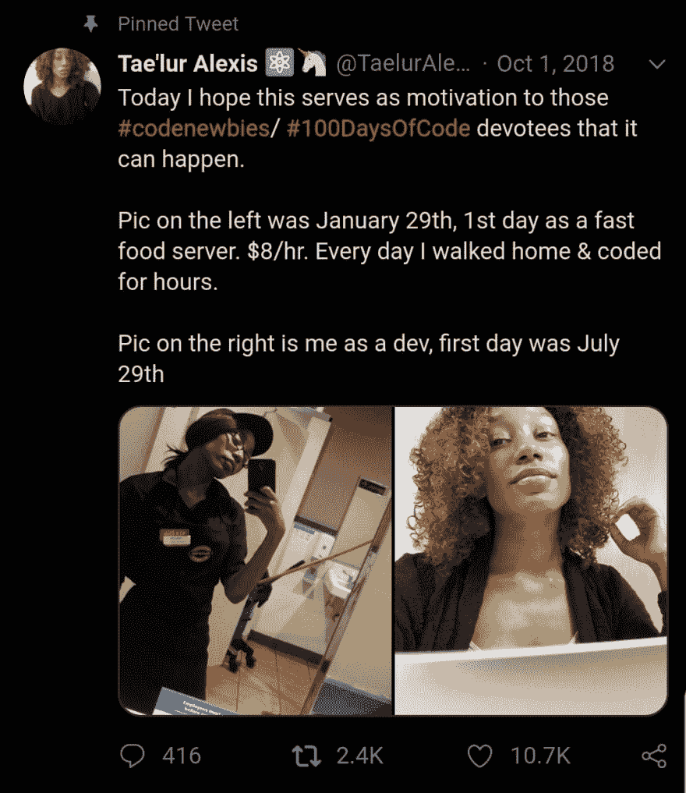
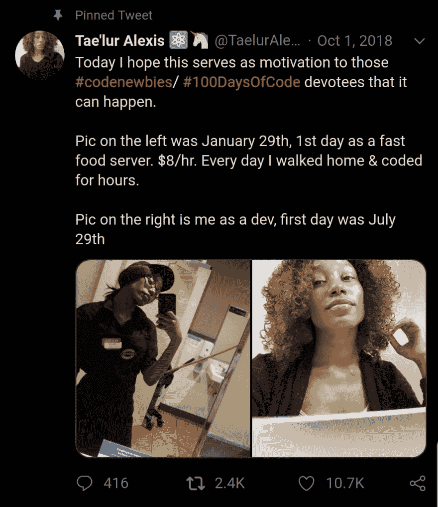
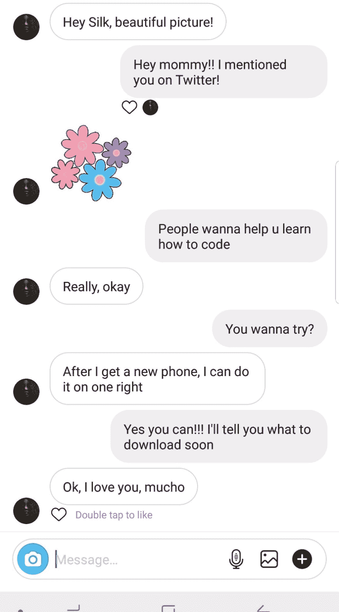
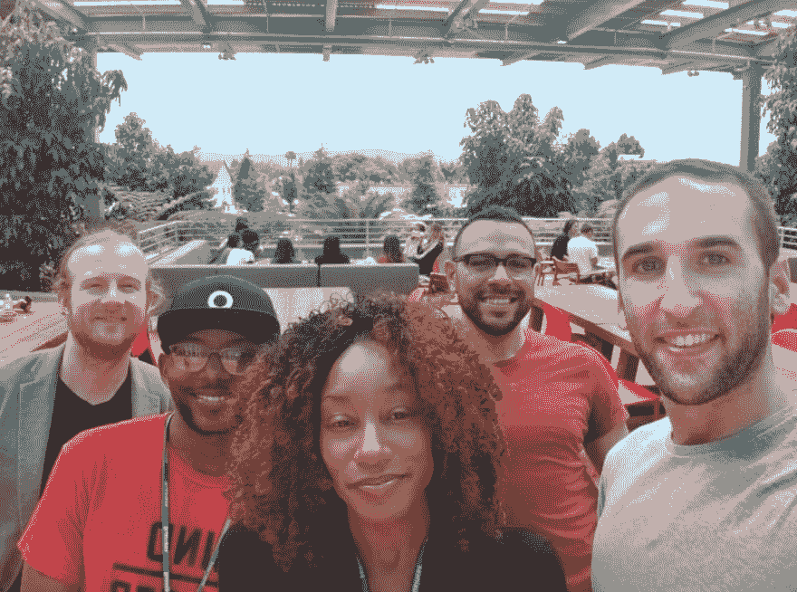
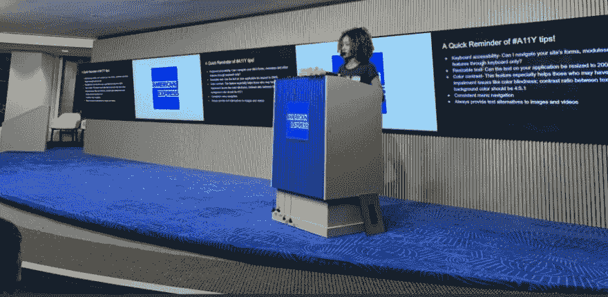

# 从服务器到开发者——泰鲁尔·亚历克西斯是如何做到的

> 原文：<https://dev.to/petecodes/from-server-to-developer-in-how-tae-lur-alexis-did-it-3o63>

Twitter 上的一个开发人员最近引起了我的注意，他发布了一篇关于从一份最低工资的工作到成为一名网络开发人员的帖子。Tae'lur Alexis 决心改善自己的处境，并自学了编码。从那以后，她成为了一名自由职业开发者，她是一名频繁活动的演讲者，也是[代码日常网站](https://codeeveryday.io)的创建者。

## 哎，那么能不能给想更多了解你的人简单介绍一下？

嘿大家好！我的名字是 Tae'lur Alexis，我是 Code 的创始人、内容创建者、网页可访问性倡导者和公共演讲者。我的热情在于构建可访问的用户界面，并帮助增强更具包容性、多样化的工程社区，这些社区重视导师、可访问性和工作/生活平衡。我也经常分享职业建议和学习资源。

## 这么说，直到最近，你一直是一名拿最低工资的服务员，而现在你是一名软件工程师。你最初是怎么学习编程的？

非常正确！我第一次接触编程是在 2017 年初，因为我知道我需要换个岗位，学一门抢手的贸易。它始于 codecademy，在那里我学习了 Python 的基础知识，但我很快失去了兴趣，因为我不知道自己在做什么，我缺乏支持系统，也不认识技术领域的任何人。

所以直到那年晚些时候，我才重新开始，那时我买了柯尔特·斯蒂尔的 Web 开发者 Bootcamp(教你 HTML、CSS、JS、Node/Express 和 MongoDB 等技能的 fullstack JavaScript 课程)。就个人而言，走自我导向的学习路线对我来说是最好的选择，因为我需要全职工作，负担不起训练营的费用，也负担不起重返大学获得计算机科学学位的费用。

## 当了一天服务器之后，学习编码是一项繁重的工作。你是如何保持动力和日常生活的？

当我试图在全职工作中平衡学习如何编码时，我犯了很多错误。我缺乏时间管理技能，经常感到精疲力竭，有时甚至会对打开我的高级文本编辑器产生负面情绪。受够了停滞不前和客户服务待遇差，不做令人满意的工作，想要更好的生活，助长了我的野心。我一直都很有抱负，只是直到我找到了编程，我才知道自己适合这个世界。

## 如今，在科技行业找到一份好工作的障碍越来越少，这真的很疯狂！你是不是告诉你所有的朋友，他们也应该编码？

是的，我总是这样，尤其是当我与 Lyft 和优步的司机交谈时，因为许多人通常都在寻求更稳定的职业转变，同时也试图照顾好自己和/或家庭。我试图在 30 分钟或更短的时间内驱散关于科技的观念。我总是强调，不是所有的编程工作都是孤立的，或者你不需要成为数学家才能在这个行业的许多领域取得成功。

我谈论职业的方式是，我强调我如何能够尝试利用我的兴趣的不同事情，如内容创作和技术写作，以及旅行做公开演讲。我总是建议，当你转向科技行业时，永远不要觉得自己局限于一条职业道路。我还想说，编程可以让你成为自由职业者，建立自己的创业公司等等。

## [没有 CS OK——没有学位的开发者的工作板](https://nocsok.com)

## 我在推特上看到你妈妈同意学习编码。你打算怎么让她开始？(我知道 Lydia Hallie 也教她妈妈编程，所以也许你们应该交换一下想法！)

是的，我真为她高兴！让她开始学习的最简单的方法就是在手机上学习。所以我问她的第一个问题是她想建造什么？她将通过构建一个灵魂食物食谱查找应用程序来学习网络开发，这将有望让她保持参与，因为她将构建一些她真正关心的东西。我们将从她学习如何通过 Grasshopper 应用程序编码开始，目标是让她每天坚持编码至少 30 分钟。这对我也有帮助，因为我将获得向一个完全的初学者解释技术概念的真实世界的经验！

<figure> 

<figcaption>泰鲁尔说服她妈妈编码</figcaption>

</figure>

## 成为职业程序员后，你的生活发生了怎样的变化？

我已经能够去我梦想去的地方旅行了。我最近第一次去了纽约，在曼哈顿的世界贸易中心做了一个演讲，我就像 OMG！！！我还能够在脸书位于湾区的总部会见 React 本地团队，这是一个梦想。我的职业生涯也迫使我走出自己的舒适区，开始公开演讲、写博客，我也在社交媒体上发展了一个很棒的社区。我现在意识到我的兴趣(社区参与、写文档和教程)可以引导我进入开发者宣传，这是一个确定的目标。

<figure> 

<figcaption>会议反应过来的原生团队</figcaption>

</figure>

## 对于那些想获得第一份编程工作，但没有时间或金钱攻读计算机科学学位的人，你有什么建议？

我的建议是首先尝试通过使用在线资源自学(从查看[Code daily](https://codeeveryday.io)或[免费代码营](https://twitter.com/freeCodeCamp)开始)。吨免费或低成本，高质量的材料。例如，为了更好地使用 CSS，可以使用 Wes Bos 的免费[CSS Grid](https://CSSGrid.io/friend/NOCS)&[Flexbox](https://Flexbox.io/friend/NOCS)课程。如果你需要加强你的 JavaScript 或 Python 知识，使用 YouTube，因为那里有大量的资源(订阅[编码阶段](https://www.youtube.com/channel/UC46wWUso9H5KPQcoL9iE3Ug)、 [Jyrone Parker](https://www.youtube.com/user/JPlaya01) 等)。

当你在进行一个课程项目时，加入你自己的创造力。例如，在我之前提到的柯尔特·斯蒂尔课程中，最后一个项目叫做 YelpCamp，你可以在其中构建一个完整的应用程序。人们错误地只是复制和粘贴，并没有理解该项目的基本概念(用户认证，也就是让用户能够在你的网站上创建帐户，MongoDB 存储和管理用户数据等)基本上是相同的基本概念，以建立更独特的东西，如在线商店或社交网络。并且采取额外的步骤来个性化你的项目，会更加巩固你对这些概念的理解。

我从未参加过训练营，但我会帮你做调查。没有一种完美的方法可以进入科技领域，但是不要因为缺乏资金或时间而气馁！这就是为什么我经常在我的 [discord 社区](https://discord.gg/Edk6pQE)上为 code daily 发微博和分享资源。

我强烈建议永远不要觉得必须学习这么多不同的框架，对我来说有用的是学习我所在领域以及全国最受欢迎的框架，所以它是 React。永远不要让自己超负荷。

## **想要一份开发人员的工作却没有学位？通过 [Triple Byte 的测验](https://triplebyte.com/a/Ww4mbM6/d)，直接进入顶级科技公司的最终现场面试**

## 你能告诉我们你现在的一天是什么样的吗？你刚才在做什么？

我目前是一名自由职业的技术作家，所以我可以专注于构建日常代码。作为一名技术写手，我的工作就是写文档，帮助开发者更好地使用一个产品。我尽量用别人能理解的方式来解释事情，尤其是新开发人员。作为[code daily](https://codeeveryday.io)的创始人，我参加会议，经常出差去建立关系网，建立合作伙伴关系和赞助商，所以这肯定是更商业的而不是技术的。

## 我看到你很快就开始每天发布代码，这将为新程序员提供面试准备和指导帮助。你能告诉我们更多关于这个项目的目标吗？

我的目标是在我学习如何编码和试图寻找角色时，提供我需要的资源。主要特点是为非传统背景的技术人员提供工作机会。最终，我们希望扩展到提供入职服务和面试准备研讨会，以更好地准备开发人员的投资组合&解决白板挑战，这是我们许多人都有的强大弱点。

我们希望更全面，并对不同的经验水平开放。所以基本上[code daily](https://codeeveryday.io)是你学会如何编码并需要升级后的下一步。到目前为止，我们正在利用 React、Apollo-GraphQL 和 Node 为平台构建全栈渐进式 web 应用程序。

## 你对未来的编码梦想是什么？

我对未来的梦想？我想通过[code daily](https://codeeveryday.io)留下一点影响，我希望能帮助成千上万或有抱负的非传统求职者转型进入科技行业并开始他们的职业生涯。我很乐意帮助改变工程文化，并影响更多的公司将初级开发人员视为资产而不是负债，并投资于多元化、包容性的团队。我们需要更多的指导，学徒计划，公司和求职者之间更多的透明度。我计划与有同样想法的公司合作。

作为一名工程师，我会教更多的东西，所以请留意我今年秋天举办的一场网上研讨会，主题是《盖茨比基础》,讲述我是如何建立自己的投资组合网站的。我也希望为开源做更多的贡献，并因撰写专注的高质量产品文档而闻名，这些文档展示了技术如何改善人类状况，而不是损害人类状况。

## 如果你喜欢这篇文章，你可以通过[为我买一杯咖啡](https://www.buymeacoffee.com/nocsdegree)(或者像有些人一样买 5 杯)来帮助支持这个网站！)