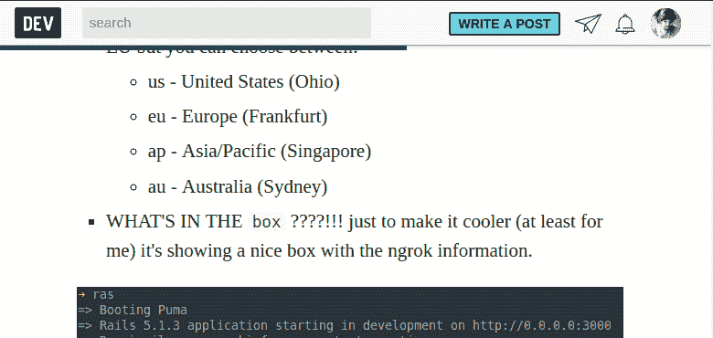

# 你对 DEV 上的“阅读位置”指标有什么看法？

> 原文：<https://dev.to/devteam/what-would-your-opinion-be-of-a-reading-position-indicator-on-dev-1088>

我们有这个公开的公关，我很想听听大家对这样一个功能的价值的看法:

# [ 读数位置指示器 #1626](https://github.com/thepracticaldev/dev.to/issues/1626) 

[](https://github.com/sabatesduran) **[sabatesduran](https://github.com/sabatesduran)** posted on [<time datetime="2019-01-22T18:45:37Z">Jan 22, 2019</time>](https://github.com/thepracticaldev/dev.to/issues/1626)

**您的功能请求是否与某个问题相关？**这不是问题，但我觉得你有这个栏告诉你文章结束前的滚动量很好。

**描述你想要的解决方案**我的解决方案是在导航中的`#top-bar`内添加一个进度条，根据滚动的当前位置，它会改变这个进度条的百分比。这个想法也将是酒吧的颜色是相同的用户配置文件的颜色，在我的情况下深绿色。

**如何看一个例子？(底部是 GIF)**我创建了这个代码片段，你可以添加到 Chrome Dev Tools > Sources >片段中，并使用`Ctrl+Enter`执行它(至少在 Linux 中)，注意你需要在帖子/文章页面中才能工作。

```
const addProgressBarCSS = () => {
  let css = document.createElement('style');
  css.type = 'text/css';
  css.innerHTML = `
 progress::-webkit-progress-bar {
 background-color: transparent;
 }
 progress::-webkit-progress-value {
 background-color: #0D4D4B;
 }
 progress::-moz-progress-bar {
 background-color: #0D4D4B;
 }
 `;
  document.querySelector("head").appendChild(css);
}

addProgressBarCSS()

let topBar = document.querySelector("#top-bar")
let articleElement = document.querySelector("article");

let readingBarElement = document.createElement("progress");
readingBarElement.id = "reading-bar";
readingBarElement.setAttribute("style", `
 width: 100%;
 position: absolute;
 height: 5px;
 top: 49px;
 bottom: 20px;
 left: 0;
 right: 0;
 -webkit-appearance: none;
 -moz-appearance: none;
 appearance: none;
 border: none;
 background-color: transparent;
 color: #0D4D4B;
`);
readingBarElement.setAttribute("value", pageYOffset);
readingBarElement.setAttribute("max", articleElement.getBoundingClientRect().height);

topBar.appendChild(readingBarElement);

window.addEventListener('scroll', () => {
    let currentScrollPosition = pageYOffset;
    let readingBar = document.querySelector("#reading-bar");
    let article = document.querySelector("article");
    let articlePositions = article.getBoundingClientRect();
    let start = articlePositions.y;
    let end = articlePositions.height;

    if (currentScrollPosition >= end) {
        readingBar.value = end;
    } else if (currentScrollPosition > start) {
        readingBar.value = currentScrollPosition;
    } else {
        readingBar.value = 0;
    }
});
```

<svg width="20px" height="20px" viewBox="0 0 24 24" class="highlight-action crayons-icon highlight-action--fullscreen-on"><title>Enter fullscreen mode</title></svg> <svg width="20px" height="20px" viewBox="0 0 24 24" class="highlight-action crayons-icon highlight-action--fullscreen-off"><title>Exit fullscreen mode</title></svg>

**截图和 GIF 说明** [Gif 链接](https://imgur.com/a/dKPv1cZ)

[](https://user-images.githubusercontent.com/5699145/51559460-38db7900-1e82-11e9-9882-6cffd10a970e.png)

[View on GitHub](https://github.com/thepracticaldev/dev.to/issues/1626)

这是一个例子:

[](https://res.cloudinary.com/practicaldev/image/fetch/s--ZS7WycMJ--/c_limit%2Cf_auto%2Cfl_progressive%2Cq_auto%2Cw_880/https://user-images.githubusercontent.com/5699145/51559460-38db7900-1e82-11e9-9882-6cffd10a970e.png)

在这里，我唯一关心的技术问题是确保它不会增加滚动行为的简洁性，否则这更像是 UX 的讨论。

请随意发表意见。