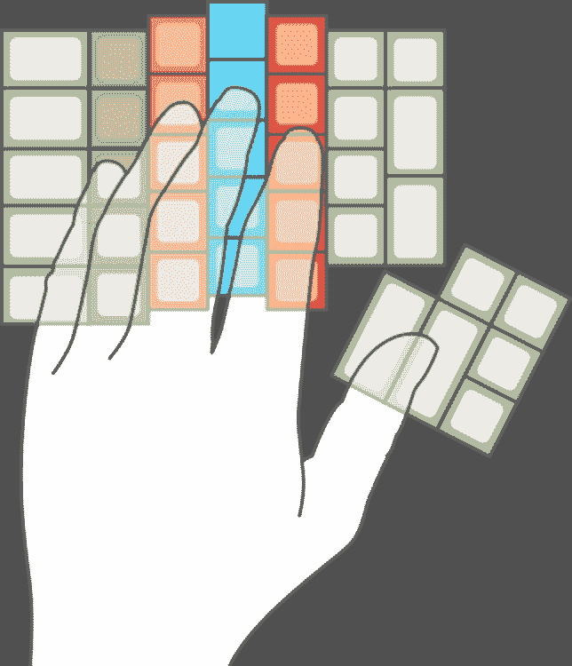
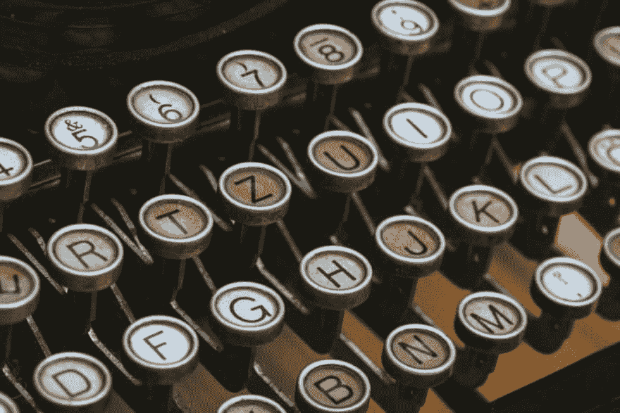

# 在你的自由职业网站开发生涯中的明智投资

> 原文：<https://dev.to/raddevon/smart-investments-in-your-freelance-web-development-career-1bhb>

在我做网页开发之前，我并没有赚很多钱。多年来，我一直靠薪水过活。当你以这种方式生活时，你就学会了尽可能地省钱。投钱是聪明的，但你就是没钱投。

网络开发应该完全改变你日常生活的经济状况。问题是，**你仍然习惯于尽可能地节俭。如果你自己能做到，哪怕结果再差，浪费一堆时间，你也会去做。如果你能用劣质的工具工作而不是替换它们，你会的。**

让我们来看看几个案例，如果你放松对现金的控制，并在你的自由职业网站开发生涯中进行一些明智的投资，你会过得更好，按重要性排序。

## 合同评审

和客户打交道时，你需要一份合同。如果你和我一样，你会在网上找到一份接近你想要的现有合同，并根据你想要的方式进行一些定制。我从合同杀手开源合同开始，并修改它以适应我以开发为中心的自由职业实践。

不过，你不是律师。你可以很容易地创建一个不可执行的合同。为了避免这种情况，你会想投资一些钱，让一个真正的律师审查你的合同，以确保它在法律上是合理的。

如果你继续修改你的合同，你只需要这样做一次或者 2-3 次(这是你可能想要做的)。如果你做自由职业是对的，你会赚到足够多的钱，使这成为做生意的一个微不足道的成本——这是值得的，因为你会得到内心的平静。

**费用:～150-400 美元，一次性**

如果你想开始做自由职业者，光靠这些明智的投资是不会让你成功的。我的自由职业速成班将在一周内教你如何创业。

## 税务准备

我开始从事自由职业，习惯于自己做税务准备，尽管我不知道自己在做什么，而且花了我不少时间。当我开始从事自由职业时，税收变得更加复杂，因为我现在拥有一家企业。此外，由于我可以接客户来填补我的时间，所以花时间做我不喜欢也不擅长的事情不再有意义。

相反，我可以付钱给擅长税务准备的人(比如会计师)，然后花时间做客户工作。会计会给我更好的纳税结果，而我可以做我喜欢的事情。这是显而易见的。

我仍然自己记账，因为我的商业信用卡和银行账户与我的会计软件相连。我花的时间非常少，而且没有痛苦。这让我为会计做好了纳税准备，我很乐意每年付钱给会计，让他帮我解决这个问题。

**成本:～300-600 美元/年**

## 人体工程学

工作时照顾好自己的身体应该是重中之重。根据我的设置，这归结为 4 件设备。

### 书桌

我在 Xdesk Terra 立式办公桌上工作，我一整天都站着。[根据梅奥诊所](https://www.mayoclinic.org/healthy-lifestyle/adult-health/expert-answers/sitting/faq-20058005)，“…那些每天坐着超过 8 小时而不运动的人的死亡风险与肥胖和吸烟造成的死亡风险相似。”这是可怕的东西，值得我站着度过我的工作日，并购买一个好的立式办公桌。

Xdesk 有点贵(约 1400 美元)，但你可以买到类似于[提升 V2](https://www.upliftdesk.com/uplift-v2-standing-desk-v2-or-v2-commercial/) 的替代品，价格约为 650 美元，如果你想要一张非常小的桌子，甚至更便宜。

**费用:1500 美元(或 650 美元的预算选项)**

### 键盘

几个月前，我做了一个全面的搜索，寻找理想的人体工程学键盘…但我没有找到。不过，我确实很接近了。

我落在一个 [ErgoDox EZ](https://ergodox-ez.com/) 分离键盘上。分离式键盘可以让您将键盘分成两半，这样您的手臂可以以更自然的角度休息，而不是朝着标准键盘倾斜。

它有一个正交的按键布局，将按键按列排列，而不是典型的交错按键布局。交错布局之所以存在，是因为非常古老的打字机每个键上都有一只手臂。每一个键臂都需要一条路径回到将字母压到纸上的锤子。

交错布局在标准键盘上仍然有一定的意义，因为你的手臂(和手指)无论如何都是成角度进入键盘的，但是，对于分离键盘，你必须人工地使你的手成角度才能正确地触及按键。

我选择了 ErgoDox EZ，因为它拥有我想要的大多数人体工程学功能，而且它非常可编程。开发人员的大部分工作都是在键盘上进行的，所以可编程性给了我们一些重要的灵活性。

**费用:270-325 美元**

### 鼠标

几个月前，我捡到了一个罗技 MX 立式鼠标。这是一个鼠标，它可以让你的手在鼠标移动时保持一个更自然的位置。这降低了你患重复性劳损的风险。

我发现在使用它的时候我没有预料到的一件事是，使用它会导致我的手腕不舒服地靠在桌子上。我不得不在桌子上放些柔软的东西来垫我的手腕。有了 pad，鼠标就成了让工作更舒适的绝佳选择。

**费用:～85 美元**

### 站立垫

如果你站了一整天，你需要一些衬垫来减轻饲料的负担。我刚买了这张[人体工学地垫。它提供衬垫，但更重要的是，它要求你改变站姿，并给你许多不同的站姿。](https://amzn.to/31wRSuW)

在此之前，我站在一个便宜得多的脚垫上工作了很多年，效果很好。几年后，它已经开始显示出一些磨损和一些缺失，但它仍然工作。

**费用:～100 美元**

## 软件

对于您可能想要的几乎每一种软件，都有一种开源的替代方案可以帮助您实现这一目标。不要害怕花钱购买能让你一路到达目的地的工具。这是你的作品。你想尽可能做好工作，你应该有能力购买合适的工具。

我能想到的最好的例子就是图片编辑。GIMP 已经存在很久了，但是它不能做商业替代品所做的事情。我使用[亲和照片](https://affinity.serif.com/en-gb/photo/)，它做了我需要做的一切，然后更多。也许 [Photoshop](https://www.adobe.com/products/photoshop.html) 是你的果酱。无论哪种情况，商业选择都是物有所值的。

我买了很多让我生活更轻松的软件。用于 FTP 的 [Transit](https://www.panic.com/transmit/) ，用于测试 API 的 [Paw](https://paw.cloud/) ，用于文本扩展的 [aText](http://www.trankynam.com/atext/) ，以及用于全功能应用启动器的 [Alfred](https://www.alfredapp.com/) 等等。如果一个木匠来到你家，用扳手敲进钉子，因为他们不想买锤子，你会怎么想？你希望他们有合适的工具，你也应该有。

**费用:各不相同**

## 教育

如果你不坚持学习 web 开发，你会很快落后的。购买你需要掌握的书籍和课程。也就是说，你不需要知道*所有的事情*。这是不现实的，而且你最终会对很多不是非常有用的技术略知一二。

小心，尤其是当你是新手的时候，不要陷入教程炼狱。这是一个真正的威胁。通过及时学习你需要知道的东西，让你的工作推动你的教育。

**费用:各不相同**

## 利用你的现金

你听说过有人希望他们能收回他们在 80 年代投资苹果股票或在 2000 年代中期投资谷歌股票的现金吗？当然不是！这是因为**投资得到了回报**。

如果你做了这些明智的投资，你将会一路笑着走向银行，因为其他自由开发者抓住每一分钱不放，努力让他们的生意运转起来。做那些明智的投资，让红利开始滚滚而来！