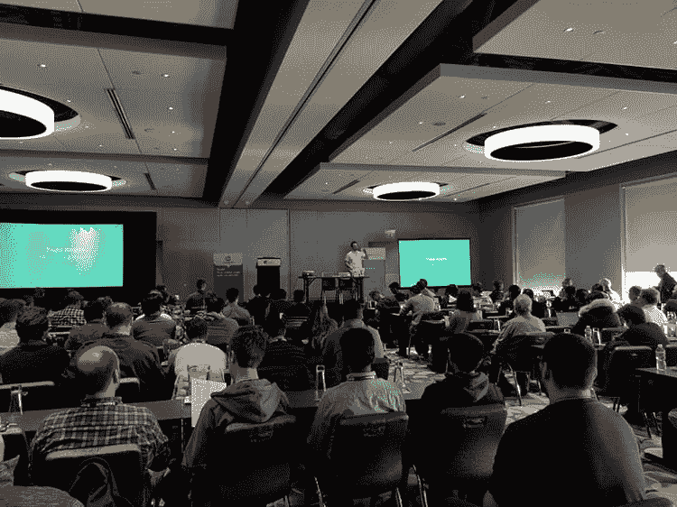
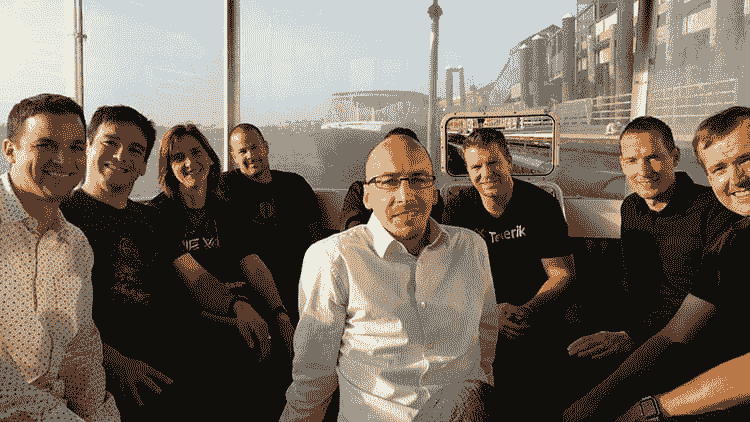
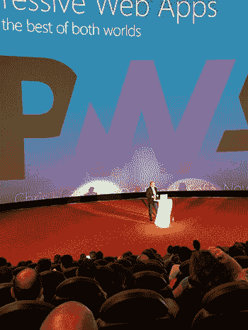

# 所以你想开一个开发者大会

> 原文：<https://dev.to/remotesynth/so-you-want-to-run-a-developer-conference-47ee>

你喜欢你参加过的开发者大会。你学到了很多，遇到了很棒的人，回来后感觉精力充沛，尝试新的想法。你对自己说，我们应该在我的镇上开一个开发者大会！

那是大约 2007 年我在波士顿主持第一次会议的时候。谢天谢地，这是一次成功，从那以后，我在波士顿、迈阿密、纽约市甚至保加利亚的索非亚召开了许多开发者大会。

最近，一个朋友想策划他自己的开发者大会，这篇文章是基于我给他的关于举办你自己的开发者大会的建议。我的建议是假设你相对来说是一个办活动的新手，并且是用自己的钱或者公司有限的预算来办一个活动。很明显，这是基于我的经验，所以我很乐意听听你们中任何一个参加过活动的人，如果你们同意或不同意我的任何建议。此外，如果你正在考虑举办一个活动，我很乐意回答额外的问题，所以请在评论中提问。

*2018 年波士顿 jsMobileConf*

## 我的事件应该有多大？

根据我的经验，活动的规模是一个复杂的因素，会真正影响你如何进行计划。显然你要考虑题目(是宽泛还是小众？你针对的社区有多大？)，但是，除此之外，你真的应该考虑活动的规模如何影响计划的成本和难度。

我在多个城市发现，任何超过 250-300 人的活动都不适合在酒店会议中心或会议中心以外的场所举行。虽然这些场馆很好，可以在活动期间照顾到许多后勤细节，而其他场馆可能不会，但它们也贵得多。通常情况下，你必须使用场馆的餐饮服务，甚至经常使用他们的视听设备。有时，你甚至必须购买 WiFi 或保证出售一定数量的房间。所有这些都增加了你或你的雇主的财务风险，除非你有一笔可观的预算，否则你可能会希望在你的第一次活动中限制这种风险。

一个较小的活动开辟了一些独特而有趣的替代场地。例如，大学或剧院(舞台剧或电影)的座位一般不超过 300-350 个，但租金低得多，其他要求也少。许多餐厅免费提供 WiFi 和影音等服务，甚至经常让你自己选择餐饮。代价是你可能需要处理大量的后勤工作，而昂贵的场馆会为你处理。例如，在波士顿的一次活动中，我不能运送物品，所以我让它们都在附近的一个同事家里等着，最后我每天早上都要从街上的星巴克拖着一大桶咖啡去参加活动。

虽然我喜欢这些“替代场地”，但考虑它们的另一个方面是，你可能需要对活动的结构持开放态度。就我个人而言，我喜欢单轨项目，但如果你在寻找多轨项目，这可能会限制你的选择。或者，如果你需要教室式的房间来举办实践研讨会，那也很难找到。有时你可以发挥创造力，找到有趣的解决办法，但你需要灵活。

*2015 年与 TelerikNEXT 的演讲者和同事乘船游览*

## 应该有几个音箱？

正如你所料，这将取决于一系列因素，包括天数、曲目数量、一天持续多长时间以及会议持续多长时间。同样，这里的一个重要因素是预算。你的活动的价值很大程度上来自你的演讲者的质量，所以，即使你是一个低价的社区活动，你的演讲者也不应该支付他们的演讲费用。为每一位外地演讲者计划最低的机票和酒店费用。一些演讲者的工作支持或要求他们演讲，有时不需要你支付他们的差旅费，但最好是像你将覆盖每个人一样来做预算。

所以，带来演讲人的成本在很大程度上不是取决于你需要多少演讲人，而是取决于你能给 T2 带来多少演讲人。就时间安排而言，我个人不建议标准会议超过 40-45 分钟，尽管主题演讲可能会更长。这意味着典型的一天，包括休息、午餐和会议之间的时间，意味着你每天每条赛道需要 6-7 个演讲者。

## 计划走多远？

我的第一次活动是在不到 60 天的时间里计划并完成的。它有效，但我不会推荐它。一些场馆可以提前一年就被预订一空。一般来说，你可以自由决定某个日期，也就是说，如果有人来要求同一天约会，你有优先拒绝的权利。因此，早做计划没有坏处(尽管一些舞台剧院有时不知道他们的演出时间表，因此可能不愿意完全承诺那么远的日期)。

演讲者也往往很早就被预订一空。许多大型会议在实际活动前 6-8 个月就有 CFP。越早开始越好(不过，同样，太早开始会让一些人很难坚持那么久)。

我通常会先找到合适的场地一年，尽管 4-6 个月已经足够了。场地的可用性会影响你的日期，你一定要尽最大努力研究比赛项目、假期甚至学校的时间表，以确保你选择的日期给你带来最大的成功机会。一旦你有了一个至少在特定日期举行的地点，你就可以开始和演讲者交谈或者开一个 CFP。你也可以开始创建一个赞助商计划书。

 
*克里斯蒂安·海尔曼主题演讲 DevReach 2017 保加利亚索非亚*

## 应该什么时候开始推广？

我通常不会宣布，直到我有了安全的场地(签署并批准了合同)和一些最初的发言者排队。对于我最近的事件，我已经提前 7 个月开始宣传了，但是大多数人直到 4-5 个月才准备好承诺。事实上，在大多数情况下，你的大部分门票销售会在活动前的最后一个月，甚至是最后几周。我知道这种模式，但我每次都会拔掉自己的头发，并在大约 2 个月前吓坏了。我不会再抓狂了，但是会议策划让我无法确定事情是否顺利*，因为尽管我抓狂了*，我还是抓狂了或*。为了安全起见，除非出现奇迹，我的活动票提前售完，否则我打算以后再来一次。*

为什么我会抓狂让我想到了下一个问题。

## 最难的部分是什么？

在我策划的每一个活动中，最困难的部分总是一样的:把话传出去。尤其是如果你的预算有限，没有简单的路线。我试过在社交媒体和其他地方的广告上砸钱，但成本越来越高，虽然我不能自称是利用它们的专家，但我很少或根本没有成功。如果某些简讯针对您的特定受众，那么它们可能是一种有效的途径，但它们可能超出了预算范围，并且不允许更有效的区域定位(正如您可能已经猜到的，离您的活动越远，就越难说服某人参加)。

你的演讲者可以帮助你传播信息，但对他们要求太多或期望太高是不公平的(他们已经是你最好的宣传了，只要他们说话并提供人们愿意付费观看的有价值的内容)。

真的，我发现最有效的方法是从基层做起。联系你的朋友和关系。接触相关的时事通讯和网站，看看他们是否会免费提供(但是不要抱有任何不切实际的期望)。联系当地和地区的聚会组织者，看看他们是否愿意与他们的成员分享，或者更好的是，如果可以的话，出现在这些聚会上。联系该地区的雇主，他们可能有想要派遣的员工团队。

说到升职，没有什么想法是不值得考虑的。善良一点，永远光明正大。

## 有哪些令人难忘的惊喜？

我很幸运，从来不用处理任何重大的事情。我早期的一些活动是在 12 月初和 11 月中旬在波士顿，所以我有几年在那里我们有一个初冬雪或冰风暴。虽然天气是你无法控制的，但很明显，这是一个很好的提醒，提醒你在一年中的某些时候考虑天气的风险。

我也遇到过由于个人紧急情况而不得不在最后一刻取消演讲的情况。这种情况时有发生。即使你压力很大，也要理解。

在计划好你的第一次活动后，你可能会发现最后的惊喜。你开始了这段旅程，因为你喜欢参加会议，并从经历中学到了很多。但是，办会议不是参加会议。我很少有机会在我自己的活动中参加很多会议——有很多事情需要我花费时间，其中大部分是管理物流。然而，这可能是一次非常有益的经历，主要是与演讲者和与会者互动的机会。享受它，祝你好运！