# 像专家一样记录 React 组件的 6 个工具

> 原文：<https://dev.to/giteden/6-tools-for-documenting-your-react-components-like-a-pro-1gml>

### 如果没人知道如何找到和使用组件，那么组件有什么用？

React 鼓励你用组件构建模块化应用。模块化带来了各种优势，包括改进的可重用性。但是，当您打算共享和重用一个组件时，您最好确保它易于发现、理解和使用。您需要记录组件。

如今，现代工具可以帮助自动化一些文档工作流，并将组件文档的消费转化为丰富、可视化甚至交互式的体验。一些工具甚至将这样的文档组合起来，作为共享组件的工作流程中不可分割的一部分。

为了在不太费力的情况下获得漂亮的组件文档，我收集了一些最好和最流行的 React 组件文档工具。请随意评论并添加您自己的想法和工具。

## 1。[钻头](https://bit.dev)

共享组件的平台。

[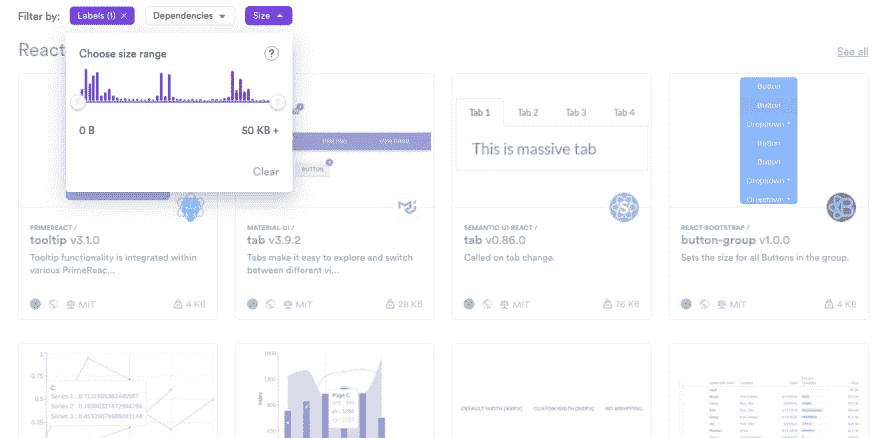 ](https://res.cloudinary.com/practicaldev/image/fetch/s--P06SqOea--/c_limit%2Cf_auto%2Cfl_progressive%2Cq_auto%2Cw_880/https://cdn-images-1.medium.com/max/2642/1%2AQG7SZrh2BFdFXFjkCP2lMg.png) * bit.dev —通过捆绑包大小、依赖性、标签和快照预览来搜索和选择组件*

[Bit](https://bit.dev) 不仅仅是一个组件的文档工具。它是一个开源工具，允许您封装组件及其所有文件和依赖项，并在不同的应用程序中运行它们。

通过 [bit.dev](https://bit.dev) 平台，您可以跨应用程序共享组件并进行协作。您的团队可以发现您所有的共享组件，并在他们的项目中查找和使用，轻松共享他们自己的组件。

[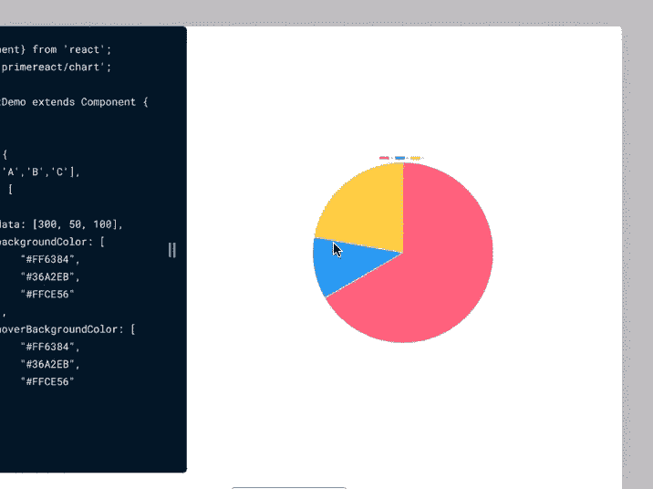](https://res.cloudinary.com/practicaldev/image/fetch/s--EXeep30D--/c_limit%2Cf_auto%2Cfl_progressive%2Cq_66%2Cw_880/https://cdn-images-1.medium.com/max/2000/1%2AHNrykRFyylLT_oTiiBDn1Q.gif)

您共享到 [bit.dev](https://bit.dev) 的组件在您团队的共享组件中心变得可被发现。您可以通过上下文、包大小甚至依赖关系来搜索组件。您可以根据实际渲染组件的视觉快照快速浏览结果，并用眼睛进行选择。

→ [浏览 bit.dev 上的组件](https://bit.dev/components)

[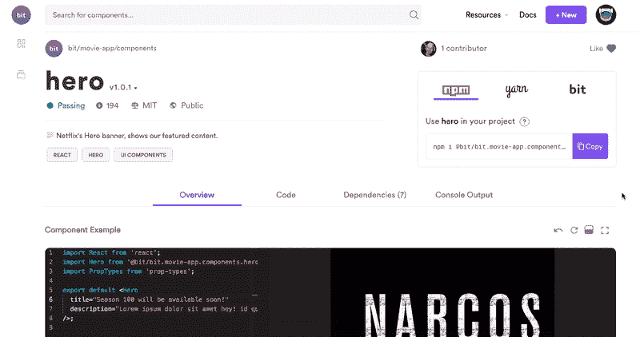](https://res.cloudinary.com/practicaldev/image/fetch/s--L6UKH4n4--/c_limit%2Cf_auto%2Cfl_progressive%2Cq_66%2Cw_880/https://cdn-images-1.medium.com/max/2000/1%2AGxjhw2nGfLKMDnEPan28lQ.gif)

当你进入一个组件的 web 页面时，你会发现 Bit 把组件呈现在一个活动场所中，这样你就可以在选择在应用程序中使用它之前先玩玩它。如果您有 JSDocs 或。作为代码的一部分，Bit 也将解析并显示这些文档。如果组件包含单元测试文件，Bit 将独立运行它们，并将结果作为每个组件文档的一部分。

当发现一个你喜欢使用的组件时，只需用 NPM 或纱来安装它。您甚至可以使用 Bit 直接从任何消费应用程序开发和更新组件，这样您的团队就可以协作和共同构建。

[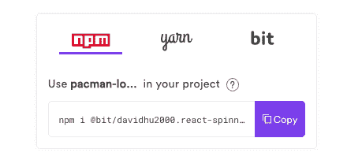](https://res.cloudinary.com/practicaldev/image/fetch/s--1Y2Ql2ah--/c_limit%2Cf_auto%2Cfl_progressive%2Cq_auto%2Cw_880/https://cdn-images-1.medium.com/max/2000/1%2AgJJ8TKLAYWhX90zWB0UMWA.png)

当通过 Bit 共享组件时，您不需要设置更多的库或工具，不需要重构或更改您的代码，共享组件的同一个中心是它们被记录和发现的地方，几乎是开箱即用的。

## 2。故事书& Styleguidist

StoryBook 和 StyleGuidist 是非常棒的项目，它们在可视化地渲染和记录组件的同时，帮助孤立地开发组件。

[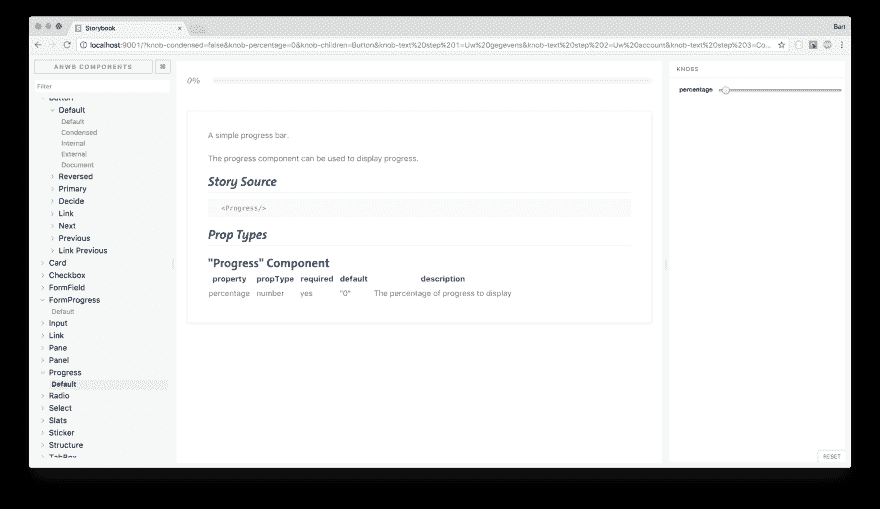 ](https://res.cloudinary.com/practicaldev/image/fetch/s--NanoAAj1--/c_limit%2Cf_auto%2Cfl_progressive%2Cq_auto%2Cw_880/https://cdn-images-1.medium.com/max/5250/1%2Apm4qA984LyGnlAGnCyhb_w.png) *故事书*

[story book](https://storybook.js.org/)* *是 UI 组件的开发环境。它允许您浏览组件库，查看每个组件的不同状态，并以交互方式开发和测试组件。当构建一个库时，StoryBook 是一种可视化和文档化组件的简洁方式，不同的插件使它更容易集成到不同的工具和工作流中。您甚至可以在单元测试中重用故事来确认细微的功能。

[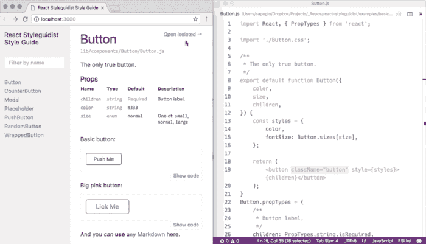 ](https://res.cloudinary.com/practicaldev/image/fetch/s--1CeIM3l_--/c_limit%2Cf_auto%2Cfl_progressive%2Cq_66%2Cw_880/https://cdn-images-1.medium.com/max/2000/1%2AKS039LFntBGC8gExP7ZqGw.gif) * StyleGuidist*

StyleGuidist 是一个隔离的 React 组件开发环境，提供生活方式指南。它提供了一个热重新加载的开发服务器和一个生活方式指南，该指南列出了组件属性类型，并显示了基于。md 文件。它支持 ES6、Flow 和 TypeScript，并与 Create React 应用程序一起使用。自动生成的使用文档可以帮助 Styleguidist 作为团队不同组件的文档门户。

*   还可以看看由[诺姆·埃尔博伊姆](https://dev.toundefined)创作的 [UI 动物园](https://github.com/myheritage/uizoo.js)。

## 3。Codesandbox，Stackblitz &好友

[组件游乐场](https://blog.bitsrc.io/11-react-ui-component-playgrounds-for-2018-eef5a87a1bf8)是一个玩组件和学习它们如何工作的好方法。当你可以将它们组合成你的文档的一部分(或者[作为你的共享组件工作流](https://bit.dev/components)的一部分)，playgrounds 可以帮助你快速了解代码是如何工作的，并决定你是否想要使用组件。

[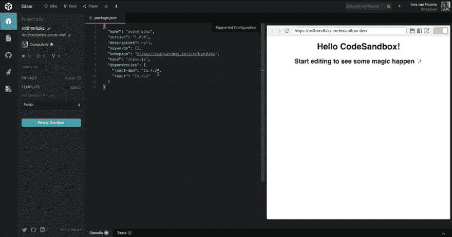 ](https://res.cloudinary.com/practicaldev/image/fetch/s--u-1wRTO3--/c_limit%2Cf_auto%2Cfl_progressive%2Cq_66%2Cw_880/https://cdn-images-1.medium.com/max/2000/1%2AxUCCCP8hLcAa4vgjKAU_vg.gif) * Codesandbox*

Codesandbox 是一个在线编辑器，用于快速创建和使用像组件这样的小项目。在创建了一些有趣的东西后，你可以通过分享 url 向其他人展示。CodeSandbox 具有实时预览功能，可在您键入时显示代码的结果，并具有内置的扩展，可集成到您的不同工具和开发工作流中。

[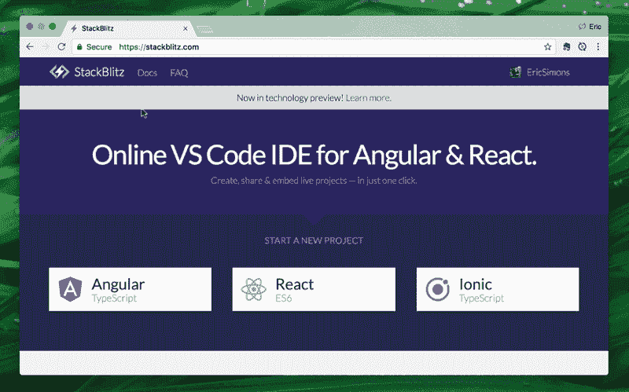](https://res.cloudinary.com/practicaldev/image/fetch/s--s3xa7Pa_--/c_limit%2Cf_auto%2Cfl_progressive%2Cq_66%2Cw_880/https://cdn-images-1.medium.com/max/2000/1%2Aibw0_i_PEheYu--MlgyV5Q.gif)

Stackblitz 是一个由 Visual Studio 代码支持的“网络应用在线集成开发环境”。与 Codesnadbox 非常相似，StackBlitz 是一个在线 IDE，您可以在其中创建 Angular & React 项目，这些项目可以通过 URL 链接共享。像 Codesandbox 一样，它[自动负责在你输入时安装依赖项、编译、捆绑和热重装。看一看。](https://medium.com/@ericsimons/stackblitz-online-vs-code-ide-for-angular-react-7d09348497f4)

→为 React 寻找更多[组件运动场](https://blog.bitsrc.io/11-react-ui-component-playgrounds-for-2018-eef5a87a1bf8) :
[**11 React UI 组件运动场 2019**
*为你的 UI 组件提供有用的在线运动场和编辑器*blog.bitsrc.io](https://blog.bitsrc.io/11-react-ui-component-playgrounds-for-2018-eef5a87a1bf8)

*   又见:[react-cosmos](https://github.com/react-cosmos/react-cosmos)|[react-live](https://github.com/FormidableLabs/react-live)

## 4。Docz

[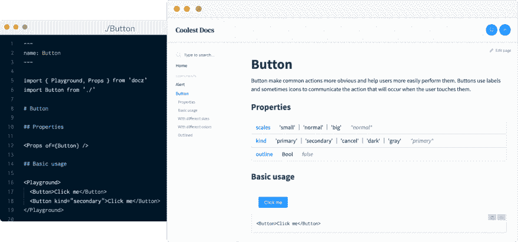 ](https://res.cloudinary.com/practicaldev/image/fetch/s--OsaqpXn9--/c_limit%2Cf_auto%2Cfl_progressive%2Cq_auto%2Cw_880/https://cdn-images-1.medium.com/max/3504/1%2ArDykaPREeCndAiNSnFuCJA.png) * Docz*

Docz 使得为你的代码构建 Gtabsy 支持的文档网站变得更加容易。它基于 MDX(* Markdown+JSX)*，以利用组件文档的 Markdown。基本上，你可以写一个。mdx 文件，Docz 会简化将它转化为部署到 Netlify 的您自己设计的文档门户的过程。有用吧？
[**pedronauck/docz**
*✍🏻记录您的东西从未如此简单！- pedronauck/docz*github.com](https://github.com/pedronauck/docz)

## 5。MDX-文档

[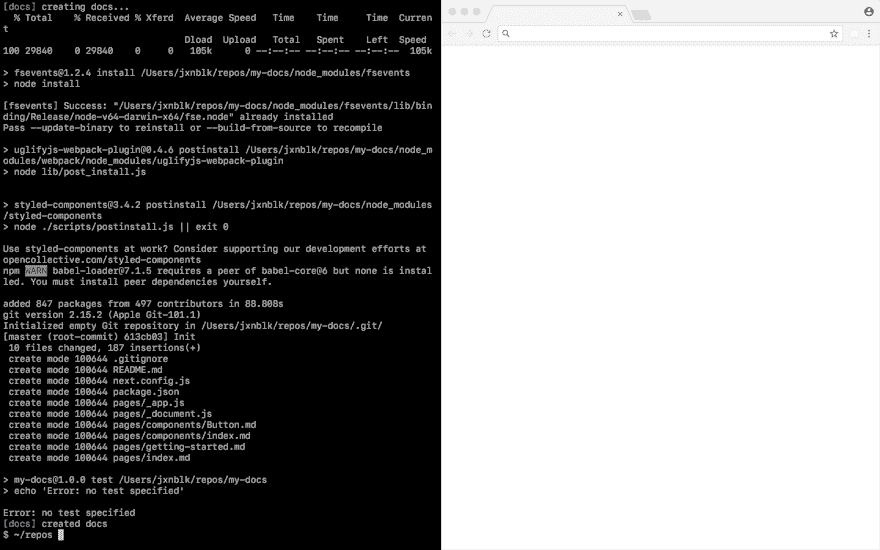 ](https://res.cloudinary.com/practicaldev/image/fetch/s--DLYANErE--/c_limit%2Cf_auto%2Cfl_progressive%2Cq_66%2Cw_880/https://cdn-images-1.medium.com/max/2880/1%2A0z5xTLkduZ1nOW0G78pU9g.gif) * MDX-docs*

[MDX-docs](https://github.com/jxnblk/mdx-docs) 让你用 MDX 和 Next.js 来文档化和开发 React 组件，你可以混合 markdown 和内联 JSX 来渲染 React 组件。像平常一样编写 markdown，并使用 ES 导入语法在文档中使用定制组件。内置组件将 JSX 防护代码块呈现为带有可编辑代码的实时预览，由 [react-live](https://github.com/FormidableLabs/react-live) 提供支持。

看一看。
[**jxnblk/mdx-docs**
* memo:用 MDX 和 next . js-jxnblk/MDX-docs * github . com](https://github.com/jxnblk/mdx-docs)记录并开发 React 组件

## 6。反应文档生成

[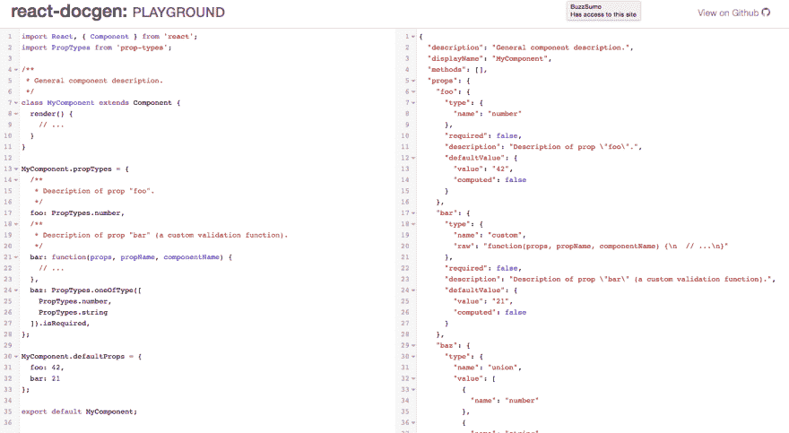](https://res.cloudinary.com/practicaldev/image/fetch/s--G9QclgKC--/c_limit%2Cf_auto%2Cfl_progressive%2Cq_auto%2Cw_880/https://cdn-images-1.medium.com/max/2860/1%2AYcmXrKZtgXzHBciYcWJTKQ.png)

React DocGen 是一个 CLI 和工具箱，用于从 React 组件文件中提取信息以生成文档。它使用 [ast-types](https://github.com/benjamn/ast-types) 和 [@babel/parser](https://github.com/babel/babel/tree/master/packages/babel-parser) 将源代码解析成 ast，并提供处理这个 AST 的方法来提取所需的信息。输出/返回值是一个 JSON blob / JavaScript 对象。它为通过 React.createClass、 [ES2015 类定义](https://developer.mozilla.org/en-US/docs/Web/JavaScript/Reference/Classes)或函数(无状态组件)定义的 React 组件提供了默认实现。功能强大。
[**react js/React-docgen**
*一个 CLI 和工具箱，用于从 React 组件文件中提取信息，以便生成文档。…*github.com](https://github.com/reactjs/react-docgen)

