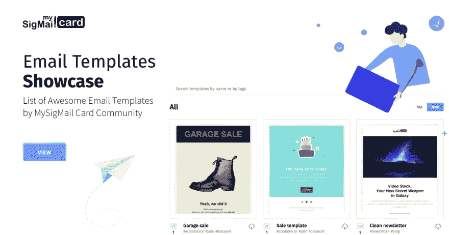
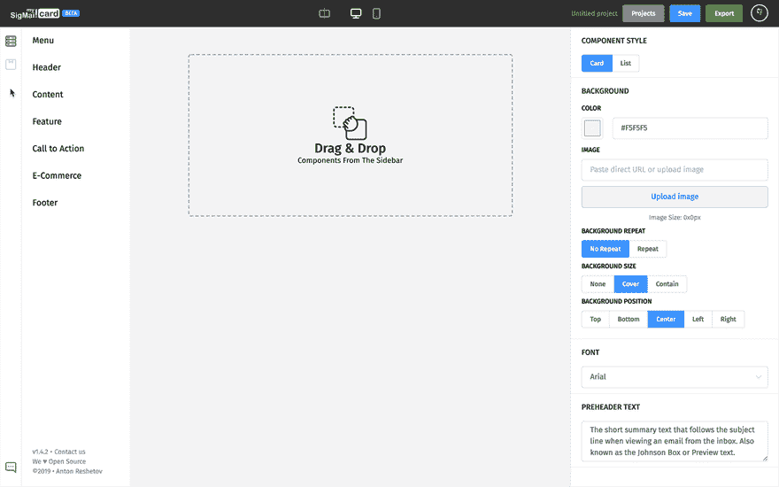

# 电子邮件模板展示

> 原文：<https://dev.to/antonreshetov/email-templates-showcase-54m2>

T3【嗨，👋

我想向您介绍一个额外的小项目 MySigMail Card Showcase——MySigMail Card 用户可以在这里展示他们的模板。在一个网站上，可以通过名称、标签和模板作者进行搜索。可以为自己喜欢的模板投票。模板的可下载工作文件可以加载到 MySigMail 卡的项目中。

因为在 MySigMail 卡中有一个与给定站点的集成，所以可以在一个模板上执行直接附录搜索，并立即加载它们。

希望对某个人有用

我很抱歉，现在没有足够的模板，所有的时间都花在我的开发上🙏

[https://showcase.mysigmail.com/](https://showcase.mysigmail.com/)