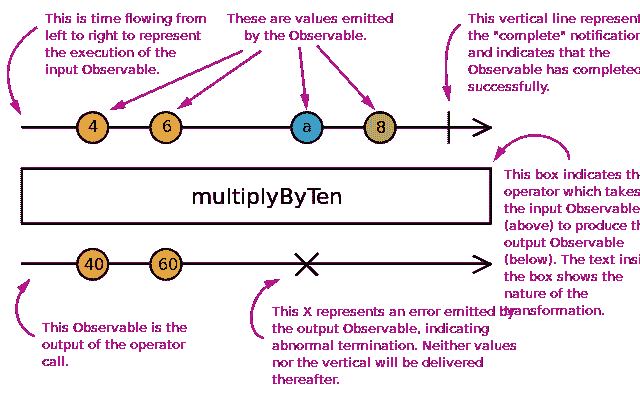
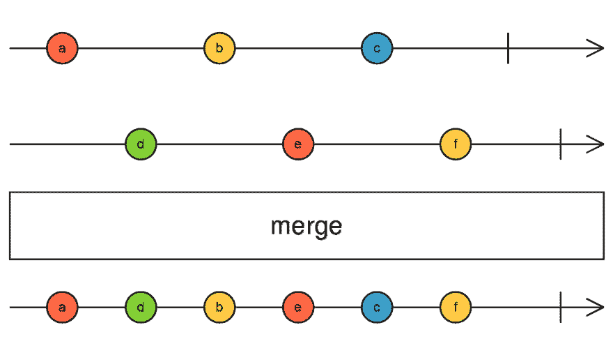
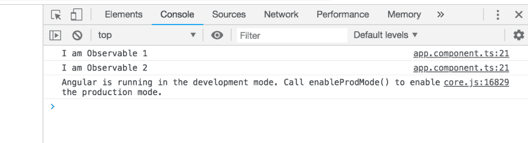
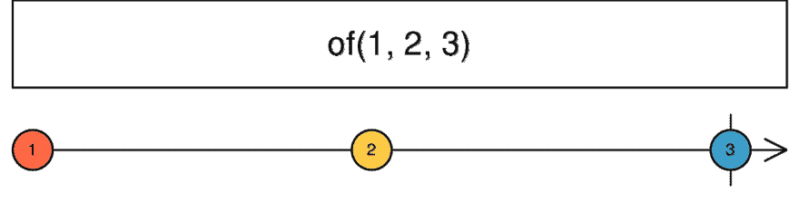
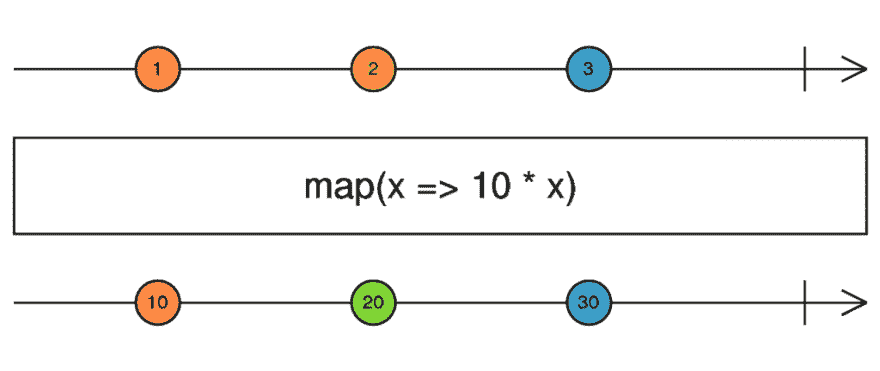
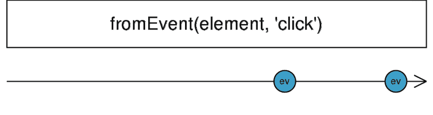
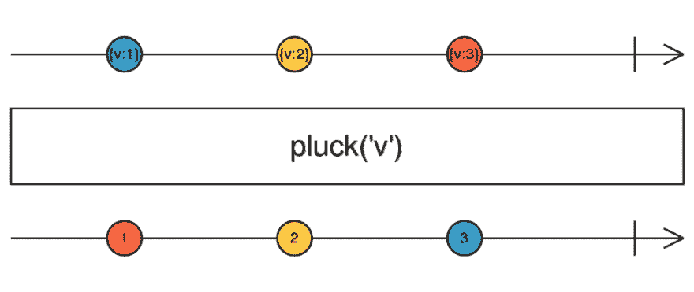
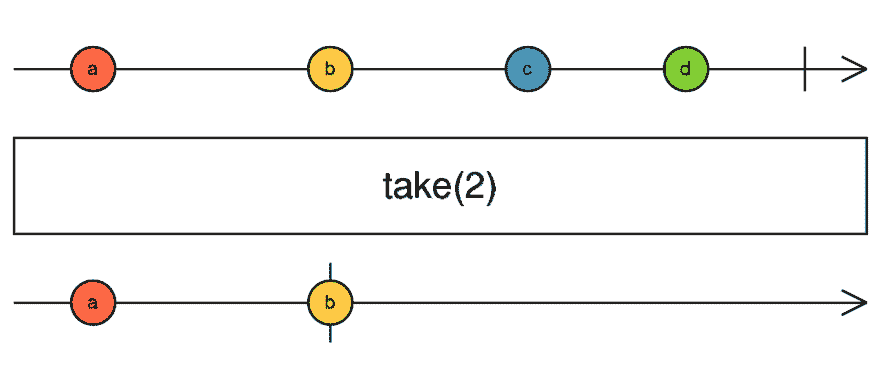

# 如何使用 RxJS 运算符来消耗工作流中的可观测量

> 原文：<https://dev.to/bnevilleoneill/how-to-use-rxjs-operators-to-consume-observables-in-your-workflow-39bk>

**由[nwo se lotana](https://blog.logrocket.com/author/nwoselotanna/)撰写**

## RxJS

RxJS 是一个反应式编程的框架，它利用了可观察性，使得编写异步代码变得非常容易。[根据官方文档](https://rxjs-dev.firebaseapp.com/)，该项目是 JavaScript 的一种反应式扩展，具有更好的性能、更好的模块化、更好的可调试调用堆栈，同时保持大部分向后兼容，并有一些减少 API 面的突破性变化。它是 Angular 用来处理反应的官方库，将回调的拉操作转换成可观察的。

## 先决条件

为了能够完成本文的演示，您应该具备:

*   [您机器上安装的节点版本 11.0](https://nodejs.org/)
*   节点程序包管理器版本 6.7(通常随节点安装一起提供)
*   角度控制器版本 7.0
*   Angular 的最新版本(版本 7)

```
// run the command in a terminal
ng version 
```

Enter fullscreen mode Exit fullscreen mode

确认您使用的是版本 7，如果不是，请更新到 7。

*   点击这里下载本教程的起始项目[来完成演示](http://github.com/viclotana/ng_canvas)
*   使用以下命令解压缩项目并初始化终端中的节点模块:

```
npm install 
```

Enter fullscreen mode Exit fullscreen mode

## 了解 RxJS 运算符

可观测量是 RxJS 中反应式编程的基础，操作符是消费或利用它们的最佳方式。**操作符**是你可以在可观察对象和主体上使用的方法，以特定的方式操纵、过滤或改变可观察对象成为新的可观察对象。它们为运行在可观察对象上的复杂逻辑提供了一个平台，并让开发人员可以完全控制可观察对象的输出。

值得注意的是，操作者不会改变初始的可观测值，他们只是编辑它并输出一个全新的可观测值。

[](https://logrocket.com/signup/)

## 操作员的类型

根据 RxJS 官方文档，有两种类型的操作符。

**A .可管道化的操作符**:这些操作符可以使用管道语法管道化到现有的观察对象。

```
observableInstance.pipe(operator()) 
```

Enter fullscreen mode Exit fullscreen mode

它们在现有的可观察对象上被调用，并且它们不改变可观察实例，它们基于初始可观察对象用 subscribe 方法返回一个新的可观察对象。

**B .创建操作符**:另一方面，这些操作符通过预定义的行为或通过将多个可观察对象连接在一起来创建可观察对象。它们可以被称为创造新的可观测量的独立方法。

## 操作员如何工作:大理石图

<figure>[](https://res.cloudinary.com/practicaldev/image/fetch/s--uOVQsTLl--/c_limit%2Cf_auto%2Cfl_progressive%2Cq_auto%2Cw_880/https://i0.wp.com/blog.logrocket.com/wp-content/uploads/2019/08/howoperatorswork.png%3Fresize%3D640%252C396%26ssl%3D1)

<figcaption id="caption-attachment-4957"></figcaption>

</figure>

上图直观地展示了操作员的工作方式。它总是一个从左到右和从上到下的过程。首先创建可观察对象，并发出一些值，然后在完成时，由完整参数定义的操作符将发出的值作为输入，然后修改它们以给出一个全新的可观察对象。

## 操作员的类别

RxJS 中有超过 [100 个操作符，它们可以分为不同的类别，其中一些是创建、转换、过滤、加入、多播、错误处理和实用程序。](https://rxjs-dev.firebaseapp.com/api)

| 种类 | 经营者 |
| --- | --- |
| 创建运算符 | ajax、bindCallback、defer、empty、from、fromEvent、fromEventPattern、generate、interval、of、range、throwError、timer 和 iif。还有连接创建操作符，如 combineLatest、concat、forkJoin、merge、race 和 zip。 |
| 变换运算符 | bufferCount，bufferTime，bufferToggle，bufferWhen，concatMap，concatMapTo，exhaust，exhaustMap，expand，groupBy，Map，MapTo，mergeMap，mergeMapTo，mergeScan，pairwise，partition，pluck，Scan，switchMap，switchMapTo，window，windowCount，windowTime，windowToggle，windowWhen。 |
| 过滤运算符 | audit、auditTime、debounce、debounceTime、distinctKey、distinctUntilChange、distinctUntilKeyChanged、elementAt、filter、first、ignoreElements、last、sample、sampleTime、single、skipLast、skipUntil、skipWhile、take、takeLast、takeUntil、takeWhile、throttle 和 throttleTime。 |
| 连接运算符 | combineAll、concatAll、exhaust、mergeAll、startWith 和 withLatestFrom。 |
| 多播运营商，加入运营商 | 多播，发布，发布行为，发布最后，发布重放和共享。 |
| 错误处理运算符 | catchError，retry 和 retryWhen。 |
| 公用事业运营商 | 点击、延迟、延迟时间、去物质化、物质化、观察、订阅、时间间隔、时间戳、超时、超时时间和数组。 |

## 常用的 RxJS 运算符

如果您从一开始就关注了这篇文章，那么您将有一个在 VS 代码中打开的 starter 项目来跟进这些插图。本节将向您展示如何在角度工作流程中使用一些顶级 RxJS 运算符:

### 合并()

<figure>[](https://res.cloudinary.com/practicaldev/image/fetch/s--IqJ0XLdm--/c_limit%2Cf_auto%2Cfl_progressive%2Cq_auto%2Cw_880/https://i1.wp.com/blog.logrocket.com/wp-content/uploads/2019/08/merge.png%3Fresize%3D1280%252C740%26ssl%3D1)

<figcaption id="caption-attachment-4963"></figcaption>

</figure>

这个操作符是一个连接创建操作符，它只是将一个可观察对象与另一个可观察对象合并，并将它们的组合作为一个可观察对象返回。打开您的`app.component.ts`文件，复制下面的代码块:

```
import { Component, OnInit } from '@angular/core';
import { Observable, merge} from 'rxjs';
@Component({
  selector: 'app-root',
  templateUrl: './app.component.html',
  styleUrls: ['./app.component.css']
})
export class AppComponent implements OnInit{
  ngOnInit(){
   const observable1 = Observable.create((observer:any) => {
      observer.next('I am Observable 1')
  });

  const observable2 = Observable.create((observer:any) => {
      observer.next('I am Observable 2')
  });

  const observable3 = merge(observable1, observable2);

  observable3.subscribe((data) => console.log(data));
  }
} 
```

Enter fullscreen mode Exit fullscreen mode

您的浏览器控制台应该如下所示:

[](https://res.cloudinary.com/practicaldev/image/fetch/s--xRrRmbKr--/c_limit%2Cf_auto%2Cfl_progressive%2Cq_auto%2Cw_880/https://i0.wp.com/blog.logrocket.com/wp-content/uploads/2019/08/observableinconsole.png%3Fresize%3D1386%252C376%26ssl%3D1)

## (之)

<figure>[](https://res.cloudinary.com/practicaldev/image/fetch/s--Ty9UgiKI--/c_limit%2Cf_auto%2Cfl_progressive%2Cq_auto%2Cw_880/https://i0.wp.com/blog.logrocket.com/wp-content/uploads/2019/08/createobservales.png%3Fresize%3D1280%252C340%26ssl%3D1)

<figcaption id="caption-attachment-4969"></figcaption>

</figure>

这是一个创建操作符，用于从任何类型的数据中创建观察值，可以是一个字符串或数组，一个对象，甚至是一个承诺。用下面的代码块测试一下:

```
import { Component, OnInit } from '@angular/core';
import { Observable, of} from 'rxjs';
@Component({
  selector: 'app-root',
  templateUrl: './app.component.html',
  styleUrls: ['./app.component.css']
})
export class AppComponent implements OnInit{
  ngOnInit(){
     const observable1 = of(1,2,3)
      .subscribe((data) => console.log(data));
 }
} 
```

Enter fullscreen mode Exit fullscreen mode

## 地图()

<figure>[](https://res.cloudinary.com/practicaldev/image/fetch/s--YH7QSOyC--/c_limit%2Cf_auto%2Cfl_progressive%2Cq_auto%2Cw_880/https://i2.wp.com/blog.logrocket.com/wp-content/uploads/2019/08/map.png%3Fresize%3D1024%252C432%26ssl%3D1)

<figcaption id="caption-attachment-4972"></figcaption>

</figure>

这是一个在管道中定义的操作符，在管道内部，您可以修改一个可观察对象发出的值的内容，以形成另一个新的可观察对象。在你的`app.component.ts`文件中复制下面的代码块:

```
import { Component, OnInit } from '@angular/core';
import { Observable, of} from 'rxjs';
import { map } from 'rxjs/operators';
@Component({
  selector: 'app-root',
  templateUrl: './app.component.html',
  styleUrls: ['./app.component.css']
})
export class AppComponent implements OnInit{
  ngOnInit(){
const observable1 = of('my name is lotanna');
  observable1.pipe(
    map(data => data.toUpperCase())
  ).subscribe((data) => console.log(data));
}} 
```

Enter fullscreen mode Exit fullscreen mode

在管道内部，您可以添加您的修改逻辑，在我们的例子中，它是将发出的值转换为大写。

## 来自事件()

<figure>[](https://res.cloudinary.com/practicaldev/image/fetch/s--aU2ZlzUL--/c_limit%2Cf_auto%2Cfl_progressive%2Cq_auto%2Cw_880/https://i1.wp.com/blog.logrocket.com/wp-content/uploads/2019/08/fromEvent.png%3Fresize%3D1280%252C340%26ssl%3D1)

<figcaption id="caption-attachment-4987"></figcaption>

</figure>

这个操作符接受任何 DOM 元素和事件名作为道具，然后用它创建一个新的可观察对象。一个简单的文档点击操作符应该是这样的:

```
import { Component, OnInit } from '@angular/core';
import { fromEvent} from 'rxjs';
@Component({
  selector: 'app-root',
  templateUrl: './app.component.html',
  styleUrls: ['./app.component.css']
})
export class AppComponent implements OnInit{
  ngOnInit(){
const observable1 = fromEvent(document, 'click')
  .subscribe(() => console.log('You clicked the page!'));
}} 
```

Enter fullscreen mode Exit fullscreen mode

## 拔毛()

<figure>[](https://res.cloudinary.com/practicaldev/image/fetch/s--UmZNfJnh--/c_limit%2Cf_auto%2Cfl_progressive%2Cq_auto%2Cw_880/https://i2.wp.com/blog.logrocket.com/wp-content/uploads/2019/08/pluck.png%3Fresize%3D1024%252C432%26ssl%3D1)

<figcaption id="caption-attachment-4990"></figcaption>

</figure>

顾名思义，pull 操作符从具有多个属性的数组中选取一个属性。这里有一个简单的例子:

```
import { Component, OnInit } from '@angular/core';
import { from } from 'rxjs';
import { pluck } from 'rxjs/operators';
@Component({
  selector: 'app-root',
  templateUrl: './app.component.html',
  styleUrls: ['./app.component.css']
})
export class AppComponent implements OnInit{
  ngOnInit(){
from([
    { brand: 'iPhone', model: 'Xmax', price: '$1000'},
    { brand: 'Samsung', model: 'S10', price: '$850'}
])
.pipe(
  pluck('price')
)
.subscribe((data) => console.log(data));
}} 
```

Enter fullscreen mode Exit fullscreen mode

## 取()

<figure>[](https://res.cloudinary.com/practicaldev/image/fetch/s--BVwANId3--/c_limit%2Cf_auto%2Cfl_progressive%2Cq_auto%2Cw_880/https://i1.wp.com/blog.logrocket.com/wp-content/uploads/2019/08/take2.png%3Fresize%3D1280%252C540%26ssl%3D1)

<figcaption id="caption-attachment-4994"></figcaption>

</figure>

这种算子把发射事件的发生看作是可观察的。例如，我们已经为页面点击设计了一个 fromEvent 操作符。使用 take 操作符，新的可观察对象只能记录第一次点击。

```
import { Component, OnInit } from '@angular/core';
import { fromEvent } from 'rxjs';
import { take } from 'rxjs/operators';
@Component({
  selector: 'app-root',
  templateUrl: './app.component.html',
  styleUrls: ['./app.component.css']
})
export class AppComponent implements OnInit{
  ngOnInit(){
const observable1 = fromEvent(document, 'click')
 .pipe(
   take(2)
 )
  .subscribe(() => console.log('You clicked the page!'));
}} 
```

Enter fullscreen mode Exit fullscreen mode

如预期的那样，这只记录了页面上的前两次点击。

## 结论

本文介绍 RxJS 操作符作为反应式编程的主要特征。可观物是基础，运营商是帮助我们合理消费可观物的方法。我们还看了运算符的类别以及如何使用一些非常流行的运算符。黑客快乐！

* * *

**编者按:**看到这个帖子有问题？你可以在这里找到正确的版本。

## Plug: [LogRocket](https://logrocket.com/signup/) ，一款适用于网络应用的 DVR

[](https://res.cloudinary.com/practicaldev/image/fetch/s--6FG5kvEL--/c_limit%2Cf_auto%2Cfl_progressive%2Cq_auto%2Cw_880/https://i2.wp.com/blog.logrocket.com/wp-content/uploads/2017/03/1d0cd-1s_rmyo6nbrasp-xtvbaxfg.png%3Fresize%3D1200%252C677%26ssl%3D1)

[log rocket](https://logrocket.com/signup/)是一个前端日志工具，让你重放问题，就像它们发生在你自己的浏览器中一样。LogRocket 不需要猜测错误发生的原因，也不需要向用户询问截图和日志转储，而是让您重放会话以快速了解哪里出错了。它可以与任何应用程序完美配合，不管是什么框架，并且有插件可以记录来自 Redux、Vuex 和@ngrx/store 的额外上下文。

除了记录 Redux 动作和状态，LogRocket 还记录控制台日志、JavaScript 错误、stacktraces、带有头+体的网络请求/响应、浏览器元数据、自定义日志。它还使用 DOM 来记录页面上的 HTML 和 CSS，甚至为最复杂的单页面应用程序重新创建像素级完美视频。

[免费试用](https://logrocket.com/signup/)。

* * *

帖子[如何使用 RxJS 操作符来消耗工作流中的可观测量](https://blog.logrocket.com/use-rxjs-operators-to-consume-observables/)最先出现在[博客](https://blog.logrocket.com)上。