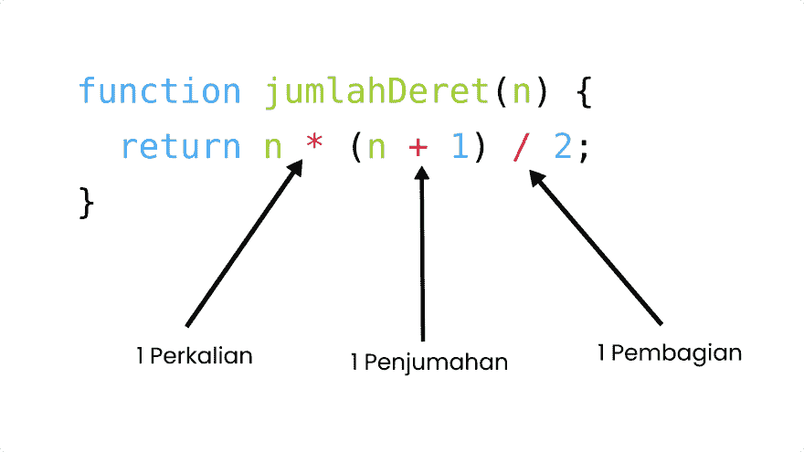
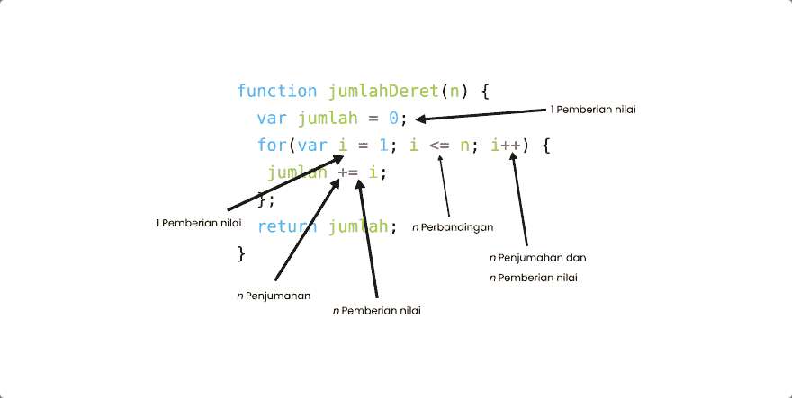
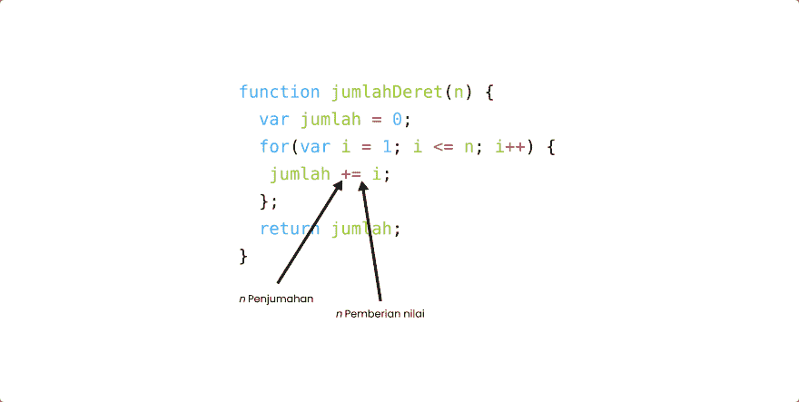
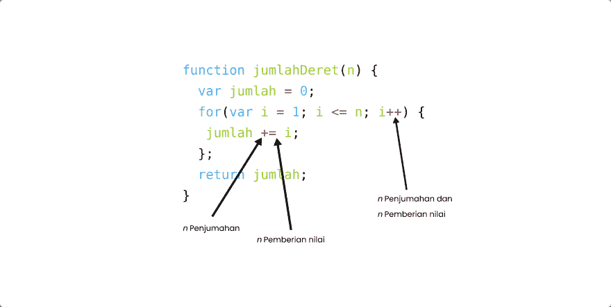
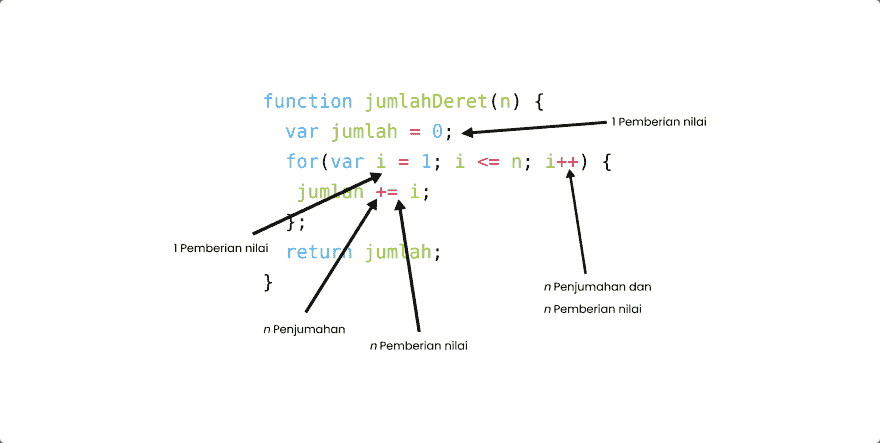

# Big O: [3] Menghitung Operasi

> 原文： [https://dev.to/luthfiajiw/big-o-3-menghitung-operasi-3ndp](https://dev.to/luthfiajiw/big-o-3-menghitung-operasi-3ndp)

Bismillahirrahmaanirrahim，

Pada artikel [sebelumnya](https://dev.to/luthfiajiw/2-pengaturan-waktu-pada-kode-kita-1o28) saya katakan bahwa menggunakan waktu dengan bantuan method `performance` milik Javascript sebagai tolak ukur merupakan cara yang kurang bisa diandalkan. Lantas jika bukan menggunakan waktu lalu mengunakan apa?

Jadi begini, pada artikel sebelumnya kita itu ingin mengetahui kode mana yang memiliki waktu proses paling cepat dengan mengukurnya menggunakan waktu juga, waktu diukur dengan waktu.

Nah, sekarang ini kita tidak melakukan hal itu. Kita akan memprediksi kode mana yang lebih cepat dengan cara *menghitung operasi-operasi* pada kode tersebut yang akan dilakukan oleh komputer.

Yang namanya prediksi kita tidak akan mendapat nilai pasti berapa detik kode tersebut berjalan, namun untungnya kita tidak perlu melakukan serangkaian proses seperti pada artikel sebelumnya, dan untungnya lagi bahwa prediksi yang akan kita lakukan insyaallah 100% akurat.

Mengapa kita melakukan perhitungan operasi yang dimiliki oleh suatu kode?
Itu karena operasi-operasi yang ada pada kode tersebut selalu memiliki nilai *konstan* , tidak seperti waktu yang kadang berubah-ubah.

Jadi misalkan kita memiliki dua algoritma, yang satu memiliki 5 operasi dan yang satunya lagi memiliki 10 operasi. Maka kita tidak perlu lagi khawatir dengan spesifikasi komputer yang kita gunakan, entah inputan yang diberikan itu bernilai kecil ataupun besar pengaruh eksternal tidak bisa ikut campur lagi di sini.

Dan, sebuah `runtime` akan selalu berbanding lurus dengan jumlah operasi yang dijalankan.

Langsung saja kita bedah kode dari contoh pada artikel sebelumnya dengan menghitung operasi yang dimiliki oleh masing-masing kode. Dimulai dari sang pemenang,

Bisa kita lihat, ada 3 operasi yang berjalan pada fungsi di atas. 1 penjumlahan, 1 perkalian dan 1 pembagian. Berapapun nilai *n* nya maka operasi yang berjalan tetap 3\. Entah itu 100 atau bahkan 1 triliun, operasi yang berjalan akan selalu 3 kali.

Sekarang kita berpindah ke kode yang ke dua, dan ini dia

*Weww* , sekarang kita bedah satu persatu, dimulai dari yang ini,

Yang berbeda pada kode kali ini adalah, kita menggunakan perulangan `for` . Maka 2 operasi di atas berjalan bergantung pada variabel `n` . Maka dari itu ditulis *n Penjumlahan* dan *n Pemberian Nilai* . Sebenarnya sintaks `jumlah += i` adalah ringkasan dari sintaks `jumlah = jumlah + i` .

Selanjtunya adalah,

Operasi yang berada pada `i++` . Operasi itu juga sama seperti yang sebelumnya, yakni penjumlahan dan pemberian nilai. Karena `i++` merupakan ringkasan dari `i = i + 1` .

Selanjutnya，

Kita memiliki 2 operasi pemberian nilai, operasi ini tidak bergantung pada n karena berada di luar jangkauan perulangan. Operasi ini hanya berjalan satu kali saat fungsi pertama kali dipanggil untuk memberikan nilai awal.

Dan yang terakhir adalah,

*n* operasi perbandingan. Operasi ini akan terus membandingkan nilai *i* dengan *n* , jika masih bernilai `true` maka perulangan akan terus berjalan sampai akhirnya perbandingan ini bernilai `false` dan perulangan akan berhenti.

Hmm, lalu jumlah operasi pada kode ini ada berapa?

Jika sudah seperti ini maka akan sedikit merepotkan karena kita tidak memiliki nilai *konstan* seperti pada kode yang pertama tadi. Kita hanya memiliki nilai *n* yang sejatinya bukan nilai yang *statis* .

Maka kita simpulkan dari uraian di atas bahwa jumlah operasi dari perhitungan di atas adalah `5n+2` . Dimana ada 5n operasi dan 2 operasi konstan. jika `n = 5` maka jumlah operasi dari kode di atas adalah **27** .

Selanjutnya kita sederhanakan lagi kesimpulan dari rumus `5n+2` di atas. Bahwa sebenarnya nilai pasti seperti `5` dan `2` itu tidak usah terlalu dipikirkan dan kita hanya berfokus pada pertumbuhan jumlah *n* saja. Kita akan melihat teori tentang ini lebih banyak lagi ke depannya.

Jadi, kesimpulan yang sebenarnya adalah **Pertumbuhan n akan memengaruhi jumlah operasi. Karena jumlah operasi akan selalu berbanding lurus dengan pertumbuhan n** .

Oke, cukup sekian dulu pembahasan kali ini. Di artikel selanjutnya kita akan membahas mengenai Time Complexity.

Jika ada kritik dan saran bisa langsung disampaikan. Terimakasih dan Sampai Jumpa ! :D