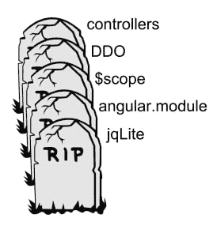
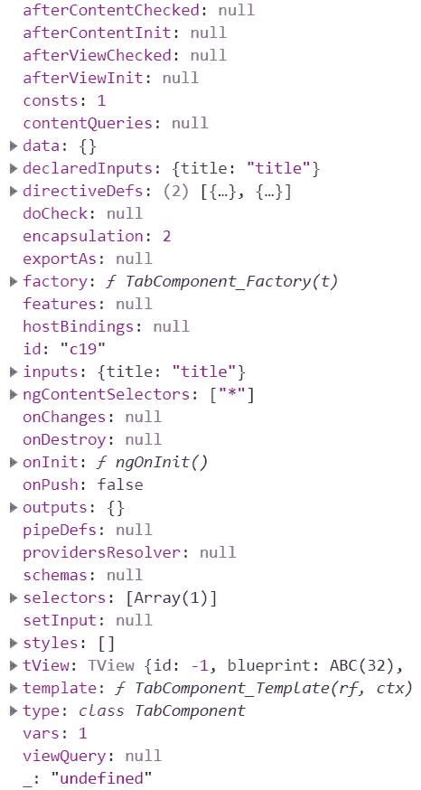
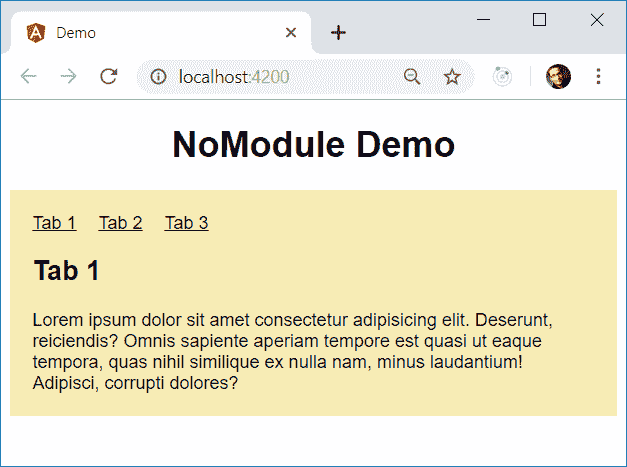

# 有角常春藤的建筑——第一部分:没有 NgModules 的可能未来？

> 原文：<https://dev.to/angular/a-possible-future-without-ngmodules-4i2d>

在这篇文章中，我想展示:

*   🔭没有(可选)NgModules 的未来会是什么样子
*   🐹今天我们如何为未来做准备

用于示例的[源代码](https://github.com/manfredsteyer/angular-without-modules)可以在[这里](https://github.com/manfredsteyer/angular-without-modules)找到。

**免责声明**:这里的例子是一个*实验*展示了 Angular 可能走向的一个可能方向。因此，它还没有准备好生产，而且*也没有*反映 Angular 团队的官方愿景。尽管如此，它展示了常青藤的可能性，并引出了一个结论:我们今天如何为没有 T0 的未来做准备。

## 一点历史

当 Angular - back 被称为 Angular 2 -时，该团队并没有计划实施自己的模块系统。虽然这在 AngularJS 1.x 时代是必要的，但 Angular (2+)的想法只是利用 2015 年引入的 EcmaScript 模块。

因此，AngularJS 1.x 的几个方面中，有角度的模块应该在即将到来的谷歌 SPA 旗舰版本中被跳过。下图摘自[伊戈尔·米纳尔](https://twitter.com/igorminar?lang=de)和[托拜厄斯·博施](https://twitter.com/tbosch1009?lang=de)在 2014 巴黎欧洲展上的演讲，强调了这一点:

[](https://res.cloudinary.com/practicaldev/image/fetch/s--sdnGqQzn--/c_limit%2Cf_auto%2Cfl_progressive%2Cq_auto%2Cw_880/https://thepracticaldev.s3.amazonaws.com/i/i7kg0l0rhhs3y30tseas.png)

然而，在 Angular 的开发过程中，有几个原因使得 Angular 模块变得很方便。一个原因是懒惰加载；另一个原因是需要为 Angular 编译器提供上下文。这是因为编译器需要知道模板中哪些组件、指令和管道是可用的。

相反，Ivy 有一个不同的策略来定义编译上下文——至少在幕后是这样。下一节将给出一些细节。

## 编译上下文为 Ivy

Ivy 的一个好处是它产生更简单的代码。在编译期间，它只是向组件添加一个静态的`ɵcmp`属性。此属性包含描述编译器组件的定义对象。

类似地，编译器也将这样的定义添加到指令和管道中。它们被称为`ɵdir`和`ɵpipe`。

你甚至可以在运行时访问它:

```
const def: ComponentDef<AppComponent> = AppComponent['ɵcmp'];
console.debug('def', def); 
```

Enter fullscreen mode Exit fullscreen mode

相应的控制台输出如下所示:

[](https://res.cloudinary.com/practicaldev/image/fetch/s--CRFfB-fj--/c_limit%2Cf_auto%2Cfl_progressive%2Cq_auto%2Cw_880/https://thepracticaldev.s3.amazonaws.com/i/iroujz6cqa00lxndgwmb.png)

正如您在这里看到的，这些属性包含了 Angular 在执行组件时需要知道的一切。也许你已经注意到了`directiveDefs`和`pipeDefs`属性。它们包含了我们上面讨论过的模板的编译上下文。

第一个指向一组指令和组件的定义。也就是说，组件定义只是一种特殊的指令定义。或者，`directiveDefs`可以指向返回这样一个数组的工厂函数。

`pipeDefs`属性对管道定义做同样的事情。

这样，Angular 知道哪些(子)组件、指令和管道在组件的模板中是可用的。

现在，您可能想知道这些属性是如何填充正确的值的。为了防止破坏性的更改，Ivy 编译器只在组件的模块以及导入的所有其他模块中查找必要的条目。之后，它将找到的组件、指令和管道添加到`directiveDefs`或`pipeDefs`。

然而，如果我们想使用没有模块 Ivy，我们可以直接填充这两个属性。下一节提供了一些关于这个想法的信息。

## 没有 NgModules 的编译上下文

从技术上讲，可以直接将编译上下文添加到`directiveDefs`和`pipeDefs`中。不幸的是，这些属性目前还不是 Angular 公共 API 的一部分。

这是有原因的:首先，Angular 团队专注于确保 Ivy 完全向后兼容。除此之外，他们将逐步引入基于 Ivy 的新功能。

当这种情况发生时，`Component` decorator 可能会因此获得一些额外的属性。

正如下一节所示，我们今天已经可以对这种可能的未来有一个简短的展望。

## 镇定棱角-编译器

虽然这一切都将在运行时工作，但由于 Angular 编译器的一些检查，它可能会在编译期间引起一些问题。例如，它通过查看`NgModules`来检查使用的部件和管道是否可用。当然，这些检查在我们的例子中不起作用，因为我们的目标是在没有它们的情况下工作。

为了让编译器平静下来，我们应该在`tsconfig.json` :
中关闭 fullTemplateTypeCheck

```
"angularCompilerOptions":  {  "fullTemplateTypeCheck":  true,  "strictInjectionParameters":  true,  } 
```

Enter fullscreen mode Exit fullscreen mode

同样，我们应该将`NO_ERRORS_SCHEMA`输入到`AppModule` :

```
@NgModule({
    imports: [
        BrowserModule
    ],
    declarations: [
        AppComponent
    ],
    schemas: [
        NO_ERRORS_SCHEMA
    ],
    providers: [],
    bootstrap: [
        AppComponent
    ]
})
export class AppModule { } 
```

Enter fullscreen mode Exit fullscreen mode

在这个案例研究中，`AppModule`是唯一使用的模块。从技术上讲，我们甚至可以去掉这个模块。
相反，我们可以使用 Ivy 的`ɵrenderComponent`函数来引导`AppComponent`，它也是私有 API 的一部分。然而，这将使事情变得更加复杂，因为`renderComponent`目前不支持开箱即用的自动变更检测。

## 直接提供编译上下文

由于直接提供编译上下文在今天的公共 API 中是不可能的，所以本节直接利用了可用的私有 API。当然，它们可以改变，因此这里概述的技术对于生产代码来说是不可行的。

然而，这个实验展示了现代角码在未来可能的样子。这也导致了一个结论，告诉我们，我们如何为这个未来做准备。

为了演示如何直接提供编译上下文，我在这里使用了一个简单的例子。它只包含一个`tabbed-pane`，一次显示几个`tab`中的一个:

[](https://res.cloudinary.com/practicaldev/image/fetch/s--62HV8rme--/c_limit%2Cf_auto%2Cfl_progressive%2Cq_auto%2Cw_880/https://thepracticaldev.s3.amazonaws.com/i/9or5dyek4sm52l4a6ki5.png)

示例中的`AppComponent`使用了它们:

```
<tabbed-pane>
  <tab title="Tab 1">
    Lorem ipsum ...
  </tab>
  <tab title="Tab 2">
    Lorem ipsum ...
  </tab>
  <tab title="Tab 3">
    Lorem ipsum ...
  </tab>
</tabbed-pane> 
```

Enter fullscreen mode Exit fullscreen mode

为了显示和隐藏标签，`TabbedPaneComponent`使用 Angular 的`*ngIf`指令，为了显示链接，它使用`*ngFor`。

如果我们想直接向这些组件提供编译上下文，我们需要获得各自的定义对象。为此，我创建了一个助手函数:

```
import { Type } from "@angular/core";
import { ɵComponentDef as ComponentDef } from '@angular/core';

[...]

export function getComponentDef<T>(t: Type<T>): ComponentDef<T> {
  if (t['ɵcmp']) {
    return t['ɵcmp'] as ComponentDef<T>;
  }

  throw new Error('No Angular definition found for ' + t.name);
} 
```

Enter fullscreen mode Exit fullscreen mode

您可能已经注意到了，`ComponentDef`类以`ɵ`符号为前缀。这表明该类仍然是 Angular 私有 API 的一部分。

我已经写了类似的帮助函数来获取`DirectiveDef` s 和`PipeDef` s:

```
export function getDirectiveDef<T>(t: Type<T>): DirectiveDef<T> {

    if (t['ɵdir']) {
      return t['ɵdir'] as DirectiveDef<T>;
    }

    // A Component(Def) is also a Directive(Def)
    if (t['ɵcmp']) {
      return t['ɵcmp'] as ComponentDef<T>;
    }

    throw new Error('No Angular definition found for ' + t.name);
}

export function getPipeDef<T>(t: Type<T>): PipeDef<T> {

  if (t['ɵpipe']) {
    return t['ɵpipe'] as PipeDef<T>;
  }

  throw new Error('No Angular definition found for ' + t.name);
} 
```

Enter fullscreen mode Exit fullscreen mode

类似地，我已经编写了助手函数，用于从一组指令和一组管道中获取所有的定义对象:

```
export function getDirectiveDefs(types: Type<any>[]): DirectiveDef<any>[] {
  return types.map(t => getDirectiveDef(t));
}

export function getPipeDefs(types: Type<any>[]): PipeDef<any>[] {
  return types.map(t => getPipeDef(t));
} 
```

Enter fullscreen mode Exit fullscreen mode

请注意，前一种方法也尊重组件定义，因为组件定义是一种特殊的指令定义。技术上，`ComponentDef`甚至继承了`DirectiveDef`。

使用这些助手，我们可以很容易地将编译上下文添加到我们的组件:

```
@Component({ [...] })
export class AppComponent {
  title = 'demo';
}

// Adding compilation context
const def = getComponentDef(AppComponent);

def.directiveDefs = [
  getDirectiveDef(TabComponent), 
  getDirectiveDef(TabbedPaneComponent)
]; 
```

Enter fullscreen mode Exit fullscreen mode

为了简单起见，我在这里覆盖了`directiveDefs`属性。这意味着编译器在遍历可能存在的模块后放在那里的值也会被覆盖。

当然，将相同的定义对象一次又一次地添加到不同的消费对象中是很烦人的。然而，我们可以使用一个中心数组将属于同一组的组件分组:

```
export const TABBED_PANE_COMPONENTS = [
    TabbedPaneComponent,
    TabComponent
]; 
```

Enter fullscreen mode Exit fullscreen mode

为了导入这个数组，我们可以使用我们的`getDirectiveDef`助手函数:

```
def.directiveDefs = [
  ...getDirectiveDefs(TABBED_PANE_COMPONENTS)
]; 
```

Enter fullscreen mode Exit fullscreen mode

与此类似，我写了一个文件，从`@angular/common` :
导出了我需要的所有指令

```
export const COMMON_DIRECTIVES = [
    NgIf,
    NgForOf,
    // etc.
]; 
```

Enter fullscreen mode Exit fullscreen mode

这个用于`TabbedPaneComponent` :

```
@Component({ [...] })
export class TabbedPaneComponent implements AfterContentInit {
    [...]
}

const def = getDef(TabbedPaneComponent);

def.directiveDefs = [
     ...getDefs(COMMON_DIRECTIVES)
]; 
```

Enter fullscreen mode Exit fullscreen mode

当然，由于我们只有两个组件，这在这里并不是一个很大的优势，但是在有很多组件的更大的场景中，使用这样的阵列会非常方便。

由于在定义组件后对其进行修补有些残忍，下一节将展示一种更好的方法。

## 用装饰器提供编译上下文

为了以我们作为 Angular 开发人员更习惯的方式向组件添加编译上下文，我编写了一个简单的装饰器:

```
export interface ComponentDepsConfig {
  directives?: Type<any>[];
  pipes?: Type<any>[];
}

export function ComponentDeps(config: ComponentDepsConfig) {
  return (component) => {

    const def = getComponentDef(component);

    def.directiveDefs = [
      ...getDirectiveDefs(config.directives || [])
    ];

    def.pipeDefs = [
      ...getPipeDefs(config.pipes || [])
    ];

  }
} 
```

Enter fullscreen mode Exit fullscreen mode

更准确地说，这是一个装修工人的工厂。它接受一个包含编译上下文的 config 对象，并返回一个组件装饰器。这个装饰器将上下文添加到组件的定义中。

现在，让我们将这个装饰器应用到我们的组件:

```
@Component({ [...] })
@ComponentDeps({
  directives: [ 
    ...TABBED_PANE_COMPONENTS
  ]
})
export class AppComponent {
  title = 'demo';
} 
```

Enter fullscreen mode Exit fullscreen mode

这看起来很像设想的未来，组件装饰器直接获取编译上下文。同样，Angular 的 [Minko Gechev](https://twitter.com/mgechev) 创造了 Angular 的[原型，它使用了这个想法。它的组件装饰器带有一个`deps`属性，用于相同的目的。再说一次，这一切都是为了展示什么是可能的，它并不反映 Angular 团队的官方愿景。](https://github.com/mgechev/angular-ivy-demo)

然而，现在的问题是我们能从这个案例研究中学到什么。下一节给出了答案。

## 为没有(可选)NgModules 的可能未来做准备

在本文中，我们已经看到我们需要一个编译上下文。如果我们没有类似于`NgModules`的东西，我们可以把它直接分配给我们的组件。这已经可以通过使用内部 API 来实现，并且各自的属性可能最终会作为 Angular 的公共 API 的一部分公开。

我们还看到，即使在这种情况下，将组件、指令或管道组合在一起也很方便。为此，我们使用了一个简单的数组:

```
export const TABBED_PANE_COMPONENTS = [
    TabbedPaneComponent,
    TabComponent
]; 
```

Enter fullscreen mode Exit fullscreen mode

有趣的是，这个数组看起来像 NgModule 的`export`部分。然而，这是纯粹的 EcmaScript，这使得它更简单，更容易理解。

同样，很明显，即使在没有`NgModules`的未来，我们也需要一种方法来对我们的代码进行分组。我们还需要某种信息隐藏方式，这意味着我们必须定义 API 的公共和私有部分。幸运的是，这也可以通过使用桶用纯 EcmaScript 来完成。

例如，在我的案例研究中，`tabbed-pane`文件夹有下面的`index.ts` :

```
export * from './tab.component';
export * from './tabbed-pane.component';

// array with components
export * from './components'; 
```

Enter fullscreen mode Exit fullscreen mode

`app.component.ts`进口该桶:

```
import { TABBED_PANE_COMPONENTS } from './tabbed-pane'; 
```

Enter fullscreen mode Exit fullscreen mode

我们甚至可以更进一步，对不同的库使用 monorepo。每个库都有一个定义公共 API 的桶。由于有了 Angular CLI，创建库来对代码进行分组变得非常容易。这只是一个命令(`ng generate lib my-lib`)的问题，它也使你的代码更加可重用。

此外，当使用 [Nrwl 的 Nx](https://nx.dev) 创建基于 Angular CLI 的 monorepo 时，您还可以[定义库之间的访问限制](https://www.softwarearchitekt.at/post/2019/03/04/sustainable-angular-architectures-with-strategic-design-and-monorepos-part-2-implementation.aspx)。此外，它包含林挺规则，防止有人通过绕过他们的桶来使用你的 API 的私有部分。

这一切都导致我的建议，为这种可能的未来做好准备，没有(可选)角模块。

## 结论

正如您在这里看到的，我们已经可以为没有(可选)NgModules 的未来做好准备。就这么简单:

1.  将你的应用程序切割成库，并使用桶来定义它们的公共 API。
2.  当 NgModules 变为可选时，用它们的`export`数组替换它们。

最后，让我告诉你最好的:不管这种可能的未来是否会发生，这个建议无论如何都很有意义，因为将你的应用程序分成一个公共部分和一个私有部分的小库会导致一个更健壮的架构。