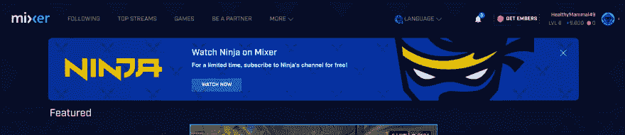
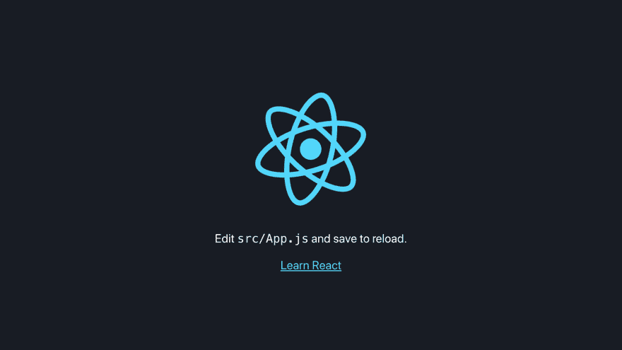
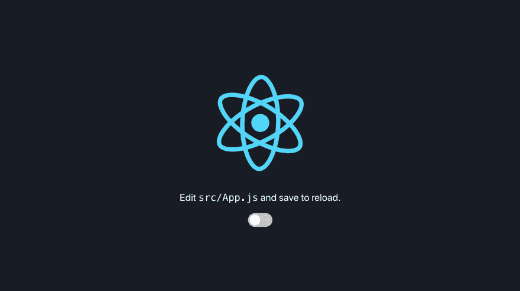
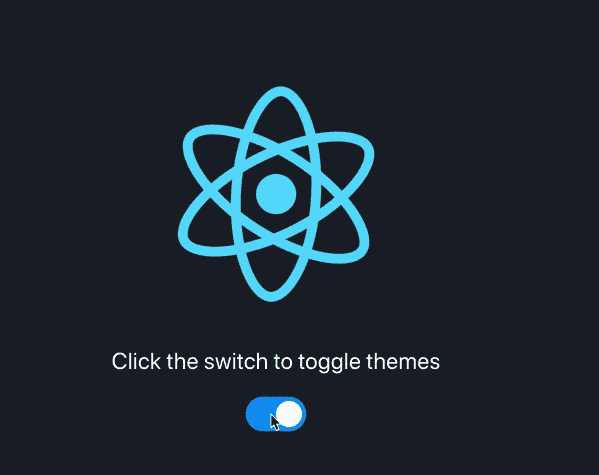

# 如何在 React web 应用程序中添加黑暗模式

> 原文：<https://dev.to/wchr/how-to-add-a-dark-mode-to-your-react-web-app-4f1>

我们目前生活在万物时代的黑暗模式中。现在大多数应用程序都有一个开关，要么在导航栏上，要么就在它的设置附近，你只需点击一下，屏幕就会变黑。一些应用程序甚至默认设置了黑暗模式，例如[混合器](https://mixer.com)
[](https://res.cloudinary.com/practicaldev/image/fetch/s--uUEWSVNS--/c_limit%2Cf_auto%2Cfl_progressive%2Cq_auto%2Cw_880/https://cdn.hashnode.com/res/hashnode/image/upload/v1565871575888/hE9mSc11D.png) ，甚至网飞也默认设置了黑暗模式。

拥有黑暗模式将真正有助于减少由光明模式引起的眼睛疲劳，到本文结束时，你应该能够在几分钟内将黑暗模式添加到你的 Reactjs 应用程序中。

# 先决条件

您应该对以下内容有基本的了解:

*   反应概念(生命周期)
*   css 概念，尤其是 CSS 变量
*   Javascript 文档对象模型

# 设置

创建一个新目录来存放我们的 React 应用程序。

```
$ mkdir simple_dark_theme_react_app && cd simple_dark_theme_react_app 
```

<svg width="20px" height="20px" viewBox="0 0 24 24" class="highlight-action crayons-icon highlight-action--fullscreen-on"><title>Enter fullscreen mode</title></svg> <svg width="20px" height="20px" viewBox="0 0 24 24" class="highlight-action crayons-icon highlight-action--fullscreen-off"><title>Exit fullscreen mode</title></svg>

接下来，我们将需要`create-react-app` CLI 来帮助快速设置一个简单的 React 应用程序，无需任何 webpack 配置。

```
$ npx create-react-app . 
```

<svg width="20px" height="20px" viewBox="0 0 24 24" class="highlight-action crayons-icon highlight-action--fullscreen-on"><title>Enter fullscreen mode</title></svg> <svg width="20px" height="20px" viewBox="0 0 24 24" class="highlight-action crayons-icon highlight-action--fullscreen-off"><title>Exit fullscreen mode</title></svg>

运行我们的应用程序

```
$ yarn start or npm start 
```

<svg width="20px" height="20px" viewBox="0 0 24 24" class="highlight-action crayons-icon highlight-action--fullscreen-on"><title>Enter fullscreen mode</title></svg> <svg width="20px" height="20px" viewBox="0 0 24 24" class="highlight-action crayons-icon highlight-action--fullscreen-off"><title>Exit fullscreen mode</title></svg>

它应该会自动启动您的浏览器，如果没有访问`http://localhost:3000`。

> 如果你碰巧遇到一个`fsevents is not a constructor`访问这个 Github 的人提出关于它的问题[链接](https://github.com/facebook/create-react-app/issues/6891)
> 
> 如果这没有帮助，我所做的就是删除`lock`文件和`node_module`文件夹，并重新安装软件包。

```
{  "name":  "simple_dark_theme_react_app",  "version":  "0.1.0",  "private":  true,  "dependencies":  {  "react":  "^16.9.0",  "react-dom":  "^16.9.0",  "react-scripts":  "3.1.1"  },  "scripts":  {  "start":  "react-scripts start",  "build":  "react-scripts build",  "test":  "react-scripts test",  "eject":  "react-scripts eject"  },  "eslintConfig":  {  "extends":  "react-app"  },  "browserslist":  {  "production":  [  ">0.2%",  "not dead",  "not op_mini all"  ],  "development":  [  "last 1 chrome version",  "last 1 firefox version",  "last 1 safari version"  ]  }  } 
```

<svg width="20px" height="20px" viewBox="0 0 24 24" class="highlight-action crayons-icon highlight-action--fullscreen-on"><title>Enter fullscreen mode</title></svg> <svg width="20px" height="20px" viewBox="0 0 24 24" class="highlight-action crayons-icon highlight-action--fullscreen-off"><title>Exit fullscreen mode</title></svg>

*以上是我的 package.json 文件。*

# 好玩的部分

我不会创建一个完整的 react 应用程序，因为它可能会使这个博客很长，我也希望你有创意，没有混乱。我将使用默认的`create-react-app`模板。

[](https://res.cloudinary.com/practicaldev/image/fetch/s--rHiu8n4g--/c_limit%2Cf_auto%2Cfl_progressive%2Cq_auto%2Cw_880/https://cdn.hashnode.com/res/hashnode/image/upload/v1565873711199/Hp3n0R4qk.png)

## 我们将做什么

我们要做的是使用上面默认的 React 应用背景色作为我们的深色主题，白色作为我们的浅色主题。一个开关将存在于页面下方，允许我们切换主题的变化。

> **注意**:我不会使用`react`钩子，因为我没有时间去研究它，而且类组件对我来说也很有用。

## CSS 部分

CSS 在切换主题时起着重要的作用。启动你最喜欢的编辑器，打开我们需要添加几个变量的`src/App.css`文件。

```
/* Define our color variables */

html {
  --primary-color: #fff;
  --secondary-color: #282c34;
}

/* Redefine our color variables if the data-theme attr
  value is "dark
*/

html[data-theme="dark"] {
  --primary-color: #282c34;
  --secondary-color: #fff;
}

.App {
  text-align: center;
}

.App-logo {
  animation: App-logo-spin infinite 20s linear;
  height: 40vmin;
  pointer-events: none;
}

.App-header {
  background-color: var(--secondary-color);
  min-height: 100vh;
  display: flex;
  flex-direction: column;
  align-items: center;
  justify-content: center;
  font-size: calc(10px + 2vmin);
  color: var(--primary-color);
}

@keyframes App-logo-spin {
  from {
    transform: rotate(0deg);
  }

  to {
    transform: rotate(360deg);
  }
} 
```

<svg width="20px" height="20px" viewBox="0 0 24 24" class="highlight-action crayons-icon highlight-action--fullscreen-on"><title>Enter fullscreen mode</title></svg> <svg width="20px" height="20px" viewBox="0 0 24 24" class="highlight-action crayons-icon highlight-action--fullscreen-off"><title>Exit fullscreen mode</title></svg>

接下来，我们将添加我们的主题切换开关。打开`src/App.js`文件。

```
import React from "react";
import logo from "./logo.svg";
import "./App.css";

class App extends React.Component {
  render() {
    return (
      <div className="App">
        <header className="App-header">
          
          <p>
            Edit <code>src/App.js</code> and save to reload.
          </p>
          <label class="switch">
            <input type="checkbox" />
            <span class="slider round" />
          </label>
        </header>
      </div>
    );
  }
}

export default App; 
```

<svg width="20px" height="20px" viewBox="0 0 24 24" class="highlight-action crayons-icon highlight-action--fullscreen-on"><title>Enter fullscreen mode</title></svg> <svg width="20px" height="20px" viewBox="0 0 24 24" class="highlight-action crayons-icon highlight-action--fullscreen-off"><title>Exit fullscreen mode</title></svg>

> 注意，我在`src/App.js`文件中使用了一个类组件。

我们需要添加几个 css 样式的切换按钮，打开`src/App.css`文件。

```
/* CSS styling for our switch */
/* This switch was styled with the help of w3schools */
/* https://www.w3schools.com/howto/tryit.asp?filename=tryhow_css_switch */
.switch {
  position: relative;
  display: inline-block;
  width: 60px;
  height: 34px;
}

.switch input {
  opacity: 0;
  width: 0;
  height: 0;
}

.slider {
  position: absolute;
  cursor: pointer;
  top: 0;
  left: 0;
  right: 0;
  bottom: 0;
  background-color: #ccc;
  -webkit-transition: .4s;
  transition: .4s;
}

.slider:before {
  position: absolute;
  content: "";
  height: 26px;
  width: 26px;
  left: 4px;
  bottom: 4px;
  background-color: white;
  -webkit-transition: .4s;
  transition: .4s;
}

input:checked+.slider {
  background-color: #2196F3;
}

input:focus+.slider {
  box-shadow: 0 0 1px #2196F3;
}

input:checked+.slider:before {
  -webkit-transform: translateX(26px);
  -ms-transform: translateX(26px);
  transform: translateX(26px);
}

/* Rounded sliders */
.slider.round {
  border-radius: 34px;
}

.slider.round:before {
  border-radius: 50%;
} 
```

<svg width="20px" height="20px" viewBox="0 0 24 24" class="highlight-action crayons-icon highlight-action--fullscreen-on"><title>Enter fullscreen mode</title></svg> <svg width="20px" height="20px" viewBox="0 0 24 24" class="highlight-action crayons-icon highlight-action--fullscreen-off"><title>Exit fullscreen mode</title></svg>

你应该有类似下图的东西。
[T3】](https://res.cloudinary.com/practicaldev/image/fetch/s--vxrCypiw--/c_limit%2Cf_auto%2Cfl_progressive%2Cq_auto%2Cw_880/https://cdn.hashnode.com/res/hashnode/image/upload/v1565876598744/IaJbLKbHA.png)

## Javascript/React 部分

> 注意:为了防止刷新应用程序时丢失状态，我们将主题状态存储在浏览器的`localStorage`中。

打开你的`src/App.js`文件，让我们更新它，这样我们就可以在主题
之间切换

```
import React from "react";
import logo from "./logo.svg";
import "./App.css";

class App extends React.Component {
  // Define a state object to hold our app's state
  state = {
    // Boolean attribute that will allow us to toggle the switch
    // Keep the switch on if the theme is dark
    checked: localStorage.getItem("theme") === "dark" ? true : false,
    /**
     * When a user activates the dark theme we will store the value
     * on localstorage or set default value to light if it is neither dark
     * nor light
     */
    theme: localStorage.getItem("theme")
  };

  componentDidMount() {
    // Update the data-theme attribute of our html tag
    document
      .getElementsByTagName("HTML")[0]
      .setAttribute("data-theme", localStorage.getItem("theme"));
  }

  // Class method allowing us to toggle the theme change
  toggleThemeChange = () => {
    const { checked } = this.state;
    // If theme is light then change to dark
    if (checked === false) {
      // Update localstorage
      localStorage.setItem("theme", "dark");
      /**
       * The document.getElementsByTagName(...).setAttribute(...)
       * will only update the value
       */
      // Update the data-theme attribute of our html tag
      document
        .getElementsByTagName("HTML")[0]
        .setAttribute("data-theme", localStorage.getItem("theme"));
      // Update our state
      this.setState({
        // Ensure our switch is on if we change to dark theme
        checked: true
      });
    } else {
      // Update localstorage
      localStorage.setItem("theme", "light");
      /**
       * The document.getElementsByTagName(...).setAttribute(...)
       * will only update the value until the App is mounted and we change
       * the state of the switch so we will need to introduce
       * a React lifecycle called ˝componentDidMount()˝
       */
      // Update the data-theme attribute of our html tag
      document
        .getElementsByTagName("HTML")[0]
        .setAttribute("data-theme", localStorage.getItem("theme"));
      // Update our state
      this.setState({
        // Ensure our switch is off if we change to light theme
        checked: false
      });
    }
  };

  render() {
    return (
      <div className="App">
        <header className="App-header">
          
          <p>Click the switch to toggle themes</p>
          <label class="switch">
            {/* checked attribute is used to determine the state of 
              checkbox
              ----------------------------------------------
              The onChange attribute will toggle our theme change
            */}
            <input
              type="checkbox"
              // checked={this.state.checked}
              defaultChecked={this.state.checked}
              onChange={() => this.toggleThemeChange()}
            />
            <span class="slider round" />
          </label>
        </header>
      </div>
    );
  }
}

export default App; 
```

<svg width="20px" height="20px" viewBox="0 0 24 24" class="highlight-action crayons-icon highlight-action--fullscreen-on"><title>Enter fullscreen mode</title></svg> <svg width="20px" height="20px" viewBox="0 0 24 24" class="highlight-action crayons-icon highlight-action--fullscreen-off"><title>Exit fullscreen mode</title></svg>

哇哦！你的应用程序有黑暗模式。
[T3】](https://res.cloudinary.com/practicaldev/image/fetch/s--kKziYRcU--/c_limit%2Cf_auto%2Cfl_progressive%2Cq_66%2Cw_880/https://cdn.hashnode.com/res/hashnode/image/upload/v1565942037781/9SU6czVvV.gif)

# 总结

在这篇博客中，我们能够为我们的 react 应用程序添加一个黑暗模式。

# 加贺

*   回购[环节](https://github.com/werickblog/simple_dark_theme_react_app)
*   Codesandbox [链接](https://codesandbox.io/s/simplereactappwithdarktheme-jnpvg)
*   演示[链接](https://simpledarkthemereactapp.ewachira254.now.sh/)

## 钩子版本

[https://gist . github . com/oxy RUS/B4 edab 0372 B3 c 9 B1 b 60 a 59 e 7955121](https://gist.github.com/Oxyrus/b4edab0372b3c9b1c1b60a59e7955121)由

[](/andres)

## 安德烈斯·佩雷斯

[Web developer from 🇨🇴](/andres)