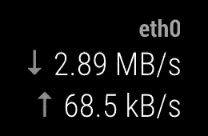

# 我写了我的第一个 MagicMirror 模块

> 原文：<https://dev.to/mscharl/i-wrote-my-first-magicmirror-module-3flo>

不久前我听说了 MagicMirror。我一直想自己做一个，但就像我所有的兼职项目一样，它被比告诉我我看起来漂亮的镜子更重要的东西吞噬了。我后来很长一段时间都没有去想它。但是最近我有了一些空闲时间，这个想法又回到了我的脑海里。我开始调查[回购和文件](https://github.com/MichMich/MagicMirror)，因为我好奇它是如何演变的。然后我找到了第三方模块的列表。我浏览了一下，被这个社区创造的大量不同的工具惊呆了。看到许多有用、有趣甚至琐碎的模块并记住至少有一个人在他或她的镜子上使用它是令人惊讶的。

所以我认为开始这个项目的最好方式是创建我自己的第一个模块。由于我的提供商被收购，我切换到了新提供商的网络，最近我的互联网连接遇到了很多问题，因此我决定创建一个模块来显示我的路由器上的当前带宽吞吐量。我还发现，当家里有人在浏览网页或看《网飞》时，看到这些数字有点好笑。

首先，我必须找出如何从我无处不在的 EdgeRouter 中获取这些号码。这花了我一些时间，但最终通过命令行界面并不难做到。然后我开始阅读 MagicMirror 文档并开发这个模块。虽然我没想到这很难，但它比我想象的还要容易。感谢[Michael Teeuw(magic mirror 的创造者)](https://github.com/MichMich)创造了这个令人敬畏的平台！我只能建议你自己去看看。

我计划写一篇关于我如何创建这个模块的更深入的文章。在写这篇文章的时候，我甚至创造了第二个。在此之前，您可以签出代码本身。

## [mscharl](https://github.com/mscharl)/[MMM-edge router-吞吐量](https://github.com/mscharl/MMM-edgerouter-throughput)

### 一个 MagicMirror 模块，显示一个无处不在的 EdgeRouter 的接口吞吐量

<article class="markdown-body entry-content container-lg" itemprop="text">

# 边缘路由器吞吐量

一个 MagicMirror 模块，显示一个无处不在的 EdgeRouter 的接口吞吐量。

该模块使用 SSH 连接到路由器，并从`/sbin/ifstat`读取网络吞吐量。

## 装置

1.  将 Repo 克隆到您的 MagicMirror 模块文件夹`git clone git@github.com:mscharl/MMM-edgerouter-throughput.git`
2.  安装一些节点依赖关系`cd MMM-edgerouter-throughput && npm install --production`
3.  [配置](https://raw.githubusercontent.com/mscharl/MMM-edgerouter-throughput/master/#configuration)享受

## 配置

| 财产 | 类型 | 需要 | 默认 | 描述 |
| --- | --- | :-: | --- | --- |
| `gateway` | `string` | ✔︎ | 您的边缘路由器的 ip 地址 |
| `username` | `string` | ✔︎ | 具有 SSH 访问权限的 EdgeRouter 的用户名。 |
| `password` | `string` | ✔︎ | 通过 SSH 访问的 EdgeRouter 的密码。 |
| `interface` | `string` | ✔︎ | 要在镜像上显示的界面。 |
| `title` | `string` | `undefined` | 显示在镜像上的可选标题。 |
| `showInterfaceName` | `boolean` | `false` | 是否显示接口的名称。 |

## 和睦相处

我基于我的 EdgeRouter X 开发了这个模块，没有额外安装任何东西。

我不能保证它会在其他…

</article>

[View on GitHub](https://github.com/mscharl/MMM-edgerouter-throughput)