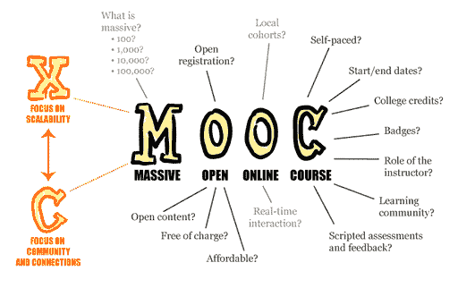

# 如何通过 MOOCs 保持与时俱进

> 原文：<https://dev.to/jwigert/how-you-can-stay-up-to-date-through-moocs-4a5n>

在这篇文章中，我将与你分享如何使用 MOOCs 来跟上你所在领域的发展并获得新的技能。在过去的一年半时间里，我完成了大约 30 门 MOOCs 课程，我也将分享我的一些经历。

## 什么是 MOOC？

让我们从基础开始。根据维基百科，MOOC 的定义是:

> 大规模开放在线课程(MOOC /muːk/)是一个旨在通过网络无限参与和开放访问的在线课程。
> 
> <cite>[Wikipedia](https://en.wikipedia.org/wiki/Massive_open_online_course)</cite>

MOOCs 是一种远程教育，你可以随时随地根据自己的需要学习内容。MOOC 通常由以下构件组成:

*   视频讲座
*   自测
*   作业(每周/期末)
*   协作项目
*   论坛
*   下载(视频、幻灯片和文字记录)

马修·普劳德(Mathplourde on Flickr)[[CC BY 2.0【T3]]的思维导图很好地概述了这个概念及其实现的灵活性:](https://creativecommons.org/licenses/by/2.0)

 [CC BY 2.0 (https://creativecommons.org/licenses/by/2.0)], via Wikimedia Commons")

## 我第一次接触 MOOCs

2018 年 2 月，我偶然发现了名为 [openSAP](https://open.sap.com/) 的[SAP](https://www.sap.com/)MOOC 平台。SAP 正在提供一门关于 ABAP 编程语言测试驱动开发的[技术课程](https://open.sap.com/courses/wtc1/)，我报了名。这门课程很棒，它改变了我作为一名开发人员如何跟上时代的步伐。

## 用 MOOCs 能学到什么？

我参加过的 MOOCs 主要分为以下三类:

1.  技术
2.  思想领袖
3.  新产品和解决方案

### 技术

作为一名开发人员，我总是寻找材料来扩展和提高我的技术技能。这可以是任何事情，从学习一门新的编程语言或测试框架到学习一个新的 NoSQL 数据库。

我参加的这类课程通常包含大量的编码练习，对我个人来说，这是一种非常好的学习方式。属于这一类别的 MOOCs 通常是工作最密集的。

### 思想领袖

作为一名开发人员，重要的是要拓宽视野，了解技术和社会的更大趋势。参加这个领域的 MOOCs 有助于你跟上新的商业实践，讲师通常是商业和学术思想领袖以及顶级政治家。

### 新产品和解决方案

当使用企业软件时，作为开发人员，您经常会被您的客户询问他们所听说的新产品和解决方案。即使你还没有机会亲身实践这些产品和解决方案，我也建议你参加这一领域的 MOOCs，至少对这些解决方案适用于哪些场景有一个大致的了解。

## 我何时以及如何消费 MOOCs

在我看来，MOOCs 相对于传统课堂培训的主要优势在于，你可以根据自己的个人时间表随时学习课程内容。

我每天乘地铁上下班总共需要 45 分钟。只要我能找到座位，我认为这是一个使用 MOOCs 的理想机会。我参加过的 MOOCs 通常有大约 20 分钟的单元，这意味着我每天可以挤出两个单元，只是去工作和回来。我发现这比浏览社交媒体帖子或在手机上玩游戏更能有效利用我的时间。

这些任务通常需要至少一个小时的专注工作，对我的通勤来说并不理想。我通常在家里其他人睡觉的时候做作业。

## 参加 MOOCs 的好副作用

除了学习本身，这当然是参加 MOOCs 最重要的部分，我还遇到了以下一些好的副作用:

*   放在你的 LinkedIn 个人资料上的证书和徽章:如果你收到一个证书或徽章，确保把它放在你的 LinkedIn 个人资料上。由于 MOOC 的词汇是可搜索的，希望与具有某种技能的人联系的人将通过这些搜索词找到你。
*   免费书籍:在我参加的一次 MOOC 中，老师们在推出 MOOC 的同时出版了一本书。因为我是这门课的前 30 名学生之一，所以我收到了一本免费的精装书。
*   折扣券:我参加的一些 MOOCs 在课程结束时给了我一张折扣券。优惠券用于书籍、会议和付费电子学习。
*   会议邀请:就在几天前，我收到了一个参加会议的邀请，主题是我参加的一个 MOOC。我仍然需要为会议付费，但如果我没有参加 MOOC，我就不会知道这个会议。

## 参加 MOOCs 的潜在不利因素

我在参加 MOOCs 时遇到的潜在不利因素如下:

*   机会成本:参加 MOOC 会有机会成本。我注意到，由于时间限制，我在参加 MOOCs 时读的书变少了。确保你参加的课程真的值得你投入的时间。
*   伪装的营销材料:我参加过的一些 MOOCs 只不过是软件供应商试图推销新产品的推销和营销材料。这在早期阶段变得很明显，所以不要犹豫退出具有这些特征的课程。我主要在新产品和解决方案类别中遇到了这些课程。

## MOOC 平台

现在有很多 MOOC 平台。我只想给你举几个例子让你开始。如果你有任何建议，请在下面的评论区分享。

### 自由代码营

在 freecodecamp.org，你可以参加一个完全免费的在线编码训练营。重点主要是前端 web 开发，课程主题包括响应式 web 设计、JavaScript、前端库和 API。有很多实际的编码练习。

### openSAP

在 open.sap.com，有数百门课程可供选择。其中许多课程侧重于 SAP 特定的解决方案和技术，但也有许多通用课程。一些例子是关于 Java 的课程，Snap！、设计思维、数字化转型、AI。这些课程对任何感兴趣的人都是免费的。

### Udacity

在 udacity.com，你可以获得不同领域的技术技能，比如编程和开发、人工智能、云计算和数据科学。我只在 Udacity 上过 JavaScript 课程，对这个平台不太熟悉。

## 最后的话

我希望你喜欢阅读我关于 MOOCs 话题的想法和经历。请在评论区告诉我你的想法。我打算用迄今为止参加过的我最喜欢的 MOOCs 写一篇后续的帖子。快乐学习！