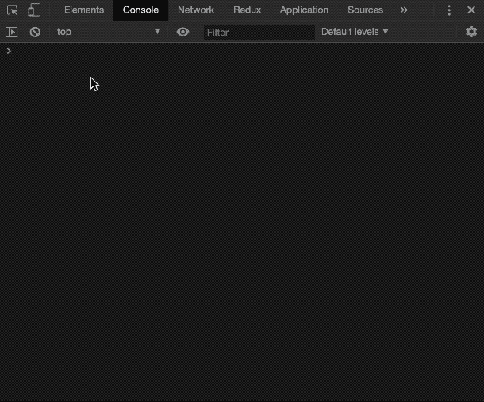
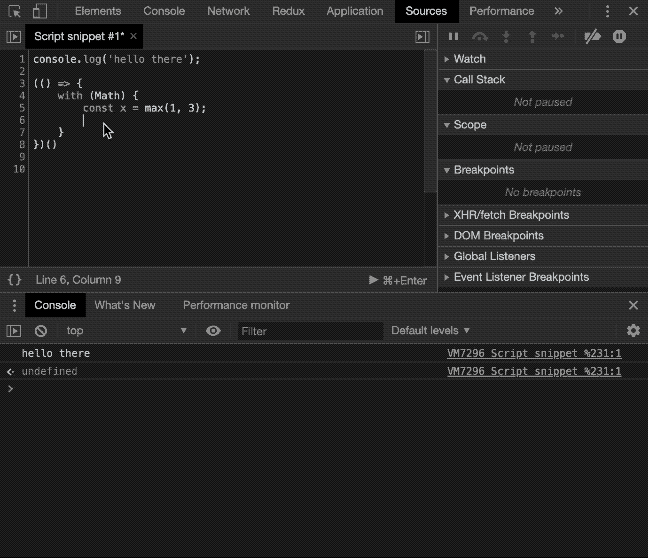

# 提高网站开发人员工作效率的 7 个技巧🚀

> 原文：<https://dev.to/mustapha/7-tips-to-boost-your-productivity-as-a-web-developer-4jh7>

作为一名软件开发人员，有时只要使用合适的工具就可以提高工作效率。如果你每天能节省一分钟，你一年就能节省四个小时，如果你不休假的话

所以，不多说了，这里是我的 7 个建议，可以帮助你节省时间:

## 更快一点`querySelector`

作为 web 开发人员，我们在浏览器中，或者我应该说，在我们浏览器的 devtools 中花费了大量时间。从这些 devtools 的控制台，你可以通过`document.getElementById` API 或者更通用的`document.querySelector`和`document.querySelectorAll`API 选择一个元素。但是有一种更快的方法。相反，你可以用:

```
 $('.some-class') // instead of document.querySelector
$$('.some-class') // instead of document.querySelectorAll 
```

<svg width="20px" height="20px" viewBox="0 0 24 24" class="highlight-action crayons-icon highlight-action--fullscreen-on"><title>Enter fullscreen mode</title></svg> <svg width="20px" height="20px" viewBox="0 0 24 24" class="highlight-action crayons-icon highlight-action--fullscreen-off"><title>Exit fullscreen mode</title></svg>

注意，`querySelectorAll`返回一个节点列表，而`$$`返回一个数组。

## 检查一个元素

当您检查一个元素(使用 devtools 的 inspect 工具)时，您可以使用的另一个有用的特性是`$0`。检查完一个元素后，您可以通过键入`$0`在控制台中访问它:

<figure>

[](https://res.cloudinary.com/practicaldev/image/fetch/s--JsLvMKs7--/c_limit%2Cf_auto%2Cfl_progressive%2Cq_66%2Cw_880/https://i.ibb.co/1TfN5Wy/0-2019-08-15-13-17-49.gif)

<figcaption>Inspecting an element with "$0"</figcaption>

</figure>

## 物体的力量`console`

如果你正在做一个 web 项目，很可能你正在使用`console.log`来调试你的应用程序。您知道`console`对象有其他方法可以帮助您更快地调试代码吗？

例如,`console.table`是一个不太为人所知的方法，但是它非常有用，因为它以数组的方式组织你的输出，在这里你可以快速排序你的变量值。(`console.table`将第二个参数作为要保留的列的数组，它将过滤其余的列):

<figure>

[](https://res.cloudinary.com/practicaldev/image/fetch/s--BrpYkFnw--/c_limit%2Cf_auto%2Cfl_progressive%2Cq_66%2Cw_880/https://i.ibb.co/m4VDGwx/table.gif)

<figcaption>Using console.table</figcaption>

</figure>

另一个有用的方法是`console.dir`。这个方法将允许您记录 DOM 元素的 javascript 对象，而不是它的 HTML。

```
const element = $$('your-component')[0];

console.log(element); // displays the HTML element

console.dir(element); // displays the list of the element's properties 
```

<svg width="20px" height="20px" viewBox="0 0 24 24" class="highlight-action crayons-icon highlight-action--fullscreen-on"><title>Enter fullscreen mode</title></svg> <svg width="20px" height="20px" viewBox="0 0 24 24" class="highlight-action crayons-icon highlight-action--fullscreen-off"><title>Exit fullscreen mode</title></svg>

## 更好的调试方式

对象很棒，但是如果你用它来调试你的代码，那么你可能会花费更多的时间。你可以使用`debugger`来访问`debugger`所在范围内的所有变量，而不是控制台日志记录，然后在控制台中检查这些变量。

参见下面使用`debugger`的例子:

<figure>

[](https://res.cloudinary.com/practicaldev/image/fetch/s--dhYIELaF--/c_limit%2Cf_auto%2Cfl_progressive%2Cq_66%2Cw_880/https://i.ibb.co/TR8dSHG/debugger.gif)

<figcaption>Using debugger</figcaption>

</figure>

## 你知道`designMode`吗？

让我们想象以下场景:您正在设计一个内部包含文本的组件的样式。你想通过改变组件的文本来测试一些边缘情况，比如放置一个非常长的文本或者根本没有文本。

虽然可以通过在 DOM 树或源代码中编辑组件的 HTML 来实现这一点，但最简单的方法是将文档的`designMode`属性设置为`'on'`，然后直接在 web 页面上更改文本。

在 devtools 运行中:`document.designMode = 'on'`:

<figure>

[](https://res.cloudinary.com/practicaldev/image/fetch/s--BU22qmsd--/c_limit%2Cf_auto%2Cfl_progressive%2Cq_66%2Cw_880/https://i.ibb.co/9ptR8R3/Untitled-2019-08-13-20-33-20.gif)

<figcaption>Setting document.designMode to ON</figcaption>

</figure>

* * *

好了，关于调试已经说得够多了，让我们看看如何在编写代码时更有效率:

## 利用对象析构

如果您使用 ES6 或任何 transpiler，您可以通过快速访问对象(和数组)属性来利用析构。

一个很好的用例是声明新的变量。这里有一个例子:

```
// Using it on arrays

const geolocation = [1.420000, 42.10000];
// Slow to type
const long = geolocation[0];
const lat  = geolocation[1];
// Fast
const [long, lat] = geolocation;

// Same goes for objects:

const geolocation = { long: 1.420000, lat: 42.10000 }
// Slow to type
const long = geolocation.long;
const lat  = geolocation.lat;
// Fast
const { long, lat } = geolocation; 
```

<svg width="20px" height="20px" viewBox="0 0 24 24" class="highlight-action crayons-icon highlight-action--fullscreen-on"><title>Enter fullscreen mode</title></svg> <svg width="20px" height="20px" viewBox="0 0 24 24" class="highlight-action crayons-icon highlight-action--fullscreen-off"><title>Exit fullscreen mode</title></svg>

析构的另一个很好的用法是交换变量值。可以这样做:

```
let a = 1; 
let b = 2;

[a, b] = [b, a]

console.log(a, b) // 2, 1 
```

<svg width="20px" height="20px" viewBox="0 0 24 24" class="highlight-action crayons-icon highlight-action--fullscreen-on"><title>Enter fullscreen mode</title></svg> <svg width="20px" height="20px" viewBox="0 0 24 24" class="highlight-action crayons-icon highlight-action--fullscreen-off"><title>Exit fullscreen mode</title></svg>

ℹ️解构是一个庞大的主题。你可以在[这篇文章](https://hacks.mozilla.org/2015/05/es6-in-depth-destructuring/)中了解更多。

## 传符

最后但同样重要的是，这最后一个技巧是目前为止我最喜欢的一个，我一直都在用。多亏了 spread 操作符，Javascript 变得比以往更加动态。

使用该操作符的一种方法是复制并连接数组和对象:

```
// For arrays

const arr1 = [0, 1];
const arr2 = [2, 3];

const copyOfArr1 = [...arr1];
const concatenating = [...arr1, ...arr2]; // [0, 1, 2, 3]

// Same works with objects:

const ob1 = { name: 'mark' };
const ob2 = { surname: 'smith' };

const copyOfOb1 = {...ob1};
const concatenating = {...ob1, ...ob2}; // { name: 'mark', surname: 'smith' } 
```

<svg width="20px" height="20px" viewBox="0 0 24 24" class="highlight-action crayons-icon highlight-action--fullscreen-on"><title>Enter fullscreen mode</title></svg> <svg width="20px" height="20px" viewBox="0 0 24 24" class="highlight-action crayons-icon highlight-action--fullscreen-off"><title>Exit fullscreen mode</title></svg>

此外，您可以使用 spread 运算符将值推入/移出对象和数组。这里有一个例子:

```
let array = [1, 2, 3];

array = [0, ...array, 4]; // [0, 1, 2, 3, 4] 
```

<svg width="20px" height="20px" viewBox="0 0 24 24" class="highlight-action crayons-icon highlight-action--fullscreen-on"><title>Enter fullscreen mode</title></svg> <svg width="20px" height="20px" viewBox="0 0 24 24" class="highlight-action crayons-icon highlight-action--fullscreen-off"><title>Exit fullscreen mode</title></svg>

这也适用于对象，但微妙的是，如果属性已经在对象中定义，它将被覆盖:

```
let ob = { name: 'mark', age: 30 };

ob = { ...ob, age: 20 };
console.log(ob); // { name: 'mark, age: 20 } 
```

<svg width="20px" height="20px" viewBox="0 0 24 24" class="highlight-action crayons-icon highlight-action--fullscreen-on"><title>Enter fullscreen mode</title></svg> <svg width="20px" height="20px" viewBox="0 0 24 24" class="highlight-action crayons-icon highlight-action--fullscreen-off"><title>Exit fullscreen mode</title></svg>

您可以利用的 spread 运算符的另一个用途是调用一个带有参数数组的函数:

```
const numbers = [1, 2, 3, 4, 5, 6, 7];

Math.max(...numbers); // 7 
```

<svg width="20px" height="20px" viewBox="0 0 24 24" class="highlight-action crayons-icon highlight-action--fullscreen-on"><title>Enter fullscreen mode</title></svg> <svg width="20px" height="20px" viewBox="0 0 24 24" class="highlight-action crayons-icon highlight-action--fullscreen-off"><title>Exit fullscreen mode</title></svg>

* * *

这个帖子到此为止。我希望你喜欢它。如果你有，请与你的朋友和同事分享。你也可以在 twitter 上关注我，地址是 [@theAngularGuy](https://twitter.com/TheAngularGuy) ，这对我帮助很大。

祝你今天开心！玩的开心！

* * *

### 接下来读什么？

[](/mustapha) [## 你可能还不知道的 7 个惊人的 CSS 属性

### 穆斯塔法·奥瓦斯 4 月 20 日 205 分钟阅读

#css #webdev #design #beginners](/mustapha/7-amazing-css-properties-you-may-not-know-yet-eej)