# MongoDB GUI 哪个最好？— 2019 年更新

> 原文：<https://dev.to/scalegrid/which-is-the-best-mongodb-gui-2019-update-2kib>

好的 UI 是开发体验的重要组成部分。MongoDB Shell 非常适合管理操作，但是当处理大量数据时，UI 变得相当重要。

2014 年，我们讨论了 MongoDB 顶级 GUI 中的 4 个:MongoVue、MongoHub、RockMongo 和 Robo 3T(以前的 Robomongo)，2016 年又讨论了:MongoDB Compass、Robo 3T、Studio 3T 和 MongoBooster。我们把这些留在了这篇文章的最后供你回顾。然而，从那时起，出现了许多新的选项来帮助您优化您的 [MongoDB 管理](https://scalegrid.io/mongodb.html "MongoDB Hosting & Management")，我们认为我们应该分享我们的更新。

## 比较 MongoDB GUIs

在本文中，我们将比较 6 个顶级的 MongoDB 图形用户界面，它们可以帮助开发人员提高工作效率和管理数据库。我们将关注数据可视化、表示和编辑。一如既往，您的里程数将根据您的场景和偏好而有所不同。请继续阅读，找出对您来说最好的 MongoDB GUI 是哪一款[，2019 年更新，包含以下关键特性:](https://scalegrid.io/blog/which-is-the-best-mongodb-gui/ "Which is the Best MongoDB GUI? — 2019 Update")

1.  一个好的可视化编辑器，可以更快地编写和编辑查询。
2.  查询的自动完成。
3.  一个聚合框架，可以更快无误地编写聚合查询。
4.  应该有助于 RDBMS 和 MongoDB 之间的数据传输。
5.  应该有一个很好的方法来衡量服务器和查询性能。

### 1.3T 工作室

Studio 3T 可能是 MongoDB 最先进的 GUI 工具。它们几乎具备上述所有特征，在各个领域都表现出色。超过 100，000 名用户正在利用 Studio 3T MongoDB GUI，包括领先的组织，如 AT & T、耐克、微软、谷歌、英特尔和特斯拉。

它们的质量从价格上也很明显。虽然他们有三种付费计划；核心版、专业版和企业版，其非商业用途的免费软件包拥有所有核心功能。Studio 3T 付费版本比任何其他工具都贵，因为它是为大型企业组织设计的，这些计划的起价为 149 美元/用户/年。

无论你是 MongoDB 的新手还是专家，Studio 3T 都能帮你节省时间。他们最好的特性是[可视化查询构建器](https://studio3t.com/knowledge-base/articles/visual-query-builder/)，它提供了一个拖放选项来构建查询。这个特性非常适合那些不熟悉或不擅长使用 MongoDB 语法的人。

[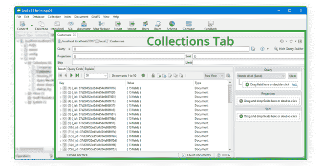](https://scalegrid.io/blog/wp-content/uploads/2016/09/2019-Best-MongoDB-GUI-Studio-3T-Collections-Tab1.png)

这三种视图都支持可视化查询生成器；表视图、树视图和 JSON 视图，这些视图中的每一个都使您的工作在不同的场景中变得更加容易。它还通过一个就地代码编辑器得到了进一步增强，该编辑器在所有三个视图中都可用。

如果你是 MongoDB shell 的爱好者，那么我们有更多好消息给你。Studio 3T 有 [IntelliShell](https://studio3t.com/knowledge-base/articles/mongo-shell-intellishell/) ，这是他们真正智能的内置 mongo Shell，通过自动完成特定于 shell 的类型、方法和 JavaScript 标准库函数，可以节省您大量的时间。

Studio 3T 也有一个[聚合编辑器](https://studio3t.com/knowledge-base/articles/aggregation-editor/)，它将帮助你编写复杂的查询而不会感到头痛。此外，它有一个独特的功能，可以将复杂的查询分成几个阶段，这使您有机会在每个阶段应用管道操作符，并检查每个步骤的结果。

只要使用他们的非商业免费计划，就可以体验到上面提到的所有功能。Studio 3T Pro 和 Enterprise plans 附带了处理大型数据集所必需的附加功能。当您构建大型商业应用程序时，您需要支持许多其他活动，而不仅仅是编写查询。让我们来看看 Studio 3T 为大型应用程序提供的一些特性。

*   一个[任务调度器](https://studio3t.com/knowledge-base/articles/automate-schedule-mongodb-tasks/#schedule-tasks)来自动化重复的 MongoDB 任务。
*   一个简单的 [MongoDB 到 SQL 的迁移](https://studio3t.com/knowledge-base/articles/mongodb-to-sql-migration/)工具，用于将 MongoDB 集合导出到 SQL 文件。
*   [查询代码](https://studio3t.com/knowledge-base/articles/query-code/)用于将查询转换成五种目标语言:Java、Python、C#、PHP 和 JavaScript (Node.js)。
*   [SQL 导入/导出](https://studio3t.com/knowledge-base/articles/mongodb-export-csv-json-sql-bson/#export-mongodb-to-sql)支持主要数据库:Oracle、SQL Server、MySQL 和 PostgreSQL。
*   [用于 MongoDB Enterprise 的 LDAP 和 Kerberos 认证](https://studio3t.com/knowledge-base/articles/mongodb-enterprise-authentication/)。

[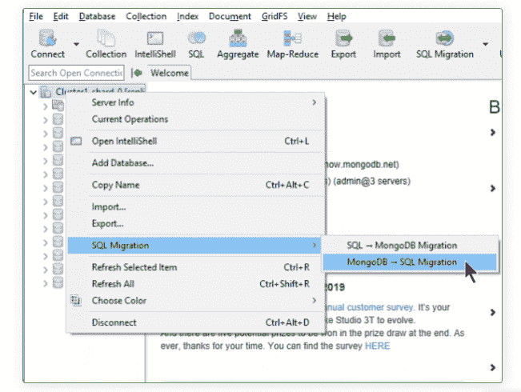](https://scalegrid.io/blog/wp-content/uploads/2016/09/2019-Best-MongoDB-GUI-Studio-3T-MongoDB-SQL-Migration.png)

### 2.NoSQLBooster

NoSQLBooster 是一个流行的以 shell 为中心的 GUI 工具，支持 Linux、Windows 和 Mac OS。它的前身是 MongoBooster，后来因为商标的原因改名了。他们有一个功能有限的免费版本，但是如果你想充分利用它的力量，可以去购买付费的个人或商业许可证，起价为[$ 119/版本/用户](https://nosqlbooster.com/purchase)。

他们最突出的功能之一是真正的智能感知体验，这是他们内置的语言服务，知道所有可能的代码建议，以帮助你打字。任何使用 NoSQLBooster 的人都会钦佩它自动完成变量、方法、关键字、属性甚至 MongoDB 集合名称的能力。它们为您提供了大量内置代码片段，让您可以更快地编写 shell 脚本查询。

[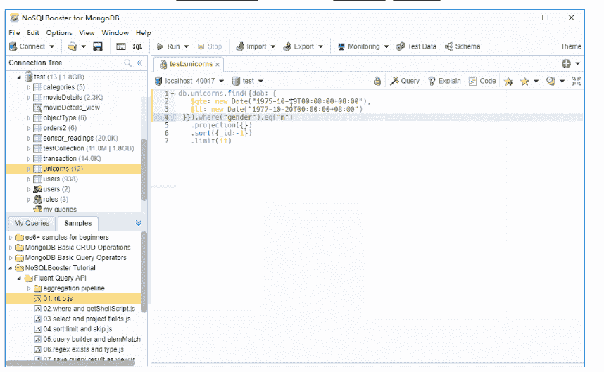](https://scalegrid.io/blog/wp-content/uploads/2016/09/2019-Best-MongoDB-GUI-NoSQLBooster-Connection-Tree.png)

NoSQLBooster 为他们的客户提供了几个独特的功能，包括他们的 [Fluent Query Builder](https://nosqlbooster.com/FluentQueryAPI) 。如果您来自 jQuery 或 JavaScript 背景，您可能比编写 JSON 对象更熟悉链接函数。借助 Fluent 查询构建器，您可以使用链接语法构建查询。

NoSQLBooster 独有的另一个重要特性是，它允许您在 MongoDB shell 脚本中使用 [npm 包](https://nosqlbooster.com/features#UsingNodeModules)。你可能知道，npm 注册中心是最大的软件注册中心，拥有近 50 万个免费软件包。

从其他数据源导入和导出数据是任何 GUI 工具的基本功能。使用 NoSQLBooster，您可以:

*   从/向 JSON/CSV 文件直接导入和导出集合。
*   从 MySQL、PostgreSQL 和 SQL Server 等 RDBMS 导入数据。
*   同样，您可以将数据从 MongoDB 导出到 MySQL、PostgreSQL、SQL Server 和 Oracle。

NoSQLBooster 还有一个[测试数据生成器](https://nosqlbooster.com/features#TestDataGenerator)，这不是你在试图购买 GUI 工具时通常期望的东西，但仍然是一个方便的工具。他们的测试数据生成器允许您创建大量的随机假数据，这样您就可以轻松地测试您的 MongoDB 查询。

### 3.MongoDB 罗盘

[MongoDB Compass](https://www.mongodb.com/products/compass) ，MongoDB 自己的 GUI 工具，支持最新的 MongoDB 版本，可以在 Linux、Mac 或 Windows 上使用。在 [MongoDB 3.2](https://www.mongodb.com/blog/post/visualizing-your-data-with-mongodb-compass) 中引入的 Compass 被开发来通过一个简单的 GUI 工具提供 mongo shell 的所有功能。他们总是保持免费社区版本足够好以有效地使用 MongoDB，你可以期待他们改进这个工具以继续增强其可用性。

MongoDB Compass 付费计划只能通过其企业订阅或更昂贵的 Atlas 订阅获得。这是一个值得注意的缺点，因为组织试图避免供应商锁定，并且还利用支持多种数据库类型的 DBaaS 平台。

[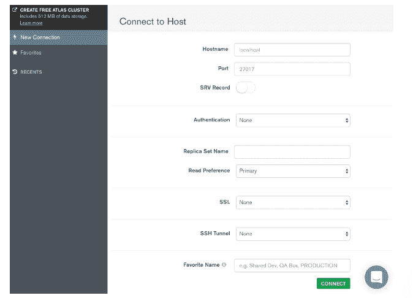](https://scalegrid.io/blog/wp-content/uploads/2016/09/2019-Best-MongoDB-GUI-MongoDB-Compass-Connect-to-Host.png)

以下是 MongoDB Compass 的一些主要优势:

*   提供直观的 GUI，您可以通过它来可视化和处理数据。
*   使用强大的可视化编辑工具插入、修改和删除数据。
*   使用可视化解释计划查看查询性能。
*   实时服务器统计让您深入了解服务器状态。
*   在其智能编辑器中编写 JSON 模式验证规则来验证您的数据。
*   通过插件添加新功能或改进现有功能。

如前所述，MongoDB Compass 致力于改进这个 GUI 工具。以下是自我们 2016 年最后一次更新以来，他们所做的一些[改进](https://docs.mongodb.com/compass/master/release-notes/):

*   现在支持 Linux 版本。
*   改进的查询历史。
*   现在提供两个版本:指南针社区和指南针。
*   增加了插件支持。
*   增加了 JSON 和 CSV 导入和导出功能。
*   引入聚合管道。

[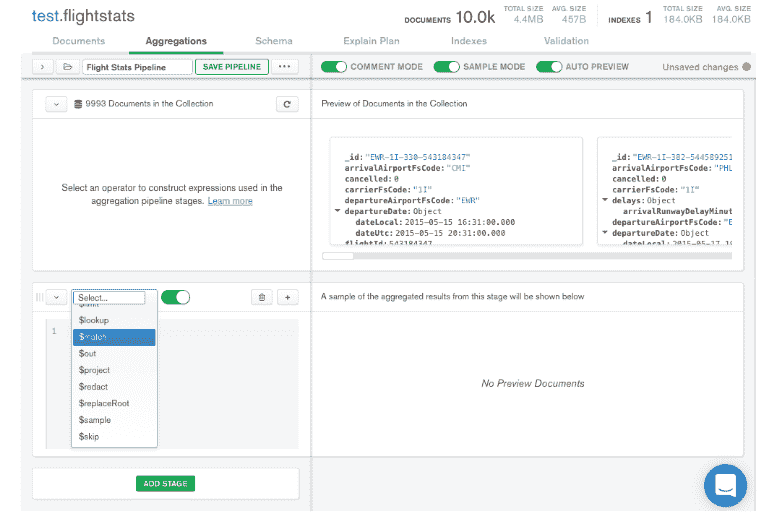](https://scalegrid.io/blog/wp-content/uploads/2016/09/2019-Best-MongoDB-GUI-MongoDB-Compass-Aggregations.png)

MongoDB 指南针有[四个版本](https://docs.mongodb.com/compass/master/)；指南针社区，指南针，指南针只读，指南针孤立。社区版是免费的，但是功能有限。这些限制不是问题，除非您需要模式分析、实时服务器统计、创建、删除和编辑文档验证，或者需要 Kerberos、LDAP 或 x.509 认证。如果你是一个做中小型项目的自由职业者，或者只是无意购买付费许可证，这是最适合你的产品。

### 4.NoSQL 经理

NoSQL 管理器从一开始就是一个受欢迎的工具，因为它能将友好的用户界面和强大的外壳结合起来。它完全支持最新的 MongoDB 版本以及从 2.2 开始的旧版本。

正如其余的，NoSQL 经理提供了一个免费的商业以及付费订阅计划。他们的免费计划提供有限的功能，包括连接、外壳管理、监控、数据操作和支持，你可以在他们的[计划比较页面](https://www.mongodbmanager.com/mongodb-manager-features)上进行比较。NoSQL 经理付费计划适用于[$ 98/版本/用户](https://www.mongodbmanager.com/purchase?lic=single)。

功能齐全的 GUI 支持 MongoDB shell 可用的所有命令，有助于节省 MongoDB 专业人员和初学者的时间。它们的自动补全功能允许您自动补全 MongoDB 中使用的所有 shell 命令、集合名称和方法。类似 Studio 3T，NoSQL 经理支持全部三观；表格视图、树视图和 JSON 视图。

[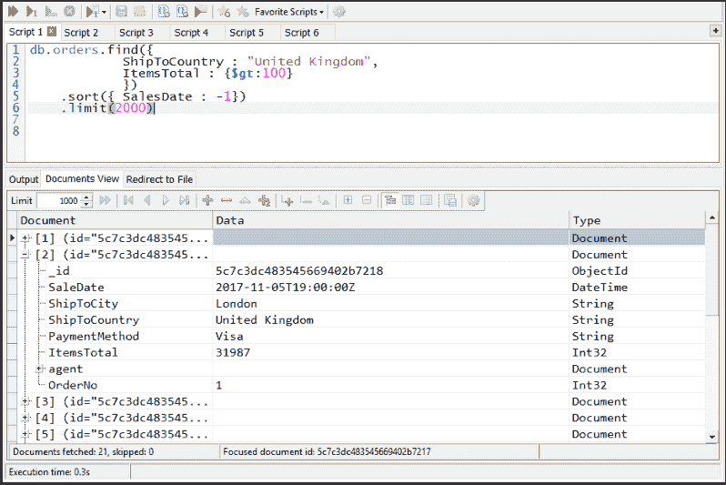](https://scalegrid.io/blog/wp-content/uploads/2016/09/2019-Best-MongoDB-GUI-NoSQL-Manager-Favorite-Scripts.png)

此外，使用 NoSQL 管理器，您可以管理集合、创建和删除数据库、管理用户和角色，以及使用 GridFS 存储和检索文件。

NoSQL 管理器在改进性能监控方面投入了大量精力，因为他们认为这是数据库管理中最重要的部分之一。它的公平判断是观察数据库的状态，这允许您在问题升级为故障之前检测到问题。性能监控工具显示数据库指标，如读写操作、客户端请求数量、内存和网络使用情况以及页面错误数量。

### 5.Robo 3T

Robomongo 是我们 2016 年更新的顶级竞争者之一，被 3T 软件实验室收购，并将 GUI 重新命名为 [Robo 3T](https://robomongo.org/) 。3T 软件实验室将与自己的 MongoDB GUI Studio 3T 并行开发 Robo 3T。好消息是 Robo 3T 将继续作为商业或非商业用途的免费工具。这个原生的跨平台 GUI 应用程序作为 Mac OS X 的最佳 MongoDB GUI 而广受欢迎。

Robo 3T 有四个与众不同的特点。

*   它是列表中唯一嵌入了原始 MongoDB shell 的 GUI 工具。
*   Robo 3T 通过内部 JavaScript VM 提供真正的运行时自动完成功能。
*   您在 MongoDB 上执行的所有操作都是异步的。
*   使用最少的机器资源。

Robo 3T 仍然是 Github 上最热门的项目之一。3T 软件实验室最近发布了支持 MongoDB 4.0 的 Robo 3T 版本 1.3。这些明显的迹象表明，Robo 3T 在未来许多年内仍将是顶级 GUI 工具。

[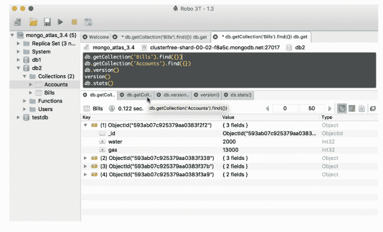 ](https://scalegrid.io/blog/wp-content/uploads/2016/09/2019-Best-MongoDB-GUI-Robo-3T-Accounts.png) Robo 3T 1.3 -查询结果窗口支持选项卡式输出。

查看这个文档，看看如何将 Robo 3T 连接到您的 MongoDB DBaaS 帐户。

### 6.Mongo 管理工作室

[Mongo 管理工作室](http://mms.litixsoft.de/) (MMS)是本文中我们最后的选择。你可能会觉得前三名的产品有太多的功能，让事情变得不必要的复杂。有时候，你需要的只是一个简单的界面，只有核心功能。如果是这样，这是最适合你的工具。有了 MMS 轻巧简洁的界面，您可以直截了当地完成工作。

[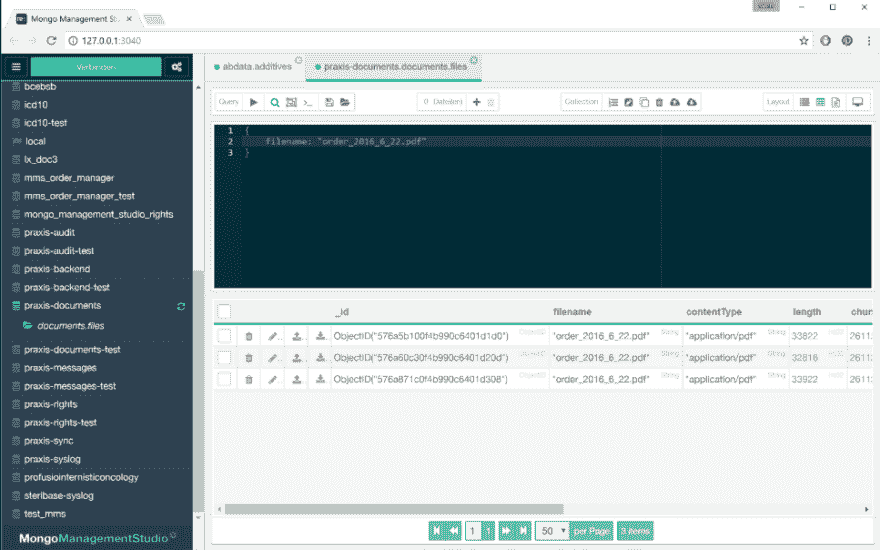](https://scalegrid.io/blog/wp-content/uploads/2016/09/2019-Best-MongoDB-GUI-MongoDB-Management-Studio-Dashboard.png)

在定价方面，它提供了三种不同的版本。社区版于 2018 年初发布，与付费版本相比缺少一些功能，如导入/导出、SSH 连接、用户管理、支持等..有两种付费版本提供；专业(本地)和企业(web 服务器)。两者都有相似的特性，但是企业版以不到专业版三倍的价格为您提供了五个许可证，这对于小型团队来说是理想的。彩信专业版起价为 [25 欧元/用户](http://mms.litixsoft.de/)。

这种跨平台系统让您可以轻松地以多种格式输入查询。目前，您可以使用 MongoDB 3.0、3.2 和 3.4 版本。此外，MMS 支持使用 SSH 隧道的远程数据库。

以下是 Mongo Management Studio 提供的一些附加服务:

*   使用内嵌编辑功能，您可以即时编辑数据。
*   简单、灵活、直观的图形用户界面。
*   所有 MMS 动作都可以用于副本集。
*   强大的聚合框架。
*   关于所有彩信功能的完整文档。

## 哪个 MongoDB GUI 最好？

请注意，所有这些产品都提供免费和商业版本。如果你是个人开发者或自由职业者，我们相信免费版本对你来说已经足够了。但是如果你不仅仅是一个开发者，比如两个人一起开发大型项目，我们强烈建议你使用商业版本。那最终会有很好的回报。此外，这些产品大多为付费版本提供试用期。你可以用它来了解产品是否符合你的期望。

最终，这一切都归结于你在预算、使用需求、团队成员、特性数量等方面的需求。挑选吧，祝你旅途好运。创建一些令人敬畏的东西，并注册下面的时事通讯，我们可能会报道你的项目！

* * *

## 2016 年最佳 Mongo GUI

### 1.MongoDB 罗盘

[caption id = " attachment _ 1688 " align = " align none " width = " 100% "][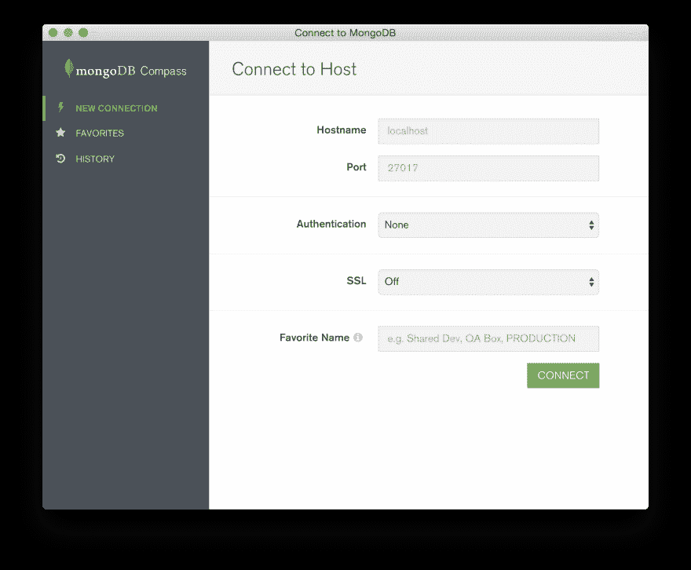](https://scalegrid.io/blog/wp-content/uploads/2016/08/new-connection-form.png)MongoDB 罗盘:新连接形式[/caption]

它为用户提供了他们的 MongoDB 模式的图形化视图，而不需要使用查询语言。在 MongoDB 中，集合不强制执行严格定义的文档结构。如果没有像 MongoDB Compass 这样的工具，就很难探索和理解底层数据及其结构。

MongoDB Compass 分析您的文档，并在一个简单直观的 GUI 中显示您的集合中丰富的结构。它允许您快速可视化和浏览方案，以了解数据集中字段的频率、类型和范围。

[caption id = " attachment _ 1689 " align = " align none " width = " 100% "][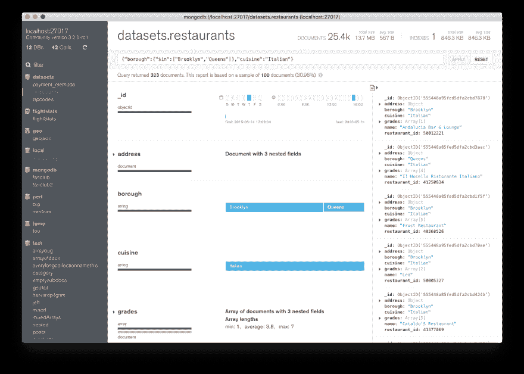](https://scalegrid.io/blog/wp-content/uploads/2016/08/document-viewer-search-results.png)MongoDB 指南针:文档查看器[/caption]

以下是 MongoDB Compass 提供的一些特性:

*   可视化浏览您的数据
*   在几秒钟内运行即席查询
*   查看您的查询性能
*   Compass 使您能够在索引、文档验证等方面做出更明智的决策
*   不需要命令行

注意:虽然 UI 看起来很光滑，但它既不是全功能的开发 UI，也不是全功能的挖掘数据的 BI 工具。将会很有意思地看到它会朝哪个方向发展。

平台:Mac OS X，Windows

定价:出于开发目的免费；联系 MongoDB 获取商业/高级许可证

### 2\.  Robomongo

[caption id = " attachment _ 1692 " align = " align none " width = " 100% "]robo mongo:跨平台可用性[/caption]

Robomongo:跨平台可用性 Robomongo 仍然是我们最好的 MongoDB GUIs 列表中的一个顶级竞争者。Robomongo 嵌入了与 MongoDB shell (3.2)相同的引擎和环境，并且还提供了一个简洁的自动完成特性和完整的命令库。它还在内部 JavaScript VM 中分析和执行它，允许我们为您提供运行时自动完成，这是静态无法实现的。

[caption id = " attachment _ 1696 " align = " align none " width = " 100% "][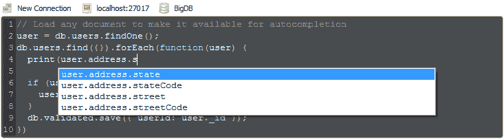](https://scalegrid.io/blog/wp-content/uploads/2016/08/innovative-autocompletion-f7112563.png)robo mongo:交互 Shell &自动完成[/caption]

以下是 Robomongo 提供的一些功能:

*   本机和跨平台 MongoDB 管理器
*   使用很少的机器资源
*   第一个也是唯一一个嵌入真正的 MongoDB shell 的工具
*   第一个提供真正自动完成的图形工具

注意:MongoDB 的全功能商业级开发 UI。由于资金问题，开发停止了很长一段时间，但现在似乎又回到了正轨。平台:Mac OS X，Windows，Linux 定价:免费社区版，其他版本起价 12 美元/月，按年计费。

更多信息:[https://robomongo.org/](https://robomongo.org/)

### 3.3T 工作室

Studio 3T 是开发人员使用 MongoDB 的另一个首选工具。无论您是探索本地数据库还是使用碎片和副本集，Studio 3T 都可以让您完成所有这些工作。Studio 3T 通过提供市场上最好的 MongoDB 工具，帮助成千上万的 MongoDB 开发人员和管理员处理日常工作。

[caption id = " attachment _ 1699 " align = " align none " width = " 100% "][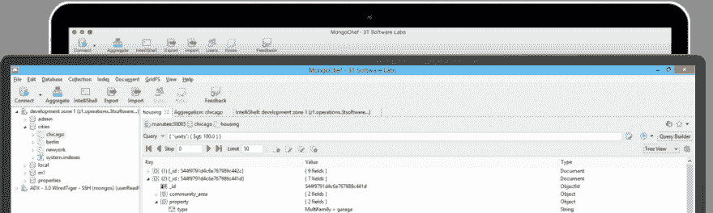](https://scalegrid.io/blog/wp-content/uploads/2016/08/mongochef-landing-pro.png)Studio 3T:Windows&Mac[/caption]

Studio 3T Shell 提供了轻松的多行编辑和自动完成功能，包括课程数据库和集合名称。创建复杂的更新或聚合查询轻而易举。Studio 3T Shell 输出是完全格式化的、突出显示的和可搜索的。还提供了完整的命令历史记录。

[caption id = " attachment _ 1700 " align = " align none " width = " 100% "][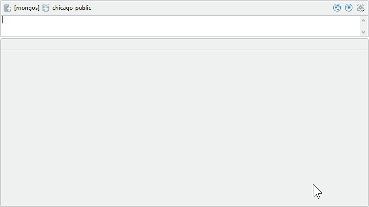](https://scalegrid.io/blog/wp-content/uploads/2016/08/intellishell-demo.gif)Studio 3T:Intellisense[/caption]

以下是 Studio 3T 提供的更多功能:

*   非商业用途永久免费使用
*   独一无二，专为 MongoDB 构建和优化
*   与 intellispell 的完整 mongodb shell 集成

注意:全功能开发 UI——强烈推荐任何使用 MongoDB 平台的开发人员使用:Windows、Mac、Linux

定价:非商业用途免费，其他版本一次性收费 299 美元起。

更多信息[点击这里](https://studio3t.com/)。

### 4.MongoBooster

MongoBooster 是一个以 shell 为中心的跨平台 GUI 工具，用于 MongoDB v2.2-3.2，它提供了就地更新、流畅的查询构建器、ES6 语法支持和真正的智能感知体验。

内置的语言服务知道所有可能的完成、方法、属性、变量、关键字，甚至 MongoDB 集合名称、字段名称和操作符。智能感知建议将在您键入时弹出。

MongoBooster 支持类似 mongoose 的流畅查询构建器 API，使您能够使用链接语法构建查询，而不是指定 JSON 对象。聚合框架现在也很流畅。您可以按照当前的文档或者通过可链接的方法来使用它。

[题注 id = " attachment _ 1714 " align = " align one " width = " 100% "][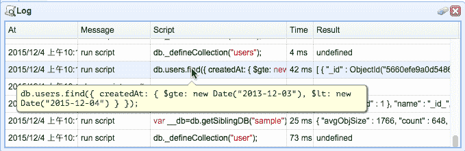](https://scalegrid.io/blog/wp-content/uploads/2016/08/log_window.png)MongoBooster:Log Window[/题注]

以下是提供的更多功能:

*   大量内置代码片段
*   MongoDB shell 扩展，使 MongoDB shell 内部的工作变得更加简单
*   MongoBooster 支持在结果树视图中就地编辑

完整功能列表:[http://mongobooster.com/features](http://mongobooster.com/features)

平台:Mac OS X、Windows、Linux 定价:非商业用途免费，其他版本起价 79 美元。

更多信息[点击这里](https://nosqlbooster.com/purchase)。

## 2014 年最佳 Mongo GUI

### 1.蒙戈瓦

MongoVue 是一个用于 windows 平台的桌面 GUI。它有一个简单干净的用户界面，基本功能是免费的。数据可以以文本视图、树形视图或表格视图显示。您也可以保存您的查找查询供以后使用-我们发现这非常方便。更高级的功能要求您购买许可证。总的来说，软件看起来很稳定，维护得很好。

[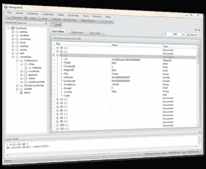](https://scalegrid.io/blog/wp-content/uploads/2014/02/mongovue.png)

### 2.MongoHub

是 MongoDB 的原生 Mac GUI。它为您提供了一个通过 SSH 隧道连接到 MongoDB 服务器的选项，从安全角度来看，这相当方便。“StatMonitor”功能为您提供统计数据的实时显示，也称为 mongostat。查询界面有一点局限性，因为它似乎只支持树视图。此外，没有办法保存查找查询供以后使用。根据我们的经验，该软件似乎工作得相当好，但它似乎没有得到维护-因此使用风险自担。

[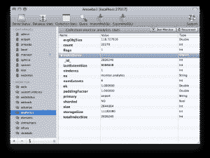](https://scalegrid.io/blog/wp-content/uploads/2014/02/mongohub.png)

### 3.洛克蒙戈

一个基于 HTML 的 MongoDB GUI。GUI 是用 PHP 编写的，并且是开源的。基于 HTML 的方法的缺点是，您需要一个 PHP 服务器来运行这个 GUI。您也可以选择在本地机器上运行 PHP 服务器。用户界面没有虚饰，相当容易使用，并支持所有的常用选项与收集，统计等工作。find 界面仅在表格/文本模型中显示数据，因此当您处理多级文档时，这可能是一个问题。此外，似乎没有太多的签入活动——因此我们怀疑该项目处于非活动状态。

[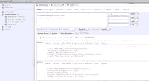](https://scalegrid.io/blog/wp-content/uploads/2014/02/rockmongo.png)

### 4\.   [RoboMongo](http://robomongo.org/)

一个以 shell 为中心的 MongoDB GUI，支持 Windows、iOS 和 Linux 平台。RoboMongo 的最新版本是 0.8.4，现在还为时尚早。它也是少数几个支持到 MongoDB 服务器的 SSL 连接的 GUI 之一。还支持通过 SSH 隧道进行连接。查询界面以树形视图、表格视图和文本视图显示数据。

您也可以保存您的查询供以后使用。最酷的特性之一是它还支持 shell——所以您仍然可以继续使用您喜欢的 shell 命令。UI 中有一些怪癖，我认为随着时间的推移会得到解决。如果积极维护，我认为这可能是 MongoDB 最好的跨平台 GUI。

[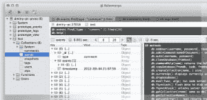](https://scalegrid.io/blog/wp-content/uploads/2014/02/robomongo.png)