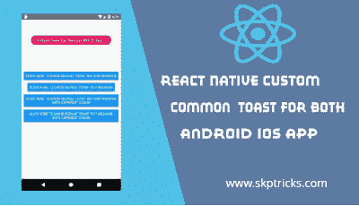

# React 本机自定义两个 Android iOS 应用程序的共同吐司

> 原文：<https://dev.to/skptricks/react-native-custom-common-toast-for-both-android-ios-app-1j00>

来源: [React 原生自定义常用 Toast for all Android iOS App](https://www.skptricks.com/2019/08/react-native-custom-common-toast-for-android-ios.html)

本教程解释了如何在 android 或 ios 设备中的 react 原生应用程序中创建自定义 toast 消息。Toast 是 android 应用程序历史上最古老的组件之一。Toast 只会获得文本消息，并根据给定的消息自动填充屏幕。默认情况下，react 原生 Android 应用程序支持 Toast 消息，但 iOS 不支持 Toast。Toast 是 android 应用程序历史上最古老的组件之一。自从 Android 应用程序开发开始以来，它就一直存在，并被数百万开发者持续使用。Toast 用于在任务完成时对任何给定的任务给出简单的反馈。

[点击此处阅读更多信息](https://www.skptricks.com/2019/08/react-native-custom-common-toast-for-android-ios.html)