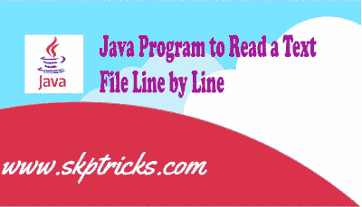

# 逐行读取文本文件的 Java 程序

> 原文：<https://dev.to/skptricks/java-program-to-read-a-text-file-line-by-line-1n7a>

来源: [Java 程序逐行读取文本文件](https://www.skptricks.com/2019/08/java-program-to-read-text-file-line-by-line.html)

本教程解释了如何在 java 中逐行读取一个文本文件。这个简单的 java 代码将解释这些使用 java 逐行读取文件的概念。下面的源代码有助于搜索文本。

[点击此处阅读更多信息](https://www.skptricks.com/2019/08/java-program-to-read-text-file-line-by-line.html)