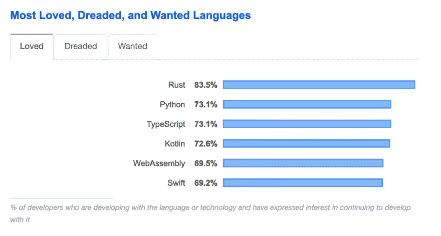
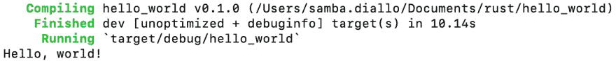
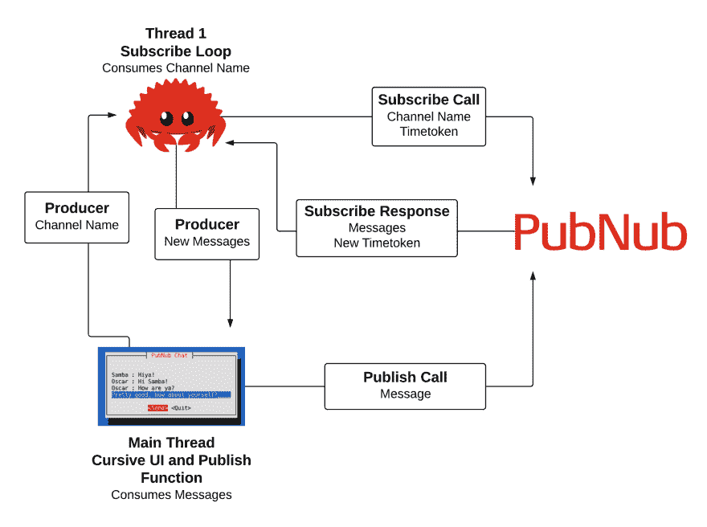
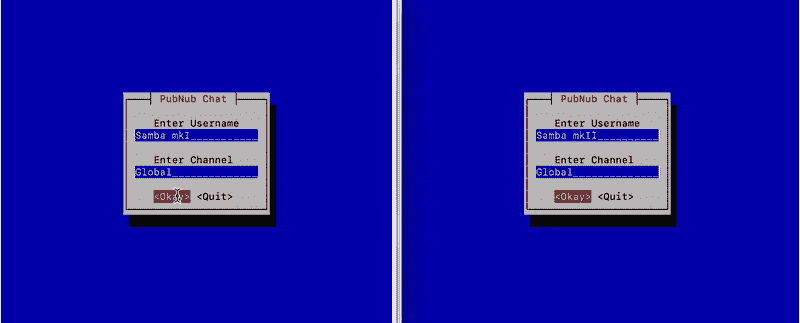

# Rustifying Chat:在 Rust 中创建一个终端 UI 聊天应用

> 原文：<https://dev.to/sambajahlo/rustifying-chat-create-a-terminal-ui-chat-app-in-rust-5bno>

编码世界充满了新的语言和框架，其中一个越来越受欢迎的是 [Rust](https://www.rust-lang.org/) 。你可能听说过它，介于堆栈溢出和专注于编程的 Twitter 账户之间。

我不会让你去推销 Rust 本身，毕竟，[这个堆栈溢出投票](https://insights.stackoverflow.com/survey/2019#technology-_-most-loved-dreaded-and-wanted-languages)本身就说明了问题。然而，我想展示如何通过创建一个 Rust 聊天应用程序将发布/订阅消息集成到您的 Rust 项目中。

[](https://res.cloudinary.com/practicaldev/image/fetch/s--3PHWTcLO--/c_limit%2Cf_auto%2Cfl_progressive%2Cq_auto%2Cw_880/https://www.pubnub.com/wp-content/uploads/2019/08/Screen-Shot-2019-08-07-at-10.55.26-AM-e1565201261509-1024x548.png%3Fdevrel_dt%3Drustchat)

*跟随教程或查看 GitHub 上的[完整源代码。](https://github.com/SambaDialloB/RustyChat)*

## 什么是发布-订阅？

发布-订阅或发布/订阅是服务和客户端相互实时通信的一种方式。Rust 中发布/订阅的一个常见用例是连接多个设备或服务器，并同时反映它们之间的任何更改或更新。人们可以使用这些有效载荷来更新系统，发送[聊天应用消息](https://www.pubnub.com/solutions/chat/?devrel_dt=rustchat)，[实时地理位置跟踪](https://www.pubnub.com/blog/javascript-mapping-javascript-tracking/?devrel_dt=rustchat)等等。另一个用途是在 [Web Assembly](https://webassembly.org/) 中联网，这是一种预编译的二进制格式，将取代浏览器中的 JavaScript。这将使开发人员能够用 JavaScript 之外的另一种语言制作网站前端。它不需要在运行时解释 JavaScript，而是在页面加载之前将其他编程语言编译成二进制。

有一些发布/订阅 API 我要用 [PubNub](https://www.pubnub.com/?devrel_dt=rustchat) 。我之所以将它与 Rust 一起使用，是因为它有一个我可以利用的简单 REST API。同时还提供预先编写的开源 API 集成，它为我的用例提供了一个坚实的基础设施。

通过获得**免费** [PubNub API 密匙](https://pubsub-quickstart-app.pubnub.com/signup?devrel_dt=rustchat)，迈出创建这个项目的第一步。

## 设置生锈环境

当开始用 Rust 开发时，我发现编译器非常有用。除了运行你的代码，它还会告诉你哪里和哪里做错了，如果你问它，它会告诉你为什么！让我们通过在您的终端中键入`curl [https://sh.rustup.rs](https://sh.rustup.rs) -sSf | sh`来安装它。

一旦完成，导航到你想要你的新 Rust 项目存在的地方并输入`cargo new rustychat`

现在导航到您的项目并使用`cargo run`来运行您的项目！

[](https://res.cloudinary.com/practicaldev/image/fetch/s--uMJ1iASX--/c_limit%2Cf_auto%2Cfl_progressive%2Cq_auto%2Cw_880/https://www.pubnub.com/wp-content/uploads/2019/07/Screen-Shot-2019-07-30-at-11.39.16-AM-1.png%3Fdevrel_dt%3Drustchat)

现在您已经建立了一个项目，让我们检查一下项目中的一些文件。

文件“Cargo.toml”类似于 Node.js 中的 package.json。这是您放置所有板条箱(库)的地方，当您构建项目时，它们将被安装。如果你已经用 Cocoapods 安装了 iOS 框架，列出这些依赖项会感觉很相似。

在这里，在 dependencies 下面，您应该包括我们的应用程序使用的六个箱子。图书馆将允许我们:

*   发送获取请求
*   更容易定义自定义错误类型
*   构造和析构 JSON 对象
*   从 JSON 派生自定义结构
*   创建自定义终端用户界面
*   URL 编码我们的请求

```
[dependencies]
reqwest = "0.9.18"
custom_error = "1.6.0"
serde_json = "1.0"
serde = { version = "1.0", features = ["derive"] }
cursive = { version = "0.12.0", default-features = false, features = ["pancurses-backend"] }
percent-encoding = "1.0.1" 
```

你的货物。汤姆现在应该有我们计划使用的所有板条箱。当我们构建项目时，Rust 会自动安装这些依赖项。

下一个文件是 src -> main.rs，您的主要 Rust 代码文件。除了“导入”箱子和定义结构之外，这里是您的主要功能所在。

在您的主函数上方，插入这些行以访问您刚刚作为依赖项列出的箱子。包括一些标准生锈的板条箱。

```
extern crate reqwest;
use percent_encoding::{percent_encode, PATH_SEGMENT_ENCODE_SET};
use serde::{Deserialize, Serialize};
use std::sync::mpsc::{channel, Sender};
use std::thread;
use cursive::align::HAlign;
use cursive::traits::*;
use cursive::Cursive;
use cursive::view::ScrollStrategy;
use cursive::views::{BoxView, Dialog, DummyView, EditView, LinearLayout, ScrollView, TextView};
use custom_error::custom_error; 
```

如果您再次运行您的代码，它应该构建所有的板条箱，然后输出“Hello World”

## 创建自定义错误

当在代码中执行有风险的操作时，您应该编写错误处理程序来优雅地处理代码执行出错的情况。这就是我使用 [custom_error](https://docs.rs/custom_error/1.6.0/custom_error/macro.custom_error.html) 的原因，它减少了普通 Rust 中创建错误所需的样板文件。我们定义类型，对于我们预期的每种类型的错误，我们可以返回一个描述。

在我们的代码中，我们将把一个对象转换成 JSON 字符串(反之亦然)，向一个 URL 发出 GET 请求，并访问作为响应返回的内容。所有这三个都有风险，可能会失败，但我们可以恢复。一旦我们检测到一个错误，创建一个描述在终端中输出。

下面是我所涵盖的错误以及如何定义这些错误的示例。

```
custom_error! {ChatError
    JSONError{source: serde_json::error::Error} = @{
        source.to_string()
    },
    ReqwestError{source: reqwest::Error } = @{
        source.to_string().split(": ").collect::<Vec<&str>>()[1]
    },
    Unknown = "unknown error"
} 
```

## 为 Rust JSON 响应定义结构

在这一节中，我们将定义几个结构来表示从 PubNub 获得的 JSON 响应。我们将有四个结构，每个结构代表我们接收的响应对象的一层。

Response 包含一个时间和一个 MessageResp 向量。Time 保存一个时间令牌字符串，MessageResp 保存一个消息，该消息有一个 UUID 字符串字段和一个文本字符串字段。这些字段中的每一个都需要是可反序列化的。这允许我们将 JSON 响应放到一个响应结构中，它将负责组织数据。消息还需要是可序列化的，以便将其转换成 JSON 数据。

```
#[derive(Deserialize)]
struct Response {
    t: Time,
    m: Vec<MessageResp>,
}

#[derive(Deserialize)]
struct MessageResp {
    d: Message,
}

#[derive(Deserialize)]
struct Time {
    t: String,
}

//Message is a sub object of MessageResp
#[derive(Serialize, Deserialize)]
struct Message {
    uuid: String,
    text: String,
} 
```

## 异步信任:如何多线程化

我们在这个项目中的主要功能将创建两个线程:一个用于搜索新消息的线程和一个用于 UI 的线程。让我们从让我们的程序使用多线程开始。让我们的程序在多个线程上运行允许我们阻塞一个线程等待消息，而用户仍然可以在聊天输入中键入新消息。

默认情况下，应用程序运行在一个线程上，一行一行地运行。我们可以创建第二个线程，同时运行订阅循环。在我们创建第二个线程之前，我们如何在主线程上访问它的数据呢？

这就是[通道](https://doc.rust-lang.org/std/sync/mpsc/fn.channel.html)的用武之地。它创建了发送者和接收者，也称为生产者和消费者。发送方可以被克隆，但接收方不能，这允许接收方按照消息发送的顺序访问消息。

创建两个独立的通道，一个是从 UI 向 subscribe 线程发送通道，另一个是从 subscribe 线程向 UI 发送消息。

```
fn main() {

    //We create two channels, one to pass the channel name to the subscribe function 
    //Another to send new messages from the subscribe function to the UI 
    let (channel_sender, channel_receiver) = channel();
    let (mut msg_sender, msg_receiver) = channel();

    //... 
    //REST OF THE MAIN FUNCTION 
} 
```

现在使用 [spawn](https://doc.rust-lang.org/std/thread/fn.spawn.html) 创建一个线程，这是在 Rust 中创建新线程最简单的方法。我们将关键字“move”放在回调之前，以获得通道接收者和消息发送者的所有权。在新线程中，创建一个空字符串，我们将使用它作为初始时间标记。要订阅，我们需要从我们的用户界面频道。一旦用户提交了一个通道，我们的 UI 就会发送一个通道，但是在此之前，我们应该暂停我们的线程。

使用通道的好处是我们可以选择等待信息被发送。让我们在接收器上使用"`recv()“`函数，它等待一个值通过通道传递。

```
//... 
//INSIDE MAIN
//Create a seperate thread, this allows us to have a subscribe loop that wont stop the UI from updating
let _handle1 = thread::spawn(move || {
  let mut time_token = "".to_string();
    //We wait for the UI to send us the channel name
    let test_channel = channel_receiver.recv();
    //...
    //REST OF THREAD
}
//...
//REST OF MAIN 
```

当我们从另一个线程收到一个变量时，我们不知道它是否是一个错误。如果值为“Ok”，则将它展开成一个字符串。让我们创建我们的订阅循环！使用“loop”关键字创建无限循环。

```
//...
//INSIDE THREAD
if test_channel.is_ok() {

    let channel_name: String = test_channel.unwrap();
    loop {
        //...
        //REST OF LOOP
    }
} 
```

下一步将调用我们的 subscribe 函数。它将返回一个字符串和 ChatError 的结果枚举。结果包含包装在“Ok”或“Err”中的值如果操作进展顺利，那么将返回“Ok ”,但是如果有错误，将返回“Err”。您可以检查结果是错误还是成功，还可以通过解包来查看值是多少。subscribe 函数将借用时间标记、消息发送者的可变版本和通道名。

```
//...
//Loop
let result: Result<String, ChatError> = subscribe(&time_token, &mut msg_sender, &channel_name); 
```

我们还没有创建这个函数，但是我很快会带你完成它。我们现在需要知道的是函数可能会返回一个错误。让我们处理这两种情况。

如果我们的订阅结果顺利的话，“`result.is_ok()“`应该会返回 true。如果是这样的话，打开它，把你的时间令牌赋值给它的值。

```
if result.is_ok() {
    //We update the time_token var to get all messages that happened after that specific time.
    time_token = result.ok().unwrap();
} 
```

如果进展不顺利，先不要担心提醒用户；这可能是一个“超时”错误。如果没有新消息，这种情况时有发生。

因为 PubNub 的 REST API 使用 [HTTP 长轮询](https://www.pubnub.com/blog/http-long-polling/?devrel_dt=rustchat)，超时意味着没有新的事情发生。如果没有超时，那么我们应该打印错误，然后退出循环。这取消了我们的计划。这就是我们循环的结束，如果我们从 subscribe 函数收到一个时间令牌或者超时错误，那么我们重新开始循环。

```
else if result.is_err() {
    let err = result.unwrap_err();
    //If the request times out, thats okay, we just restart it with that same time token, looking for new messages.
    if err.to_string() != "timed out" {
        println!(
            "Error: {:?} \nPlease restart application to try again.",
            err.to_string()
        );
        break;
    }
}
//...
//END LOOP
//END IF
//END THREAD 
```

既然我们已经完成了 subscribe 循环，是时候暂停一下 main 函数了。是时候通过实际创建函数来更深入地研究订阅了。

## PubNub REST API

既然我们已经得到了我们的密钥，让我们学习如何在 Rust 中使用 PubNub。

PubNub 有一个 REST API，它允许我们只通过 HTTP GET 请求来访问 Pub/Sub 等。有关更多信息，请查看带有 HTTP GET 文档的 [REST API。](https://www.pubnub.com/http-rest-push-api/?devrel_dt=rustchat)

PubNub REST API 允许开发人员使用 HTTP 请求发布消息和订阅通道。对请求进行低级控制可以让您决定订阅调用的频率以及调用是否是异步的。对于这个聊天应用程序，我们将在上一个应用程序结束后立即拨打订阅电话，以便用户仍然可以与我们应用程序的其他部分进行交互。

查看下图，了解我们应用程序中的信息流。

[](https://res.cloudinary.com/practicaldev/image/fetch/s--ZbIa671n--/c_limit%2Cf_auto%2Cfl_progressive%2Cq_auto%2Cw_880/https://www.pubnub.com/wp-content/uploads/2019/07/rustydiagram.png%3Fdevrel_dt%3Drustchat)

我们将在应用程序中使用发布和订阅 URL，各有其功能。我将首先给出关于订阅的说明，然后我们可以使用一些类似的概念来发布。

## 使用 REST API 订阅 Rust 中的通道

本节将指导您创建一个针对发布/订阅的 PubNub 请求。通过这个，我们会对 PubNub 如何处理 Rust 有更好的理解。我们将学习如何将数据从这个线程发送到 UI。

### 函数定义

正如我们前面看到的，我们的函数借用了一个时间、一个通道的发送者和一个通道名。它返回一个包含字符串或 ChatError 的结果，这是我们在项目开始时定义的。这允许我们定义代码中可能出错的地方，以及在每种情况下应该做什么

```
fn subscribe(time: &str, msg_sender: &mut Sender<String>, channel: &str ) -> Result<String, ChatError> {
    //...
    //Subscribe Function
} 
```

### 创建 URL 字符串

这些函数的第一步是创建 URL 字符串。为此，我们使用宏函数格式和机箱百分比编码。使用“格式”可以更容易地创建带有变量的 URL。percent-encoding 包允许我们将对象转换成 URL 编码的字符串。

在每个请求中，都有一个地方放置您的订阅密钥和频道名称。我们在最后包含了一个时间参数，尽管我们并不总是有时间参数。我们并不总是传递一个给 subscribe 函数。我们总是在 PubNub 的成功回复中收到一个。

```
//...
//In subscribe
//Format the URL
let url = format!(
    "https://{host}/v2/subscribe/{subkey}/{channel}/0/{time}",
    host = "ps.pndsn.com",
    subkey = "INSERT_SUB_KEY_HERE",
    channel = percent_encode(channel.as_bytes(), PATH_SEGMENT_ENCODE_SET),
    time = percent_encode(time.as_bytes(), PATH_SEGMENT_ENCODE_SET),
); 
```

### 调用 reqwest::get 函数

一旦我们有了想要请求消息的 URL，我们就使用“Reqwest”调用它。Reqwest 是 Hyper 的一个抽象:一个用于发出网络请求的低级 Rust crate。这个函数可能会返回我们想要的信息，但也可能会出错。这就是函数的结果返回类型发挥作用的地方。如果出错，它会返回一个错误。

```
let mut resp = reqwest::get(&url)?; 
```

使用 reqwest::get 时，我们在末尾留一个问号。这意味着如果这个调用失败，subscribe 函数将返回一个“Err”值。不用告诉我们的函数返回一个内部带有自定义错误信息的“Err ”,它们会自动返回。

### 成功响应–JSON 至对象

如果响应的状态是成功的，我们可以深入了解我们收到了什么。我们在文件的开头定义了几个结构来帮助我们访问里面的信息！我们打包的一个板条箱使这个反序列化过程变得不那么痛苦。我们使用 serde_json 将我们的响应文本转换成一个很好的对象，很容易访问信息。这个过程也可能失败，但是我们已经用 ChatError 处理了那个错误。

```
if resp.status().is_success() {
    let deserialized: Response = serde_json::from_str( & resp.text()?).unwrap();
    //...
    //Rest of If 
} 
```

我们有时不会在响应中收到一条消息，所以让我们遍历其中的向量。对于每条消息，我们将使用发件人来传递每条消息的信息。我用我们各自得到的两个值——UUID 和文本——创建了一个字符串。之后一定要打开声明。在遍历消息之后，我们可以在“Ok”中返回我们收到的新时间。

```
//...
//In if statement
for m in deserialized.m {
    //Send the new message to the UI above.
    msg_sender
        .send(format!("{} : {}", m.d.uuid, m.d.text))
        .unwrap();
}
return Ok(deserialized.t.t);
//End of if 
```

如果响应不成功，在 subscribe 函数的末尾放置一个“Ok”结果。给它传入的原始时间，它被转换成一个字符串。

```
Ok(time.to_string())
//End of subscribe 
```

### 错误

你注意到我们没有包括任何错误陈述吗？我们所有的错误都由 ChatError 处理。我们确实包含了一些填充的“Ok”语句，它允许我们将一些信息传递回调用函数，并说“嘿，事情进展顺利！”

## 在 Rust 中发布消息

创建了 subscribe 函数之后，让我们创建另一个函数来发布到 PubNub。这个函数将遵循与上一个相同的格式，但是有一些小的变化。

### 函数定义

这个函数将接受 3 个字符串作为参数。它们是我们要发送的文本、发送者的 UUID 和频道名称。就像前面的函数一样，我们返回一个结果，但是这次是一个空的“Ok”，或者一个 ChatError Err。

```
fn publish(text: String, uuid: String, channel: String) -> Result<(), ChatError> {
  //...
    //PUBLISH FUNCTION
} 
```

### JSON 的对象

在这个函数的开始，让我们用提供的几个参数创建一条消息。我们将做与 subscribe 函数相反的事情，但是这次我们将把我们的对象变成一个 JSON 字符串。这可能会返回一个错误，所以在末尾留下一个问号，我们的 ChatError 会处理好它。

```
//...
//In publish
let message = Message { uuid, text };
let m_json = serde_json::to_string(&message)?; 
```

### 创建 URL 字符串

这与 subscribe 函数非常相似，只是添加和交换了一些参数。将“订阅”替换为“发布”，包括您的发布密钥，并将时间替换为消息。通道和消息都需要进行 URL 编码。

```
let url = format!(
    "https://{host}/publish/{pubkey}/{subkey}/0/{channel}/0/{message}",
    host = "ps.pndsn.com",
    pubkey = "INSERT_PUB_KEY_HERE",
    subkey = "INSERT_SUB_KEY_HERE",
    channel = percent_encode(channel.as_bytes(), PATH_SEGMENT_ENCODE_SET),
    message = percent_encode(m_json.as_bytes(), PATH_SEGMENT_ENCODE_SET),
); 
```

### 创建获取请求

提出 GET 请求，在调用后打上问号。在下一行填写“Ok”结果。一旦这些完成，我们就完成了我们的发布功能！

```
let _resp = reqwest::get(&url)?;
Ok(())
//End of publish 
```

## 使用草书创建终端用户界面

### 什么是 TUI？

我们已经学习了如何使用 PubNub 的 REST API，我们还创建了一个单独的线程来长时间轮询 PubNub 的新消息。到目前为止，我们在一个频道上寻找消息，并将这些新消息发送到某个地方。我们还没有定义从哪里获得频道，以及新消息去往何处。这两者都与用户界面有很大关系。

虽然创建基于命令行的聊天是可能的，但是使用终端用户界面会使体验更加干净和流畅。我使用了草书，这是一种简单而功能丰富的 TUI，可以让我们将输入和输出分开。

### 频道和用户名输入

要启动草书，您需要创建其默认函数的可变实例。

```
//Below end of _handle1 thread
let mut siv = Cursive::default(); 
```

草书使用了一种让人想起其他 UI 创建方法的格式，即使用视图。视图可以容纳其他视图，有不同的用途。最底层的视图包含在层中。这些是可以添加或弹出的窗口。

创建一个层，并传递给它一个对话框。对话框是一种可以容纳另一个视图的窗口。它应该围绕一个线性布局视图，我们可以设置为垂直方向。LinearLayouts 非常适合将子视图组织成堆栈或行。你可以用“`child“`函数给它添加子节点，它可以被链接任意次。你也可以使用`with“`来动态添加子节点。我们稍后会用到它，但是现在，让我们在 LinearLayout 中设计我们的连接层。

```
siv.add_layer(
    Dialog::around(
        LinearLayout::vertical()
        //...
        //LinearLayout's children
    )

    //...
    //Title and buttons of Dialog
); 
```

我们将使用几个不同的视图来创建这一层。我们将文本视图用于短文本行，如标签。EditViews 允许用户输入信息，稍后我们可以使用特定的 ID 访问这些信息。dummy 视图有助于分隔我们的其他视图。你可以在你的空间里随意设计，但是我将文本视图居中，并将编辑视图宽度设置为 20。除了设置样式之外，确保在“`new()“`”之后“`fixed_wifth(20)“`”之前为每个 EditView 设置一个 ID。如果 ID 不在那个位置，那么我们以后就不能引用那个值。虚拟视图有助于分隔物品。

```
//...
//LinearLayout's children
.child(DummyView.fixed_height(1))
.child(TextView::new("Enter Username").h_align(HAlign::Center))
.child(EditView::new().with_id("username").fixed_width(20))
.child(DummyView.fixed_height(1))
.child(TextView::new("Enter Channel").h_align(HAlign::Center))
.child(EditView::new().with_id("channel").fixed_width(20)) 
```

LinearLayout 完成后，完成对话框的创建。给对话框添加一个标题，创建一个带有回调的“确定”按钮和一个退出按钮。最后，在中心对齐。接下来我们将进入“确定”按钮的回调。

```
//...
//Attacched to Dialog
.title("PubNub Chat")
.button("Okay", CALLBACK )
.button("Quit", | s | s.quit())
.h_align(HAlign::Center), 
```

### 连接到频道

在“确定”按钮内，我们可以选择提供回调。当用户点击或按下按钮上的回车键时运行。我们想再次使用“`move“`关键字来允许这个回调拥有它需要的所有变量。

```
.button("Okay", move | s | {
    //... 
    //Okay callback
} 
```

让我们获取用户之前输入到 EditViews 中的值。

```
//Inside Okay
let channel = s
    .call_on_id("channel", |view: &mut EditView| view.get_content())
    .unwrap();
let username = s
    .call_on_id("username", |view: &mut EditView| view.get_content())
    .unwrap(); 
```

检查用户名是否为空，如果是，创建一个层，告诉用户输入用户名。如果不是，那么检查通道名称是否为空。如果是，将其设置为默认的“全局”。

```
//Checking if username input is empty.
if username.is_empty() {
    s.add_layer(Dialog::info("Please enter a username!".to_string()));
} else {
    let new_channel =
        if channel.is_empty() {
        "global".to_string()
        } else {
            channel.to_string()
        };

    //...
    //The rest of connecting to PubNub
} 
```

继续同一个 else 语句，让我们将现有的通道(或者是“全局”通道，或者是用户定义的通道)发送到 subscribe 循环。一旦我们这样做了，我们的循环将能够继续，并从 PubNub 请求消息。在我们加载下一个屏幕之前，弹出初始层。

```
channel_sender.send(new_channel).unwrap();
s.pop_layer(); 
```

### 创建聊天层

现在创建另一层，这将是一个固定大小为 40，20 的盒子视图。框内将有一个带标题的对话框。它有一个内容字段。它会在中间对齐，有一个发送和退出按钮。

```
//...
//Still in else statement
s.add_layer(BoxView::with_fixed_size((40, 20),
    Dialog::new()
    .title("PubNub Chat")
    .content(
        //...
        //Chat view: Includes list of messages and EditView
    )
    .h_align(HAlign::Center)
    .button("Send", CALLBACK)
    .button("Quit", | s | s.quit()),
))
//End of UI design 
```

我将首先展示如何设计内容，然后展示如何发送信息。在对话框的内容函数中，插入一个 LinearLayout。这是将 Scrollview 和 EditView 堆叠在一起。在 ScrollView 中，我们插入另一个 LinearLayout。这种额外的线性布局是为了让我们可以删除多余的线，如果我们愿意。其他一些视图不提供此功能。当收到新消息时，使用 `scroll_strategy`使滚动视图保持在底部。

```
//Inside Content
LinearLayout::vertical()
    .child(
        ScrollView::new(
            LinearLayout::vertical()
            //Children of the LinearLayout
        )
        .scroll_strategy(ScrollStrategy::StickToBottom),
    )
    //Next Child 
```

在第二个 LinearLayout 中，我们在顶部和底部有 DummyViews，中间有`with`子视图。它提供了对 LinearLayout 的引用，我们可以动态地添加子元素。添加一些 DummyViews，我选择了 13，一个适合我们图层高度的数字。我们添加这些空行，以便当新消息进来时，它们首先出现在底部。将 LinearLayouts ID 设置为“messages”或任何您想要的值。

```
//Children of inner LinearLayout
.child(DummyView.fixed_height(1))
//Add in a certain amount of dummy views, to make the new messages appear at the bottom
.with( | messages | {
    for _ in 0. .13 {
        messages.add_child(DummyView.fixed_height(1));
    }
})
.child(DummyView.fixed_height(1))
.with_id("messages"), 
```

在第一个 LinearLayout 的末尾添加一个 ID 为“message”的 EditView 子级。

```
//Child of first LinearLayout
.child(EditView::new().with_id("message")),
//End of content 
```

### 发布消息

现在我们已经设计好了聊天视图，让我们开始发送消息吧！就像前一层的“ok”按钮一样，我们需要一个回调函数，并将所有需要的变量移入其中。

```
.button("Send", move |s| {
  //...
    //Rest of the callback
} 
```

像以前一样，从 EditView 中获取消息，并检查它是否为空。如果是，则提醒用户并告诉他们键入一条消息。如果它不是空的，那么我们检查他们输入的通道是空的还是满的，就像我们上面做的那样。

```
//Inside callback
let message = s
    .call_on_id("message", |view: &mut EditView| view.get_content())
    .unwrap();
if message.is_empty() {
    s.add_layer(Dialog::info("Please enter a message!".to_string()))
} else {
    let new_channel_2 = if channel.is_empty() {
        "global".to_string()
    } else {
        channel.to_string()
    };

    //...
    //Will handlee publishing messages
}
//End of callback 
```

用用户输入的消息、用户名和频道名调用我们的 publish 函数。如果结果是一个错误，那么我们告诉用户我们在发布时遇到了一个错误。如果进展顺利，我们就从编辑视图中清除文本。

```
//In the else statement
let result = publish(message.to_string(), username.to_string(), new_channel_2 );
if result.is_err() {
    //If there was an error then we say that there is one, and don't do anything.
    s.add_layer(Dialog::info("Error Publishing".to_string()));
} else {
    //Clear out the EditView.
    s.call_on_id("message", |view: &mut EditView| {
        view.set_content("")
  }).unwrap();
}
//End of else + callback 
```

## 将新消息插入用户界面

通常，我们会使用命令"`siv.run()“`来启动 UI，但是因为我们想控制 UI 何时改变，所以我们使用了"`siv.refresh()“`。创建一个新变量来计算我们收到了多少消息，并在更新后刷新 UI。

```
//...
//After creating the UI design/layers
let mut message_count = 0;
siv.refresh(); 
```

创建一个循环，首先调用“step”来递增 UI 事件循环。检查草书是否在该点运行，如果不是，则退出循环。创建一个变量来跟踪是否需要 UI 刷新，并将其设置为 false。

```
 loop {
    siv.step();
    if !siv.is_running() {
        break;
    }

    let mut needs_refresh = false;

    //...
    //Handle new messages
} 
```

现在对于最后一个需求，我们需要检查是否有任何消息在通道队列中等待我们。我们可以在"`msg_receiver“`上使用非阻塞方法来查看是否有东西在等待。如果有消息，它将返回一个迭代器。我们可以使用 Rust for 循环来遍历消息。

```
for m in msg_receiver.try_iter() {
    //...
    //Adding each message "m" in
} 
```

在这个 for 循环中，我们使用 ID“messages”访问 LinearLayout。然后，我们可以将刷新布尔值设置为 true，将消息计数加 1，并将消息作为子消息添加到 LinearLayout。在该循环中，您还可以删除第一个孩子。这是为了避免在消息通过屏幕之前出现滚动条！请务必检查消息计数是否小于或等于您的 DummyView 计数加 1。

```
//Inside of for loop
siv.call_on_id("messages", |messages: &mut LinearLayout| {
  needs_refresh = true;
    message_count += 1;
    messages.add_child(TextView::new(m));
    if message_count <= 14 {
        messages.remove_child(0);
    }
}); 
```

如果我们的刷新布尔值在循环结束时为真，那么我们可以刷新 UI 并显示更改。

```
if needs_refresh {
    siv.refresh();
}
//End of loop
//End of Main 
```

完成主要功能后，聊天 app 就完成了。如果你输入`cargo run`到你的终端，会弹出一个界面要求输入用户名和频道名。输入至少一个用户名将允许您连接到您输入的频道或默认的“global”。如果您输入一条消息并点击“发送”，该消息将出现在您的屏幕上。打开多个命令行并在它们之间聊天，或者与其他人聊天，如果他们和你有相同的访问权限。

[](https://res.cloudinary.com/practicaldev/image/fetch/s--nOYnhuCT--/c_limit%2Cf_auto%2Cfl_progressive%2Cq_66%2Cw_880/https://www.pubnub.com/wp-content/uploads/2019/08/rustychat.gif%3Fdevrel_dt%3Drustchat)

## 后续步骤

在本教程中，我们在 Rust 中创建了一个终端聊天应用程序。它使用 PubNub 的 Pub/Sub 通过手写的终端 UI 发送和接收消息。这只是一个例子，说明了铁锈和小瘤的可能性。如果你正在使用 Rust 计算一个算法，或者运行一个游戏，并且你需要一些世界各地的 I/O，PubNub 可以帮助你。

想用另一种语言试试吗？PubNub 拥有超过 [75 个+SDK](https://www.pubnub.com/docs?devrel_dt=rustchat)和数百个[教程](https://www.pubnub.com/blog/?devrel_dt=rustchat)。