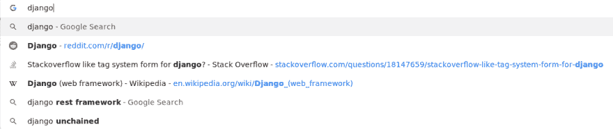

# Django 中的 SEO 友好 URL

> 原文：<https://dev.to/danihodovic/seo-friendly-urls-in-django-39bj>

用 Django 构建的示例站点通常使用主键作为资源的 URL 标识符。虽然这是获取资源 URL 的最简单、最干净的方法，但它并没有针对 SEO 进行优化。

对于谷歌来说，URL 中的关键词是否重要还存在争议，但是很明显大多数主要玩家已经采用了这种技术。下面是五个流行网站的例子，它们都在 URL 中使用关键词来提高搜索引擎优化。

*   stack overflow-[https://stack overflow . com/questions/8318911/why-html-think-chuck Norris-is-a-color](https://stackoverflow.com/questions/8318911/why-does-html-think-chucknorris-is-a-color)
*   维基百科-[https://en . Wikipedia . org/wiki/Python _(programming _ language)](https://en.wikipedia.org/wiki/Python_(programming_language))
*   Amazon.com-[https://www . Amazon . com/Django-Unchained-Jamie-Foxx/DP/b 00 bjs 7104/](https://www.amazon.com/Django-Unchained-Jamie-Foxx/dp/B00BJS7104/)
*   Reddit-[https://www . Reddit . com/r/soccer/comments/c 22 vuf/judge _ trolls _ player/](https://www.reddit.com/r/soccer/comments/c22vuf/referee_trolls_player/)
*   dev . to-[https://dev . to/danihodovic/optimizing-postgres-full-text-search-with-django-42hg](https://dev.to/danihodovic/optimizing-postgres-full-text-search-with-django-42hg)

如果你浏览一下 Alexa 排名的前 100 个网站，你会注意到大多数面向公众的网站在它们的 URL 中使用了某种关键字方法。

除了作为一种可能的 SEO 优化策略，它还提高了用户点击你的链接而不是其他链接的机会。。如果用户以前访问过该网站，Chrome 和 Firefox 都会匹配并突出显示与关键词匹配的部分 URL。

[](https://res.cloudinary.com/practicaldev/image/fetch/s--owCqH4FW--/c_limit%2Cf_auto%2Cfl_progressive%2Cq_auto%2Cw_880/https://i.imgur.com/DxhpTeR.png)

## 显示代码

Django 没有现成的在 URL 中使用关键字的视图，但是添加起来很简单。我将通过一个我们在 [findwork.dev](https://findwork.dev) 上使用的职位发布的基本例子。

假设我们有一个包含公司名称和角色的招聘模型。

```
# models.py from django.db import models

class JobPosting(models.Model):
    company_name = models.CharField(max_length=50)
    role = models.CharField(max_length=50) 
```

我们有一个视图，通过 url 中的主键显示每个作业:

```
# views.py 
from django.http import HttpResponse
from django.shortcuts import get_object_or_404

from .models import JobPosting
def job_posting_view(request, pk):
    job = get_object_or_404(JobPosting, pk=pk)
    html = f"""
    <html>
    <body>
    <h1>{job.role} at {job.company_name}</h1>
    </body>
    </html>
    """
    return HttpResponse(html) 
```

在 urls.py:

```
# urls.py 
from django.urls import path
from web import views

urlpatterns = [
    path("<int:pk>", views.job_posting_view, name="job-posting"),
] 
```

我们现在使用的 URL 通过主键来标识资源。我们希望向 url 添加关键字，但仍然包括主键[通过 ID](https://stackoverflow.com/questions/820493/can-an-seo-friendly-url-contain-a-unique-id) 识别资源，以确保我们不会破坏旧的 URL，因为这确保了唯一性。否则具有相同**角色**和**公司名称**的两个职位发布可能会相互冲突。

解决方案很简单。我们将从**公司名称**和**角色**中生成关键字，并将它们附加到 url 的末尾。使用 Django 的 [slugify](https://docs.djangoproject.com/en/2.2/ref/utils/#django.utils.text.slugify) 来处理这两个字段，我们消除了 URL 中不允许的任何空白或其他字符。然后，我们将`<slug>` [路径转换器](https://docs.djangoproject.com/en/2.2/topics/http/urls/#path-converters)匹配到已注册的**公司名称** + **角色**。最好用代码来解释:

urls.py

```
from django.urls import path
from web import views

urlpatterns = [
    # Match urls based on ID
    path("<int:pk>", views.job_posting_view, name="job-posting-id"),
    # Match urls based on ID + keywords
    path("<int:pk>/<slug:slug>", views.job_posting_view, name="job-posting-keywords"),
] 
```

views.py

```
from django.http import HttpResponse
from django.shortcuts import get_object_or_404

from .models import JobPosting
def job_posting_view(request, pk, slug):
    job = get_object_or_404(JobPosting, pk=pk)
    html = f"""
    <html>
    <body>
    <h1>{job.role} at {job.company_name}</h1>
    </body>
    </html>
    """
    return HttpResponse(html) 
```

这是我想到的最简单的解决办法。然而，对于 SEO 来说，它有一个严重的缺点。我们现在有两个不同的 URL 来标识单个资源。搜索引擎会随机选择一个版本的显示在搜索中，它会将[反向链接](https://moz.com/learn/seo/backlinks)和[链接权益](https://moz.com/learn/seo/what-is-link-equity)随机归入其中一个 URL。这也适用于链接到你的其他网站。你的内容会因为“搜索引擎优化分数”而变得不重要，这会影响你的网页排名。

为了避免这一点，我们需要确保只存在一种识别资源的方法。因为我们希望搜索引擎索引基于关键字的 url，我们希望它被认为是真实的单一来源。

简而言之:

*   我们将使用两个 URL——一个由主键标识，另一个由主键+ url 标识
*   基于主键的 url 将[重定向](https://moz.com/blog/301-redirect-or-relcanonical-which-one-should-you-use)到基于关键字的 url，以确保搜索引擎将所有链接归结到我们基于关键字的 url。

Django 有一个 **[get_absolute_url](https://docs.djangoproject.com/en/2.2/ref/models/instances/#get-absolute-url)** 方法，它在内部使用这个方法来简化到特定模型的链接。我们将添加这一点，以确保基于关键字的 url 是资源的最终 url。每当 Django 在内部使用 **[reverse](https://docs.djangoproject.com/en/2.2/ref/urlresolvers/#django.urls.reverse)** helper 方法时，Django 将依次调用 **get_absolute_url** 并将其解析为基于关键字的 url。

models.py

```
from django.db import models
from django.urls import reverse
from django.utils.text import slugify

class JobPosting(models.Model):
    company_name = models.CharField(max_length=50)
    role = models.CharField(max_length=50)

    def get_absolute_url(self):
        # Slugify the combination of role and company_name as these may contain
        # whitespace or other characters that are not permitted in urls.
        slug = slugify(f"{self.role}-at-{self.company_name}")
        return reverse("job-posting", kwargs={"pk": self.id, "slug": slug}) 
```

views.py

```
def job_posting_view(request, pk, slug):
    job = get_object_or_404(JobPosting, pk=pk)

    # Redirect with a 301 in case someone uses the ID based url. This ensures
    # that the canonical url is the keyword based one and will attribute
    # backlinks and search rankings to our keyword based url.
    if request.path != job.get_absolute_url():
        return redirect(job, permanent=True)

    html = f"""
    <html>
    <body>
    <h1>{job.role} at {job.company_name}</h1>
    </body>
    </html>
    """
    return HttpResponse(html) 
```

### 基于类的视图

对于基于类的解决方案，如果 url 不包含关键字，我们需要覆盖 **get** 方法来执行重定向。

```
from django.views.generic.detail import DetailView

class JobsDetailView(DetailView):
    model = JobPosting

    def get(self, request, *args, **kwargs):
        self.object = self.get_object()

        if self.request.path != self.object.get_absolute_url():
            return redirect(self.object, permanent=True)

        return super().get(self, request, args, kwargs) 
```

完整的代码示例可以在 [Github](https://github.com/danihodovic/seo_friendly_urls_django) 上找到。

资源:

*   [https://stack overflow . com/questions/820493/can-an-SEO-friendly-URL-contain-a-unique-id/820529 # 820529](https://stackoverflow.com/questions/820493/can-an-seo-friendly-url-contain-a-unique-id/820529#820529)
*   [https://webmasters.stackexchange.com/a/74639/45262](https://webmasters.stackexchange.com/a/74639/45262)
*   [https://webmasters . stack exchange . com/questions/47342/are-keywords-in-URLs-good-SEO-or-needless-redundant](https://webmasters.stackexchange.com/questions/47342/are-keywords-in-urls-good-seo-or-needlessly-redundant)
*   [https://stack overflow . com/questions/910683/why-just-a-id-in-the-URL-path-a-bad-idea-for-SEO](https://stackoverflow.com/questions/910683/why-is-just-an-id-in-the-url-path-a-bad-idea-for-seo)
*   [https://stack overflow . com/questions/820493/can-an-SEO-friendly-URL-contain-a-unique-id](https://stackoverflow.com/questions/820493/can-an-seo-friendly-url-contain-a-unique-id)
*   [https://moz.com/learn/seo/backlinks](https://moz.com/learn/seo/backlinks)
*   [https://moz.com/learn/seo/what-is-link-equity](https://moz.com/learn/seo/what-is-link-equity)
*   [https://moz . com/blog/301-redirect-or-rel canonical-你应该使用哪一个](https://moz.com/blog/301-redirect-or-relcanonical-which-one-should-you-use)