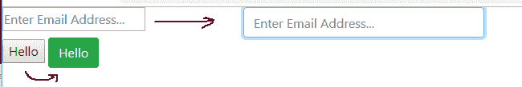
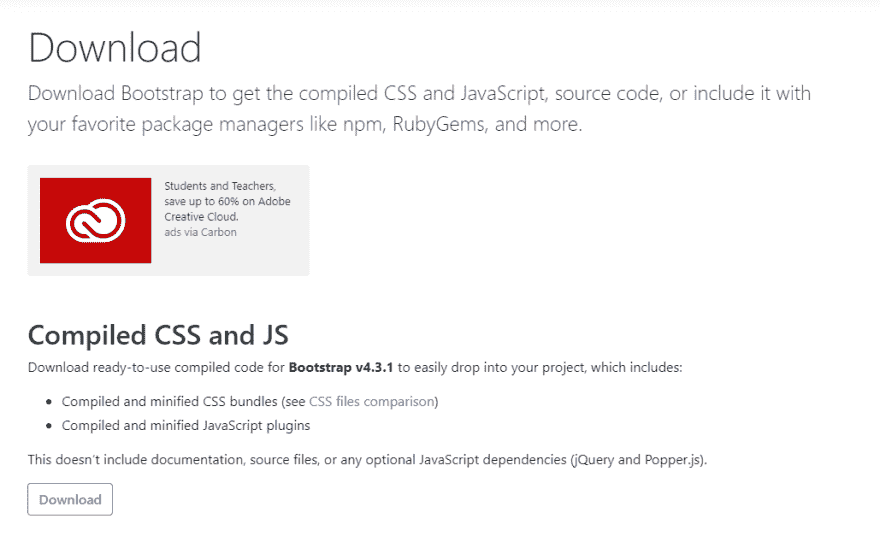
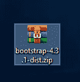
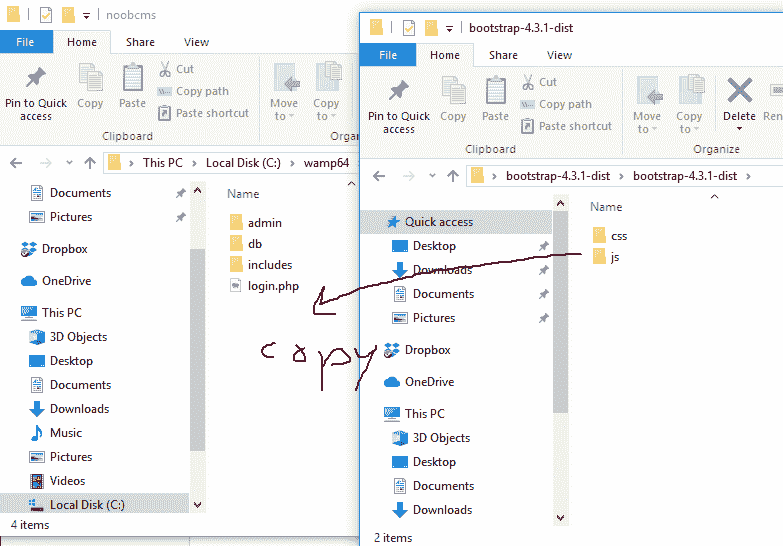
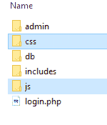

# Noob CMS:引导程序 4

> 原文：<https://dev.to/th3n00bc0d3r/the-noob-cms-bootstrap-4-43i5>

## 问题:什么是 Boostrap？

[](https://res.cloudinary.com/practicaldev/image/fetch/s--ut6z0_XQ--/c_limit%2Cf_auto%2Cfl_progressive%2Cq_auto%2Cw_880/https://thepracticaldev.s3.amazonaws.com/i/9yfs1forg8qzc80ljtj7.png)

Bootstrap 将这些难看的输入和按钮转换成炫酷的输入和按钮，这样我们的网站看起来很漂亮。

Bootstrap 也有助于处理所有设计网站边框和框架的计算，所以当我们在手机屏幕上打开它时，它会自动调整，我们不必再去管理它。

谢谢 Bootstrap，我们爱你。

## 如何将它放入我们的网站？

您可以从以下链接下载 bootstrap
[https://getbootstrap.com/docs/4.3/getting-started/download/](https://getbootstrap.com/docs/4.3/getting-started/download/)

我们可以使用 CDN，但是为了便于理解，我们将在我们的服务器上安装 boostrap。

[](https://res.cloudinary.com/practicaldev/image/fetch/s--tsvouwpm--/c_limit%2Cf_auto%2Cfl_progressive%2Cq_auto%2Cw_880/https://thepracticaldev.s3.amazonaws.com/i/pognkzjg662q02m8nme4.png)

你会有一份文件。活力

[](https://res.cloudinary.com/practicaldev/image/fetch/s--hFordp17--/c_limit%2Cf_auto%2Cfl_progressive%2Cq_auto%2Cw_880/https://thepracticaldev.s3.amazonaws.com/i/nlddfgfu5mxfvx4bnkee.png)

现在我们需要将 bootstrap-4.3.1-dist.zip 中的文件复制到 noob_cms 文件夹中。

[](https://res.cloudinary.com/practicaldev/image/fetch/s--B1hNNUD9--/c_limit%2Cf_auto%2Cfl_progressive%2Cq_auto%2Cw_880/https://thepracticaldev.s3.amazonaws.com/i/14hmisngu2is8p2w2tos.png)

这就是我们应该在 noob_cms 文件夹中的内容。

[](https://res.cloudinary.com/practicaldev/image/fetch/s--1e3K4rTf--/c_limit%2Cf_auto%2Cfl_progressive%2Cq_auto%2Cw_880/https://thepracticaldev.s3.amazonaws.com/i/h8so2m0r31e36dfrmzor.png)

## 我怎么用？

```
 <head>
        <meta charset="UTF-8">
        Login

        <link href="css/bootstrap.min.css" rel="stylesheet" />

    </head>

    <style>
        .myLoginForm label {
            margin-top: 10px;
        }

        .myLoginForm button {
            margin-top: 10px;
        }
    </style>

    <body>
        <div class="container">
            <div class="row">
                <div class="col-4 offset-4">
                    <form action="" method="POST" class="myLoginForm">
                        <label>Email Address</label>
                        <input class="form-control" name="email" type="text" placeholder="Enter Email Address..." />

                        <label>Password</label>
                        <input class="form-control" name="pass" type="password" placeholder="Password..." />

                        <button class="btn btn-success" name="btnLogin">Login</button>
                    </form>            
                </div>
            </div>
        </div>
    </body> 
```

Enter fullscreen mode Exit fullscreen mode

所以这段代码只是将旧的登录表单转换成了新的登录表单

[](https://res.cloudinary.com/practicaldev/image/fetch/s--_T-w4lF9--/c_limit%2Cf_auto%2Cfl_progressive%2Cq_auto%2Cw_880/https://thepracticaldev.s3.amazonaws.com/i/ow4mt341dgf775wyut6t.png)

我已经在 Git 上更新了新代码，请随意查看

您可以从下面的 Git
中获得代码

## [th3n 00 BC 0 d3r](https://github.com/th3n00bc0d3r)/[noobcms _ log in](https://github.com/th3n00bc0d3r/noobcms_login)

### Noob CMS 登录和用户管理版本

<article class="markdown-body entry-content container-lg" itemprop="text">

# noobcms _ log in-noobcms 登入

Noob CMS 登录和用户管理版本

</article>

[View on GitHub](https://github.com/th3n00bc0d3r/noobcms_login)

[Noob 指数](https://dev.to/th3n00bc0d3r/noob-guides-index-4mne)