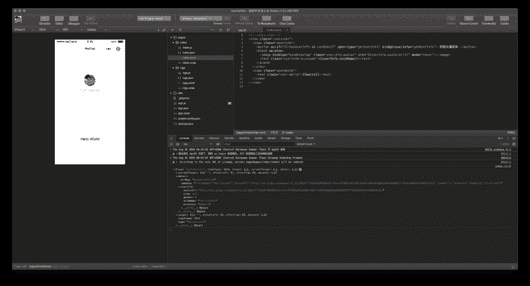
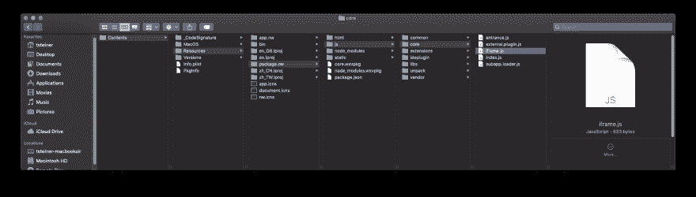

# 快速浏览微信的迷你程序

> 原文：<https://dev.to/tomayac/a-quick-look-at-wechat-s-mini-programs-1kba>

在为我在 2019 年中国上海[谷歌开发者日](https://events.google.cn/intl/zh-CN/developerdays2019/)上的[演讲](https://events.google.cn/intl/zh-CN/developerdays2019/agenda/#table-row-1-7)做准备时，我再次被提醒，在中国这个市场，很少有像[微信](https://www.wechat.com/en)这样的超级应用拥有[大量迷你应用或迷你程序](https://techcrunch.com/2018/11/07/wechat-mini-apps-200-million-users/)，可以满足日常需求，如预订出租车、预订桌子等。

我很好奇，于是[下载了 SDK](https://developers.weixin.qq.com/miniprogram/dev/devtools/download.html) ，在玩了一会儿[你的第一个迷你应用教程](https://developers.weixin.qq.com/miniprogram/en/dev/)后，我意识到整个事情是如此接近于为实际的网络构建，它既令人着迷，又引起了我的兴趣，老实说还让我有些愤怒。

## App 架构

*   你可以用 [WXSS](https://developers.weixin.qq.com/miniprogram/en/dev/framework/view/wxss.html) 来设计你的应用，它本质上是 CSS 加上一些简洁的附加元素，比如[响应像素](https://developers.weixin.qq.com/miniprogram/en/dev/framework/view/wxss.html)。

```
page-section-gap{
  box-sizing: border-box;
  padding: 0 30rpx;
}

.page-body-button {
  margin-bottom: 30rpx;
} 
```

*   你用 JavaScript(或 TypeScript)编写你的应用程序逻辑，用`App`作为顶层对象，用`wx`作为你从中获得所有酷功能的对象。API 非常强大。这里是`wx`物体的钥匙:

```
[
  "addCard",
  "addNativeDownloadTask",
  "addPhoneContact",
  "addWeRunData",
  "arrayBufferToBase64",
  "authorize",
  "base64ToArrayBuffer",
  "batchGetContactDirectly",
  "bindPaymentCard",
  "calRqt",
  "canIUse",
  "cancelDownloadAppTask",
  "canvasGetImageData",
  "canvasPutImageData",
  "canvasToTempFilePath",
  "captureScreen",
  "checkIsSoterEnrolledInDevice",
  "checkIsSupportFacialRecognition",
  "checkIsSupportSoterAuthentication",
  "checkSession",
  "chooseAddress",
  "chooseContact",
  "chooseImage",
  "chooseInvoice",
  "chooseInvoiceTitle",
  "chooseLocation",
  "chooseMedia",
  "chooseMessageFile",
  "chooseMultiMedia",
  "chooseShareGroup",
  "chooseVideo",
  "chooseWeChatContact",
  "clearStorage",
  "clearStorageSync",
  "closeBLEConnection",
  "closeBluetoothAdapter",
  "closeSocket",
  "cloud",
  "compressImage",
  "connectSocket",
  "connectWifi",
  "createAnimation",
  "createAudioContext",
  "createBLEConnection",
  "createCameraContext",
  "createCanvasContext",
  "createContext",
  "createInnerAudioContext",
  "createIntersectionObserver",
  "createInterstitialAd",
  "createLivePlayerContext",
  "createLivePusherContext",
  "createMapContext",
  "createOffscreenCanvas",
  "createRewardedVideoAd",
  "createSelectorQuery",
  "createUDPSocket",
  "createVideoContext",
  "createWorker",
  "downloadApp",
  "downloadAppForIOS",
  "downloadFile",
  "downloadSilkVoice",
  "drawCanvas",
  "enterContact",
  "env",
  "error",
  "exitVoIPChat",
  "faceVerifyForPay",
  "getABTestConfig",
  "getAccountInfoSync",
  "getAppInstallState",
  "getAvailableAudioSources",
  "getBLEDeviceCharacteristics",
  "getBLEDeviceServices",
  "getBackgroundAudioManager",
  "getBackgroundAudioPlayerState",
  "getBackgroundFetchData",
  "getBackgroundFetchToken",
  "getBatteryInfo",
  "getBatteryInfoSync",
  "getBeacons",
  "getBluetoothAdapterState",
  "getBluetoothDevices",
  "getClipboardData",
  "getConnectedBluetoothDevices",
  "getConnectedWifi",
  "getCookies",
  "getExtConfig",
  "getExtConfigSync",
  "getFileInfo",
  "getFileSystemManager",
  "getHCEState",
  "getImageInfo",
  "getLabInfo",
  "getLaunchOptionsSync",
  "getLocation",
  "getLogManager",
  "getMenuButtonBoundingClientRect",
  "getNetworkType",
  "getOpenDeviceId",
  "getPublicLibVersion",
  "getRealtimeLogManager",
  "getRecorderManager",
  "getResPath",
  "getSavedFileInfo",
  "getSavedFileList",
  "getScreenBrightness",
  "getSelectedTextRange",
  "getSetting",
  "getShareInfo",
  "getStorage",
  "getStorageInfo",
  "getStorageInfoSync",
  "getStorageSync",
  "getSystemInfo",
  "getSystemInfoSync",
  "getUpdateManager",
  "getUserInfo",
  "getWeRunData",
  "getWifiList",
  "getWxSecData",
  "hideKeyboard",
  "hideLoading",
  "hideNavigationBarLoading",
  "hideShareMenu",
  "hideTabBar",
  "hideTabBarRedDot",
  "hideToast",
  "installDownloadApp",
  "isSDKError",
  "isSystemError",
  "isThirdError",
  "joinVoIPChat",
  "launchApplicationDirectly",
  "launchApplicationForNative",
  "launchMiniProgram",
  "loadFontFace",
  "loadPaySpeechDialectConfig",
  "login",
  "makePhoneCall",
  "makeVoIPCall",
  "navigateBack",
  "navigateBackApplication",
  "navigateBackH5",
  "navigateBackMiniProgram",
  "navigateBackNative",
  "navigateTo",
  "navigateToDevMiniProgram",
  "navigateToMiniProgram",
  "navigateToMiniProgramDirectly",
  "nextTick",
  "notifyBLECharacteristicValueChange",
  "notifyBLECharacteristicValueChanged",
  "offAppHide",
  "offAppShow",
  "offAudioInterruptionBegin",
  "offAudioInterruptionEnd",
  "offError",
  "offLocalServiceDiscoveryStop",
  "offLocalServiceFound",
  "offLocalServiceLost",
  "offLocalServiceResolveFail",
  "offPageNotFound",
  "offWindowResize",
  "onAccelerometerChange",
  "onAppEnterBackground",
  "onAppEnterForeground",
  "onAppHide",
  "onAppRoute",
  "onAppRouteDone",
  "onAppShow",
  "onAppUnhang",
  "onAudioInterruptionBegin",
  "onAudioInterruptionEnd",
  "onBLECharacteristicValueChange",
  "onBLEConnectionStateChange",
  "onBLEConnectionStateChanged",
  "onBackgroundAudioPause",
  "onBackgroundAudioPlay",
  "onBackgroundAudioStop",
  "onBackgroundFetchData",
  "onBeaconServiceChange",
  "onBeaconUpdate",
  "onBluetoothAdapterStateChange",
  "onBluetoothDeviceFound",
  "onCompassChange",
  "onDeviceMotionChange",
  "onDownloadAppStateChange",
  "onError",
  "onEvaluateWifi",
  "onGetWifiList",
  "onGyroscopeChange",
  "onHCEMessage",
  "onKeyboardHeightChange",
  "onLocalServiceDiscoveryStop",
  "onLocalServiceFound",
  "onLocalServiceLost",
  "onLocalServiceResolveFail",
  "onLocationChange",
  "onMemoryWarning",
  "onNativeEvent",
  "onNetworkStatusChange",
  "onPageNotFound",
  "onPageReload",
  "onSocketClose",
  "onSocketError",
  "onSocketMessage",
  "onSocketOpen",
  "onTapNavigationBarRightButton",
  "onUploadEncryptedFileToCDNProgress",
  "onUserCaptureScreen",
  "onVoIPChatInterrupted",
  "onVoIPChatMembersChanged",
  "onVoIPChatSpeakersChanged",
  "onVoicePlayEnd",
  "onWebviewEvent",
  "onWifiConnected",
  "onWindowResize",
  "openBluetoothAdapter",
  "openBusinessView",
  "openCard",
  "openDeliveryList",
  "openDocument",
  "openGoldenRedPacketDetail",
  "openLocation",
  "openMiniProgramHistoryList",
  "openMiniProgramProfile",
  "openMiniProgramSearch",
  "openMiniProgramStarList",
  "openOfficialAccountProfile",
  "openOfflinePayView",
  "openQRCode",
  "openSetting",
  "openUrl",
  "openUserProfile",
  "openWCPayCardList",
  "operateWXData",
  "pageScrollTo",
  "pauseBackgroundAudio",
  "pauseDownloadAppTask",
  "pauseVoice",
  "playBackgroundAudio",
  "playVoice",
  "presetWifiList",
  "preventApplePayUI",
  "previewImage",
  "queryDownloadAppTask",
  "reLaunch",
  "readBLECharacteristicValue",
  "redirectTo",
  "removeSavedFile",
  "removeStorage",
  "removeStorageSync",
  "removeTabBarBadge",
  "removeUserCloudStorage",
  "reportAction",
  "reportAnalytics",
  "reportIDKey",
  "reportKeyValue",
  "reportMonitor",
  "request",
  "requestMallPayment",
  "requestPayment",
  "requestPaymentToBank",
  "requestVirtualPayment",
  "resumeDownloadAppTask",
  "saveFile",
  "saveImageToPhotosAlbum",
  "saveVideoToPhotosAlbum",
  "scanCode",
  "secureTunnel",
  "seekBackgroundAudio",
  "sendBizRedPacket",
  "sendGoldenRedPacket",
  "sendHCEMessage",
  "sendSocketMessage",
  "setBackgroundColor",
  "setBackgroundFetchToken",
  "setBackgroundTextStyle",
  "setClipboardData",
  "setCookies",
  "setCurrentPaySpeech",
  "setEnableDebug",
  "setInnerAudioOption",
  "setKeepScreenOn",
  "setLabInfo",
  "setNavigationBarAlpha",
  "setNavigationBarColor",
  "setNavigationBarRightButton",
  "setNavigationBarTitle",
  "setPageStyle",
  "setResPath",
  "setScreenBrightness",
  "setStorage",
  "setStorageSync",
  "setTabBarBadge",
  "setTabBarItem",
  "setTabBarStyle",
  "setTopBarText",
  "setUserCloudStorage",
  "setWifiList",
  "shareAppMessageForFakeNative",
  "showActionSheet",
  "showLoading",
  "showModal",
  "showNavigationBarLoading",
  "showShareActionSheet",
  "showShareMenu",
  "showTabBar",
  "showTabBarRedDot",
  "showToast",
  "startAccelerometer",
  "startBeaconDiscovery",
  "startBluetoothDevicesDiscovery",
  "startCompass",
  "startCustomFacialRecognitionVerify",
  "startCustomFacialRecognitionVerifyAndUploadVideo",
  "startDeviceMotionListening",
  "startFacialRecognitionVerify",
  "startFacialRecognitionVerifyAndUploadVideo",
  "startGyroscope",
  "startHCE",
  "startLocalServiceDiscovery",
  "startLocationUpdate",
  "startLocationUpdateBackground",
  "startPullDownRefresh",
  "startRecord",
  "startSoterAuthentication",
  "startWifi",
  "stopAccelerometer",
  "stopBackgroundAudio",
  "stopBeaconDiscovery",
  "stopBluetoothDevicesDiscovery",
  "stopCompass",
  "stopDeviceMotionListening",
  "stopGyroscope",
  "stopHCE",
  "stopLocalServiceDiscovery",
  "stopLocationUpdate",
  "stopPullDownRefresh",
  "stopRecord",
  "stopVoice",
  "stopWifi",
  "switchTab",
  "traceEvent",
  "triggerGettingWidgetData",
  "updatePerfData",
  "updateShareMenu",
  "updateVoIPChatMuteConfig",
  "uploadEncryptedFileToCDN",
  "uploadFile",
  "uploadSilkVoice",
  "uploadWeRunData",
  "verifyPaymentPassword",
  "version",
  "vibrateLong",
  "vibrateShort",
  "voiceSplitJoint",
  "writeBLECharacteristicValue"
] 
```

*   你用 [WXML](https://developers.weixin.qq.com/miniprogram/en/dev/framework/view/wxml/) 描述你的界面，这是介于 [JSX](https://reactjs.org/docs/introducing-jsx.html) 、 [Vue 的声明式渲染](https://vuejs.org/v2/guide/#Declarative-Rendering)之间的东西；这也让我想起了旧的概念，比如 XSLT 的 [`<xsl:if>`](https://www.w3.org/TR/xslt-30/#xsl-if) :

```
<view wx:if="{{view == 'WEBVIEW'}}"> WEBVIEW </view>
<view wx:elif="{{view == 'APP'}}"> APP </view>
<view wx:else="{{view == 'MINA'}}"> MINA </view> 
```

总的来说，关注点的分离非常好。我可以很好地想象用它很快就能有所收获。文档的入门体验非常简洁。SDK 是由(本质上是一个改编版) [Chrome DevTools integrated](https://developers.weixin.qq.com/miniprogram/en/dev/devtools/devtools.html) 和一些类似 VS Code 的特性(如代码完成)组成的。

## 编程概念

整体编程概念[让我想起了 OpenSocial](http://opensocial.github.io/spec/2.5.1/Social-Gadget.xml#rfc.section.3.1.2) (如果有人记得的话)，这里有一个登录用户的基本假设，他的社交图可以被探索:

```
// OpenSocial
osapi.people.getViewer().execute(function(result) {
  if (!result.error) {
    console.log('Your name is ' + result.displayName + '!');
  }
}); 
```

```
// WeChat
wx.getSetting({
  success: res => {
    if (res.authSetting['scope.userInfo']) {
      wx.getUserInfo({
        success: res => {        
          console.log(res.userInfo);
        }
      });
    }
  }
}); 
```

[](https://res.cloudinary.com/practicaldev/image/fetch/s--H3qYSrtw--/c_limit%2Cf_auto%2Cfl_progressive%2Cq_auto%2Cw_880/https://user-images.githubusercontent.com/145676/63084473-8cf79900-bf4b-11e9-8838-447688caf661.png)

## 组件库

他们也有很好的声明性组件集，从本质上来说是 web 组件，你可以用 WXML 创建并通过 JavaScript 进行交互:

```
<map
  id="myMap"
  style="width: 100%; height: 300px;"
  latitude="{{latitude}}"
  longitude="{{longitude}}"
  markers="{{markers}}"
  covers="{{covers}}"
  show-location
></map> 
```

```
Page({
  data: {
    latitude: 23.099994,
    longitude: 113.324520,
    markers: [{
      id: 1,
      latitude: 23.099994,
      longitude: 113.324520,
      name: 'T.I.T 创意园'
    }],
    covers: [{
      latitude: 23.099994,
      longitude: 113.344520,
      iconPath: '/image/location.png'
    }, {
      latitude: 23.099994,
      longitude: 113.304520,
      iconPath: '/image/location.png'
    }]
  },
  onReady: function (e) {
    this.mapCtx = wx.createMapContext('myMap')
  },
  getCenterLocation: function () {
    this.mapCtx.getCenterLocation({
      success: function(res){
        console.log(res.longitude)
        console.log(res.latitude)
      }
    })
  }
}) 
```

[](https://res.cloudinary.com/practicaldev/image/fetch/s--e-KtZO8u--/c_limit%2Cf_auto%2Cfl_progressive%2Cq_auto%2Cw_880/https://user-images.githubusercontent.com/145676/63084474-8d902f80-bf4b-11e9-9267-c69f4923e795.png)

当然他们有 [`<web-view>`](https://developers.weixin.qq.com/miniprogram/en/dev/component/web-view.html) 。

[](https://res.cloudinary.com/practicaldev/image/fetch/s--QZ0ItAqB--/c_limit%2Cf_auto%2Cfl_progressive%2Cq_auto%2Cw_880/https://user-images.githubusercontent.com/145676/63084476-8d902f80-bf4b-11e9-9cb5-d3a216a4d4af.png)

## 内在力学

以我的理解，都是运行在一个 iframe 里，Chrome/微信 DevTools 然后隐藏容器，你看到的都是 WXML 层。
当你查看 SDK 的包内容时，他们并没有真正努力隐藏任何内部机制:都是 HTML(特别有趣:`/Applications/wechatwebdevtools.app/Contents/Resources/package.nw/html/standalone.html`)、CSS(特别有趣:`/Applications/wechatwebdevtools.app/Contents/Resources/package.nw/static/app.css`)和 JavaScript(特别有趣:`/Applications/wechatwebdevtools.app/Contents/Resources/package.nw/js/vendor/index.js`)。

[](https://res.cloudinary.com/practicaldev/image/fetch/s--Md2ibZs0--/c_limit%2Cf_auto%2Cfl_progressive%2Cq_auto%2Cw_880/https://user-images.githubusercontent.com/145676/63084475-8d902f80-bf4b-11e9-954a-aff06f9b0e8d.png)

最后，有一个本地 web 服务器正在运行，允许他们从在线文档链接到本地 URL，如[127 . 0 . 0 . 1:32123/minicode/vbz 3 Jim 26 zyu](http://127.0.0.1:32123/minicode/VBZ3Jim26zYu)，这反过来允许他们打开文档中的代码示例，只需在微信 DevTools 中单击即可播放。幸运的是，网络服务器[只在微信开发工具打开时运行。](https://medium.com/bugbountywriteup/zoom-zero-day-4-million-webcams-maybe-an-rce-just-get-them-to-visit-your-website-ac75c83f4ef5)