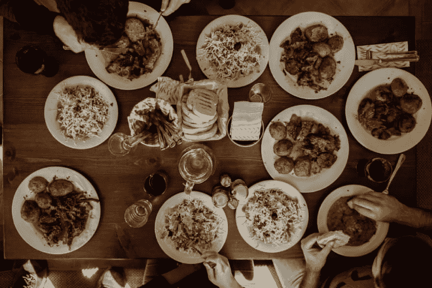
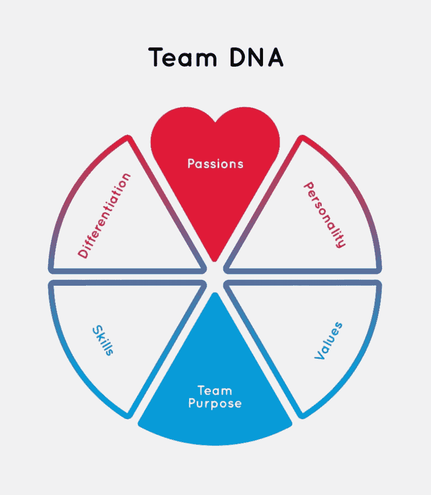
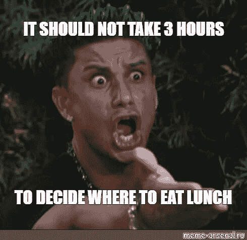
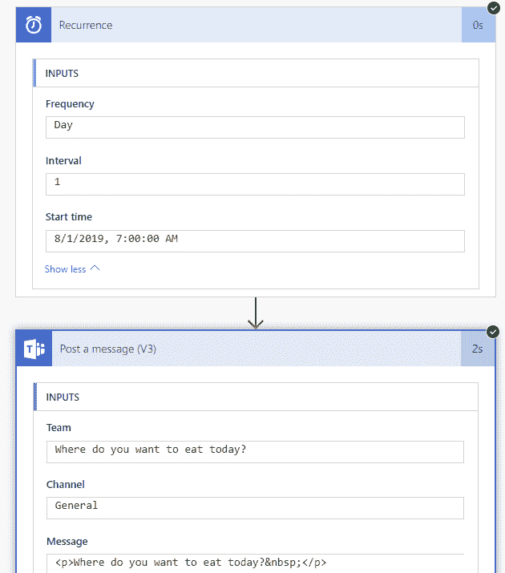

# 团队午餐的社交粘合剂

> 原文：<https://dev.to/dejavo/the-social-glue-of-the-team-s-lunch-32ed>

<figure> 

<figcaption>照片由[孙平](https://unsplash.com/@vladington?utm_source=medium&utm_medium=referral)上[下](https://unsplash.com?utm_source=medium&utm_medium=referral)</figcaption>

</figure>

每个人都要吃饭，对吧？家人喜欢一起吃饭，朋友们经常聚在一起吃饭，同事们经常在午餐时进行社交活动。

康奈尔大学最近的研究发现，一起吃饭的员工比不一起吃饭的员工在工作中有更好的团队表现。

“在研究过程中，我们注意到**不分享用餐时间是一个信号，表明团队工作方式存在更深层次的问题**，这种情况随后会反映在团队的表现中。”——[根据发表这项研究的查尔斯·戴森·康奈尔大学经济学教授凯文·尼弗芬的说法。](https://www.morningfuture.com/en/article/2018/03/23/social-eating-team-building/260/)

<figure> 

<figcaption>[独食](https://imgflip.com/i/37r3bx) —由 imgflip.com</figcaption>

</figure>

意思是一个人吃饭效率会降低。此外，我推断团队午餐仪式的重要性堪比和家人一起吃饭。花时间坐下来一起吃饭应该是团队文化的一部分。

因此，投资自助餐厅的组织提高了员工的绩效和协作。合适的基础设施提供了一个对话的开端，在这个空间里，同事们可以分享他们的午餐并更好地交流。

到现在为止，我很确定你已经注意到你的大部分觉醒时间是与这群人分享的。实际上，你见到他们比见到你的家人还多，我想，如果你更了解他们，会更有趣。

因此，与同事的社交不会以团队午餐结束。时不时地，在酒吧、餐馆或任何符合团队独特 DNA 的地方进行工作之外的会面，会使团队成员之间的联系更加紧密。

<figure> 

<figcaption>[造型团队 DNA](http://jodierogers.com/your-journey/sculpt-team-dna/) —作者 jodierogers.com</figcaption>

</figure>

依我看，每个经理都在寻找培养团队的秘诀，那种难以捉摸的化学反应造就了高成就的团队。几年前，一项名为“[建立伟大团队的新科学](https://hbr.org/2012/04/the-new-science-of-building-great-teams)”的研究观察了 21 个组织和 2500 名员工，历时 7 年，得出以下结论，造就一个伟大的团队:

*   定期面对面交流。
*   心理安全环境，每个人都可以平等的交谈和倾听。我指的是每个人，而不仅仅是领导者在说话。
*   社交时间很关键；它占沟通模式积极变化的 50%以上，是高绩效和低绩效团队之间的游戏规则改变者。
*   倾向于在团队成员之间分享知识的团队表现更好。

只要一起吃饭，以上所有的事情都会变得简单。一个大惊喜？我猜没有；因为这为它们的繁荣创造了肥沃的土壤。

要跨越的一个重要障碍是决定去哪里吃饭，因为每个人都有自己的口味和食物偏好。一个建议的方法是使用一个协作工具，允许创建一个表格(一种调查)或一个重复的消息，让每个人分享他们的想法。所选择的选项将是大多数人投票的选项。

<figure> 

<figcaption>[午餐](https://www.meme-arsenal.com/en/create/template/483897)—by meme-阿森纳. ru</figcaption>

</figure>

例如，[微软团队](https://products.office.com/en-US/microsoft-teams/group-chat-software)和[微软流程](https://flow.microsoft.com/en-us/)服务之间的连接可以成为解决方案。Flow 生成一个预定的消息到一个特定团队的通道中，在那里所有团队成员都参与进来，并可以投票选择他们喜欢的选项。如下图所示:

<figure> 

<figcaption>流量配方</figcaption>

</figure>

自然地，在常规(最大[两个披萨大小](https://buffer.com/resources/small-teams-why-startups-often-win-against-google-and-facebook-the-science-behind-why-smaller-teams-get-more-done/amp)🍕)团队，更容易安排共享午餐。在一个更大的团队中，如果没有合适的框架，这样的步调可能很难实现。其中只有一些日子被定义为整个团队的午餐，否则它将很少发生，因为倾向于分裂成具有共同偏好的更小的群体。

最终，一起吃饭创造了一个开放的对话，产生了非正式的谈话和创新的想法。同事之间的联系越紧密，团队的生产力就越高。