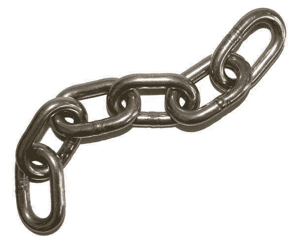

# Javascript 中的可选链接

> 原文：<https://dev.to/dhilipkmr/optional-chaining-in-javascript-1175>

[](https://res.cloudinary.com/practicaldev/image/fetch/s--SdJD5X7R--/c_limit%2Cf_auto%2Cfl_progressive%2Cq_auto%2Cw_880/https://thepracticaldev.s3.amazonaws.com/i/23q1qkg3utg8f2l36rhf.jpg)

如果我告诉你下面的代码片段在 javascript 中是可能的，会怎么样？

```
 const hasWorld = response && response.data && response.data.msg && response.data.msg.includes('world');

const hasWorld = response?.data?.msg?.includes('world'); 
```

这种检查对象属性的方式称为可选链接。

这目前在第 3 阶段`tc39`，但是有了`babel`，我们现在就可以通过添加下面的插件`@babel/plugin-proposal-optional-chaining`到你的 babel v7+的配置文件中来在我们的代码中使用它。

下面是带有可选链接的 Transpiled Babel 代码示例。

[传输的代码示例](http://bit.ly/optional-chaining)