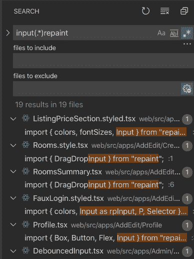
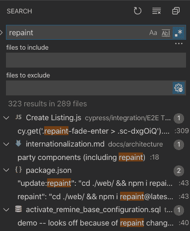

# VSCode 中的正则表达式搜索

> 原文：<https://dev.to/stephencweiss/regex-search-in-vscode-432g>

在大型应用程序中找到导入模块的所有实例是一项挑战。

由于模块的名称空间被限制在文件中，搜索特定的名称经常会使您误入歧途。在整个应用程序中，相同的名称可以用于完全不同的目的。

此外，即使你寻找的只是一个模块已经被导入的实例，由于析构和从那个资源多次导入的可能性，搜索的结果可能是压倒性的。

以我搜索从库`repaint`中导入`Input`的所有实例为例。

我搜索了大约 1500 个结果。

我可以通过搜索`repaint`来缩小搜索范围，但是在 250 多个文件中仍然有 300 多个结果。 

这是 Regex 真正闪光的地方。我知道正在导入的模块和库的名称，但是因为导入的模式可以改变很多，如果我要寻找一个精确的匹配，找到它们会很困难。

我不是专家，但是几分钟后，通过一些资源，我找到了我需要的模式:`input(.*)repaint`。 1

该模式指定了一个非常简单的模式:由任意字符分隔的字符串`input`和`repaint`。即使是这种通用的基本模式也将我的搜索结果从数百或数千个减少到了 19 个。这就是效率。【T2

注意:需要打开 Regex 选项才能工作(选择`.*`图标或使用键盘快捷键`⌥⌘R`)

# 资源

*   1 [Regex:你需要知道的一切|代码挑剔](https://www.codepicky.com/regex/)