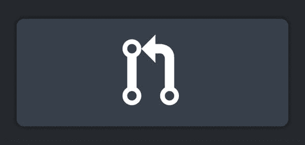
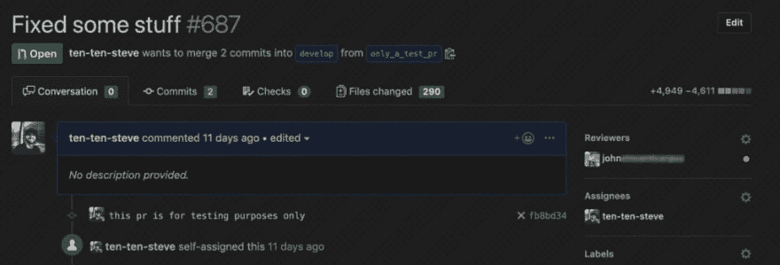
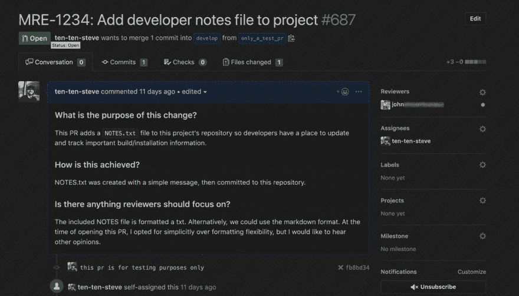

# 拉取请求的最佳实践

> 原文：<https://dev.to/solacedevs/best-practices-for-pull-requests-5h2p>

*TL；DR:我们鼓励开发人员在打开一个拉请求时，产生小的、范围良好的代码变更，并辅以有意义的标题和描述。小的、增量的变更更容易测试，更容易理解，更快审查，更安全部署。大家都赢了！*

这篇文章的目的是提出并强调一些指导原则，我认为开发者在针对我们的一个库打开一个新的[拉请求](https://help.github.com/en/articles/about-pull-requests) (PR)时应该考虑这些原则。随着提议对我们的代码库进行更改的人数不断增加，我们已经到达了一个临界点，我们需要建立一些期望并讨论一些好习惯，以便贡献者、产品所有者以及最重要的客户都满意。

根据我的经验，许多开发人员都哀叹代码审查过程。而不是一个协作的体验，它变成了开发者和评审者之间的对抗。当我发现同事陷入这种思维模式时，我喜欢提醒他们，他们是自己 pr 的主人，掌握你的技能的一部分将始终涉及接收和提供反馈。就像成为一名有经验的程序员一样，创建优秀的拉请求需要注意力和实践。

在我职业生涯的早期，我会打开一个包含几十个提交的 pull 请求，影响一千行代码，同时提供很少甚至没有描述，并期望评审者在相对较短的时间内阅读和理解我的工作。以下是这种公关的一个例子。

多亏了我的同事的一些指导，他们建议说虽然我的代码是有效的，但是我把我的工作归入一个大规模的 PR 并没有给我自己带来任何好处。相反，我应该将一个特性分解成几个易于理解、易于实施的拉取请求。采纳这个建议是我作为开发人员的旅程中一个显著的转折点。从那以后，我的拉式请求很少有注释和变更请求，更快地获得批准，并更快地交付给客户。因此，我的开发过程感觉更具协作性和回报性，而不是对抗性和令人沮丧。

前面，我提到过，我有时会向我的开发伙伴表示，他们可以控制自己的拉取请求。这可能是一个崇高的理想，但你可以采取一些现实生活中的行动来实现这个前提。首先，当提议对代码库进行更改时，作为开发人员，您应该完全理解您的更改将对整个系统产生的影响。我经常把这称为“拥有问题空间”。一个好的开发人员应该能够有效地解释他们的设计、测试方法，以及与他们的代码相关的部署特征。自然地，总有 10+种不同的方法来解决一个问题，这取决于你使用所有可用的资源来培养背景，坚持己见，并成为专家。与编写好的代码类似，这是一个分析和分解特性/错误修复/任务为最小的逻辑可交付组件的问题。打开只包含最小逻辑组件的拉式请求，可以最大限度地减少在拉式请求评审周期中需要传达的知识的复杂性和广度。换句话说，较小的 PRs 意味着需要评论、关注或争论的领域较少。

将大任务分解成几个连续的较小 PRs 的另一个方面是，它允许更早的反馈机会。更频繁的发布提供了更多的机会来改变和调整您的设计，同时减少了返回和更新现有代码所需的时间。为了给整个想法一个口号，我有时会说“渴望得到拉请求”，意思是开发人员应该尽可能多地发送他们认为必要的拉请求。

一个经常被忽视的很好的工具是拉请求描述字段。我经常看到它空着，这是我在职业生涯早期感到内疚的事情。有许多理由鼓励编写良好的、有意义的拉式请求描述。一个好的描述不仅有助于传达代码变更的本质，促进交流和理解，而且它也是一个有用的机制来识别你试图交付的工作范围。在大多数存储库中，我要求开发人员回答以下三个问题:

*   拉取请求的目的是什么？
*   这是如何实现的？
*   您希望您的评论关注/注意哪些特定领域？

乍一看这似乎很麻烦，但是我发现当你想确定你是否已经很好地将大量工作分解成最小的逻辑组件时，这是一个有效的衡量标准。如果你能用几句话回答这些问题，那么你可以相当自信地说你已经找到了答案。另一方面，如果你发现自己不得不写很长的段落来解释你的工作，那么这是一个很好的迹象，表明你试图一次运送太多。

作为我一直坚持到今天的一项练习，我喜欢用评审请求来给经验不足的开发人员一个惊喜。如果我已经很好地确定了提议的变更的范围，并且编写了一个简明的、有意义的拉请求描述，我希望他们在理解和批准我的代码变更方面没有问题(假设我们已经建立了必要的上下文)。这确保了我坚持自己的原则，并展示了我对团队的期望。这是一个好的公关的例子。

正如精心制作干净的代码需要实践、自省和细化一样，编写智能的、作用域良好的、易于理解的和易于发布的拉请求也是如此。我鼓励你考虑我学到的一些经验，并将它们融入你的工作流程。我向您保证，您花费在将您的拉请求组织成频繁的、增量的更新，以及有效地传达您如何以及为什么做出每个更改的时间是值得的。

帖子[关于拉动式请求的最佳实践](https://solace.com/blog/best-practices-for-pull-requests/)首先出现在[的慰藉](https://solace.com)上。