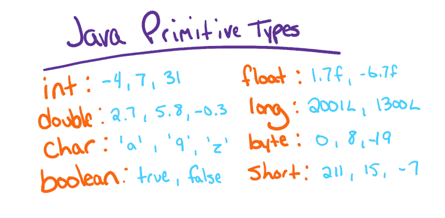
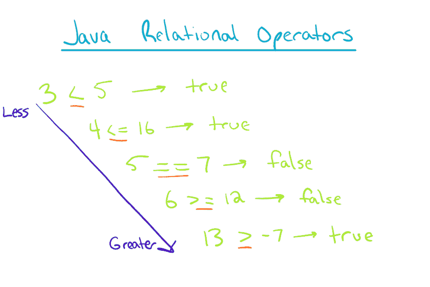
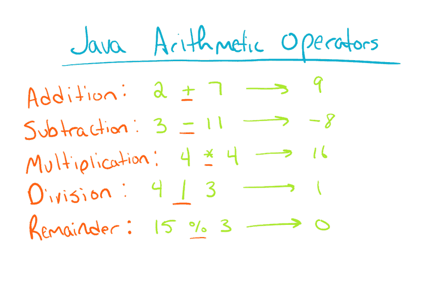

# Java 中的基本类型和变量

> 原文：<https://dev.to/renegadecoder94/primitive-types-and-variables-in-java-3gjm>

欢迎回到另一个 Java 教程！如果您一直在跟随，那么您刚刚在 DrJava 的交互窗格中玩完了数字。在本教程中，我们将给出上一教程中的一些例子的上下文。特别是，我们将讨论 Java 基本类型及其在变量创建中的作用。我们开始吧！

## 概念

在我们真正深入研究代码之前，我们需要讨论基本类型及其功能。

### Java 原语类型

[](https://res.cloudinary.com/practicaldev/image/fetch/s--FOZwHf9Y--/c_limit%2Cf_auto%2Cfl_progressive%2Cq_auto%2Cw_880/https://thepracticaldev.s3.amazonaws.com/i/yprcknu4oxmq073i18e9.png)

在每种编程语言中，都有语言内置的数据类型。在像 Java 这样所有数据类型都是显式的语言中，每种数据类型都有一个唯一的关键字。这些显式关键字用于告诉语言我们在创建变量时想要使用什么类型:

```
variableType variableName; // Declaration
variableName = variableValue; // Definition 
```

<svg width="20px" height="20px" viewBox="0 0 24 24" class="highlight-action crayons-icon highlight-action--fullscreen-on"><title>Enter fullscreen mode</title></svg> <svg width="20px" height="20px" viewBox="0 0 24 24" class="highlight-action crayons-icon highlight-action--fullscreen-off"><title>Exit fullscreen mode</title></svg>

上面的语法是我们如何在变量中创建和存储数据的。我们首先声明我们想要存储的数据的类型，然后是它的名称。这部分语法被称为变量声明**。然后，我们**使用赋值操作符(`=`)和某个值来定义变量**。当然，在一行中创建变量要容易得多:**

 **variable type variable name = variable value；
在 Java 中，我们可以使用[八种内置数据类型中的一种来定义变量，我们称之为原始类型](https://therenegadecoder.com/code/the-8-primitive-types-in-java/) : `int`、`double`、`char`、`byte`、`short`、`long`、`float`和`boolean`。例如，我们可以如下定义一个整数:

```
int height = 17; 
```

<svg width="20px" height="20px" viewBox="0 0 24 24" class="highlight-action crayons-icon highlight-action--fullscreen-on"><title>Enter fullscreen mode</title></svg> <svg width="20px" height="20px" viewBox="0 0 24 24" class="highlight-action crayons-icon highlight-action--fullscreen-off"><title>Exit fullscreen mode</title></svg>

在本例中，我们定义了一个名为 height 的变量，其值为 17。自然地，我们需要熟悉所有的八种基本类型，这样我们才能恰当地使用它们。

### Java 关系运算符

[](https://res.cloudinary.com/practicaldev/image/fetch/s--v13e4ycA--/c_limit%2Cf_auto%2Cfl_progressive%2Cq_auto%2Cw_880/https://thepracticaldev.s3.amazonaws.com/i/3uf2x92hvne1qygg84ga.png)

就在上面，我们讨论了在变量中存储一个数值。也就是说，Java 能做的不仅仅是存储数字。例如，我们可以使用关系运算符来比较数字。

在之前的教程中，我们接触到了这些操作符中的一个:`==`。此外，我们可以使用`!=`、`<`、`<=`、`>`和`>=`来比较值。试试下面的一些例子:

```
6 > 7  // 6 is greater than 7 (false)
110 >= 54  // 110 is greater than or equal to 54 (true)
95 < 96  // 95 is less than 96 (true)
63 <= 100  // 63 is less than or equal to 100 (true) 
```

<svg width="20px" height="20px" viewBox="0 0 24 24" class="highlight-action crayons-icon highlight-action--fullscreen-on"><title>Enter fullscreen mode</title></svg> <svg width="20px" height="20px" viewBox="0 0 24 24" class="highlight-action crayons-icon highlight-action--fullscreen-off"><title>Exit fullscreen mode</title></svg>

您可能已经注意到，每个操作的结果都是一个布尔值:`true`或`false`。在未来，我们将看到这些运算符被用来驱动各种逻辑。

### Java 算术运算符

[](https://res.cloudinary.com/practicaldev/image/fetch/s--nO13L8R9--/c_limit%2Cf_auto%2Cfl_progressive%2Cq_auto%2Cw_880/https://thepracticaldev.s3.amazonaws.com/i/xng2yl09h5ut7z960428.png)

虽然关系运算符很有趣，但我们需要算术运算符来使我们的表达式更有趣。到目前为止，我们已经随意介绍了算术运算符，但没有真正解释它们。幸运的是，我们将看看所有最常见的 Java 算术运算符:`+`、`-`、`*`、`/`、`%`。

首先，尝试运行以下表达式并注意注释:

```
2 + 3  // 2 plus 3 (5)
11 - 5  // 11 minus 5 (6)
13 * 2  // 13 times 2 (26)
6 / 3 // 6 divided by 3 (2)
11 % 2  // remainder of 11 divided by 2 (1) 
```

<svg width="20px" height="20px" viewBox="0 0 24 24" class="highlight-action crayons-icon highlight-action--fullscreen-on"><title>Enter fullscreen mode</title></svg> <svg width="20px" height="20px" viewBox="0 0 24 24" class="highlight-action crayons-icon highlight-action--fullscreen-off"><title>Exit fullscreen mode</title></svg>

在本例中，我们已经对整数执行了所有五个操作符。如果对各种基本类型运行每个操作符，熟悉一下会发生什么是个好主意。例如，尝试使用 double 类型:

```
2.0 + 3.0  // 2.0 plus 3.0 (5.0)
11.0 - 5.0  // 11.0 minus 5.0 (6.0)
13.0 * 2.0  // 13.0 times 2.0 (26.0)
6.0 / 3.0 // 6.0 divided by 3.0 (2.0)
11.0 % 2.0  // ERROR! Can't compute remainder on doubles 
```

<svg width="20px" height="20px" viewBox="0 0 24 24" class="highlight-action crayons-icon highlight-action--fullscreen-on"><title>Enter fullscreen mode</title></svg> <svg width="20px" height="20px" viewBox="0 0 24 24" class="highlight-action crayons-icon highlight-action--fullscreen-off"><title>Exit fullscreen mode</title></svg>

正如我们将在下一节看到的，当我们在表达式中混合这些类型时，事情会变得很奇怪。

### 截断

虽然算术可能看起来很简单，但我们应该知道一些陷阱。毕竟，当我们开始混合原始类型时，我们期望会发生什么？例如，以下表达式返回不同的结果:

```
1 + 2  // 3
1 + 2.0  // 3.0 
```

<svg width="20px" height="20px" viewBox="0 0 24 24" class="highlight-action crayons-icon highlight-action--fullscreen-on"><title>Enter fullscreen mode</title></svg> <svg width="20px" height="20px" viewBox="0 0 24 24" class="highlight-action crayons-icon highlight-action--fullscreen-off"><title>Exit fullscreen mode</title></svg>

这可能看起来很傻，但这种区别可能会产生后果。例如，如果我们把加法换成除法会发生什么？事实证明，类似于`1 / 2`的结果将是值 0。在计算机科学中，我们称之为**截断**。

发生截断是因为 32 位整数只能保存离散值。整数不舍入输出，而是丢弃不适合 32 位窗口的任何位。对于所有的数据类型来说都是如此，但是对于整数来说更容易注意到。

虽然截断可能会令人困惑且不直观，但它在某些情况下很方便，比如映射——我们稍后肯定会遇到这种情况。

无论如何，只要我们的类型一致，算术就相当简单。但是，如果我们被迫混合兼容的类型，比如 integer 和 double，Java 会将整个结果转换为最宽的类型。换句话说，拥有最多位的类型将是计算的结果。

### 数值限制

算术的另一个潜在问题是**回绕**。事实证明，计算机系统中的数字是有极限的，计算有时会超过这些极限。

如果你有机会阅读 8 种基本类型，那么你会知道有一种快速的方法来检查每种基本类型的极限。作为复习，我们可以使用下面的代码片段来确定一个整数的最大值:

```
Integer.MAX_VALUE 
```

<svg width="20px" height="20px" viewBox="0 0 24 24" class="highlight-action crayons-icon highlight-action--fullscreen-on"><title>Enter fullscreen mode</title></svg> <svg width="20px" height="20px" viewBox="0 0 24 24" class="highlight-action crayons-icon highlight-action--fullscreen-off"><title>Exit fullscreen mode</title></svg>

返回值起初可能看起来令人困惑，但是我们很快就会意识到该值是可能范围的一半。这一定意味着范围的另一半由负值组成。尝试使用以下内容作为确认:

```
Integer.MIN_VALUE 
```

<svg width="20px" height="20px" viewBox="0 0 24 24" class="highlight-action crayons-icon highlight-action--fullscreen-on"><title>Enter fullscreen mode</title></svg> <svg width="20px" height="20px" viewBox="0 0 24 24" class="highlight-action crayons-icon highlight-action--fullscreen-off"><title>Exit fullscreen mode</title></svg>

为了好玩，让我们看看当我们超越这些极限时会发生什么:

```
Integer.MAX_VALUE + 1 // Prints -2147483648
Integer.MIN_VALUE - 1 // Prints 2147483647 
```

<svg width="20px" height="20px" viewBox="0 0 24 24" class="highlight-action crayons-icon highlight-action--fullscreen-on"><title>Enter fullscreen mode</title></svg> <svg width="20px" height="20px" viewBox="0 0 24 24" class="highlight-action crayons-icon highlight-action--fullscreen-off"><title>Exit fullscreen mode</title></svg>

这不是很奇怪吗？我们刚刚第一次观察到**整数回绕**。换句话说，一旦我们达到了一个原始类型的极限，我们将绕回另一边。在我们前进的时候，请记住这一点。

如果还不清楚的话，其范围在负值和正值之间分割的数据类型被称为**有符号类型**。同样，具有完全正范围的数据类型被称为**无符号类型**。在这两种情况下，语言都解释代表一个值的位。

### 铸造类型

对于基本类型，可能最后要涉及的主题是类型转换的概念。我们已经讨论过类型扩展，其中计算存储在最宽的类型中。类型转换正好相反。

假设我们有一个计算结果是双精度的，但是我们不关心十进制的结果。我们可以通过将类型转换为整数来降低精度。这在代码中随处可见，但一个很好的例子是舍入的实现。在不知道[控制流](https://therenegadecoder.com/code/control-flow-syntax-and-design-in-java/)的情况下，我们可以实现舍入:

```
int round = (int) (7.6 + 0.5); 
```

<svg width="20px" height="20px" viewBox="0 0 24 24" class="highlight-action crayons-icon highlight-action--fullscreen-on"><title>Enter fullscreen mode</title></svg> <svg width="20px" height="20px" viewBox="0 0 24 24" class="highlight-action crayons-icon highlight-action--fullscreen-off"><title>Exit fullscreen mode</title></svg>

在本例中，我们试图舍入到最接近的整数的数字是 7.6。如果小数小于. 5，我们希望结果向下舍入。同样，如果小数是. 5 或更大，我们希望结果向上取整。

通过加上 0.5，我们迫使 7.6 变成 8.1。然后，类型转换会截断小数点，从而得到正确舍入的整数。如果数字是 7.4，计算将强制 7.4 到 7.9。那么类型转换将截断小数。

考虑到这一点，我们已经涵盖了我们可能需要了解的关于 Java 原语类型的所有内容。

## 练习

此时，我们应该非常熟悉一些概念，包括:

*   变量声明和定义
*   8 种原始类型:`boolean`、`int`、`double`、`float`、`byte`、`short`、`long`、`char`
*   5 个算术运算符:`+`、`-`、`*`、`/`、`%`
*   5 个关系运算符:`==`、`>=`、`>`、`<`、`<=`
*   截断
*   铅字铸造
*   数字限制

在这一点上，我们将通过一些例子把它们结合在一起。在“交互”面板中，尝试以下操作:

```
char letter = 'b'; 
```

<svg width="20px" height="20px" viewBox="0 0 24 24" class="highlight-action crayons-icon highlight-action--fullscreen-on"><title>Enter fullscreen mode</title></svg> <svg width="20px" height="20px" viewBox="0 0 24 24" class="highlight-action crayons-icon highlight-action--fullscreen-off"><title>Exit fullscreen mode</title></svg>

之前，我们写了一个类似的代码行，其中我们给一个变量赋值为 7。在这种情况下，我们处理的是整数。在这种情况下，我们使用的是能够存储字符值的`char`原语类型。通过这一行，我们现在已经将自己的值存储在一个名为 letter 的变量中。继续尝试各种数据类型。例如，我们可以尝试以下任何一种:

```
boolean hasMoney = true; 
int hour = 7; 
double height = 13.7; 
float gravity = 9.81f; 
long sixBillion = 6000000000L; 
```

<svg width="20px" height="20px" viewBox="0 0 24 24" class="highlight-action crayons-icon highlight-action--fullscreen-on"><title>Enter fullscreen mode</title></svg> <svg width="20px" height="20px" viewBox="0 0 24 24" class="highlight-action crayons-icon highlight-action--fullscreen-off"><title>Exit fullscreen mode</title></svg>

现在我们已经声明了一些变量，试着把这些值加在一起，注意结果。例如:

```
hour + height; 
```

<svg width="20px" height="20px" viewBox="0 0 24 24" class="highlight-action crayons-icon highlight-action--fullscreen-on"><title>Enter fullscreen mode</title></svg> <svg width="20px" height="20px" viewBox="0 0 24 24" class="highlight-action crayons-icon highlight-action--fullscreen-off"><title>Exit fullscreen mode</title></svg>

变量名没有太多意义，但是这是完全合法的，并且会导致 20.7。然而，如果我们尝试类似于:

```
hasMoney + hour; 
```

<svg width="20px" height="20px" viewBox="0 0 24 24" class="highlight-action crayons-icon highlight-action--fullscreen-on"><title>Enter fullscreen mode</title></svg> <svg width="20px" height="20px" viewBox="0 0 24 24" class="highlight-action crayons-icon highlight-action--fullscreen-off"><title>Exit fullscreen mode</title></svg>

我们将以一个错误结束。这是因为我们试图将一个布尔值加到一个整数上。同时，以下内容在 Java 中是完全合法的:

```
char gravity = 'g'; 
char speedOfLight = 'c'; 
gravity + speedOfLight; 
```

<svg width="20px" height="20px" viewBox="0 0 24 24" class="highlight-action crayons-icon highlight-action--fullscreen-on"><title>Enter fullscreen mode</title></svg> <svg width="20px" height="20px" viewBox="0 0 24 24" class="highlight-action crayons-icon highlight-action--fullscreen-off"><title>Exit fullscreen mode</title></svg>

我们确实可以把这些字符加在一起，得到 202 或“ê”。因为 char 类型实际上是一个数值，所以我们可以像对整数求和一样对它们求和。

如果我们想比较字符以便排序，添加字符特别方便。例如，通过比较两个字母的数值，可以按字母顺序对它们进行比较。所有可用的 ASCII 字符及其值的完整列表可在此处找到。

补充说明一下，Java 字符是 16 位的，这使得它们比 256 位 ASCII 字符更加多样化。此外，char 原语类型是唯一无符号的 Java 原语类型。

## 但是字符串呢？

既然说到人物这个话题，那就说说字符串吧。Java 本身支持字符串，字符串是字符序列。然而，字符串不是 Java 的原始类型。相反，它们是一种引用类型。

**引用类型**与原语类型有点不同。对于原始类型，我们可以根据需要自由复制和比较数据。这使得开发变得非常直观，因为这个概念被称为**价值语义**。值语义意味着变量是不可变的，所以我们不必担心副本会破坏原始值。

要测试这个概念，请在 DrJava 的交互窗格中尝试以下操作:

```
int x = 5; 
int y = 5; 
y == x; 
```

<svg width="20px" height="20px" viewBox="0 0 24 24" class="highlight-action crayons-icon highlight-action--fullscreen-on"><title>Enter fullscreen mode</title></svg> <svg width="20px" height="20px" viewBox="0 0 24 24" class="highlight-action crayons-icon highlight-action--fullscreen-off"><title>Exit fullscreen mode</title></svg>

注意，这个比较如预期的那样返回 true。直觉上，5 等于 5。现在试试下面的:

```
String firstName = "Leroy"; 
String lastName = "Leroy"; 
firstName == lastName; 
```

<svg width="20px" height="20px" viewBox="0 0 24 24" class="highlight-action crayons-icon highlight-action--fullscreen-on"><title>Enter fullscreen mode</title></svg> <svg width="20px" height="20px" viewBox="0 0 24 24" class="highlight-action crayons-icon highlight-action--fullscreen-off"><title>Exit fullscreen mode</title></svg>

在这个例子中，我们定义了某人名字的两个组成部分:Leroy Leroy。直觉上，我们会认为比较两个名字会返回 true。毕竟，两个名字都有相同的字母，并且都区分大小写。然而，我们得到一个令人震惊的结果`false`。

事实证明，`==`操作符并没有像预期的那样比较字符串。错误比较的原因将在下面的教程中详细解释，所以现在尝试比较更多的字符串。例如，我们可以试着创建两个字符串并将它们分配给彼此:

```
String firstName = "Leroy"; 
String lastName = "Jenkins"; 
firstName = lastName; 
firstName == lastName; 
```

<svg width="20px" height="20px" viewBox="0 0 24 24" class="highlight-action crayons-icon highlight-action--fullscreen-on"><title>Enter fullscreen mode</title></svg> <svg width="20px" height="20px" viewBox="0 0 24 24" class="highlight-action crayons-icon highlight-action--fullscreen-off"><title>Exit fullscreen mode</title></svg>

在这种情况下，使用`==`的比较结果为真。当然，值的比较是一样的，那么为什么这次会返回 true 呢？在下一篇教程中，我们将更深入地研究字符串，以及当我们使用`==`进行比较时实际发生了什么。

*小心！如果您使用除了 DrJava 的交互窗格之外的几乎任何工具，您可能会发现类似于`"Leroy" == "Leroy"`的表达式返回 true。这要归功于 Java 的一个特殊功能，叫做 [string interning](https://www.baeldung.com/java-string-pool) (感谢， [Iven](https://dev.to/ivenk) )，它确保了重复的字符串常量拥有相同的引用。换句话说，我们仍然没有比较字符串的内容。稍后将详细介绍这一点！***