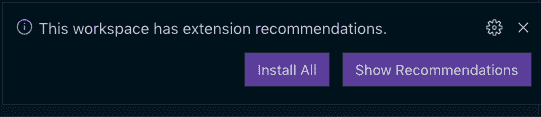
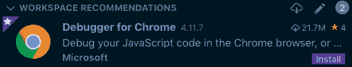

# 在您的开源项目中推荐 VSCode 扩展

> 原文：<https://dev.to/spboyer/recommending-vscode-extensions-within-your-open-source-projects-5167>

[](https://res.cloudinary.com/practicaldev/image/fetch/s--hg5LG9vD--/c_limit%2Cf_auto%2Cfl_progressive%2Cq_auto%2Cw_880/http://tattoocoder.com/conteimg/2019/08/Screen-Shot-2019-08-14-at-2.53.11-PM-1.png)

你运行一个开源项目吗？当维护你的项目或者甚至日常编码时，使用 Visual Studio 代码和它广泛的[扩展](https://marketplace.visualstudio.com/vscode?WT.mc_id=devto-blog-shboyer)？

如果你有一个或一组你喜欢/推荐给你的项目的扩展；您可以启用其他贡献者，方法是通过显示任何类似内容的警报通知他们。

[](https://res.cloudinary.com/practicaldev/image/fetch/s--mqQHEq8H--/c_limit%2Cf_auto%2Cfl_progressive%2Cq_auto%2Cw_880/http://tattoocoder.com/conteimg/2019/08/Screen-Shot-2019-08-14-at-2.53.11-PM.png)

点击**显示建议**打开**工作区建议**

[](https://res.cloudinary.com/practicaldev/image/fetch/s--yhazhNeq--/c_limit%2Cf_auto%2Cfl_progressive%2Cq_auto%2Cw_880/http://tattoocoder.com/conteimg/2019/08/Screen-Shot-2019-08-14-at-2.53.35-PM.png)

详细信息允许您忽略建议。

[](https://res.cloudinary.com/practicaldev/image/fetch/s--YM2x6jMa--/c_limit%2Cf_auto%2Cfl_progressive%2Cq_auto%2Cw_880/http://tattoocoder.com/conteimg/2019/08/Screen-Shot-2019-08-14-at-2.54.15-PM.png)

### 在您的存储库中启用

添加一个`.vscode`文件夹，如果您的调试设置还没有这个文件夹的话，并使用下面的结构创建一个名为`extensions.json`的新文件。

```
{
    "recommendations": [
        "msjsdiag.debugger-for-chrome"
    ]
} 
```

<svg width="20px" height="20px" viewBox="0 0 24 24" class="highlight-action crayons-icon highlight-action--fullscreen-on"><title>Enter fullscreen mode</title></svg> <svg width="20px" height="20px" viewBox="0 0 24 24" class="highlight-action crayons-icon highlight-action--fullscreen-off"><title>Exit fullscreen mode</title></svg>

`recommendations[]`包含来自 Visual Studio 市场的扩展标识符。

例如，如果我要为[ASP.NET 核心车间](https://github.com/dotnet-presentations/aspnetcore-app-workshop)添加推荐的扩展。`extensions.json`文件可能看起来像这样。

```
{
    "recommendations": [
                "ms-vscode.csharp",
                "VisualStudioExptTeam.vscodeintellicode",
                "ms-mssql.mssql",
                "ms-vscode.azure-account",
                "ms-azuretools.vscode-azureappservice",
        "ms-azuretools.vscode-docker",
                "MS-vsliveshare.vsliveshare-pack"
    ]
} 
```

<svg width="20px" height="20px" viewBox="0 0 24 24" class="highlight-action crayons-icon highlight-action--fullscreen-on"><title>Enter fullscreen mode</title></svg> <svg width="20px" height="20px" viewBox="0 0 24 24" class="highlight-action crayons-icon highlight-action--fullscreen-off"><title>Exit fullscreen mode</title></svg>

*   [C#](https://marketplace.visualstudio.com/items?itemName=ms-vscode.csharp&WT.mc_id=devto-blog-shboyer)
*   [Visual Studio Intellicode](https://marketplace.visualstudio.com/items?itemName=VisualStudioExptTeam.vscodeintellicode&WT.mc_id=devto-blog-shboyer)
*   [SQL 服务器](https://marketplace.visualstudio.com/items?itemName=ms-mssql.mssql&WT.mc_id=devto-blog-shboyer)
*   [Azure 账户](https://marketplace.visualstudio.com/items?itemName=ms-vscode.azure-account&WT.mc_id=devto-blog-shboyer)
*   [Azure 应用服务](https://marketplace.visualstudio.com/items?itemName=ms-azuretools.vscode-azureappservice&WT.mc_id=devto-blog-shboyer)
*   [码头工人](https://marketplace.visualstudio.com/items?itemName=ms-azuretools.vscode-docker&WT.mc_id=devto-blog-shboyer)
*   [VS 直播分享包](https://marketplace.visualstudio.com/items?itemName=MS-vsliveshare.vsliveshare-pack&WT.mc_id=devto-blog-shboyer)

### 简单干净

一个小的附加功能，帮助贡献者发现您使用的扩展，以及用于添加到您维护的项目中的扩展，并且是完全可选的。

*交叉发布自[https://纹身编码者. com/recommending-vs code-extensions-within-your-open-source-projects/](https://tattoocoder.com/recommending-vscode-extensions-within-your-open-source-projects/)*