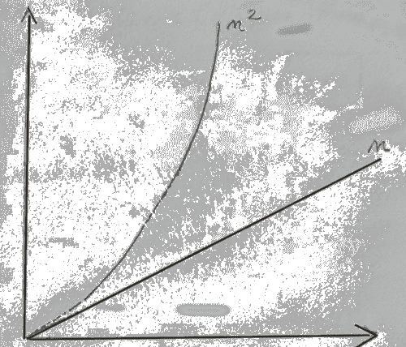
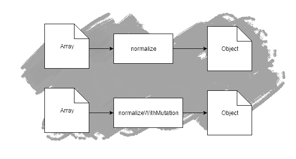

# 函数式 JavaScript 中的数据突变

> 原文：<https://dev.to/macsikora/data-mutation-in-functional-javascript-1h97>

我们来谈谈不变性和可变性。整个网络都是关于突变是如何有害的文章。甚至我有一些关于不变性好处的非常受欢迎的文章。看看这里[不变性的状态](https://medium.com/dailyjs/the-state-of-immutability-169d2cd11310)，可以肯定的是，你现在正在读的这篇文章，部分与我之前的作品相反。让我们问一个问题——我们应该总是遵循不变性吗，它是一个银弹吗，这种方法，在像 JavaScript 这样的语言中，适合每种情况吗？看起来不像，但是让我试着解释一下，在你结束这篇文章说——多么无知之前😎

让我们回忆一下缺乏突变带来了什么好处:

*   可预测性
*   安全
*   代码信任
*   降低复杂性

**是的，这是真的。但是当这些利益显示出它们的力量时？当然是在共享状态下。然而，对外界隐藏的状态又如何呢？本地状态只用于内部计算。在那里强加不变性有意义吗？让我们多调查，多思考。**

## 以数据归一化为例

没有什么比代码更能说明问题了。在示例中，我将展示典型的 normalize 函数，其目的是将集合数据结构更改为 key->value map 结构，以便通过 key 快速访问元素。换句话说，这样的`key->value`映射使我们能够对映射中的每条记录拥有恒定的访问时间，不管映射有多大。与标准集合相反，其中访问元素的时间将具有复杂度`n`，其中`n`是集合的大小。标准化对于 **Redux** 类型的架构来说是非常典型的，扁平结构对性能和复杂性也有直接的积极影响。

由于规范化的目的是将一种数据结构转换/简化为另一种数据结构，因此在这里直接使用`Array.prototype.reduce`:

```
function normalize(data) {
    return data.reduce((result, record) => ({...result, [record.id]: record}), {});
} 
```

<svg width="20px" height="20px" viewBox="0 0 24 24" class="highlight-action crayons-icon highlight-action--fullscreen-on"><title>Enter fullscreen mode</title></svg> <svg width="20px" height="20px" viewBox="0 0 24 24" class="highlight-action crayons-icon highlight-action--fullscreen-off"><title>Exit fullscreen mode</title></svg>

很管用。但是我们需要理解，对于集合中的每个元素，这个实现是对上一次迭代中创建的整个地图的一个浅层复制。这也意味着，这个操作的复杂度是`n * (n-1)`，所以我们可以将其简化为`O(n<sup>2</sup>)`，其中`n`是集合的大小。

有局部变异的版本。

```
function normalizeWithMutation(data) {
    return data.reduce((result, record) => {
      result[record.id] = record;
      return result;
  }, {});
} 
```

<svg width="20px" height="20px" viewBox="0 0 24 24" class="highlight-action crayons-icon highlight-action--fullscreen-on"><title>Enter fullscreen mode</title></svg> <svg width="20px" height="20px" viewBox="0 0 24 24" class="highlight-action crayons-icon highlight-action--fullscreen-off"><title>Exit fullscreen mode</title></svg>

与前面的例子相反，第二个例子在谓词中没有浅层拷贝(传递给 reduce 的函数)，它只是在新创建的对象中设置字段。幸亏，后者的复杂度是线性的`O(n)`。

[](https://res.cloudinary.com/practicaldev/image/fetch/s--VwYYAwqj--/c_limit%2Cf_auto%2Cfl_progressive%2Cq_auto%2Cw_880/https://thepracticaldev.s3.amazonaws.com/i/2rons000ia78kjpkdksu.png)

显然，传递给`reduce`的匿名函数不是一个纯粹的函数，它改变了赋予它的状态。所以它打破了不变性规则，但是它有缺陷吗？

## 外纯内不纯

我们从外部看一下这两个函数，传递什么，返回什么。

[](https://res.cloudinary.com/practicaldev/image/fetch/s--wPTbM39v--/c_limit%2Cf_auto%2Cfl_progressive%2Cq_auto%2Cw_880/https://thepracticaldev.s3.amazonaws.com/i/43dhyv34rsswtfwjldnq.png)

从函数 in/out 来看没有区别。这两个函数都是纯的，所以是引用透明的，换句话说，无论时间、系统和外部状态如何，相同输入的两个函数都返回相同的输出。两种功能都是独立的单元，与环境没有任何关系。

那么结论就是两个函数是相等的，不相等在于实现。我们可以称之为实现细节，它保持实现细节，直到函数不改变任何外部状态。

话虽如此，两种功能都保持纯粹。

[](https://res.cloudinary.com/practicaldev/image/fetch/s--dTZgVQnT--/c_limit%2Cf_auto%2Cfl_progressive%2Cq_auto%2Cw_880/https://thepracticaldev.s3.amazonaws.com/i/44skf5nfm17if3rag0zw.png)

## 业绩确实重要

然而我声明这些功能的复杂性是不一样的，而且它对系统性能有直接的影响。是的，性能，是的，它很重要。在服务器上更重要，但即使在前端工作，这种差异也是可以理解的。

我对这两个实现进行了一些简单的性能测试，执行时间变化很大，并且与集合的大小成正比。

下面是对于给定的集合大小，可变版本的速度提高的比例。

*   100 个元素-快 2 倍
*   1000 个元素-快 30 倍
*   10 000 个元素-速度提高 80 倍
*   100，00 0 个元素-速度快 6000 倍

需要明确的是，对于前两种情况，我没有发现任何差异，后两种情况有明显的延迟，最后一种情况，浏览器挂起 30 秒。

*该测试已在 Chrome 76 版本上进行。用于检查执行时间的实用程序是`window.performance`*

明显存在差异，函数不相等，复杂度差异为`n`到`n<sup>2</sup>`，这在测试中也很明显。然而，我不能说第一个实现在任何情况下都是不好的。不，正如我经常说的，没有解决所有问题的灵丹妙药和最佳解决方案(是的，和你谈，最佳实践追随者😉 ).对于小集合来说，很难发现我们做错了什么，而且小集合在前端应用程序中很典型，处理大于 1000 行的集合很少见。因此，如果代码库中存在这样的实现，也不用担心。但是如果在 **node.js** 中存在这种情况，那么就应该真正检查并将其视为潜在的瓶颈。As **node.js** 应用程序需要覆盖的不是一个用户，而是许多用户。换个说法，还有一个额外的因素`k`，其中`k`代表 app 当前处理了多少客户端，那么我们的真实处理时间应该表示为`n<sup>2</sup> * k`。如果一个客户机阻塞了 IO，即使是很短的时间，其他客户机也不能执行任何操作，因为 JavaScript 的运行时特性是单线程的。执行时间是算法的执行时间和连接的客户端数量的乘积。

[](https://res.cloudinary.com/practicaldev/image/fetch/s--Og9fbdxk--/c_limit%2Cf_auto%2Cfl_progressive%2Cq_auto%2Cw_880/https://thepracticaldev.s3.amazonaws.com/i/dn6h69yatmap2r3tcqgw.png)

## 不可变版本更适合的地方。

函数式程序员喜欢将较小的函数组合成较大的函数。我们解决小问题，并将这些解决方案组合成函数来解决更大的问题。是的，这太棒了！然而在 JavaScript 中，它可能会有一些陷阱。因为 JS 没有尾调用优化，也没有不可变的数据结构。考虑以下代码。

```
const appendKeyValue = (key) => (product, value) => ({...product, [value[key]]: value});  
const normalize = (data) => data.reduce(appendKeyValue('id'), {}); 
```

<svg width="20px" height="20px" viewBox="0 0 24 24" class="highlight-action crayons-icon highlight-action--fullscreen-on"><title>Enter fullscreen mode</title></svg> <svg width="20px" height="20px" viewBox="0 0 24 24" class="highlight-action crayons-icon highlight-action--fullscreen-off"><title>Exit fullscreen mode</title></svg>

代码是以函数风格创建的。`normalize`功能由`reduce`和`appendKeyValue`功能组合而成。由于`appendKeyValue`仍然是通用和独立的函数，那么它应该是一个纯函数，要成为一个纯函数，它不能修改输入或有任何副作用，它没有，它每次都创建一个副本。

由于这个特性，`appendKeyValue`只是一个可预测的效用函数，可以用于从任何集合到地图的任何转换。

话虽如此，这个实现与第一个实现具有相同的复杂性。所以它有`O(n<sup>2</sup>)`，不好意思。

[](https://res.cloudinary.com/practicaldev/image/fetch/s--mN_8j52u--/c_limit%2Cf_auto%2Cfl_progressive%2Cq_auto%2Cw_880/https://thepracticaldev.s3.amazonaws.com/i/nbvesoc6vioffwgf3ikl.png)

假如，我可以说，一切基于复制的东西都是不够的，这是多么大的发现啊😂，适用于高性能最重要的地方(所有地方😝).不要哭函数式程序员，因为总是有一个权衡，对于大多数前端操作，纯函数的全函数组合可能会工作得很好，但正如已经说过的，我们应该知道它的缺陷。

## 有功能，知道什么时候允许突变

那么，如何仍然组合函数，但受益于突变性能呢？

1.  仅改变本地状态，不改变共享状态
2.  创建可变/不安全的函数，并清楚地描述风险

首先，之前已经给出了局部状态突变的例子。`normalizeWithMutation`是完全纯函数，将其命名为`normalize`是完全可以接受的:

```
// pure function with local mutation being only an implementation detail
function normalize(data) {
    return data.reduce((result, record) => {
      result[record.id] = record;
      return result;
  }, {});
} 
```

<svg width="20px" height="20px" viewBox="0 0 24 24" class="highlight-action crayons-icon highlight-action--fullscreen-on"><title>Enter fullscreen mode</title></svg> <svg width="20px" height="20px" viewBox="0 0 24 24" class="highlight-action crayons-icon highlight-action--fullscreen-off"><title>Exit fullscreen mode</title></svg>

或者，第二种可能——用适当的命名创建可重用的变异函数:

```
const IMPURE_appendKeyValue = (key) => (product, value) => {
  product[value[key]] =  value
  return product;
}; 
```

<svg width="20px" height="20px" viewBox="0 0 24 24" class="highlight-action crayons-icon highlight-action--fullscreen-on"><title>Enter fullscreen mode</title></svg> <svg width="20px" height="20px" viewBox="0 0 24 24" class="highlight-action crayons-icon highlight-action--fullscreen-off"><title>Exit fullscreen mode</title></svg>

并合成它们:

```
const normalize = (data) => data.reduce(IMPURE_appendKeyValue('id'), {}); 
```

<svg width="20px" height="20px" viewBox="0 0 24 24" class="highlight-action crayons-icon highlight-action--fullscreen-on"><title>Enter fullscreen mode</title></svg> <svg width="20px" height="20px" viewBox="0 0 24 24" class="highlight-action crayons-icon highlight-action--fullscreen-off"><title>Exit fullscreen mode</title></svg>

前一个命题，局部变异作为实现细节，应该毫不犹豫地使用，因为对于功能控制流没有差异和风险。值得注意的是，局部突变仍然应该保留在我们的工具箱中，因为这里没有损失。

后来，用特殊前缀标记的可变函数也是一个好主意，目的是保护代码重用。这里最重要的是明确指出哪个函数是不纯的，这种明确的标记允许调用者理解影响。

总的来说，了解我们在做什么，并认识到解决方案是否足以解决特定问题是至关重要的。即使我们认为自己是函数式程序员，理解在 JS 这样的语言中什么缺陷可以有完全不可变的实现也是一件好事。也许变异是个好主意。然而，这些突变应该始终受到控制，最糟糕的情况是允许突变扩散和共享。为了避免这种情况，我在这里给出了两个解决方案——只在局部保持变异，不要变异不属于函数的部分，或者明确命名不纯的单元以保持它们的明确性。当我们遵循这一点时，代码范例仍然保持功能性，**缺省值是纯洁性和不变性**，并且在需要变异的地方，这种变异不会导致任何问题，因为它保持在本地或者被清楚地定义和明确。