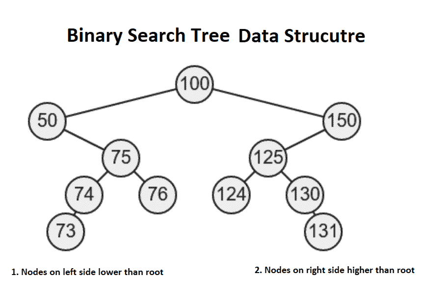
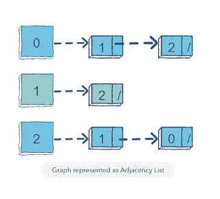
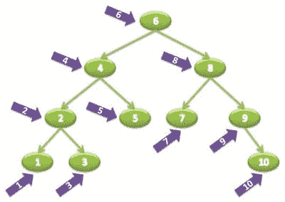

# 顺序遍历如何在二叉查找树中实现顺序遍历？

> 原文：<https://dev.to/javinpaul/how-to-implement-inorder-traversal-in-a-binary-search-tree-1787>

*披露:这篇文章包括附属链接；如果您从本文提供的不同链接购买产品或服务，我可能会收到报酬。*
[](https://www.java67.com/2019/07/top-10-online-courses-to-learn-data-structure-and-algorithms-in-java.html)
**有序**遍历是遍历二叉树数据结构的三种流行方式之一，另外两种是[前序](http://www.java67.com/2016/07/binary-tree-preorder-traversal-in-java-without-recursion.html)和[后序](http://www.java67.com/2016/10/binary-tree-post-order-traversal-in.html)。在有序遍历算法中，首先浏览左边的子树，然后是根，最后是右边子树上的节点。

你从根开始遍历，然后到左边的节点，然后再到左边的节点，直到你到达一个叶子节点。在那个时间点，您打印节点的值或标记它被访问并移到右边的子树。继续相同的算法，直到访问了二叉树的所有节点。InOrder 遍历也称为**左节点右**或**左根右**遍历或 **LNR** 遍历算法。

类似于[前序算法](http://www.java67.com/2016/07/how-to-implement-preorder-traversal-of-binary-tree-in-java.html)，它也是深度优先算法，因为它在探索兄弟之前探索二叉树的深度。因为它是基本的二叉树算法之一，所以在编程面试中很受欢迎。

这些遍历算法也是学习更高级的二叉树算法的基础，因此每个程序员都应该学习、理解和知道如何实现顺序和其他遍历算法。

在 Java 或任何编程语言中实现 inOrder 遍历算法的最简单方法是使用[递归](https://javarevisited.blogspot.com/2016/03/how-to-reverse-arraylist-in-java-using-recursion.html)。由于二叉树是一种递归数据结构，递归是解决基于树的问题的自然选择。BinaryTree 类中的 inOrder()方法实现了使用递归遍历二叉树的逻辑。

从访问的角度来看，InOrder 遍历是非常重要的，因为它也以排序顺序打印二叉查找树的节点，但前提是给定的树是[二叉查找树](http://javarevisited.blogspot.com/2015/10/how-to-implement-binary-search-tree-in-java-example.html)。如果您还记得，在 BST 中，左子树中节点的值低于根，而右子树中节点的值高于根。按顺序遍历的字面意思是按顺序，即票据按顺序或分类顺序打印。

顺便说一下，尽管这三种算法(前序、按序和后序)是流行的二叉树遍历算法，但它们不是唯一的。你也有其他广度优先的方法来遍历二叉树，例如层次顺序遍历(见[数据结构和算法:深度挖掘](https://click.linksynergy.com/fs-bin/click?id=JVFxdTr9V80&subid=0&offerid=323058.1&type=10&tmpid=14538&RD_PARM1=https%3A%2F%2Fwww.udemy.com%2Fdata-structures-and-algorithms-deep-dive-using-java%2F))。

[](https://click.linksynergy.com/fs-bin/click?id=JVFxdTr9V80&subid=0&offerid=323058.1&type=10&tmpid=14538&RD_PARM1=https%3A%2F%2Fwww.udemy.com%2Fdata-structures-and-algorithms-deep-dive-using-java%2F)

## 递归算法实现二叉树的有序遍历

顺序遍历的递归算法非常简单。你只需要按照你想要访问树的顺序调用 BinaryTree 类的 inOrder()方法。最重要的是包含基本情况，这是任何递归算法的关键。

例如，在这个问题中，基本情况是您到达了叶节点，没有更多的节点要探索，在那个时间点递归开始减速。下面是使用 InOrder 遍历来遍历二叉树的具体步骤:

1.  访问左侧节点
2.  打印根的值
3.  访问右节点\以下是使用递归在 Java 中实现该算法的示例代码:

```
private void inOrder(TreeNode node) {
    if (node == null) {
      return;
    }

    inOrder(node.left);
    System.out.printf("%s ", node.data);
    inOrder(node.right);
} 
```

<svg width="20px" height="20px" viewBox="0 0 24 24" class="highlight-action crayons-icon highlight-action--fullscreen-on"><title>Enter fullscreen mode</title></svg> <svg width="20px" height="20px" viewBox="0 0 24 24" class="highlight-action crayons-icon highlight-action--fullscreen-off"><title>Exit fullscreen mode</title></svg>

类似于最后一个例子中的[中的 preOrder()方法，还有另一个 inOrder()方法，它将 inorder 遍历公开，并调用这个私有方法来实际执行 InOrder 遍历。](http://javarevisited.blogspot.com/2016/07/binary-tree-preorder-traversal-in-java-using-recursion-iteration-example.html)

这是编写接受输入的递归方法的标准方式，它使得客户端调用该方法更容易。

```
public void inOrder() {
    inOrder(root);
} 
```

<svg width="20px" height="20px" viewBox="0 0 24 24" class="highlight-action crayons-icon highlight-action--fullscreen-on"><title>Enter fullscreen mode</title></svg> <svg width="20px" height="20px" viewBox="0 0 24 24" class="highlight-action crayons-icon highlight-action--fullscreen-off"><title>Exit fullscreen mode</title></svg>

您可以看到，我们从 root 开始，然后使用 node.left 递归调用 inOrder()方法，这意味着我们将沿着左侧子树向下，直到遇到 node == null，这意味着最后一个节点是叶节点。

此时，`inOrder()`方法将返回并执行下一行，打印 node.data。之后，它再次递归调用 inOrder()和 node.right，这将再次启动相同的过程。

您还可以查看 Pluralsight 上的[数据结构和算法第 1 部分和第 2 部分](https://pluralsight.pxf.io/c/1193463/424552/7490?u=https%3A%2F%2Fwww.pluralsight.com%2Fcourses%2Fads-part1)课程，以了解更多关于算法以及如何设计自己的算法的信息。

[](https://pluralsight.pxf.io/c/1193463/424552/7490?u=https%3A%2F%2Fwww.pluralsight.com%2Fcourses%2Fads-part1)

顺便说一句，你需要一个 Pluralsight 会员才能参加这个课程，费用大约是每月 29 美元或者每年[299 美元](https://pluralsight.pxf.io/c/1193463/424552/7490?u=https%3A%2F%2Fwww.pluralsight.com%2Fpricing)(节省 14%)。我有一个，我也建议所有开发人员都有这个计划，因为 Pluralsight 就像软件开发人员的网飞。

它有 5000 多门高质量的课程，涵盖所有最新的主题。因为我们程序员每天都要学习新的东西，所以 299 美元的投资是不错的。

顺便说一下，它还提供了 10 天的免费试用，没有任何义务，允许您观看 200 小时的内容。你可以通过注册 [10 天免费试用](http://pluralsight.pxf.io/c/1193463/424552/7490?u=https%3A%2F%2Fwww.pluralsight.com%2Flearn)来免费观看这些课程。

## Java 中二叉树的有序遍历

这是我们用 Java 实现的顺序遍历算法的完整解决方案。这个程序使用递归算法来打印一个二叉树的所有节点的值。

正如我之前告诉你的，在有序遍历过程中，首先打印左子树的值，然后是根和右子树。如果对迭代算法感兴趣，可以进一步查看这个[教程](http://javarevisited.blogspot.com/2016/08/inorder-traversal-of-binary-tree-in-java-recursion-iteration-example.html)实现无递归的顺序遍历。

```
import java.util.Stack;

/*
 * Java Program to traverse a binary tree
 * using inorder traversal without recursion.
 * In InOrder traversal first left node is visited, followed by root
 * and right node.
 *
 * input:
 *      40
 *     /\
 *    20   50
 *   / \\
 *  10  30   60
 * /   /\
 * 5  67  78
 *
 * output: 5 10 20 30 40 50 60 67 78
 */

public class Main {

  public static void main(String[] args) throws Exception {

    // construct the binary tree given in question
    BinaryTree bt = BinaryTree.create();

    // traversing binary tree using InOrder traversal using recursion
    System.out
        .println("printing nodes of binary tree on InOrder using recursion");

    bt.inOrder();
  }

}

class BinaryTree {
  static class TreeNode {
    String data;
    TreeNode left, right;

    TreeNode(String value) {
      this.data = value;
      left = right = null;
    }

  }

  // root of binary tree
  TreeNode root;

  /**
   * traverse the binary tree on InOrder traversal algorithm
   */
  public void inOrder() {
    inOrder(root);
  }

  private void inOrder(TreeNode node) {
    if (node == null) {
      return;
    }

    inOrder(node.left);
    System.out.printf("%s ", node.data);
    inOrder(node.right);
  }

  /**
   * Java method to create binary tree with test data
   *
   * @return a sample binary tree for testing
   */
  public static BinaryTree create() {
    BinaryTree tree = new BinaryTree();
    TreeNode root = new TreeNode("40");
    tree.root = root;
    tree.root.left = new TreeNode("20");
    tree.root.left.left = new TreeNode("10");
    tree.root.left.left.left = new TreeNode("5");

    tree.root.left.right = new TreeNode("30");
    tree.root.right = new TreeNode("50");
    tree.root.right.right = new TreeNode("60");
    tree.root.left.right.left = new TreeNode("67");
    tree.root.left.right.right = new TreeNode("78");

    return tree;
  }

} 
```

<svg width="20px" height="20px" viewBox="0 0 24 24" class="highlight-action crayons-icon highlight-action--fullscreen-on"><title>Enter fullscreen mode</title></svg> <svg width="20px" height="20px" viewBox="0 0 24 24" class="highlight-action crayons-icon highlight-action--fullscreen-off"><title>Exit fullscreen mode</title></svg>

使用递归输出
按顺序打印二叉树的节点
5 10 20 30 67 78 40 50 60

这就是关于**如何使用递归**在 Java 中实现二叉树的有序遍历。你可以看到代码非常类似于前序遍历，唯一的区别是我们递归调用方法的顺序。在这种情况下，我们首先调用 inOrder(node.left ),然后打印节点的值。

值得记住的是，按顺序遍历是一种深度优先算法，如果给定的二叉树是一个二叉查找树，则按排序顺序打印树节点。

在本文的下一部分，我将分享无递归的有序遍历，同时，您可以尝试练习以下数据结构和二叉树问题。

**进一步学习**
[数据结构和算法:深度学习使用 Java](https://click.linksynergy.com/fs-bin/click?id=JVFxdTr9V80&subid=0&offerid=323058.1&type=10&tmpid=14538&RD_PARM1=https%3A%2F%2Fwww.udemy.com%2Fdata-structures-and-algorithms-deep-dive-using-java%2F)
[算法和数据结构-第一部分和第二部分](https://pluralsight.pxf.io/c/1193463/424552/7490?u=https%3A%2F%2Fwww.pluralsight.com%2Fcourses%2Fads-part1)
[Java 9 中的数据结构由亨氏 Kabutz](https://learning.javaspecialists.eu/courses/data-structures?affcode=92815_johrd7r8)
[破解编码面试- 189 个问题及解决方案](http://www.amazon.com/Cracking-Coding-Interview-6th-Edition/dp/0984782850/?tag=javamysqlanta-20)
[破解编码面试:编码问题模式](https://www.educative.io/collection/5668639101419520/5671464854355968?affiliate_id=5073518643380224)
[100+程序员的数据结构和算法问题](http://www.java67.com/2018/06/data-structure-and-algorithm-interview-questions-programmers.html)

面向 Java 程序员的其他**数据结构和算法教程**

*   每个程序员都应该读的 10 本算法书([列举](http://www.java67.com/2015/09/top-10-algorithm-books-every-programmer-read-learn.html))
*   如何用 Java 实现快速排序算法？([解](http://javarevisited.blogspot.com/2014/08/quicksort-sorting-algorithm-in-java-in-place-example.html)
*   用 Java 学习数据结构和算法的 5 本书？([书籍](http://javarevisited.blogspot.com/2015/07/5-data-structure-and-algorithm-books-best-must-read.html)
*   如何用 Java 实现一个二分搜索法算法？([解](http://www.java67.com/2016/05/java-program-to-perform-binary-search-without-recursion.html)
*   如何找到整数数组上所有和等于给定一个数的对？([解](http://javarevisited.blogspot.sg/2014/08/how-to-find-all-pairs-in-array-of-integers-whose-sum-equal-given-number-java.html)
*   如何在 Java 中原地反转数组？([解](http://www.java67.com/2016/01/java-program-to-reverse-array-in-place.html)
*   如何在 Java 中不使用递归来反转一个链表？([解](http://www.java67.com/2016/07/how-to-reverse-singly-linked-list-in-java-example.html)
*   如何在 Java 中实现插入排序？([解](http://www.java67.com/2014/09/insertion-sort-in-java-with-example.html)
*   如何在 1 到 100 的数组中找到缺失的数字？([解](http://javarevisited.blogspot.sg/2014/11/how-to-find-missing-number-on-integer-array-java.html)
*   如何在 Java 中求单链表的长度？([解](http://javarevisited.blogspot.sg/2016/05/how-do-you-find-length-of-singly-linked.html)
*   15 常见数据结构与算法面试问题([列表](http://javarevisited.blogspot.com/2015/07/5-data-structure-and-algorithm-books-best-must-read.html))

如果你有任何改进这个算法的建议，请随时提出。面试官喜欢那些提出自己的算法或对流行算法有所触动的人。

**p . s .**——如果你不介意从免费资源中学习，那么你也可以看看我为 Java 开发者提供的[免费数据结构和算法课程](https://javarevisited.blogspot.com/2018/01/top-5-free-data-structure-and-algorithm-courses-java--c-programmers.html)列表。