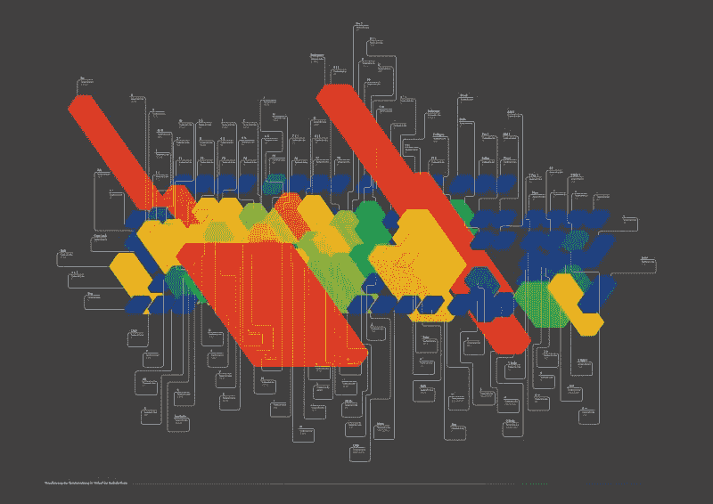

# 试用:VueJs 天

> 原文：<https://dev.to/david_j_eddy/trial-30-days-with-vuejs-59g4>

鉴于我在过去一年中的角色，加上编写代码已经被归入 IaC、bash 或 pipeline automation。虽然我仍然可以编写逻辑很好，但创造可供人们使用的东西的渴望仍然在我的脑海中挥之不去。考虑到过去十年左右的大部分时间都是在服务器端；React、VueJS、Angular 等技术与我擦肩而过。这并不是一个问题，我个人从未真正感兴趣。这主要是因为在 21 世纪初，开发人员不得不拼命地为 IE 和 Firefox 编写程序。我讨厌只为一个供应商重复代码。

因此，我在空闲时间一直在听/看 VueJS 的课程。正如你们许多人所知，我也在学习证书，所以 VueJS 的时间有限。在过去的 30 天里，我大概花了 40 个小时来研究 VueJS。

<figure> 

<figcaption>如果你感兴趣，这是键盘的关键用途。
资料来源[【http://chickart . de/portfolio-item/bachelor work-visualization-键盘使用-即时记录-插接板工作/](http://chickart.de/portfolio-item/bachelorarbeit-visualisierung-der-tastaturnutzung-im-verlauf-der-bachelorarbeit/)</figcaption>

T10】</figure>

## 为什么是 VueJS？(好的)

VueJS 有很多优点。

*   没有 JSX
*   非 FAANG 所有(脸书、亚马逊、苹果、网飞、谷歌)
*   积极参与的社区
*   性能，小尺寸，仅包括构建中所需的内容
*   最小设置开发/生产环境
*   IE 11 不支持，没有额外的负担，一个过时和死亡的浏览器
*   大型用户界面库选项

## 什么，真的！？(坏的)

虽然 VueJS 有其优点，但没有什么是完美的。开箱即用的最大难题之一是 var 数据的可访问性。函数调用函数调用属性调用函数。只是将原子数据传递给兄弟组件。(公平地说，许多前端框架都存在同样的访问问题。)

## 资源

鉴于我能够投入学习 VueJS 的时间和注意力有限，对我来说，最大限度地利用注意力非常重要。这里有一些非常有用的资源。

*   [https://www.udemy.com/vuejs-2-the-complete-guide](https://www.udemy.com/vuejs-2-the-complete-guide)
*   [vuej 指南](https://vuejs.org/v2/guide/)
*   [vuejos 示例](https://vuejs.org/v2/examples/)
*   [开发社区](https://dev.to/)
*   [初学者学习 Vue Js 的顶级教程](https://medium.com/quick-code/top-tutorials-to-learn-vue-js-for-beginners-6c693e41091d)
*   拉腊卡斯特

Javascript，也许没那么糟糕...

## 结果

经过大约 40 个小时的关注和努力，一些实践和对社区的接触，我认为 VueJS 值得一看。它灵活而不杂乱，强大而不复杂，流行而不令人窒息。如果可以作为一部分或整体包含在几乎任何标准的 web 或原生应用程序中，移动原生 VueJS 应用程序有谁？使 VueJS 更加完善的是 performant，它的采用率正在上升。

如果另一个选项已经存在并且正在工作，我会用它来交换另一个选项吗？不，当然不是。如果有机会，我会为一个新特性或项目选择 VueJS 吗？是的，是的，我会的。