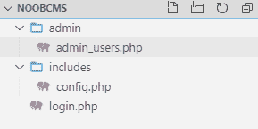
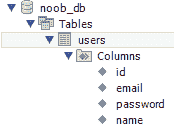
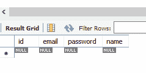
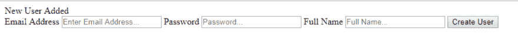
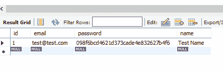
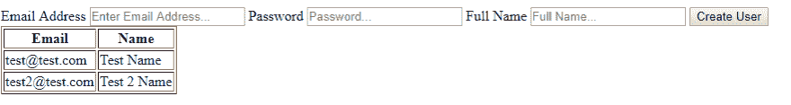
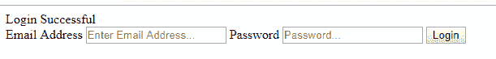

# Noob CMS:登录/用户 Noob 版本

> 原文：<https://dev.to/th3n00bc0d3r/the-noob-cms-login-users-noob-version-1ae2>

让我们在您的 Web 服务器中创建一个空文件夹，并创建以下文件；

**无短信**

[](https://res.cloudinary.com/practicaldev/image/fetch/s--ACAoIPFN--/c_limit%2Cf_auto%2Cfl_progressive%2Cq_auto%2Cw_880/https://thepracticaldev.s3.amazonaws.com/i/l51ez2mwxb8g9vw46kxh.png)

在 PHPMyAdmin 或 MySQL Workbench 中创建以下数据库结构，我们的数据库名称是 **noob_db** _

[](https://res.cloudinary.com/practicaldev/image/fetch/s--YtLuiVsL--/c_limit%2Cf_auto%2Cfl_progressive%2Cq_auto%2Cw_880/https://thepracticaldev.s3.amazonaws.com/i/4410m9oi1trcfow25ng6.png)

[](https://res.cloudinary.com/practicaldev/image/fetch/s--DKh89pz0--/c_limit%2Cf_auto%2Cfl_progressive%2Cq_auto%2Cw_880/https://thepracticaldev.s3.amazonaws.com/i/reyzaeirp46009iwpdpm.png)

[](https://res.cloudinary.com/practicaldev/image/fetch/s--IreXEe7V--/c_limit%2Cf_auto%2Cfl_progressive%2Cq_auto%2Cw_880/https://thepracticaldev.s3.amazonaws.com/i/e5n3zdfidtvpnj5qx413.png)

我们的配置文件应该是这样的
**config.php**

```
<?php
    //CREATE SESSTION
    session_start();

    //TIMEZONE
    date_default_timezone_set('Asia/Karachi');

    //SITE PATH
    define('SITE', 'http://localhost/noobcms/');

    //DATABASE CREDENTIALS
    define('DBHOST', 'localhost');
    define('DBUSER', 'root');
    define('DBPASS', '');
    define('DBNAME', 'noob_db');

    //CREATE CONNECTION
    $conn = mysqli_connect(DBHOST, DBUSER, DBPASS, DBNAME);

    //CHECK CONNECTION
    if (!$conn) {
        die("Connection failed: ".mysqli_connect_error());
    }
?> 
```

<svg width="20px" height="20px" viewBox="0 0 24 24" class="highlight-action crayons-icon highlight-action--fullscreen-on"><title>Enter fullscreen mode</title></svg> <svg width="20px" height="20px" viewBox="0 0 24 24" class="highlight-action crayons-icon highlight-action--fullscreen-off"><title>Exit fullscreen mode</title></svg>

**admin_users.php**

```
<?php
    include("../includes/config.php");

    if (isset($_POST['btnCreateUser'])) {
        $email  = $_POST['email'];
        $pass   = $_POST['pass'];
        $name   = $_POST['name'];

        $sql = "SELECT * FROM users WHERE email = '$email'";
        if ($result = $conn->query($sql)) {
            if ($result->num_rows == 0) {
                //Email Address Doesnt Exists
                //Add User to Database
                $pass   = md5($pass); //We are Encrypting Password with MD5 Hash
                $addSQL = "INSERT INTO users (email, password, name) VALUES ('$email', '$pass', '$name')";
                $conn->query($addSQL);

                echo "New User Added";
            } else {
                //Email Address Already Exists
                echo "Email Address Already Exists";
            }
        }
    }
?>
    <head>
        <meta charset="UTF-8">
        <title>Admin: Users</title>
    </head>

    <body>
        <div>
            <form action="" method="POST">
                <label>Email Address</label>
                <input name="email" type="text" placeholder="Enter Email Address..." />

                <label>Password</label>
                <input name="pass" type="password" placeholder="Password..." />

                <label>Full Name</label>
                <input name="name" type="text" placeholder="Full Name..." />

                <button name="btnCreateUser">Create User</button>
            </form>
        </div>

        <div>
            <table border="1">
                <thead>
                    <tr>
                        <th>Email</th>
                        <th>Name</th>
                    </tr>
                </thead>
                <tbody>
                    <?php
                        $userResult = $conn->query('SELECT * FROM users');
                        if ($userResult->num_rows != 0) {
                            while ($row = $userResult->fetch_array()) {
                                ?>
                                <tr>
                                    <td><?php echo $row["email"];?></td>
                                    <td><?php echo $row["name"];?></td>
                                </tr>
                                <?php
                            }
                        }
                    ?>
                </tbody>
            </table>
        </div>
    </body> 
```

<svg width="20px" height="20px" viewBox="0 0 24 24" class="highlight-action crayons-icon highlight-action--fullscreen-on"><title>Enter fullscreen mode</title></svg> <svg width="20px" height="20px" viewBox="0 0 24 24" class="highlight-action crayons-icon highlight-action--fullscreen-off"><title>Exit fullscreen mode</title></svg>

现在如果你在浏览器中运行这个文件

[](https://res.cloudinary.com/practicaldev/image/fetch/s--WHT2nNRK--/c_limit%2Cf_auto%2Cfl_progressive%2Cq_auto%2Cw_880/https://thepracticaldev.s3.amazonaws.com/i/uvehgmwl3blbh6xzfod2.png)

[](https://res.cloudinary.com/practicaldev/image/fetch/s--HFx52pXC--/c_limit%2Cf_auto%2Cfl_progressive%2Cq_auto%2Cw_880/https://thepracticaldev.s3.amazonaws.com/i/scmxf3bihyi8uae1ijvb.png)

[](https://res.cloudinary.com/practicaldev/image/fetch/s--E7oEoLIE--/c_limit%2Cf_auto%2Cfl_progressive%2Cq_auto%2Cw_880/https://thepracticaldev.s3.amazonaws.com/i/so5a0kwnikk48p413s4i.png)

**login.php**T2】

```
<?php
    include("includes/config.php");

    if (isset($_POST['btnLogin'])) {
        $email  = $_POST['email'];
        $pass   = md5($_POST['pass']);

        $sql = "SELECT * FROM users WHERE email = '$email' AND password = '$pass'";
        if ($result = $conn->query($sql)) {
            if ($result->num_rows == 1) {
                echo "Login Successful";
            } else {
                echo "Invalid Credentials";
            }
        }
    }
?>

    <head>
        <meta charset="UTF-8">
        <title>Login</title>
    </head>

    <body>
        <div>
            <form action="" method="POST">
                <label>Email Address</label>
                <input name="email" type="text" placeholder="Enter Email Address..." />

                <label>Password</label>
                <input name="pass" type="password" placeholder="Password..." />

                <button name="btnLogin">Login</button>
            </form>            
        </div>
    </body> 
```

<svg width="20px" height="20px" viewBox="0 0 24 24" class="highlight-action crayons-icon highlight-action--fullscreen-on"><title>Enter fullscreen mode</title></svg> <svg width="20px" height="20px" viewBox="0 0 24 24" class="highlight-action crayons-icon highlight-action--fullscreen-off"><title>Exit fullscreen mode</title></svg>

[](https://res.cloudinary.com/practicaldev/image/fetch/s--h_HOD_Cz--/c_limit%2Cf_auto%2Cfl_progressive%2Cq_auto%2Cw_880/https://thepracticaldev.s3.amazonaws.com/i/z764v9deqn890n9tpzpm.png)

您可以从下面的 Git
中获得代码

## [th3n 00 BC 0 d3r](https://github.com/th3n00bc0d3r)/[noobcms _ log in](https://github.com/th3n00bc0d3r/noobcms_login)

### Noob CMS 登录和用户管理版本

<article class="markdown-body entry-content container-lg" itemprop="text">

# noobcms _ log in-noobcms 登入

Noob CMS 登录和用户管理版本

</article>

[View on GitHub](https://github.com/th3n00bc0d3r/noobcms_login)

[Noob 指数](https://dev.to/th3n00bc0d3r/noob-guides-index-4mne)