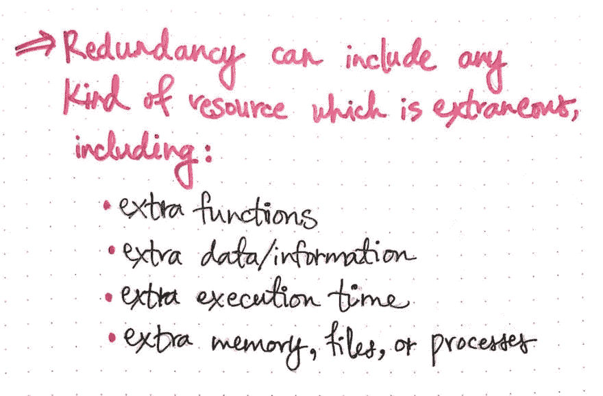
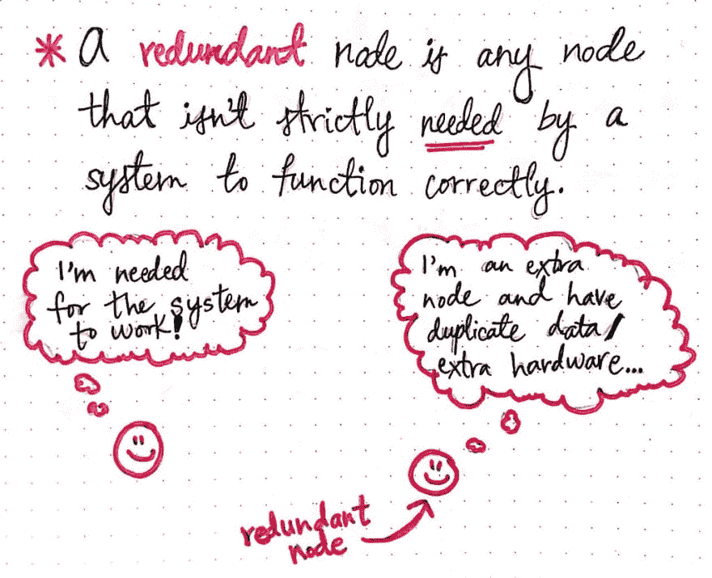
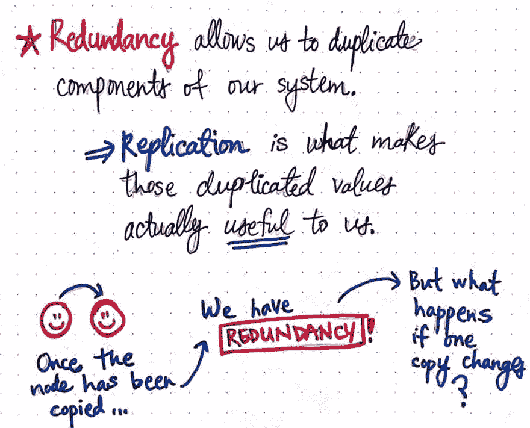
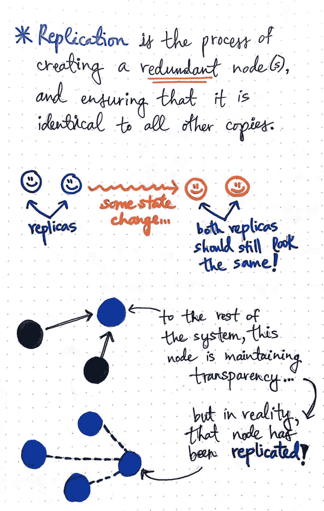
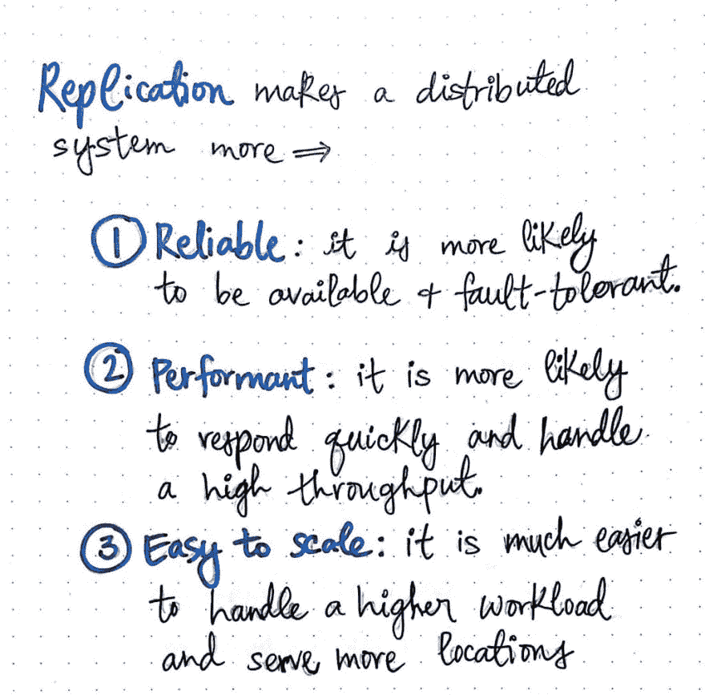
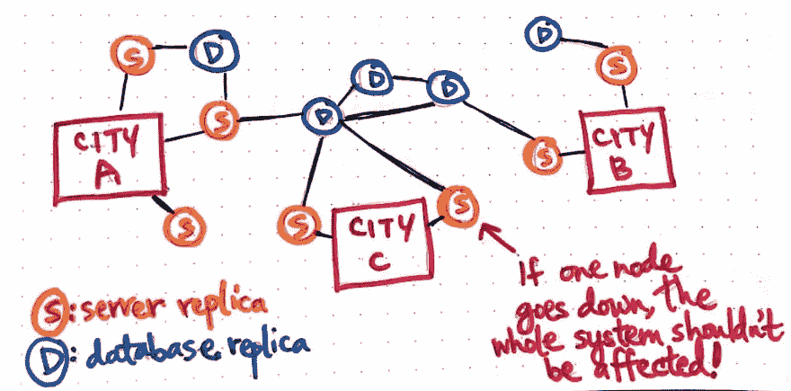
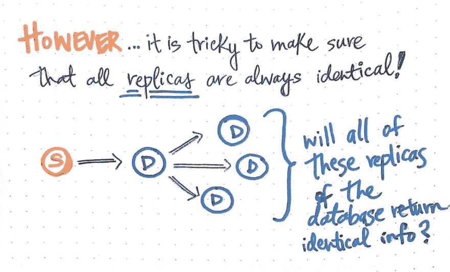
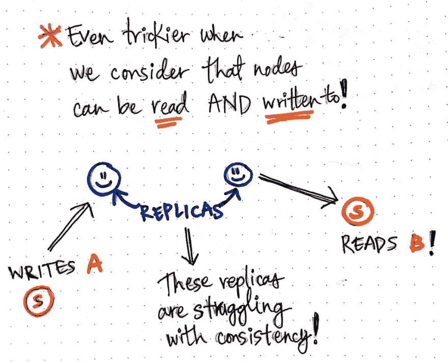

# 冗余和复制:分布式系统中的复制

> 原文：<https://dev.to/vaidehijoshi/redundancy-and-replication-duplicating-in-a-distributed-system-p73>

当谈到编程时，作为一个社区，我们经常会遇到和引用某些约定、习惯用法和原则。其中一个原则就是“不要重复自己”，简称 DRY。在我编程生涯的早期，我遇到了这个想法，当时对我来说它看起来很简单:为了保持干净、简洁的代码，确保在我们的代码库中不重复相同的行或逻辑是很重要的。

但是在我的职业生涯中，我学到了更多，看到了更多，并意识到重复并不是那么简单——没有双关语的意思！有时候，冒着不必要的过度设计或过度抽象的风险重复自己确实是有意义的。有时，复制一个函数或一段逻辑，并把它“复制”到另一个文件中是有意义的。

当涉及到分布式系统时，拥有许多相同的东西往往很有意义！事实上，当我们开始将复制视为分布式计算中的一个概念时，重复我们自己实际上对我们的系统整体来说是一个巨大的好处就变得越明显。因此，让我们深入研究分布式系统中的复制，并尝试理解我们为什么想要这样做。

### 重复:有时候是好事？

当我们在分布式计算领域谈论“重复自我”时，我们可以指许多不同的事情。一行代码或一段逻辑的重复通常表明我们有不止一件事情是不必要的。在分布式系统中，我们对此有一个专门的术语叫做 ***冗余*** ，它是系统中所有系统实际运行不需要的资源。

<figure> 

<figcaption>冗余可以包括哪些？</figcaption>

</figure>

然而，在分布式计算中，我们可能有大量不同的资源，这意味着我们有许多不同的东西可能会重复！因此，冗余可能包含许多不同种类的外部资源。

例如，从系统的不同位置重复调用同一个函数，或者对相同数据的重复引用/变量都是冗余的形式。类似地，函数中重复的执行时间以及额外的内存、文件或进程也是多余的，因为系统实际上并不需要这些重复的资源来正常运行。

出于本系列的目的，我们将关注额外内存、文件或进程上下文中的冗余，这通常被称为 ***结构冗余*** 。在分布式系统的上下文中，一些额外的内存或文件(读:一个数据库)或额外的进程都可以被抽象成一个我们已经熟悉的术语[:节点。](https://dev.to/vaidehijoshi/many-nodes-one-distributed-system-kl9)

<figure> 

<figcaption>冗余节点:一个定义。</figcaption>

</figure>

冗余节点是分布式系统正常运行不一定需要的任何节点。换句话说，任何增加系统最低功能的节点都是无关的，因此我们可以说它是冗余的。

嗯，等一下——如果我们更深入地思考一下，我们可能会意识到我们在分布式系统中复制了很多东西！在本系列中，我们已经讨论了向系统中相当松散地添加节点，但是我们添加的所有节点不可能都是系统所必需的，对吗？那么，我们为什么还要费心添加冗余节点呢？为什么会有人想在他们的系统中显式地、故意地冗余呢？好吧，为了真正回答这个问题，我们需要从冗余这个更大的概念转移到复制这个更具体的主题。_

<figure> 

<figcaption>冗余 vs 复制</figcaption>

</figure>

虽然冗余允许我们复制系统的组件，但复制本身并不真正有用。

> 如果冗余节点与从复制到*的节点不同步，冗余实际上对我们没有帮助。*

一个冗余节点本身并不那么有用；当然，我们已经实现了冗余，但是谁知道冗余节点在我们的系统中实际上还能工作多久呢？如果其中一个节点的值或状态发生变化，会发生什么情况？事实证明，这两个问题的答案都是复制！当我们在系统中复制一个节点时，这些重复的副本实际上对我们来说变得更加有用。

### 复制并保持状态

复制作为一个概念很像冗余的子集。这两种方法都涉及到在系统中创建冗余节点——这些节点并不是系统正常工作所必需的。

但是， ***复制*** 对冗余节点更进一步；它确保冗余节点(一个 ***副本*** )与其所有其他副本完全相同。乍一看，这似乎很简单，甚至是显而易见的；我们甚至可以假设一个从其他地方复制过来的节点将会和它被复制的地方是一样的，对吗？

<figure> 

<figcaption>复制节点:一个定义</figcaption>

</figure>

嗯，不一定！实际上，假设我们复制了一个节点，创建了一个冗余节点。但是后来，我们改变了原始节点的一些东西——也许我们改变了它的状态、它包含的一些值或者一些内部行为。冗余节点会发生什么情况？嗯…没什么！

如果我们只创建了一个简单的冗余节点，我们的系统中没有任何东西可以确保冗余节点 1)知道发生了变化，2)自我更新或被其他人更新以获得正确的状态。

所以也许这个问题并没有我们最初想的那么明显！复制试图解决这个问题，因为它确保一个节点的所有副本彼此完全相同，并且与复制它们的原始节点相匹配。(补充说明:关于*如何确保这一点的问题并不容易，但我们将在本系列的稍后部分了解更多……)*

这里需要注意的另一件重要的事情是，复制与透明性(T2、T3)密切相关，透明性是我们已经熟悉的概念。对于添加到系统中的每个副本，系统的其余部分仍应正常工作，并且理想情况下应该不知道任何已创建的副本。

> 如果一个副本被更新，系统的其他部分不应该知道，如果一个节点被复制，系统的其他部分也不应该关心。

例如，如果复制了一个 web 服务器或数据库节点，那么分布式系统的最终用户不应该知道正在与副本或原始节点进行交互。(事实上，他们可能根本不知道*是一个复制节点！)*

当这种透明性主要在系统中保持时，复制为我们提供了很多好处:

<figure> 

<figcaption>在分布式系统中使用复制的一些好处。</figcaption>

</figure>

1.  节点的复制使得我们的系统更加可靠。 如果一个节点发生故障，而我们已经添加了副本，那么副本更有可能介入并完成故障节点的工作。这使得我们的系统更加[容错](https://dev.to/vaidehijoshi/fantastic-faults-and-what-to-call-them-2djb)。有了副本，我们的系统[也变得更加可用](https://dev.to/vaidehijoshi/ready-and-available-distributed-systems-bck)，因为总的来说有更多的备份副本来代替另一个节点，这意味着我们的系统不应该经历太多的停机时间。
2.  节点的复制也使我们的系统更具*。有了更多的副本，我们现在能够做更多的工作，满足更多的请求，并处理更多的数据。这使得我们的系统总体上更快，减少了延迟，并允许系统处理必须处理/交付的高吞吐量数据。*
**   节点的复制使得我们的系统更容易扩展*。在构建分布式系统时，可伸缩性是[的一大优势](https://dev.to/vaidehijoshi/scalability-growing-a-system-in-different-directions-485j)，但这并不总是容易实现的。有了更多的复制节点，通过根据系统需求添加更多的数据库、服务器或服务来扩展系统变得更加容易。当我们可以复制一个节点并将其放置在不同的洲或国家以帮助扩展特定位置的高工作负载时，在地理上扩展系统也更容易。**

 **<figure> 

<figcaption>通过复制实现可靠性、性能和可扩展性</figcaption>

</figure>

至此，希望我们都同意复制的想法(对吗？).这很酷，几乎每个分布式系统都将利用这一概念来帮助处理可靠性、性能和容错问题。无论是工作人员、服务器、数据库还是服务，作为开发人员，我们可能在日常生活中都与副本打交道！听起来很棒，对吧？

嗯，差不多了。故事并没有到此结束。复制是令人敬畏的，但它也给自己带来了一些独特的挑战。我不能在这篇文章中承诺任何解决方案(不要担心，随着系列文章的继续，我们会更多地讨论这个问题)，但最起码，我会向你提出一些问题。😉

### 一致头疼

除了透明性之外，复制的概念还需要另外一个东西才能真正发挥作用:*。为了使副本实际上与系统中的所有其他副本保持同步，它需要与其他副本保持一致。这不是一个微不足道的任务！*

 *<figure> 

<figcaption>是什么让复制变得艰难？</figcaption>

</figure>

现在也许，乍一看，这似乎并不太难。也许我们总是可以让副本从原始副本获取更新？或者，当其他东西发生变化时，原始副本可以告诉副本？然而，这比听起来要复杂。

<figure> 

<figcaption>当复制品改变状态时，保持一致性是一件非常困难的事情！</figcaption>

</figure>

我们之前了解到，系统也必须是透明的，复制才能工作。[透明性](https://dev.to/vaidehijoshi/transparency-illusions-of-a-single-system-part-1-17ao)在[系统](https://dev.to/vaidehijoshi/transparency-illusions-of-a-single-system-part-2-lbb)中，意味着所有副本和原始节点必须行为相似，这意味着系统的消费者(如终端用户或另一个节点)可能会写入一个副本，而系统的另一个消费者可能会读取 _another _replica！

因此，当涉及到我们的节点的状态时，我们不能再仅仅依赖原始节点作为我们唯一的事实来源。当然，这里的问题是，我们如何告诉这两个复制品刚才发生了什么？被读取的副本需要知道最近的写入；同样，被写入的副本需要分散有关该写入的信息。

这正是复制如此困难的原因；我们必须解决一致性问题，并找出一种模式来确保我们的所有副本。幸运的是，我们将在后面更详细地介绍这一点。现在，我们只需要知道这是一个我们必须尽快解决的问题。那就尽情复制你们的小心脏吧！

### 资源

理解复制和冗余是理解分布式系统如何发展的关键一步。本系列中的主题将继续建立在复制的思想上，因此完全理解它是很重要的。如果你正在寻找更多的资源，下面列出的是一些很好的起点(或者继续学习！).

1.  [冗余和复制:系统级容错](https://pdfs.semanticscholar.org/87dc/8e839af0633b9f2968a669c5af70453cfe0b.pdf)，Kurt Kanzenbach
2.  [分布式系统:复制](http://www8.cs.umu.se/kurser/5DV147/HT15/lectures/l8-handouts.pdf)，于默奥大学
3.  [分布式系统中的复制](https://www.uio.no/studier/emner/matnat/ifi/INF5040/h16/pensumliste/replication.pdf)，罗曼·维滕贝格
4.  [分布式系统:复制和一致性](https://www.cs.helsinki.fi/webfm_send/1256)，Jussi Kangasharju
5.  [了解数据库和分布式系统中的复制](http://csis.pace.edu/~marchese/CS865/Papers/wiesmannWPS+00.pdf)，斯基珀&阿朗索

* * ****