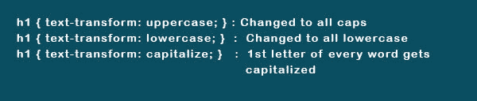
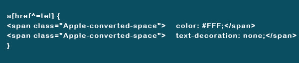

# 你必须知道的 17 个重要的 CSS 技巧

> 原文：<https://dev.to/stevegeorge/17-important-css-tips-that-you-must-be-aware-of-54po>

CSS 是一个广阔的领域。作为一个初学者，你需要熟悉那些能帮助你毫不费力地完成你所选择的设计的技巧和技术。这篇文章将带你了解一些行之有效的 CSS 技巧来开始设计。

## 你必须知道的重要 CSS 窍门

### 1)用“绝对定位”控制网元素的精确位置

通过“绝对”定位，你可以控制你的站点上任何元素的位置。指定以“上”、“下”、“右”或“左”开头的像素值，以控制位置。

例:
位置:绝对；
底部:30px
左:30px

这个 CSS 使元素保持在浏览器底部上方 30px，左侧 30px。绝对定位可以在 div 中使用。

### 2)选择选择器的每个元素

对于给定的选择器，可以用*选择所有元素。例如，如果在添加 CSS 样式之前使用*p，那么文档中的每个元素都将使用

标签将被选中。你可以很容易地选择网站的一部分。

### 3)覆盖其他 CSS 样式

您必须小心使用，因为如果经常使用，可能会出现潜在的问题。为了覆盖特定的 CSS 样式，您需要将一个！作为 CSS 样式的后缀很重要。

。h1 部分{颜色:蓝色！重要；}
以上将特定站点部分的 H1 标题渲染为蓝色而不是红色。

### 4)居中 CSS 项

居中基于以居中方式对齐的 CSS 内容。您可以使用“text-align:center；”将文本居中。将“居中”替换为右对齐或左对齐，以进行特定对齐。
通过添加 block 属性，可以使“div”或其他元素居中。之后，您可以使用自动边距。

div1 {
显示:block
保证金:自动；
宽度:100%以下的任何东西；
}

“100%以下”对于没有设置宽度的目标元素(如 55%或 250 像素)非常重要。

### 5)垂直对齐单行文本

主要在 CSS 菜单导航中使用，你必须使菜单的高度与文本的行高相同。
。导航 li{
行高:50px
身高:50px
}

### 6)添加悬停效果

通过添加:hover to CSS，当鼠标悬停在元素上时，可以改变元素的样式。你可以用它来改变颜色，字体大小或重量等。文本链接，图标，按钮，部分等。
举例:
。条目 H2 {
font-size:36px；
颜色:# 000；
font-weight:800；
}

。条目 H2:hover {
color:# f00；
}

### 7)用过渡来缓和变化

使用悬停效果时，您可能不希望元素突然发生变化。为了使更改在一段时间内变得容易，您需要使用 transition 属性。
举例:
。参赛作品 H2:hover {
color:# f00；
过渡:全 0.4s 缓和；
}
现在，变化将在 0.4 秒的时间范围内发生。这会让眼睛放松。

### 8)使用“最大宽度”调整图像大小

当您需要通过比例缩放使图像适合给定的宽度时，请考虑使用“最大宽度”。img {
最大宽度:100%；
身高:汽车；
}
这意味着图像的最大宽度将是 100%。通过将图像的宽度考虑在内，高度可以自动计算出来。

### 9)控制截面的元素

当你的目标是你的博客或任何指定部分的图像时，你需要使用 class option 并把它包含在原始选择器中。现在，将选择指定部分中使用的图像。其他图像，如徽标、侧边栏图片、社交媒体图标等。不会被选中。

例子:
。博客 img{
最大宽度:100%；
身高:汽车；
}

### 10)将 CSS 应用于选择器或类

假设你想在边栏、所有图片和博客部分放置相同的边框类型。要重复这个动作，你不需要写三次类似的 CSS。您必须指定用逗号分隔/使用的元素。
Ex:
。博客，img，。侧边栏{
border:1px solid # 000；
}

这个技巧被许多著名的网页设计公司用来用 CSS 开发网站。

### 11)解决布局&填充相关问题

为了使你的网页设计避开填充或布局问题，使用“框大小:边框”。在将一个盒子设置为给定的宽度并添加填充后，你会发现盒子的尺寸会因为填充而增加。您可以使用“框大小:边框-框”来恢复大小的增加。以盒子的实际尺寸为准。

### 12)插入可控元素

使用“内容”CSS 属性，您可以插入可控元素。例如，图标可以从字体图标插入到给定的位置。要插入的文本必须用“引号”括起来。

### 13)重置浏览器的 CSS 设置

各种浏览器的默认 CSS 设置是不同的。为了确保一致性和标准基数，必须统一重置它们。不需要的边框、预设边距、行高、列表样式、填充等。可以去掉。

### 14)使用首字下沉

CSS 的另一个技巧是用 element ':first-letter '轻松创建引人注目的首字下沉。
Ex:
p:首字母{
显示:block
浮动:左；
margin:4px；
颜色:# f00
字体大小:400%；
}

该字母现在被设置为后面字母大小的 4 倍。为了防止重叠，在字母周围提供了 4px 的空间。字母颜色设置为红色。

### 15)强制文本改变大小写

如果你的整个博客都是用大写字母发布的，你可能也想用小写字母和间断的大写字母来表达。你不需要重打。相反，您可以在样式表中使用固定的 CSS 样式来强制文本更改其“大小写”格式。
举例:

在上面的例子中，h1 标题标签已经被定位。

### 16)用特定部分填充整个屏幕

当一个部分必须被用来填充整个浏览器屏幕而不管它的大小时，你必须使用 vh(视图(v)高度(h))。vh 前的百分比表示您想要填充的浏览器屏幕的大小。为了适应静态导航菜单，您可能希望将该值设置为 85%。

为了应用 vh 金额，您需要为容器构建一个类。必须调整给定的媒体查询，使其值适合特定的屏幕或手机方向。如果图像处于横向模式，拉伸它以适合纵向屏幕会导致其美学价值丧失。
。full height { height:85vh；}

### 17)造型手机链接

假设，你已经放置了一个链接，当用户点击这个链接时，你可能会在它的样式上遇到问题。这是因为用于活动线路选项的传统选择器变得无效。你必须使用 CSS3 格式来克服这个问题。

示例:

T3】

## 结论

到目前为止，您已经熟悉了适用于初学者的流行技巧。对于初学者来说，CSS 是非常有趣的，只要你投入大量的时间和精力去学习 CSS 的复杂性。