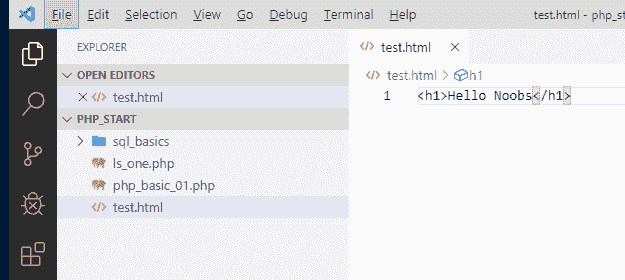
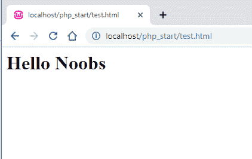

# HTML Noob 基础知识

> 原文：<https://dev.to/th3n00bc0d3r/html-noob-basics-405c>

## 什么是超文本标记语言？

它是一种用 **< >** 标签表示的语言。HTML 是我们决定什么是粗体、斜体、两端对齐的段落和图片的地方。

[](https://res.cloudinary.com/practicaldev/image/fetch/s--PSZCVxj1--/c_limit%2Cf_auto%2Cfl_progressive%2Cq_auto%2Cw_880/https://thepracticaldev.s3.amazonaws.com/i/rv6gh7mag3aux2kij2pa.png)

让我们把它付诸行动，在 php_start 目录中创建一个 test.html 文件，我们一直遵循。编写下面这段代码。

```
<h1>Hello Noobs</h1> 
```

<svg width="20px" height="20px" viewBox="0 0 24 24" class="highlight-action crayons-icon highlight-action--fullscreen-on"><title>Enter fullscreen mode</title></svg> <svg width="20px" height="20px" viewBox="0 0 24 24" class="highlight-action crayons-icon highlight-action--fullscreen-off"><title>Exit fullscreen mode</title></svg>

[](https://res.cloudinary.com/practicaldev/image/fetch/s--iUkiT0vG--/c_limit%2Cf_auto%2Cfl_progressive%2Cq_auto%2Cw_880/https://thepracticaldev.s3.amazonaws.com/i/krdngi5tpusg4m2xq9qx.png)

现在让我们运行文件，太好了。

这是一个标题标签，它以

# 并以正斜杠结束

下面是一个合适的 html 文件如何开始的

```
<!DOCTYPE html>
<html lang="en">
   <head>
     <title>Page Title</title>
   </head>

   <body>
      <h1>This is a Heading</h1>
      <p>This is a paragraph.</p>
      <p>This is another paragraph.</p>
   </body>
</html> 
```

<svg width="20px" height="20px" viewBox="0 0 24 24" class="highlight-action crayons-icon highlight-action--fullscreen-on"><title>Enter fullscreen mode</title></svg> <svg width="20px" height="20px" viewBox="0 0 24 24" class="highlight-action crayons-icon highlight-action--fullscreen-off"><title>Exit fullscreen mode</title></svg>

*   **T2！DOCTYPE html >** 这定义了这是现在的 html5(它是 HTML 的最新版本)
*   这定义了它是我们启动文件的基础，我们也在其中定义了语言。
*   这部分是我们定义标题、添加样式、添加脚本和添加文件元的地方，在这里我们得到搜索引擎优化的页面。
*   通过设计我们想要展示的东西，一切都变得美丽。

现在让我们看看更多的代码

```
//LINKS
<a href="url">link text</a>

//IMAGES


//LISTS
<ul>
  <li>Happy</li>
  <li>Still Happy</li>
  <li>Way Happy</li>
</ul>

//PARAGRAPHS
<p>This is the Noob World</p>

//EMBED YOUTUBE
<iframe width="500" height="500" src="https://www.youtube.com/watch?v=dT4A3rttrs8" /> 
```

<svg width="20px" height="20px" viewBox="0 0 24 24" class="highlight-action crayons-icon highlight-action--fullscreen-on"><title>Enter fullscreen mode</title></svg> <svg width="20px" height="20px" viewBox="0 0 24 24" class="highlight-action crayons-icon highlight-action--fullscreen-off"><title>Exit fullscreen mode</title></svg>

[Noob 指数](https://dev.to/th3n00bc0d3r/noob-guides-index-4mne)