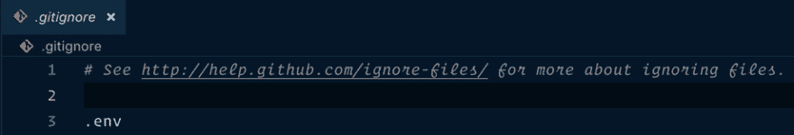

# 以优雅的方式存储 Node.js 应用程序的配置设置。

> 原文：<https://dev.to/shimjudavid/storing-config-settings-of-a-node-js-application-1d48>

这篇文章解释了如何存储 node.js 应用程序的配置设置，以及如何根据不同的环境覆盖每个设置。例如，在开发环境中，我们将使用与生产环境中不同的数据库和邮件服务器。

## 使用. env 文件

如何组织和维护环境变量的一个流行的解决方案是使用. env 文件。我真的很喜欢这项技术，因为它让我有一个可以快速阅读和修改它们的地方变得超级简单。

**自定义环境包:**

Custom env 是一个库，通过允许多个。不同环境的环境配置。这是通过将环境变量从. env.env 名称文件加载到节点的 process.env 对象中来实现的。

```
npm i custom-env 
```

<svg width="20px" height="20px" viewBox="0 0 24 24" class="highlight-action crayons-icon highlight-action--fullscreen-on"><title>Enter fullscreen mode</title></svg> <svg width="20px" height="20px" viewBox="0 0 24 24" class="highlight-action crayons-icon highlight-action--fullscreen-off"><title>Exit fullscreen mode</title></svg>

把这个放在你的申请的顶部

```
// this will load .env file which is default dev mode
require('custom-env').env() 

// OR  this will load .env.staging file 
require('custom-env').env('staging')

// OR this will load .env.production file
require('custom-env').env('production')   

//OR this will load the current environment dynamically, but default to dev mode.
require('custom-env').env(true) 
```

<svg width="20px" height="20px" viewBox="0 0 24 24" class="highlight-action crayons-icon highlight-action--fullscreen-on"><title>Enter fullscreen mode</title></svg> <svg width="20px" height="20px" viewBox="0 0 24 24" class="highlight-action crayons-icon highlight-action--fullscreen-off"><title>Exit fullscreen mode</title></svg>

默认情况下，这将从。env 文件，并假设应用程序处于开发环境模式(dev)。

在应用程序的根目录下创建一个. env 文件，并在新的一行中添加每个环境变量:

```
APP_ENV=dev
DB_HOST=localhost
DB_USER=root
DB_PASS=root 
```

<svg width="20px" height="20px" viewBox="0 0 24 24" class="highlight-action crayons-icon highlight-action--fullscreen-on"><title>Enter fullscreen mode</title></svg> <svg width="20px" height="20px" viewBox="0 0 24 24" class="highlight-action crayons-icon highlight-action--fullscreen-off"><title>Exit fullscreen mode</title></svg>

简单！process.env 现在加载了上面的环境变量。

```
//index.js
console.log(process.env.APP_ENV)
console.log(process.env.DB_HOST)
console.log(process.env.DB_USER)
console.log(process.env.DB_PASS)

/* output
dev
localhost
root
root
*/ 
```

<svg width="20px" height="20px" viewBox="0 0 24 24" class="highlight-action crayons-icon highlight-action--fullscreen-on"><title>Enter fullscreen mode</title></svg> <svg width="20px" height="20px" viewBox="0 0 24 24" class="highlight-action crayons-icon highlight-action--fullscreen-off"><title>Exit fullscreen mode</title></svg>

现在创建另一个。登台环境的环境

在应用程序的根目录中创建一个. env.staging 文件，并在新行中添加每个环境变量:

```
.env.staging
APP_ENV=staging
DB_HOST=staging.emaxsoftware.com
DB_USER=stage_user
DB_PASS=state_pwd 
```

<svg width="20px" height="20px" viewBox="0 0 24 24" class="highlight-action crayons-icon highlight-action--fullscreen-on"><title>Enter fullscreen mode</title></svg> <svg width="20px" height="20px" viewBox="0 0 24 24" class="highlight-action crayons-icon highlight-action--fullscreen-off"><title>Exit fullscreen mode</title></svg>

如果要从特定环境加载，请使用:

```
//index.js
// This loads configuration from staging environment
require('custom-env').env('staging') 
```

<svg width="20px" height="20px" viewBox="0 0 24 24" class="highlight-action crayons-icon highlight-action--fullscreen-on"><title>Enter fullscreen mode</title></svg> <svg width="20px" height="20px" viewBox="0 0 24 24" class="highlight-action crayons-icon highlight-action--fullscreen-off"><title>Exit fullscreen mode</title></svg>

我们可以使用终端设置环境变量

cd 到项目文件夹和

```
export NODE_ENV=staging 
```

<svg width="20px" height="20px" viewBox="0 0 24 24" class="highlight-action crayons-icon highlight-action--fullscreen-on"><title>Enter fullscreen mode</title></svg> <svg width="20px" height="20px" viewBox="0 0 24 24" class="highlight-action crayons-icon highlight-action--fullscreen-off"><title>Exit fullscreen mode</title></svg>

### **记住你的。gitignore 文件**

一个`.env`文件是在一个地方查看所有环境变量的好方法。只是要确保不要将它们放入源代码控制中。否则，你的历史将会包含你的秘密！

创建一个. gitignore 文件(或者编辑现有的文件，如果已经有了的话)并添加。env 到它，如下图所示。的。gitignore file 告诉源代码管理忽略您列出的文件(或文件模式)。

[](https://res.cloudinary.com/practicaldev/image/fetch/s--0y5rStyR--/c_limit%2Cf_auto%2Cfl_progressive%2Cq_auto%2Cw_880/https://thepracticaldev.s3.amazonaws.com/i/197db0j170g0gra139gk.png)

谨慎补充。env 到你的。git 忽略文件，并在添加。包封/包围（动词 envelop 的简写）

## 配置文件

如果您想要一个专用的配置文件来查找。env 文件，解析它，并以优雅的方式将它们读入 Node.js 应用程序，然后您还需要一个名为 dotenv 的 npm 包。

```
npm i dotenv 
```

<svg width="20px" height="20px" viewBox="0 0 24 24" class="highlight-action crayons-icon highlight-action--fullscreen-on"><title>Enter fullscreen mode</title></svg> <svg width="20px" height="20px" viewBox="0 0 24 24" class="highlight-action crayons-icon highlight-action--fullscreen-off"><title>Exit fullscreen mode</title></svg>

现在让我们在 webroot 下名为 config.js 的文件中或者在 config 文件夹(您的首选项)中创建一个新模块。

```
// config.js
const dotenv = require('dotenv');
dotenv.config();
module.exports = {
  mode: process.env.APP_ENV,
  db_host: process.env.DB_HOST,
  db_user: process.env.DB_USER,
  db_pass: process.env.DB_PASS
}; 
```

<svg width="20px" height="20px" viewBox="0 0 24 24" class="highlight-action crayons-icon highlight-action--fullscreen-on"><title>Enter fullscreen mode</title></svg> <svg width="20px" height="20px" viewBox="0 0 24 24" class="highlight-action crayons-icon highlight-action--fullscreen-off"><title>Exit fullscreen mode</title></svg>

现在在 index.js 页面顶部

```
require('custom-env').env(true);
const { mode, db_host, db_user, db_pass } = require('./config');

console.log(`Your mode is ${mode}, dbhost is ${db_host} , dbuser is ${db_user} , dbpwd is ${db_pass} `); 
```

<svg width="20px" height="20px" viewBox="0 0 24 24" class="highlight-action crayons-icon highlight-action--fullscreen-on"><title>Enter fullscreen mode</title></svg> <svg width="20px" height="20px" viewBox="0 0 24 24" class="highlight-action crayons-icon highlight-action--fullscreen-off"><title>Exit fullscreen mode</title></svg>

现在，基于环境的变化，配置文件也将从各自的。env 文件，解析它并使它在 Node.js 应用程序中可用。