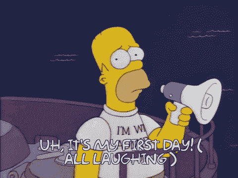

# 如何一无所知

> 原文：<https://dev.to/mrisdal/how-to-know-nothing-33an>

几个月前，我在我的个人博客上写了这篇文章。今天，我在 Stack Overflow 担任新产品经理已经六个月了，所以我在这里交叉发布。🎉

几个月前，我开始了一份新工作，在 Stack Overflow 担任产品经理。这篇博文是关于如何在新工作中一无所知。这是一种类似挥鞭样的经历，从自信地了解你工作的一切，到艰难地停下来，这样你就可以从头再来。

好吧，也许没那么戏剧化，但是我的不安全感激励我向我的推特粉丝寻求建议:

> T3】梅根·里斯达尔👾@ Megan risdal从对一份工作了如指掌到重新开始是艰难的。有人有什么让自己感觉更好的建议吗？2019 年 4 月 24 日上午 02:41

为了提供更多的背景资料，我觉得自己因为缺乏知识而感到特别沮丧，原因有几个，我想是:

首先，在 [Kaggle](https://www.kaggle.com/mrisdal) (我之前的工作)时，我经历了一个非常令人兴奋的高速增长期。当我在 2016 年开始工作时，他们主要关注比赛，在我工作结束时，我们已经大规模扩展了社区、产品和团队。我们甚至经历了谷歌的成功收购。我作为一个参与者，或者作为一个“见证者”，或者作为一个“创造者”，出现在所有这些变化中。我觉得我可以胜任地回答任何人(内部或外部)可能问我的关于 Kaggle 的问题。

第二，我加入的公司( [Stack Overflow](https://stackoverflow.com/users/8157789/megan-risdal?tab=profile) )和 Kaggle 有点像，因为它有一个庞大的技术用户群，拥有丰富的文化规范历史和过去的产品决策。丰富的历史使 Stack 成为今天的家喻户晓的品牌，但作为多年来没有积极参与其中的人，它可能会令人生畏。需要补上很多部落知识！

无论如何，在这篇博文中，我想总结一下我从 Twitter 上的朋友那里得到的一些很好的建议。

## 1。没有安全感是正常的，没关系

这是值得一提的！我收到了很多人的回复，他们要么表示支持，要么向我保证，对于任何开始新工作的人来说，这是一种正常的感觉。

> 杰森·鲍姆加特纳@ jasonbaumgartne[@ Megan risdal](https://twitter.com/MeganRisdal)任何时候一个人开始新的工作，都会对自己的知识感到不知所措和缺乏安全感，这是完全正常的。记住，重新开始对任何人来说都是势不可挡的。人们需要 60-90 天才能适应，这是完全正常的。记住你是牛逼的！2019 年 4 月 24 日下午 17:11

## 2。提醒自己你是有能力的，你会再次有能力的

这是写给那些嘲笑我们在评估自身能力时屈服于催款-克鲁格效应的人的。我承认，我在离开谷歌时索要了我的个人档案，所以我有我的绩效评估来提醒我，从某种客观意义上来说，我*可以*在工作中表现出色。

我喜欢最近换了团队的其他人的回复:

> 弗雷德·卢奇 3@ probnotabot[@ Megan risdal](https://twitter.com/MeganRisdal)我是说 j 还是觉得海拉哑..但是我知道我觉得自己很笨，因为我在学习新的东西。这让我意识到我并不笨。这只是我的感觉。2019 年 4 月 24 日 23 点 06 分

## 3。把你的新手视角变成超级大国

这可能是我最喜欢的回答(来自谷歌的一位前同事):

> 红龙🦕[@ amcasari](https://dev.to/amcasari)[@ Megan risdal](https://twitter.com/MeganRisdal)当人们提醒我刚进入一家公司/角色/技术领域是一种超级力量时，这很有帮助。你有新鲜的眼睛，新的视角，对尚未建立的联系有想法。
> 
> 尽可能长时间戴着那些权力的新手手铐！2019 年 4 月 24 日上午 02:44

另一个人也说得很好，他[回复了这段话](https://twitter.com/ztuylime/status/1121132899166605312):

> 在初学者的头脑中有许多可能性，
> 但是在专家的头脑中很少有
> [*【铃木】*T5】](https://www.dailyzen.com/journal/zen-mind-beginners-mind)

因为我知道在我的新角色中我还有很多要学，所以我有一个很好的机会问“为什么？”这么多次。我肯定会尽可能长时间戴着这顶帽子，因为我会和同事[以及用户](https://twitter.com/MeganRisdal/status/1127006719492509701?s=20)交谈。

[正如另一个人回答的那样](https://twitter.com/aCraigPfeifer/status/1121089455538999297)，通过挑战假设，你“既了解了环境，又推动了它的发展。”

## 4。脆弱

只有当人们知道你在纠结什么或者你想如何改进时，他们才能帮助你。也许对我来说，在推特上告诉世界我不知道所有的事情是不舒服的，但它给了我一些惊人的回复，希望能帮助更多的人，而不仅仅是我自己。另外，正如有人回答的那样，“如果你不感到不舒服，你就没有在学习。”

> 贾斯汀·基金斯@神经音乐[@ Megan risdal](https://twitter.com/MeganRisdal)[@尼克万](https://twitter.com/nickwan)我不知道，我真的很难在我的新工作中拥有这种脆弱性，我想我有时会表现得像个无所不知的混蛋。我想你要赢了😁2019 年 4 月 24 日上午 05:01

这也与[我得到的一些其他建议相吻合](https://twitter.com/tinkertim/status/1120887904287494145)作为一个团队的新人，我经常尽早要求反馈。

...

我已经把我得到的建议提炼成了我上面写的几个不同的主题，但是最后我最大的两点收获是:

1.  对自己要有耐心
2.  好奇

最终你会再次了解一些事情。