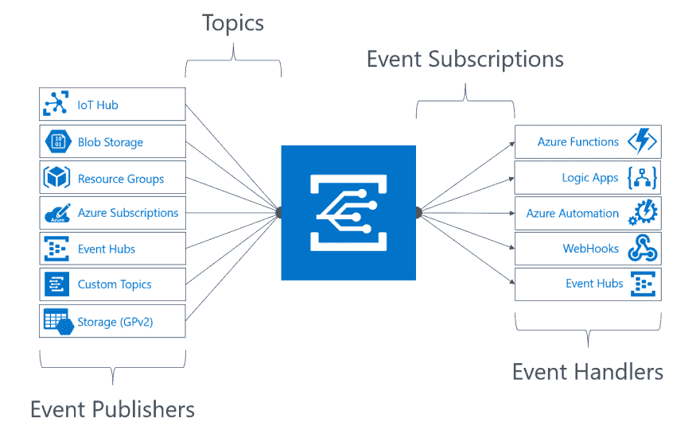
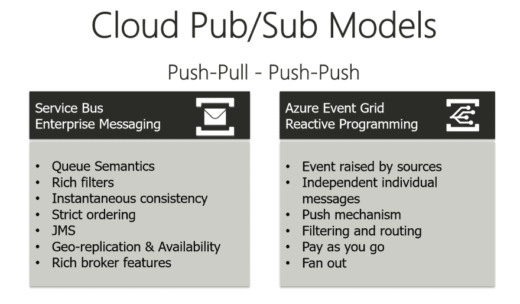
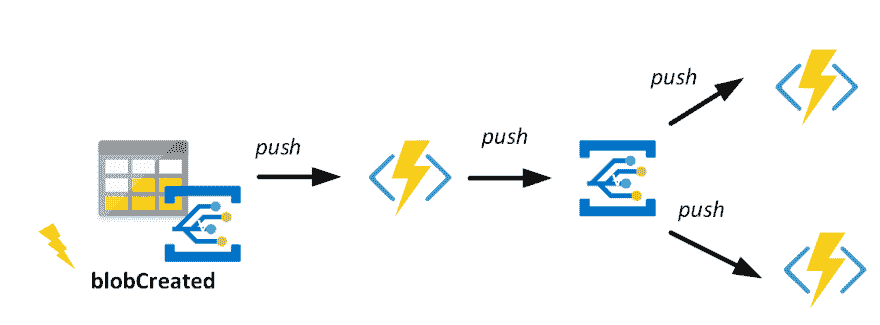
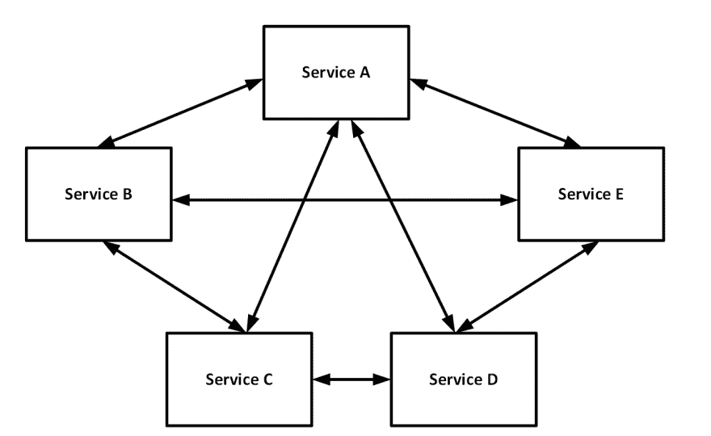
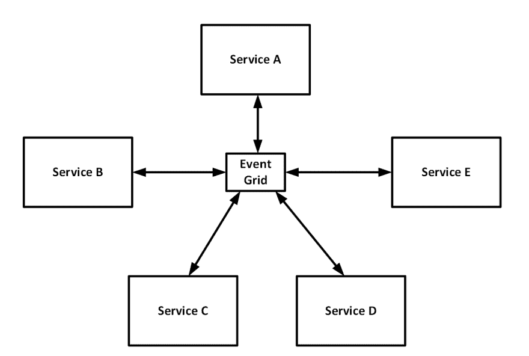
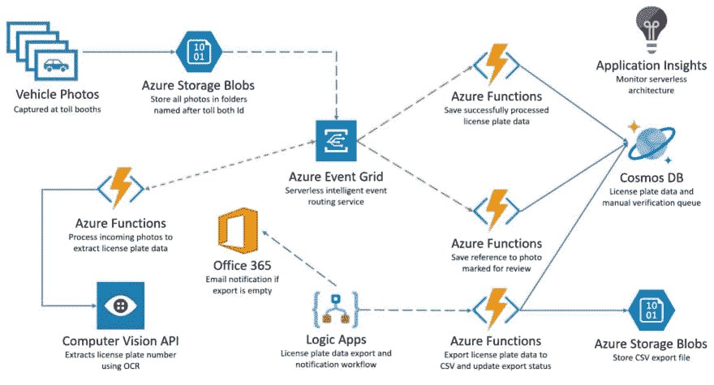
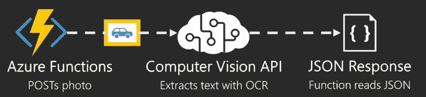
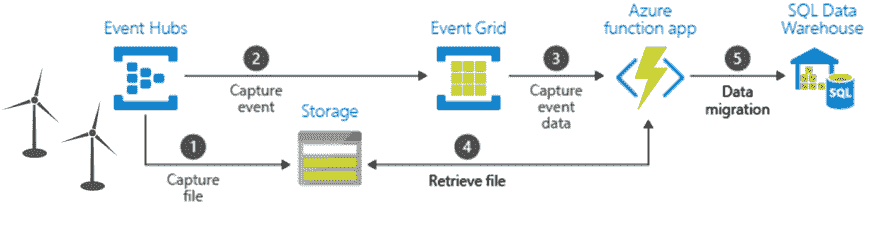

# 如何用 Azure 事件网格构建一个反应式解决方案

> 原文：<https://dev.to/suryavenkat_v/how-to-build-a-reactive-solution-with-azure-event-grid-a8k>

作者名单:[斯蒂夫-扬·威格斯](https://www.serverless360.com/blog/author/steef)，蔚蓝最有价值球员

最初发布于[无服务器 360 博客](https://www.serverless360.com/blog)

Azure [事件网格](https://azure.microsoft.com/en-us/services/event-grid/) 是云中消息传递的缺失部分。与大量轮询或“锤子式轮询”这种非常耗费资源的过程不同，您现在可以“轻轻一拍”——这是一个“有图像可供处理”的事件事件网格是 Azure 中的一项服务，支持集中管理事件。它提供带有过滤器的智能路由，并在 [事件模式](https://docs.microsoft.com/en-us/azure/event-grid/event-schema)上标准化。

## **事件网格**

通过事件，网格提供了一种反应式事件处理机制。应用程序可以订阅事件并相应地处理它们，例如，处理存储 blob 事件、Azure 订阅中的配置通知、物联网设备信号，甚至是自定义事件。

事件网格处理事件，而不是消息。一个消息有一个意图，并且需要一个动作，例如，一个需要完成的订单。事件是事实，是已经发生的事情，你可以对它做出反应，也可以不做出反应。因此，消息传递和事件之间有着明显的区别。因此，在 Azure 平台中有两种可用的服务——Clemens Vasters 在去年的博客文章中解释了这一点: [事件、数据点和消息 - 为你的数据选择正确的 Azure 消息服务](https://azure.microsoft.com/en-us/blog/events-data-points-and-messages-choosing-the-right-azure-messaging-service-for-your-data/) 。

## **发布-订阅模式**

Azure 事件网格的概念很简单——它是一个发布-订阅模型。事件源将事件推送到 Azure 事件网格，事件处理程序订阅事件。事件源或发布者——像存储、物联网中心或第三方源这样的 Azure 服务发出一个事件，例如， **blobCreated** 或 **blobDeleted** 。您可以将事件发送到主题。每个主题可以有一个或多个订阅者(事件处理程序)。如果支持，您可以将 Azure 服务配置为事件发布者，或者创建自定义的 Azure 事件网格主题。随后，Azure 中的事件处理器 like Functions、WebHook 和 Event Hubs 可以对事件做出反应并处理它们。

[](https://res.cloudinary.com/practicaldev/image/fetch/s--QFuaq7jN--/c_limit%2Cf_auto%2Cfl_progressive%2Cq_auto%2Cw_880/https://serverless360.wpengine.com/wp-content/uploads/2018/07/Event-Grid-concepts.png)

Azure 事件网格的发布-订阅模型与服务总线主题和订阅不同。而且主题和订阅是推拉的，Azure 事件网格是推-推的。此外，还有其他的区别，如下图所示。

[](https://res.cloudinary.com/practicaldev/image/fetch/s--PR1uWh8l--/c_limit%2Cf_auto%2Cfl_progressive%2Cq_auto%2Cw_880/https://serverless360.wpengine.com/wp-content/uploads/2018/07/Cloud-Pub-Sub-Models.png)

考虑一个监听 blob 存储容器的函数，每次创建新的 blob 时，它都会向消息队列发送一条消息。随后，您可以用另一个函数监听队列，用该函数处理 blob，并调用另外两个函数(或者在该函数和另外两个函数之间放置一个队列)。下图显示了推拉如何使用服务总线队列工作。

[](https://res.cloudinary.com/practicaldev/image/fetch/s--2MZHlxHB--/c_limit%2Cf_auto%2Cfl_progressive%2Cq_auto%2Cw_880/https://serverless360.wpengine.com/wp-content/uploads/2018/07/Building-reactive-solution-with-Azure-Event-Grid-Picture-3.png)

使用事件网格，您可以有不同的方法，如下图所示。

[](https://res.cloudinary.com/practicaldev/image/fetch/s--nWx6KbYT--/c_limit%2Cf_auto%2Cfl_progressive%2Cq_auto%2Cw_880/https://serverless360.wpengine.com/wp-content/uploads/2018/07/Building-reactive-solution-with-Azure-Event-Grid-Picture-4.png)

您可以将事件网格视为 Microsoft Azure 中事件驱动计算的主干——它为企业带来了一些好处。使用推-推发布-订阅模式，您可以更有效地利用资源。除了效率之外，事件网格还提供:

*   无服务器方式的本地集成(点击);
*   扇出到多个地方；
*   事件在 24 小时内可靠交付；
*   使用类型和过滤器智能路由事件。

这些好处将在这篇博文中变得显而易见。

## **依赖性反转**

有了 Azure 中的 Event Grid，您可以像开发人员一样使用或采用现有云解决方案中的反向依赖关系——服务通过相互依赖来支持业务流程。在这种类型的解决方案中，每个服务都有一些逻辑来与架构中的其他服务进行通信。此外，解决方案或架构变得很复杂，或者是一堆服务。

[](https://res.cloudinary.com/practicaldev/image/fetch/s--hdVmBYt5--/c_limit%2Cf_auto%2Cfl_progressive%2Cq_auto%2Cw_880/https://serverless360.wpengine.com/wp-content/uploads/2018/07/Building-reactive-solution-with-Azure-Event-Grid-Picture-5.png)

然而，利用事件网格，您可以通过使服务更加事件驱动来放松这些依赖性。这些服务通过将事件推到一个中心位置(即事件网格)来进行通信。

[](https://res.cloudinary.com/practicaldev/image/fetch/s--CTOPmQ34--/c_limit%2Cf_auto%2Cfl_progressive%2Cq_auto%2Cw_880/https://serverless360.wpengine.com/wp-content/uploads/2018/07/Building-reactive-solution-with-Azure-Event-Grid-Picture-6.png)

通过将事件推到一个中心位置，您从根本上统一了服务之间的通信。汤姆·克霍夫在他的博客 [探索事件网格](https://blog.tomkerkhove.be/2017/08/22/exploring-azure-event-grid/)中讨论了这个问题。

## **收费站场景**

事件网格的一个典型用例或示例是利用 Vision API 处理图像。Azure Blob 存储发出事件 **blobCreated** ，该事件随后由订阅该事件的函数或逻辑应用程序处理。在下面的场景中，事件网格在处理 **blobCreated** 事件中起着至关重要的作用，其中有几个函数订阅该事件。

[](https://res.cloudinary.com/practicaldev/image/fetch/s--PC5CwDb0--/c_limit%2Cf_auto%2Cfl_progressive%2Cq_auto%2Cw_880/https://serverless360.wpengine.com/wp-content/uploads/2018/07/Toll-booth-license-plate-recognition-scenario.png)

在上面的场景中，一个摄像头记录了每辆通过收费站的汽车。车辆的图片包括一个牌照。这些图像被批量上传到 Azure 存储帐户——配置为事件发布者。每个图像都存储为一个 blob，因此导致事件被发送到事件网格主题。随后，几个函数订阅这些事件:

*   将斑点(图像)推送到计算机视觉 API 的功能-通过光学字符识别(OCR)功能提取车牌号码。该函数会将结果作为事件推送到另一个事件网格主题。
*   将牌照(Vision API 的结果)保存到 Cosmos DB 的函数。
*   将存储帐户中的图像引用保存到 Cosmos DB 的功能。

上面的场景展示了开发人员如何构建几个函数来处理事件。此外，开发人员是制作反应性组件的一部分，即在这种情况下的功能(任务)。管理事件(汽车通过收费站)的过程是通过松耦合、可伸缩和无服务器类型的解决方案实现的。在下面的段落中，我们将结合给定的场景进一步讨论事件网格的一些关键概念。

## **Azure 事件网格模式**

Event Grid 中的事件遵循一个预定义的模式——一个带有几个属性的 JSON 模式。此外，事件作为 JSON 数组发送到 Event Grid，最大大小为 1mb——数组中的每个事件限制为 64 KB。如果您发送一个超出限制的事件数组，您将收到过大的 HTTP 响应 413 有效负载。请注意，即使是单个事件也是作为数组发送的。

以下架构显示了事件的属性:

```
[
 {
  "topic": string,
  "subject": string,
  "id": string,
  "eventType": string,
  "eventTime": string,
  "data":{
  object-unique-to-each-publisher
  },
  "dataVersion": string,
  "metadataVersion": string
 }
]
```

例如，在我们的场景中，为 Azure Blob 存储事件发布的模式:

```
[{
"topic": "/subscriptions/0bf166ac-9aa8-4597-bb2a-a845afe01415/resourceGroups/RG_LicensePlates_Demo/providers/Microsoft.Storage/storageAccounts/licenseplatesstorage",
"subject": "/blobServices/default/containeimg/blobs/LicensePlate1.png",
"eventType": "Microsoft.Storage.BlobCreated",
"eventTime": "2018-06-05T08:35:26.2778593Z",
"id": "2c6f7c22-201e-00b7-0aa8-fca7ce06e319",
"data": {
"api": "PutBlob",
"clientRequestId": "32a51839-6bf5-44d6-acfe-7d284229988c",
"requestId": "2c6f7c22-201e-00b7-0aa8-fca7ce000000",
"eTag": "0x8D5CABF497519C6",
"contentType": "application/octet-stream",
"contentLength": 41860,
"blobType": "BlockBlob",
"url": "https://licenseplatesstorage.blob.core.windows.nimg/LicensePlate1.png",
"sequencer": "000000000000000000000000000008BC0000000003fd850f",
"storageDiagnostics": {
"batchId": "fbb4e831-82b2-4e64-b0e5-0735449f9cb7"
}
},
"dataVersion": "",
"metadataVersion": "1"
}]
```

我们场景中的图像处理函数可以处理事件，并使用数据负载中的 URL 从存储帐户容器下载图像。Rest 调用将下载的图像推送到计算机视觉端点。最后，这个函数将读取 JSON 结果，并作为事件推送到另一个事件网格主题。

[](https://res.cloudinary.com/practicaldev/image/fetch/s--ErWoIIws--/c_limit%2Cf_auto%2Cfl_progressive%2Cq_auto%2Cw_880/https://serverless360.wpengine.com/wp-content/uploads/2018/07/Tollbooth-license-plate-recognition-scenario1.png)

## **安全**

事件网格的安全性由几个部分组成。第一部分是事件网格资源上基于角色的访问控制(RBAC)——创建新订阅的人需要拥有**Microsoft.EventGrid/EventSubscriptions/Write**权限。其次，WebHooks 上有一个验证——监听事件的首要机制——每个新注册的 WebHook 都需要首先通过事件网格进行验证。这是在存储帐户 V2 等事件资源中创建事件订阅时隐式发生的情况，您可以使用存储帐户中的事件功能将事件与函数或逻辑应用程序挂钩。在我们的场景中，订阅事件的安排是隐式的。

如果您想要使用自定义代码订阅事件，即本地客户端，您将需要响应事件网格将发出的验证令牌。网格将发送给客户端的验证请求事件如下所示:

```
[{
"id": "2d1781af-3a4c-4d7c-bd0c-e34b19da4e66",
"topic": "/subscriptions/xxxxxxxx-xxxx-xxxx-xxxx-xxxxxxxxxxxx",
"subject": "",
"data": {
"validationCode": "512d38b6-c7b8-40c8-89fe-f46f9e9622b6"
},
"eventType": "Microsoft.EventGrid.SubscriptionValidationEvent",
"eventTime": "2018-01-25T22:12:19.4556811Z",
"metadataVersion": "1",
"dataVersion": "1"
}]
```

客户端将在 200-OK 响应中使用验证码进行响应。如果要发送自定义事件，请使用 SAS 令牌或密钥身份验证将事件发布到主题。有关事件网格的安全和认证的更多详细信息，请参见[https://docs . Microsoft . com/en-us/azure/Event-Grid/security-authentic ation](https://docs.microsoft.com/en-us/azure/event-grid/security-authentication)

## **事件的保证交付**

该场景的一个关键方面是事件的保证交付。事件网格的默认行为是，它将至少尝试一次传递事件，并使用指数回退重试——事件网格将继续向事件处理程序发送事件，直到它用 HTTP 200 OK 或 HTTP 202 Accepted 确认请求。退避机制将在重试之间使用越来越长的等待来进行后续的错误响应。此外，它将持续到 24 小时后——24 小时后，事件网格将删除该事件。另见[https://docs . Microsoft . com/en-us/azure/event-grid/delivery-and-retry](https://docs.microsoft.com/en-us/azure/event-grid/delivery-and-retry)。

## **扇入扇出场景**

你可以把 Event Grid 看作是无服务器的，也就是说你不需要管理任何基础设施，你只需为每项操作付费，微软会为你处理扩展。事件网格利用底层的服务结构，因此可以随着工作负载的增加而扩展。

事件中心和事件网格在接收(扇入)和推送(扇出)场景中无缝协作。两者都可以在工作负载增加时轻松扩展，并且不需要您管理基础架构。在以下情况下，捕获功能会将风电场数据(每台风机)发送到事件中心。

[](https://res.cloudinary.com/practicaldev/image/fetch/s--KcyvfDi---/c_limit%2Cf_auto%2Cfl_progressive%2Cq_auto%2Cw_880/https://serverless360.wpengine.com/wp-content/uploads/2018/07/Ingestion-and-migration-of-event-data.png)

[事件集线器捕获](https://docs.microsoft.com/en-us/azure/event-hubs/event-hubs-capture-overview) 从风电场数据流中提取数据，并生成带有 [Avro](https://en.wikipedia.org/wiki/Apache_Avro) 格式数据的存储 blobs。随后，当捕获创建 blob (1)时，将生成 blobCreated 事件并将其发送到事件网格(2)。事件的订阅者将接收到它并相应地处理它，在这种情况下，Azure 函数(3)将获得事件。此外，该函数将从 blob 存储器(4)中检索文件(Avro 文件的 URL ),并将其存储到 SQL 数据仓库(5)中。此示例可在 Microsoft docs 上找到:[https://docs . Microsoft . com/en-GB/azure/event-grid/event-grid-event-hubs-integration](https://docs.microsoft.com/en-gb/azure/event-grid/event-grid-event-hubs-integration)

## **总结**

这篇博客讨论了事件网格场景，在这些场景中，事件网格扮演着核心角色，以及开发人员如何利用这项服务。另一个场景展示了 Event Grid 如何在事件数据的大量接收和迁移中与事件中心协作。

Event Grid 已在美国、欧洲和亚洲的几个 Azure 地区全面推出，更多地区即将推出。事件网格的定价，详见 [定价页面](https://azure.microsoft.com/en-us/pricing/details/event-grid/) 。此外，Azure Event Grid 服务的完整文档可以在微软文档网站上找到。