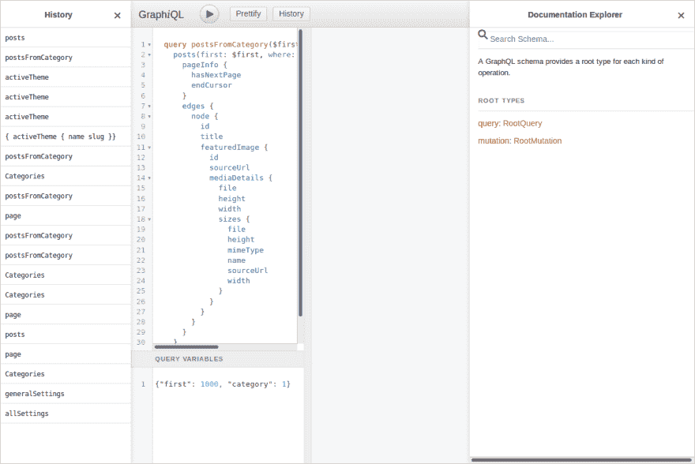
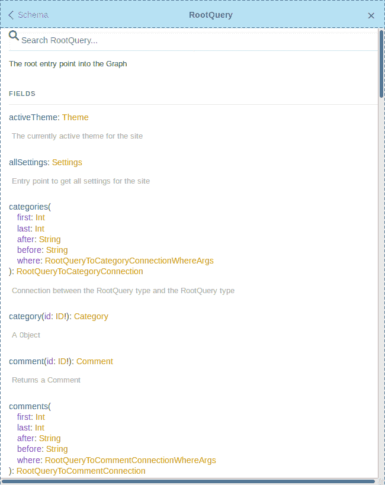
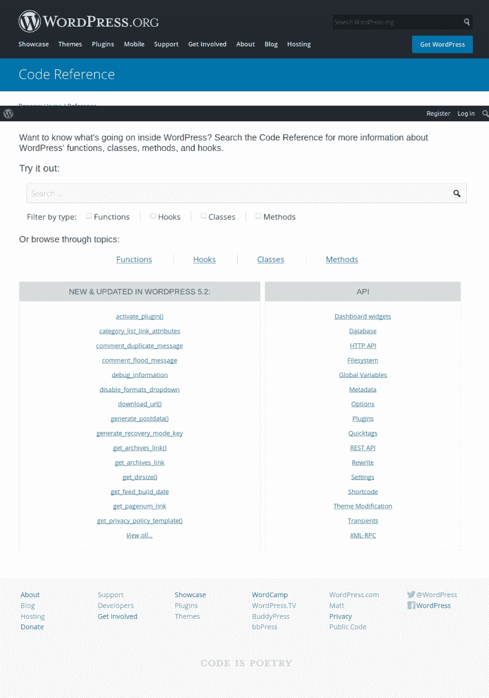

# 更新 WordPress 主题以做出反应

> 原文：<https://dev.to/metamn/updating-a-wordpress-theme-to-react-481j>

在无头 WordPress 上做 SPA！

## 问题

如果你不得不更新一个旧的 WordPress 主题来反应呢？你唯一的部署选择是在 WordPress 仪表盘上传一个新主题？

用 [Gatsby](https://www.gatsbyjs.org/) 没有静态站点生成，用 [Next](https://nextjs.org/) 没有服务器端渲染。

剩下的是 [create-react-app](https://create-react-app.dev/) ，它构建了一个单页面应用程序。更准确地说是 [create-react-wptheme](https://github.com/devloco/create-react-wptheme) ，它使`create-react-app`适应了 WordPress。

## 创建-反应-wptheme

`create-react-wptheme`用一个 WordPress 开发服务器替换`create-react-app`附带的 Webpack 开发服务器。这使得开发 React 主题就像开发任何其他 React 应用程序一样简单。

部署主题也很容易:你只需要构建它并上传到 WordPress。仅此而已。

整体体验非常流畅。太光滑了，没什么好学的。向 [@devloco](https://github.com/devloco) 这位不知名的代码艺术家致敬。

## WPGraphQL

WPGraphQL 和附带的[WPGraphQL](https://github.com/wp-graphql/wp-graphiql)IDE 插件也是同样神奇的工具。

它们取代了 [WordPress 模板文件和标签](https://developer.wordpress.org/themes/basics/template-hierarchy/)以及大部分 [WordPress API](https://developer.wordpress.org/reference/) 。你不再需要这些古老的艺术品了。

你不用再写 PHP 代码，所有的主题文件都会为你生成，除了`functions.php`，以防你想扩展`WPGraphQL`。

### 文档

用 GraphQL 创建主题在`WPGraphiQL`插件中有记录。它也是所有数据库操作的实时测试平台。

看着活代码编辑器旁边的文档，感觉很清爽。这一切都在一个屏幕上，无需打开网页和搜索结果。

我发现 GraphQL API 文档比原来的 WordPress 文档更有用。更好的导航，不那么冗长，但直接指向快速查找，甚至深入研究。

和...相对

### 经历

用 GraphQL 创建第一个主题就像用传统方式创建主题一样自然。

事实上，这是一次更愉快的经历。

在 React 中(重新)实现`get_categories()` / `get_category_link()` PHP 函数很有趣，并且观察到这个应用程序不再需要整个类别的 API。

这让我们感觉到，与旧的方法相比，这个应用程序是多么的轻便，因为没有人知道在引擎盖下发生了什么，以及有多少函数被调用来执行一个简单的操作。

### 生态系统

WPGraphQL 设法成为 WordPress 的*无头*部分的速度之快令人惊讶。

与[高级定制字段](https://www.wpgraphql.com/acf/)、 [WooCommerce](https://docs.wpgraphql.com/extensions/wpgraphql-woocommerce) 和 [Gutenberg](https://docs.wpgraphql.com/extensions/wpgraphql-gutenberg) 的集成表明，社区正在将旧生态系统中所有有趣的部分迁移到新生态系统中。

最近，WPGraphQL 的创建者得到了 Gatsby 的支持，以支持进一步的开发。这些都是项目健康发展的迹象。

## 总结

由于这两个奇妙的开源贡献，WordPress 现在已经准备好使用单页应用程序(SPA)范例进行简单的反应主题化。

SPAs 并不真正支持多个 URL，只适用于像营销网站和投资组合这样的小项目。

当需要更多服务时——真实的 URL、服务器端渲染、静态站点生成——人们只需用 Gatsby 或 Next 之类的服务来替换`create-react-wptheme`。

所有现有的 React 和 WPGraphQL 代码保持不变，可以重用。

## 资源

*   [创建-反应-WP 主题](https://github.com/devloco/create-react-wptheme)
*   [WPGraphQL](https://www.wpgraphql.com/)
*   [Jason Bahl 加入 Gatsby 团队，全职开发 WPGraphQL】](https://wptavern.com/jason-bahl-joins-the-gatsby-team-to-work-on-wpgraphql-full-time)
*   [样本项目](https://github.com/metamn/inu-v2-b)