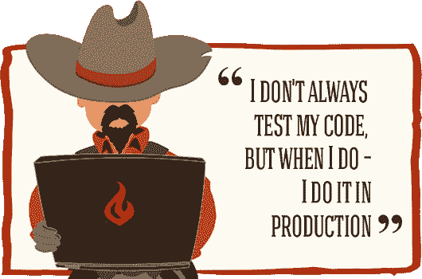
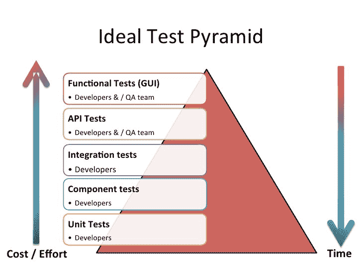

# 你做过单元测试吗，兄弟？

> 原文：<https://dev.to/juyn/do-you-even-unit-test-bro-434g>

# 单元测试是火箭科学

很多程序员不写任何单元测试。主要原因是他们不明白为什么要花时间在这上面。只是浪费时间，对吧？

我就是这样，然后我的代码开始在生产中崩溃。大型可见项目。所以，我寻找一种方法来对我的代码，对我的提交更加自信。

单元测试是第一个答案，但是我花了很长时间才写对。

## 什么是好的单元测试？

要编写一个好的、可靠的单元测试，你需要:

*   **了解你在测试什么**。这听起来可能很愚蠢或显而易见，但事实并非如此。阅读方法，理解它做什么，如何做，为什么做。如果你不知道它应该做什么或不应该做什么，你怎么能测试它呢？

*   **避免“过度嘲笑”综合症**。嘲讽让写作测试变得容易，但这不是一个好的做法。只有在没有其他选择的情况下才使用 mock，比如 API 调用。并且，请不要存根你正在测试的类！

*   **座**。设置、练习、断言、拆卸。并对每个测试进行重复。

*   **输入/输出**。专注于数据转换。定义一个开始状态，运行测试，在输出上断言。在这个过程中发生了什么，或者是如何发生的，与你无关。

*   **决定一个范围。坚持下去**。一个方法可以有任意多的测试，但是要尽量在用例场景中分离测试。
    你想断言一个方法把一个数组转换成 json，而且还抛出一个异常？好吧，做两个独立的测试！

## 代码覆盖率真的重要吗？

TL；大卫:不，不是的。

我听到很多人说你应该以 100%的代码覆盖率为目标。但这不是个好主意。不要误会，代码覆盖率越高越好。但这不应该是你的主要关注点，也不是你的目标。

在编写方法测试之前，我会问自己几个问题:

*   该方法是否转换了数据？
*   我能在不嘲笑方法输出的情况下编写这个测试吗？
*   这个方法到底有没有返回什么东西？
*   我能对结果下结论吗？

如果任何一个问题的答案是“否”,我很可能不会写任何测试。

并不是因为你有 100%的代码覆盖率，你的代码才被正确测试。

## 你不得通过！

是的，代码是由公共方法组成的，但是也有私有的和受保护的方法。我们应该测试它们吗？

当然不是。但也是的！

它们通常包含业务逻辑，所以，是的，测试它们。但是，与公共方法不同，不值得进行特定的测试。私有方法的目的是被同一个类的公共方法调用。让我们在测试中应用同样的逻辑。私有和受保护的方法应该通过公共方法的测试来进行测试。

## 永远是 F.I.R.S.T

我习惯于按照第一个原则编写测试，但是也存在其他方法，比如 AAC。我认为，作为一名开发人员，如果 FIRST 不适合你，你应该知道如何使用 Google 来找到它们！

*   **快速**:测试应该是快速的。如果没有，我会劝阻你或你的团队不要运行它。大项目可能有成千上万的测试和鉴定。
    设置、测试和拆除应该不会超过几毫秒

*   **独立**:测试**不能**互相依赖，或者依赖于前一个测试的状态。
    应该为当前测试创建所有需要的数据，并在之后销毁。
    如果许多测试需要相同的数据，只需在设置过程中创建即可。

*   可重复:测试应该是反复可重复的。时间、日期或时区不应该影响它们。
    是的。你可以做一个时间领主，嘲笑时间(当然，除非是一个固定的时间点；请记住，如果测试失败，唯一有效的原因应该是该方法没有按预期工作。或者测试是错误的。但那都是乡亲！

*   **自确认**:不需要人工检查测试是否通过。

*   **彻底**:不要偷懒。编写单元测试需要时间，有时甚至比编写方法本身还要多。

    *   测试每个用例场景
    *   不要因为简单的价值观而限制自己。寻找边缘值
    *   如果这些方法可以处理大量数据，请使用大型数据集进行测试
    *   异常和错误测试
    *   不要只为成功而测试。你可以断言一个失败，你应该这样做！

## 结论

保持你的测试简单，将它们限制在一个特定的范围内，并关注方法的输出。

单元测试只是一个完整测试周期的第一步。看看下面的金字塔。

