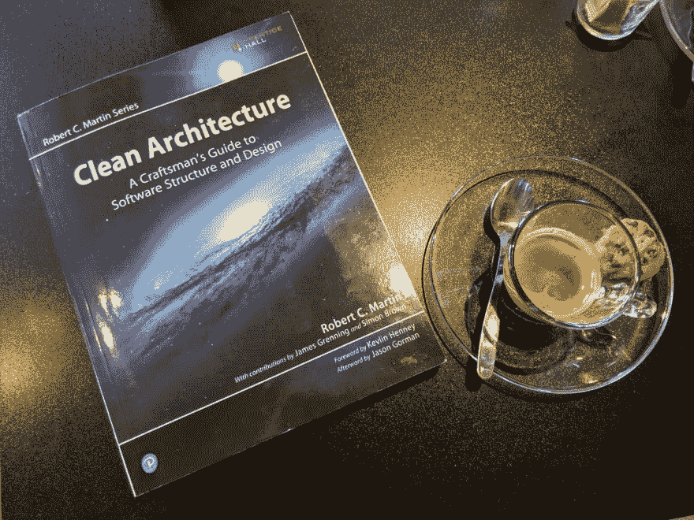
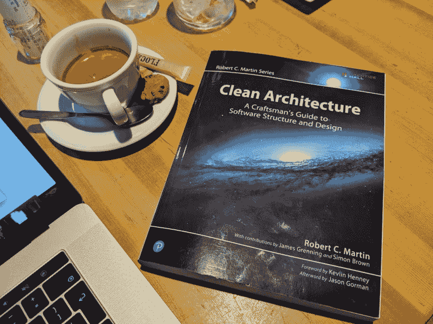

# 干净的建筑——简评

> 原文：<https://dev.to/colaru/clean-architecture-a-short-book-review-3no9>

这是对[鲍勃叔叔](https://blog.cleancoder.com/)写的[清洁建筑书](https://www.amazon.com/Clean-Architecture-Craftsmans-Software-Structure/dp/0134494164)的评论(前三部分)。我在假期时读它，我必须承认这不是一本我可以称之为“假期书”的书。这是因为这是一本非常严肃的关于编程的书，作者在这个领域有超过 50 年的经验——50 年的编程历史在这本书里随处可见。你需要一个安静的地方来思考这个问题，还需要一个网络连接来浏览更多的材料。

首先，我将对这本书的主要部分进行描述。最后，我会表达我对内容的感受和印象。

第 1 部分- **简介**

设计和架构是一样的——架构有时被认为是系统高层的结构，而设计是系统低层的结构。都是建筑！

架构的目标是“最小化构建和维护所需系统所需的人力资源”。作者给出了一个错误的应用程序的例子，对于 release 8，代码的生产成本是 release 1 的 40 倍。

该软件为利益相关者提供了两个价值:行为和结构。开发人员有责任保持这两个值都很高。软件必须是“软的”=易于更改和维护。这就是为什么结构=架构是必不可少的。

第 2 部分- **编程范例**

这本书的这一部分致力于编程范例。在 1958 年到 1968 年间发现了三种范式，在接下来的几十年里没有发现任何范式。这是一个信号，表明我们只能拥有这些:

结构化编程(Structured programming)=仅仅基于这些控制结构的编程:顺序、选择和迭代。转到“被认为有害的声明”Dijkstra 的文章强加了“直接转移控制的原则”——从一行代码跳到另一行代码是邪恶的，是不需要的。

**面向对象编程** -在 ALGOL 中诞生了类/对象概念=函数调用堆栈框架可以在堆中移动，函数可以成为类构造函数，内部函数可以是类方法。

面向对象的本质不在于用对象建模世界的能力——“一切都是对象”——而是在于面向对象的好处:封装、继承和多态。虽然封装、继承和多态可以在非 POO 语言中实现，但在 POO 语言中，它们的表达更加简单，甚至微不足道。

特别是多态给了我们依赖倒置=对系统中所有源代码依赖的绝对控制→独立部署能力→独立开发能力。面向对象多态强加了“控制间接转移的原则”。

函数式编程(Functional programming)-函数式语言中的变量不变=不可变。这是一个很大的优势，因为所有的并发问题都是由可变变量引起的。

一种想法是使用一种叫做“事件源”的技术来驱逐更新/删除操作(从 CRUD 中删除),并像在会计中一样保留一个事件分类帐——任何时候我们都可以从事件中重新计算状态。函数式编程是关于“强加于变量赋值的规则”

总之，现在的软件是由**序列、选择、迭代和间接**组成的。随着时间的推移，硬件发生了巨大的变化，但软件仍然和编程初期一样。

第 3 部分- **设计原则**

这里是从架构角度来看的坚实原则的描述。SOLID 是关于如何将我们的功能和数据组织成类，以及类应该如何像“墙上的砖块”一样相互连接。下一部分将讨论如何构建系统中的组件=“建筑物中的房间”。

这些原则用于创建结构“墙里的砖”,这些结构容忍变化并使代码易于理解=设计/架构的全球范围。

原则:

1.  单一责任原则

一个模块应该有且只有一个改变的理由。更准确地说，只针对一个参与者:用户或利益相关者。这个问题的经典解决方案是分成更多的函数/类。

1.  **O** 笔/闭原理

软件产品应该对扩展开放，但对修改关闭。一个例子展示了我们如何保护高层组件免受低层组件变化的影响。

1.  **L** 伊斯科夫替代原理

Barbara Liskov (1988)如果对于每个 S 类型的对象 o1，都有一个 T 类型的对象 o2，那么对于所有用 T 定义的程序 P，当 o1 代替 o2 时，P 的行为不变，那么 S 是 T 的一个子类型。

1.  I 界面分离原理

依赖那些承载着你不需要的包袱的东西会给你带来麻烦。所以把接口分成几部分，这样你就可以避免不必要的重新编译和重新部署。

1.  **D** 依赖反转原理

接口比实现更不稳定。所以不要指易变的具体类，而是接口。作者展示了一个抽象工厂模式实现来说明依赖倒置。

**我的想法(可能不太清楚，所以你可以跳过这一部分)**

**三合一咖啡**

我认为现代语言的趋势是包含所有三种编程范式——结构化、面向对象和函数式。例如，Java 有类似于 C 语言的结构控制块。这是面向对象的设计。最近，它开始支持 Java 8 lambda 函数和流(Groovy 也支持)。Javascript(另一种我感兴趣的语言)在 ES5 级别上是结构化的，在 ES6 级别上变成了面向对象，并且可以通过类似[下划线的库在函数式风格中使用。JS](https://underscorejs.org/) 和[洛达什 JS](https://lodash.com/) 。

第一次见到电脑，我写了一个程序

我怀念我叔叔鲍勃 30 年的历史经验——这就是为什么我们需要一个叔叔给我们讲过去的故事！

我在 2000 年开始使用 Java，直到现在它都是我的主要编程语言。我的感觉是我们有两波便便。首先是 C++和 Objective C，我们仍然可以看到指向机器的指针和引用。第二波是带有虚拟机(JVM 和 CLR)、垃圾收集器和无指针的 Java 和 C#。这些是高级编程语言，我们只是在对象中思考——在我们的代码中不涉及任何机器(线程、套接字等)。是特定于操作系统的，并被建模为对象)。可能会填满机器，就在我们启动 JVM 的时候，我们配置内存，GC 类型。

但是我在学校里学的第一门语言是 90 年代的 BASIC 语言，它有 GOTO，我给这些行编号，我记得我曾经从一行跳到另一行——我们称之为命令式编程。学校里的第二种主要语言是[PASCAL](https://en.wikipedia.org/wiki/Pascal_(programming_language))——结构化编程(过程化)。

在那个时候，Z80 (Zilog)处理器在家里使用 64K 内存- x86(英特尔/AMD)已经被视为未来，但当时太贵了，家里没有一个-还记得第一个 486 和 586(奔腾)我们在学校。我仍然记得我们以前整天玩的磁带上的那些游戏。受游戏的启发，我也在 Z80 上做了一些汇编语言子程序。

**类型化/动态语言辩论**

我认为编程历史的一个主题也是语言中的类型化/动态类型化之争。看上次的语言(Scala，Groovy)。静态编译检查过的语言如 Java、TypeScript 与运行时动态语言如 Groovy(也运行在 JVM 上)或 JavaScript。动态语言面向脚本的趋势——在简洁的语法中有很多语义。

功能仅仅意味着不变性吗？

不确定函数式编程的本质是什么(如果是不变性的话)——我认为有可能将函数应用于数据结构，以声明的方式创建函数链，将函数作为语言的公民将其作为参数传递——来完成所有这些在结构化编程中很难完成的映射/归约工作。

不变性不是简化并发问题(锁、线程池)的唯一方法。像 Node.JS/Vertex 这样的事件循环/单线程每核编程有助于避免经典的并发问题(与非阻塞协同工作，但会迫使您将所有系统建模为小型非阻塞事件，或者使用工人进行长时间工作)。