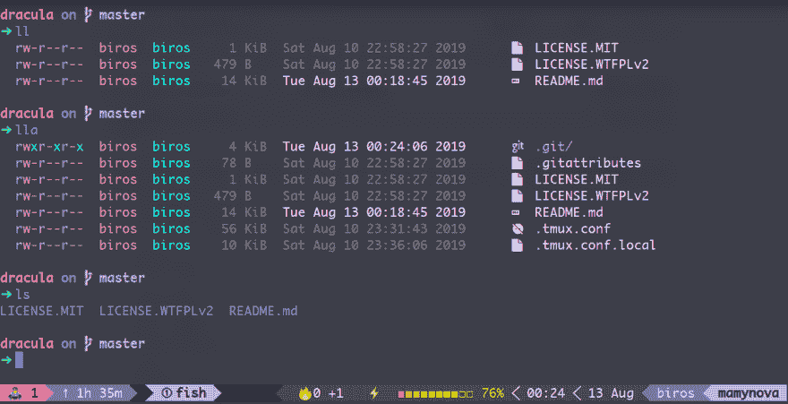
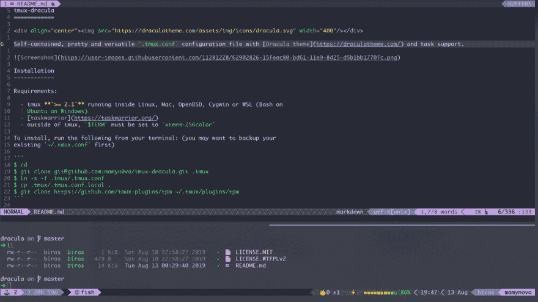

# 德古拉·🧛‍♂️的一贯开发者之旅

> 原文：<https://dev.to/biros/consistent-developer-journey-with-dracula-5bae>

最近用[德古拉主题](https://draculatheme.com)定制了所有我喜欢的 app。由于 Dracula 团队的出色工作，我很快为以下应用程序找到了主题:

*   虚拟代码
*   Intellij
*   精力

火狐也有很多德古拉主题。我选择[klo rax’one](https://addons.mozilla.org/en-US/firefox/addon/klorax-dracula/)。

然后，我想更进一步，在我的终端模拟器中进行同样的旅程。幸运的是， [deepin-terminal](https://github.com/linuxdeepin/deepin-terminal) 附带了很多捆绑主题，包括德古拉。

但作为一个 Tmux 用户，我有点沮丧，因为我使用的状态行与德古拉无关。Tmux 也没有德古拉主题。所以我创造了一个:

## [【mamman 0 va】](https://github.com/mamyn0va)/[【tmux-德古拉】](https://github.com/mamyn0va/tmux-dracula)

### 🔥Awesome .tmux.conf 配置文件与德古拉主题🧛‍♂️和任务支持。

<article class="markdown-body entry-content container-lg" itemprop="text">

# tmux-德古拉

[](https://camo.githubusercontent.com/30160ca35814e779a8447209d4d7c8ab65e8f6d6/68747470733a2f2f64726163756c617468656d652e636f6d2f7374617469632f696d672f69636f6e732f64726163756c612e737667)

独立的、漂亮的、多功能的`.tmux.conf`配置文件，带有[吸血鬼主题](https://draculatheme.com/)和任务支持。

[](https://user-images.githubusercontent.com/11281228/62902826-15feac80-bd61-11e9-8d25-d5b1bb1770fc.png)

## 装置

要求:

*   tmux **`>= 2.1`** 运行在 Linux、Mac、OpenBSD、Cygwin 或 WSL (Bash on Ubuntu on Windows)内部

*   在 tmux 之外，`$TERM`必须设置为`xterm-256color`

要安装，从您的终端运行以下命令:(您可能想先备份您现有的`~/.tmux.conf`)

```
$ cd
$ git clone git@github.com:mamyn0va/tmux-dracula.git .tmux
$ ln -s -f .tmux/.tmux.conf
$ cp .tmux/.tmux.conf.local
$ git clone https://github.com/tmux-plugins/tpm ~/.tmux/plugins/tpm 
```

然后重新加载您的 tmux conf:

```
$ tmux source ~/.tmux.conf 
```

然后通过按`prefix` + `I`(大写 I，如**I**install)安装所需的插件，使用`tpm`获取插件。

最后进行[定制](https://raw.githubusercontent.com/mamyn0va/tmux-dracula/master/#enabling-the-powerline-look)你的`~/.tmux.conf.local`副本。

如果您是 Vim 用户，将`$EDITOR`环境变量设置为`vim`将启用并进一步定制 vi 风格的键绑定(参见 tmux 手册)。

如果你是 tmux 新手，我推荐…

</article>

[View on GitHub](https://github.com/mamyn0va/tmux-dracula)

事实上，我刚刚从 [gpakosz](https://github.com/gpakosz/.tmux) 那里获得了令人敬畏的 Tmux conf，并且我根据《德古拉》的[调色板改变了颜色。](https://github.com/dracula/dracula-theme/#color-palette)

## 就这样！

[](https://res.cloudinary.com/practicaldev/image/fetch/s--lBqbNbGE--/c_limit%2Cf_auto%2Cfl_progressive%2Cq_auto%2Cw_880/https://thepracticaldev.s3.amazonaws.com/i/cn3qgitf5xx7kr223adt.png)

> 截图中的贝壳是带有 [SpaceFish](https://github.com/matchai/spacefish) 提示的[鱼](https://fishshell.com/)。
> 
> 如果你希望在列出你的文件夹(`ls`、`ll`或`lla`)时有相同的外观和感觉，我为 colorls 创建了一个 [Dracula 主题，这是对`ls` unix 命令的一个替代。](https://github.com/mamyn0va/dotfiles-home/blob/master/.config/colorls/dark_colors.yaml)

你完了！