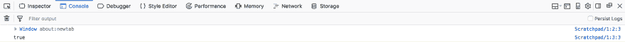
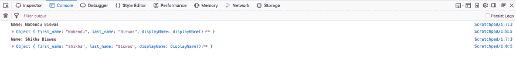
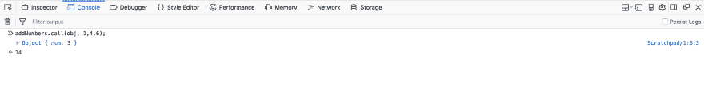
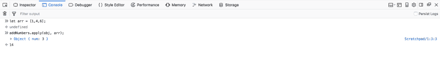
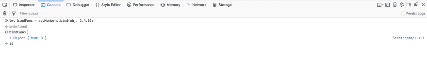

# 用 JavaScript 和 React 揭开这一神秘面纱

> 原文：<https://dev.to/nabendu82/demystifying-this-in-javascript-and-react-4d9p>

this 关键字有时可能是 JavaScript 中最令人困惑的事情之一，因为它不同于其他面向对象语言，如 C++，Java。

这是一个很大的话题，如果你需要掌握它，你需要通读凯尔·辛普森的一整本书。你可以在这里找到《T2》这本书的免费版本。

我们将首先在 JavaScript 中理解这一点，然后将移动到 react 的 **this.bind** 。

## 理解 JS 中的“这个”

对象是 JavaScript 的基础，甚至函数也是 JavaScript 中的对象。“this”是 JavaScript 中的一个特殊对象，它的值取决于代码的执行方式。

### 【本】在简单函数中

在下面这样一个普通的 JS 函数中，**这个**指的是*全局窗口对象*。

```
 function foo() {
      console.log(this);
      console.log(this === window);  
    }

    foo(); 
```

运行上面的代码会给出。

[ ](https://res.cloudinary.com/practicaldev/image/fetch/s--nnxRq9IG--/c_limit%2Cf_auto%2Cfl_progressive%2Cq_auto%2Cw_880/https://cdn-images-1.medium.com/max/5760/1%2A0Wt8xiBXE70o-IWNidrMTg.png) *全局窗口对象*

有一种特殊情况是**严格模式**。
在严格模式下**这个**为 **undefined** ，因为全局对象指的是 undefined 而不是窗口对象。

```
 function foo() {
      'use strict';
      console.log(this);
      console.log(this === window);  
    }

    foo(); 
```

[](https://res.cloudinary.com/practicaldev/image/fetch/s--9FVeCM1E--/c_limit%2Cf_auto%2Cfl_progressive%2Cq_auto%2Cw_880/https://cdn-images-1.medium.com/max/5760/1%2AXiOXGSRMGweAUZPkiHtefA.png)T3】这是未定义的

### “此”在一个对象属性中

在一个具有属性作为函数的对象中,“this”的值就是**对象**本身。

```
 var obj = {};
    obj.foo = function() {
      console.log("Inside obj foo");
      console.log(this);
    }

    obj.foo(); 
```

[ ](https://res.cloudinary.com/practicaldev/image/fetch/s--k1ATzOgo--/c_limit%2Cf_auto%2Cfl_progressive%2Cq_auto%2Cw_880/https://cdn-images-1.medium.com/max/5760/1%2AafzRrlnAA6YBlVdFwlxP4Q.png) *这是物体本身*

### 【本】带构造函数

当用“new”关键字调用一个函数时，它被称为构造函数。而**的值这个**指的是*新创建的实例*。

```
 function Person(fn, ln) {
     this.first_name = fn;
     this.last_name = ln;

    this.displayName = function() {
        console.log(`Name: ${this.first_name} ${this.last_name}`);
        console.log(this);
     }
    }

    let person = new Person("Nabendu", "Biswas");
    person.displayName();  
    let person2 = new Person("Shikha", "Biswas");
    person2.displayName(); 
```

新创建的实例只是一个对象，因为 JS 中的所有东西都是对象。

[ ](https://res.cloudinary.com/practicaldev/image/fetch/s--X0LVbGff--/c_limit%2Cf_auto%2Cfl_progressive%2Cq_auto%2Cw_880/https://cdn-images-1.medium.com/max/5760/1%2APllzrm00k8nSSJ9bCZw01w.png) *这是指新创建的对象*

### 【本】同调用、应用和绑定方法

JavaScript 中几乎所有的东西都是对象，包括函数。每个函数都有调用、应用和绑定方法。这些方法可用于将“this”的自定义值设置为函数的执行上下文。

### 谓

假设我们有一个名为 **obj** 的对象。它只有一个名为 **num** 的属性，其值为 3。让我们也做一个名为 **addNumbers** 的函数。

```
 let obj = {num: 3};
    let addNumbers = function(a, b, c){
      console.log(this);
      return this.num + a + b + c;
    }; 
```

现在，在 **addNumbers** 中，我们有 this.num .但是我们如何将值 obj.num 传递给它呢？我们需要给它传递一个上下文，也就是“这个”的值。我们将通过传递第一个参数作为 obj 来实现这个 my call 方法，所以“this”现在是 obj。

[ ](https://res.cloudinary.com/practicaldev/image/fetch/s--n_oZyMBd--/c_limit%2Cf_auto%2Cfl_progressive%2Cq_auto%2Cw_880/https://cdn-images-1.medium.com/max/5760/1%2A1qTnpYtZMF6bzEJZuQOdHw.png) *这是 obj*

### 适用

它完全类似于 call，但唯一的区别是我们可以将 array 作为第二个参数传递。我们也将使用相同的应用代码。

```
 let obj = {num: 3};
    let addNumbers = function(a, b, c){
      console.log(this);
      return this.num + a + b + c;
    }; 
```

但是现在我们有一个 arr，作为第二个参数传递。

[ ](https://res.cloudinary.com/practicaldev/image/fetch/s--n-X08w3p--/c_limit%2Cf_auto%2Cfl_progressive%2Cq_auto%2Cw_880/https://cdn-images-1.medium.com/max/5760/1%2AEbpo1-BcGX1oRgJQDtSiOA.png) * arr 作为第二个自变量*

### 绑定

绑定的工作方式与调用和应用稍有不同。它通过返回函数的副本来工作。因此，我们将使用相同的代码。

```
 let obj = {num: 3};
    let addNumbers = function(a, b, c){
      console.log(this);
      return this.num + a + b + c;
    }; 
```

我们将在 **bindFunc** 中获取返回的函数，然后在下一行执行它。

[ ](https://res.cloudinary.com/practicaldev/image/fetch/s--TLmkoUI6--/c_limit%2Cf_auto%2Cfl_progressive%2Cq_auto%2Cw_880/https://cdn-images-1.medium.com/max/5760/1%2AqLAkKXrRcYqWeiGXdAnvOg.png) *捆绑解释*

## 理解“此在”的反应

任何使用过 React 的人都一定在构造函数中使用过 bind 函数，这个函数是通过输入事件调用的。

```
 class Foo extends React.Component{
      constructor( props ){
        super( props );
        this.state = {
          text: ''
        }

       this.handleChange = this.handleChange.bind(this);
      }

    handleChange(event){
        this.setState({
          text: event.target.value
        })
      }

    render(){
        return (
          <input type="text" value={this.state.text}
          onChange={this.handleChange} />
        );
      }
    }

    ReactDOM.render(
      <Foo />,
      document.getElementById("app")
    ); 
```

如果我们不给行**this . handleChange = this . handle change . bind(this)**，那么 handle change()将抛出错误

```
'this' is undefined 
```

出现此问题是因为 JavaScript 和 not React。让我们用普通的 JavaScript 重现这个问题。在 Firefox scratchpad 中运行代码会出现错误。

```
 class Foo {
      constructor(name){
        this.name = name
      }
      display(){
        console.log(this.name);
      }
    }
    var foo = new Foo('Nabendu');
    foo.display(); //Outputs Nabendu

    var display = foo.display; 
    display(); 
    ***/*
    Exception: TypeError: this is undefined
    display@Scratchpad/1:6:5
    [@Scratchpad](http://twitter.com/Scratchpad)/1:13:1
    */*** 
```

下面的赋值操作模拟了上下文的丢失，类似于在实际的 React 组件中将处理程序作为回调来传递。

> 这给出了 undefined，因为类的主体默认处于**严格模式**，而在严格模式下全局对象是未定义的。

```
To prevent this error we need to bind “this” value.

    class Foo {
      constructor(name){
        this.name = name;
        this.display = this.display.bind(this);
      }
      display(){
        console.log(this.name);
      }
    }
    var foo = new Foo('Nabendu');
    foo.display(); //Outputs Nabendu

    var display = foo.display; 
    display();  //Outputs Nabendu 
```

同样的事情发生在**反应**中。当我们将事件处理程序的“this”绑定到构造函数中的组件实例时，我们可以将它作为回调来传递，而不用担心它会丢失上下文。

### 【箭头】功能中的回调

我们还可以通过在回调中使用 arrow 函数来避免 bind 语句。

```
 class Foo extends React.Component{
      constructor( props ){
        super( props );
        this.state = {
          text: ''
        }
      }

    handleChange(event){
        this.setState({
          text: event.target.value
        })
      }

    render(){
        return (
          <input type="text" value={this.state.text}
          onChange={(e) => this.handleChange(e)} />
        );
      }
    }

    ReactDOM.render(
      <Foo />,
      document.getElementById("app")
    ); 
```

原因是在箭头函数的情况下，“this”在词汇上被绑定**。这意味着它使用封闭函数或全局范围的上下文作为它的“This”值。**

希望这篇文章能揭开“这个”物体的神秘面纱。