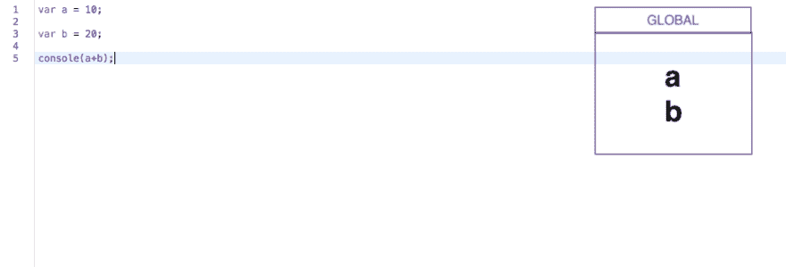
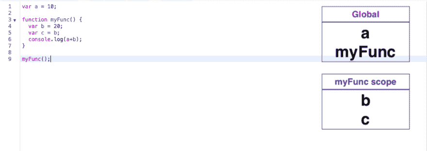
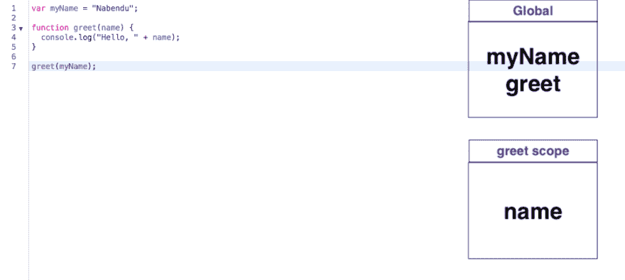
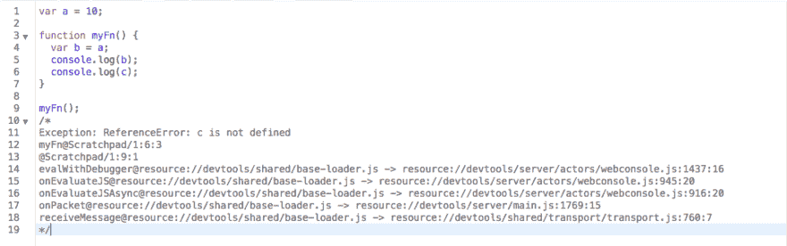
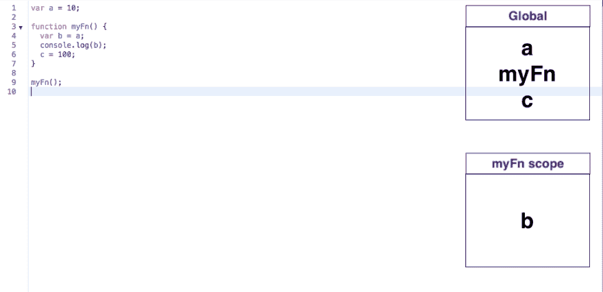

# YDKJS —范围和闭合—第 3 部分

> 原文：<https://dev.to/nabendu82/ydkjs-scopes-and-closures-part3-m75>

欢迎来到本系列的第 3 部分。

像 Java 和 C++这样的传统语言是编译语言，这意味着你必须从你的源代码中生成一个中间可执行文件。在 java 中你创建一个“jar 文件”,而在 C++中你创建一个“out 文件”。

在 javascript 中，你直接执行你的源代码。一个网页会直接执行你的 javascript。因此，许多人认为 Javascript 是一种解释语言。

> 然而，在 Javascript 中，这是解释步骤之前的一个编译步骤。所以，JS 既是解释语言又是编译语言。

编译步骤—在此步骤中，编译器主要注册变量声明。

让我们考虑下面的例子。编译步骤主要看 **var** 关键字。它不关心在这些变量中分配什么。

 *编译步骤*

当编译器转到第 1 行时，它遇到 var a 并将其注册到全局范围内，然后转到第 3 行并注册 var b。第 5 行只是一个控制台，它没有找到任何 var，所以不要做任何事情。

让我们考虑另一个例子。这里编译器找到了 4 个变量声明。

 *另一个编译步骤示例*

很明显，变量 a、b 和 c 是变量声明。但是第 3 行的 **myFunc** 也是一个变量声明，因为 JS 中的函数实际上是对象声明。

让我们再做一个。在这个变量声明中，第 1 行和第 3 行在全局范围内是显而易见的。但是在第 3 行有另一个变量声明，用于 **name=myName** ，它在 greet 范围内。

 *又一个编译步骤示例*

解释步骤——这个步骤之后是编译步骤，实际的执行发生在这个步骤中。

让我们只考虑上面的例子。一旦编译步骤完成，解释步骤开始。

现在解释器从**行 1** 开始，看到一个变量**我的名字**并询问编译器，它是否在全局范围内有一个变量我的名字，编译器是否有。所以，它给它赋值 **Nabendu** 。

在第 3 行，不需要进行赋值/执行，所以它转到第 7 行，这里有一个**函数 greet** ，它是从编译器全局范围内找到的。甚至它里面的 **myName** 变量也是全局范围的。

现在执行第 3 行，在这里找到另一个名为的变量**。它从 greet 作用域的编译器中找到的变量名。**

现在，一旦解释器进入函数内部，在第 4 行，它会找到**控制台**。它首先在编译器的*问候范围*中寻找*控制台*，然后在*全局范围*中寻找，但是没有找到。因此，它检查 Javascript 全局并找到它。在控制台内部有一个名称，它在 greet 作用域中找到。

让我们考虑一个解释器如何创建全局变量的例子。

 *解说者问题*

这里编译器成功运行，但是当解释器运行到第 6 行时，它首先在 myFn 范围内检查 c 的值，然后在全局范围内检查。但是它找不到它，所以抛出一个运行时错误。

让我们将第 6 行改为写操作，看看会发生什么。正如我们所知，对未声明变量的写操作不会抛出错误，而是由解释器来创建错误。

 *解说全局问题*

现在，在上面的代码中，编译器忽略第 6 行，因为没有用 var 声明变量。因此，当解释器来到第 6 行并向编译器请求变量 c 时，它没有在 myFn 或全局范围内得到它。
因为，写操作不会在 JS 中抛出错误。解释器在全局范围内创建相同的。