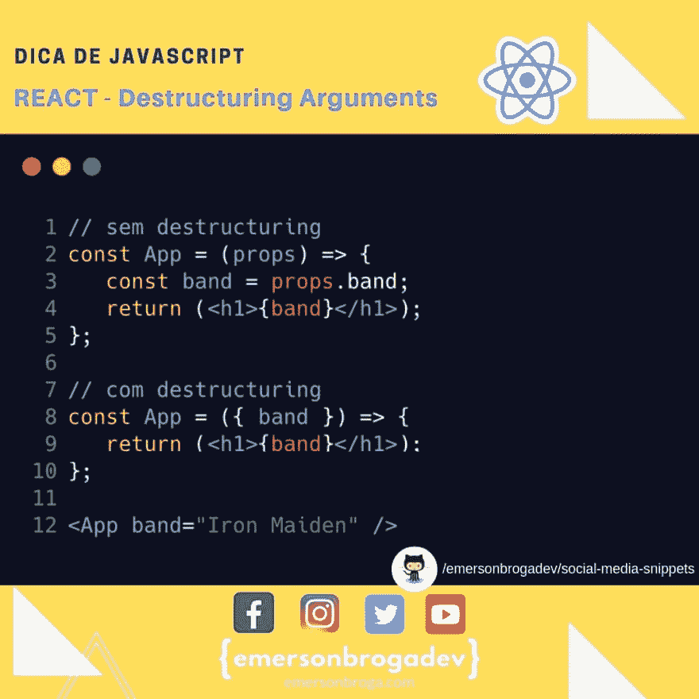

# 反应:析构参数

> 原文：<https://dev.to/emersonbroga/react-destructuring-arguments-1824>

在现代 JavaScript 中，尤其是在 React 中，另一个非常常见的做法是在函数的参数中使用 destroy。

您可以直接在函数参数中使用 dentro，这样您就可以在该函数中准确地获取所传递的对象。

[参加我们的开发者名单](https://emersonbroga.com/e/participe/)
[【学习 es 6】](https://amzn.to/2J4XnLg)[【查看 Instagram 上的提示](https://www.instagram.com/emersonbrogadev/)

=)