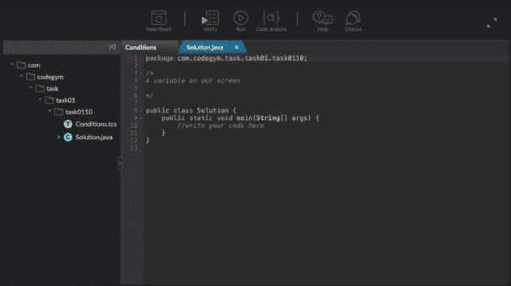
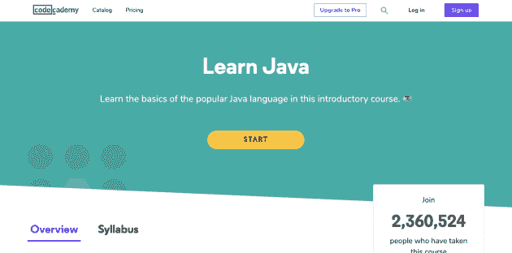
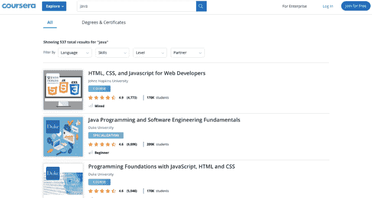

# 想快速学习 Java？烧掉你所有的 Java 教程

> 原文：<https://dev.to/selawsky/want-to-learn-java-quickly-burn-all-your-java-tutorial-books-38b>

每天，Java 编程世界都充斥着渴望学习 Java 语言的初学者。你也是，这并不奇怪。

用这种语言编码的好处几乎是无穷无尽的。作为世界上最受欢迎和最受欢迎的语言之一，你当然不能学习 Java 而失业！

但是，作为一名程序员，这不仅仅是一份丰厚的收入，它还让学习其他语言变得更加容易。当然，如果你知道正确的方法，你可以很容易地学习 Java。

### 这就是问题…

不幸的是，大多数时候，初学者在前进的道路上会遇到挫折。虽然这可能是其他因素的结果，但很大程度上是采用错误的方法学习 Java 的问题。

## 学习 Java 的错误方法是什么？

大概当你第一次在谷歌里输入“如何学习 java”时，弹出来的第一件事就是“java 全教程”。然后，你点击进入，首先映入你眼帘的是一大堆理论上的胡言乱语，或是一本让你回到高中时代的大部头书。你试着去读它，在你读到第一部分的结尾之前，你比开始时更加困惑。

这并不是说这个理论完全不好。不是的。每个学习过程都需要理论来解释细节。杀死它的是在学习编程语言时只坚持理论。

大多数所谓的 java 导师所做的——在理论上教授实用技能——是完全错误的。那从来不会有好结果。

为什么？

首先，它会耗尽你的激情和动力。用一位通俗学者的话来说:“课本从不教”。理论不能激发你的学习热情。事实上，阅读 java 上的理论教程只会让你孤立于学习之外。虽然它可以让你积累一些知识，但它肯定不能让你成为一名优秀的 Java 程序员。

其次，理论会减缓你的学习速度。在你阅读大量教科书的时间里，你可以通过实践在学习中取得巨大进步。避免一些学生犯的可怕错误。我总是得到它。就在最近，一些学生向我提出了这个问题。他们向我这个 Java 专家和导师吐露了他们在学习 Java 时遇到的挫折。他们承认他们已经学习 Java 一年多了，但仍然对代码如何工作感到困惑。真的吗？

是的，这很可笑。但是，嘿，很多 Java 学生遭受同样的命运。原因很简单:他们选择了错误的学习方法——理论！

## 那么，学习 Java 时，什么方法效果最好呢？

*   实践决定一切。好处几乎是无穷无尽的:实践导致专业。由于不断地、反复地练习，我能够成为一名专业的 Java 教师。当然，这是职业程序员成功的关键。你只需要去编码它！
*   帮助你学习。将知识应用于现实生活中的案例，增强你的能力。
*   **你练习得越多，你就会发现越多，**包括你还不知道的事情。
*   **指导你手工编码。与花哨的工具和框架相比，它赋予你更多的技能。您可以更好地理解编码逻辑。**
*   **帮你解决实际问题。**通过实践，你可以更好地理解问题，了解它们的动态，并提供适当的解决方案。

事实上，实践在学习 Java 编程语言中的地位是不可替代的。事实上，学习 Java 始于实践，也止于实践，尤其是在个人学习的时候。

## 可以学习 Java 的网上资源

如前所述，学习 Java 的成功取决于几个因素。虽然不断练习是一个关键因素，但在正确的平台上学习也同样重要。但是你必须看着它。互联网上充斥着声称完全了解并教授 Java 的不同资料。你在做出选择时应该小心谨慎。

这里是我挑选的平台和资源，你可以从中获得实用的 Java 指令。

### [CodeGym](https://codegym.cc/)

*CodeGym.cc 有 IntelliJ IDEA 集成插件*
CodeGym 的命名恰如其分。这正是你可以锻炼 Java 编码技能的地方。在平台上学习百分之八十是实用的。这给了你比平时学得更快的机会。你必须编码，编码，然后再编码！这就是这个平台为你提供的。

你将不得不执行 1200 个实际任务。这些任务是按照复杂程度排列的，所以你从最简单的开始，从最难的开始。当你完成任务后，他们会检查你的工作并给你打分。

## [代码学院](https://www.codecademy.com/catalog/language/java)

多年来，该平台已经在全球范围内培训了数百名程序员，你也可能是其中之一。它们为掌握 Java 和其他语言的学生提供了实际的学习体验。他们也很擅长与初学者合作。所以，他们会根据你选择关注的领域来帮助你计划你的学习。

而且别忘了，你可以在平台上规划和安排自己的时间，以便更好地学习。

## [Coursera](https://www.coursera.org/courses?query=java&)

当你访问 Coursera 网站时，首先映入你眼帘的是“**免费加入。**“好吧，别把它当成“免费赠品”你有一个强大的平台，在这里你可以快速学习 Java，甚至获得证书。这就是报酬的来源。

虽然在这个平台上学习不是完全免费的，但你可以同意这是值得的。他们从被认可的合作大学颁发证书。有一些学习材料，如视频和图像，可以帮助快速学习。

## [Java 重游](https://javarevisited.blogspot.com/)

这个平台提供了一种稍微不同的学习 Java 的方法。有大量实用的教程可供你参考和编写代码。他们教你用 Java 编程。所以，它更多的是理论和实践的结合。你阅读理论，然后应用它。

## 学习 Java 时要应用的一些技巧

当你选择在哪个平台上学习时，你应该注意一些能帮助你学得更快更好的提示。这些[提示](https://javarevisited.blogspot.com/2018/05/10-tips-to-become-better-java-developer.html#axzz5jwmmAbXI)对初学者和有经验的程序员都很有帮助。

*   不要害怕问别人。让我们搞清楚一件事:孤立地学习很难成功。这是一个可怕的方法。虽然你需要把个人的注意力放在学习上，但你也需要确保在必要的时候向他人伸出援手。你会遇到的一些问题，可能只要找个人聊聊就能解决。你永远不知道，他们可能遇到并解决了类似的问题。

*   跟随你导师的经验。在我的[博客](https://medium.com/@johnnythecoder)上，经常有人问我，这让我的学生如此成功。我只是笑着说“嗯，以我自己的经验，我是让他们走路的。”一个优秀的导师有丰富的经验，你可以利用这些经验来积累自己的知识。从这次经历中吸取教训。

*   加入编程论坛和社区。有许多程序员论坛和社区。加入活跃的团体，因为在那里你可以学到很多东西。你可以学习他人的经验，提出问题，并讨论和寻求解决你遇到的问题的方法。其中包括 [Java 论坛](http://www.javaprogrammingforums.com/)、 [Java 世界](https://www.javaworld.com/)、 [CodeGym 帮助](https://codegym.cc/help)，以及 Reddit 上的编程子编辑(如 [learnjava](https://www.reddit.com/r/learnjava/) 和 [learnprogramming](https://www.reddit.com/r/learnprogramming/) )

补充一下:重要的是要明白这些论坛和社区充斥着不同的角色。不要指望只看到好的。事实上，可能会有这样的情况，你会比以前更加失望和困惑。现在是钓鱼的时代，所以你必须学会如何忽略它。

## 如何建立有效的自学 Java 的计划

毫无疑问，学习 Java 需要计划和坚持计划的纪律。这是成功的职业程序员的秘诀之一。你如何实现这一点？

*   为你的教育制定一个时间表，想办法减少分心。你需要严格按照时间表来约束自己。
*   问正确的问题。不是每个问题都是必要的，都需要一个解决方案。询问相关问题，以便获得有帮助的解决方案。
*   从基础开始。如果你是初学者，从基础开始。不要跳到任何层次，不管它看起来有多简单。
*   每天编码。熟能生巧。你需要不断练习。让编码成为日常习惯。例如，您可以:
*   编写迷你程序。
*   一旦掌握了基础知识，就不要回避使用 Java APIs 编写更高级的程序。
*   尝试构建至少一个 web 和一个桌面应用程序。
*   充分利用专门讨论 Java 和编程语言的博客和论坛。这会帮助你提高。
*   运用 80%实践和 20%理论的原则。
*   每天继续学习，即使在你成功之后。

## 包装完毕

停止收集 Java 教材。他们对你没有好处。事实上，为了显示学习 Java 的严肃性，可以把你的 Java 书点着。

我猜这是让你明白书本不能教你用 Java 编码的更激烈的方式。最好的学习方法是编码。不断练习编码会带来很大的不同，你做的多少和多好决定了你学习的速度。

更何况，在你的学习过程中，不要把交流当成理所当然。访问对 Java 感兴趣的程序员的论坛和社区。分享想法，提出问题，做出有意义的贡献。这些肯定会促进你的学习过程。