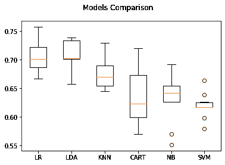

# 关于分类的简短说明

> 原文：<https://dev.to/thnery/a-short-brief-about-classification-3pgo>

[](https://res.cloudinary.com/practicaldev/image/fetch/s--_jRAhLTB--/c_limit%2Cf_auto%2Cfl_progressive%2Cq_auto%2Cw_880/https://thepracticaldev.s3.amazonaws.com/i/7brl707yigrhno91vc6d.jpg)

# 什么是分类？

这是我听到分类这个词时做的第一个问题。这个定义说，从根本上来说，它是一个预测标签的模型。这给我带来了一个新的问题。什么是**标签**？嗯，在分类模型的**数据集**中，我们会发现**特征**和**标签**，其中特征是用作输入数据的列，标签是我们想要预测的值。
因此，当我们知道我们想要用机器学习模型预测什么值时，我们就有了一个分类问题。

# 测试分类模型

我们来获取一个 NBA 日志数据集。目标是预测一个球员是否会在联盟中坚持超过 5 年。该数据包含一个目标列，TARGET _ 5Yrs 列可以为 0 ( < 5 years) or 1 (> = 5 年)。由于我们知道我们的目标(标签)，我们可以肯定地说这是一个分类问题。

这个数据集可以在[这里](https://data.world/exercises/logistic-regression-exercise-1)找到。

## 要求

下面是我们将在这个例子中使用的库。

```
import os

import numpy as np
import pandas as pd
import matplotlib.pyplot as plt

from pandas.plotting import scatter_matrix
from sklearn import model_selection
from sklearn.metrics import classification_report
from sklearn.metrics import confusion_matrix
from sklearn.metrics import accuracy_score
from sklearn.linear_model import LogisticRegression
from sklearn.tree import DecisionTreeClassifier
from sklearn.neighbors import KNeighborsClassifier
from sklearn.discriminant_analysis import LinearDiscriminantAnalysis
from sklearn.naive_bayes import GaussianNB
from sklearn.svm import SVC

# define the dataset path DATASET_PATH = os.path.join("datasets")
SEED = 7 
```

Enter fullscreen mode Exit fullscreen mode

## 加载数据集

首先要做的是加载数据集，让我们使用 Pandas 来完成它，并检查数据是如何可用的。

```
# create a function to load the dataset def load_nba_data(dataset_path=DATASET_PATH):
    csv_path = os.path.join(dataset_path, "nba_logreg.csv")
    return pd.read_csv(csv_path)

# load the dataset nba_data = load_nba_data()
# replace NaN fields with 0 nba_data.fillna(0, inplace=True)
# show 10 first rows nba_data.head(10) 
```

Enter fullscreen mode Exit fullscreen mode

|  | 名字 | GP | 部 | 香港警察训练学校（Police Training School 的缩写） | FGM | 国外一般代理人(Foreign General Agent) | FG% | 3P 制造 | 3PA | 3P% | ... | 自由贸易协定 | 英尺% | OREB | DREB | 与姓名连用 | 大西洋时间 | 标准模板库 | 良性苔癣样角化病 | TOV | 目标 _ 5 年 |
| --- | --- | --- | --- | --- | --- | --- | --- | --- | --- | --- | --- | --- | --- | --- | --- | --- | --- | --- | --- | --- | --- |
| Zero | 布兰登·英格拉姆 | Thirty-six | Twenty-seven point four | Seven point four | Two point six | Seven point six | Thirty-four point seven | Zero point five | Two point one | Twenty-five | ... | Two point three | Sixty-nine point nine | Zero point seven | Three point four | Four point one | One point nine | Zero point four | Zero point four | One point three | Zero |
| one | 安德鲁·哈里森 | Thirty-five | Twenty-six point nine | Seven point two | Two | Six point seven | Twenty-nine point six | Zero point seven | Two point eight | Twenty-three point five | ... | Three point four | Seventy-six point five | Zero point five | Two | Two point four | Three point seven | One point one | Zero point five | one point six | Zero |
| Two | 贾卡尔·桑普森 | Seventy-four | Fifteen point three | Five point two | Two | Four point seven | Forty-two point two | Zero point four | One point seven | Twenty-four point four | ... | One point three | Sixty-seven | Zero point five | One point seven | Two point two | One | Zero point five | Zero point three | One | Zero |
| three | 马里克·西里 | Fifty-eight | Eleven point six | Five point seven | Two point three | Five point five | Forty-two point six | Zero point one | Zero point five | Twenty-two point six | ... | One point three | Sixty-eight point nine | One | Zero point nine | One point nine | Zero point eight | Zero point six | Zero point one | One | One |
| four | 马特·盖格尔 | Forty-eight | Eleven point five | Four point five | one point six | Three | Fifty-two point four | Zero | Zero point one | Zero | ... | One point nine | Sixty-seven point four | One | One point five | Two point five | Zero point three | Zero point three | Zero point four | Zero point eight | One |
| five | 托尼·本内特 | Seventy-five | Eleven point four | Three point seven | One point five | Three point five | Forty-two point three | Zero point three | One point one | Thirty-two point five | ... | Zero point five | Seventy-three point two | Zero point two | Zero point seven | Zero point eight | One point eight | Zero point four | Zero | Zero point seven | Zero |
| six | 唐·麦克林 | Sixty-two | Ten point nine | Six point six | Two point five | Five point eight | Forty-three point five | Zero | Zero point one | Fifty | ... | One point eight | Eighty-one point one | Zero point five | One point four | Two | Zero point six | Zero point two | Zero point one | Zero point seven | One |
| seven | 特雷西·穆雷 | Forty-eight | Ten point three | Five point seven | Two point three | Five point four | Forty-one point five | Zero point four | One point five | Thirty | ... | Zero point eight | Eighty-seven point five | Zero point eight | Zero point nine | One point seven | Zero point two | Zero point two | Zero point one | Zero point seven | One |
| eight | 杜安·库珀 | Sixty-five | Nine point nine | Two point four | One | Two point four | Thirty-nine point two | Zero point one | Zero point five | Twenty-three point three | ... | Zero point five | Seventy-one point four | Zero point two | Zero point six | Zero point eight | Two point three | Zero point three | Zero | One point one | Zero |
| nine | 戴夫·约翰逊 | forty-two | Eight point five | Three point seven | One point four | Three point five | Thirty-eight point three | Zero point one | Zero point three | Twenty-one point four | ... | One point four | Sixty-seven point eight | Zero point four | Zero point seven | One point one | Zero point three | Zero point two | Zero | Zero point seven | Zero |

10 行× 21 列

这是我们数据集的一个小样本。让我们丢弃名字和目标 5 年栏，所有其他的是每个球员的特征，这些将告诉我们球员是否会在一个联盟中持续超过 5 年。TARGET _ 5Yrs 拥有每种功能组合的答案。

让我们用 info()函数检查一下数据集的快速描述。

```
# first let's remove the uneeded Name column, 'cause it's not relevant for this experiment nba_data = nba_data.drop('Name', 1)
nba_data.info() 
```

Enter fullscreen mode Exit fullscreen mode

```
# first let's remove the uneeded Name column, 'cause it's not relevant for this experiment nba_data = nba_data.drop('Name', 1)
nba_data.info() 
```

Enter fullscreen mode Exit fullscreen mode

```
<class 'pandas.core.frame.DataFrame'>
RangeIndex: 1340 entries, 0 to 1339
Data columns (total 20 columns):
GP             1340 non-null int64
MIN            1340 non-null float64
PTS            1340 non-null float64
FGM            1340 non-null float64
FGA            1340 non-null float64
FG%            1340 non-null float64
3P Made        1340 non-null float64
3PA            1340 non-null float64
3P%            1340 non-null float64
FTM            1340 non-null float64
FTA            1340 non-null float64
FT%            1340 non-null float64
OREB           1340 non-null float64
DREB           1340 non-null float64
REB            1340 non-null float64
AST            1340 non-null float64
STL            1340 non-null float64
BLK            1340 non-null float64
TOV            1340 non-null float64
TARGET_5Yrs    1340 non-null float64
dtypes: float64(19), int64(1)
memory usage: 209.5 KB 
```

Enter fullscreen mode Exit fullscreen mode

我们还可以使用`describe`函数检查数据集的一些统计信息。

```
nba_data.describe() 
```

Enter fullscreen mode Exit fullscreen mode

|  | GP | 部 | 香港警察训练学校（Police Training School 的缩写） | FGM | 国外一般代理人(Foreign General Agent) | FG% | 3P 制造 | 3PA | 3P% | FTM | 自由贸易协定 | 英尺% | OREB | DREB | 与姓名连用 | 大西洋时间 | 标准模板库 | 良性苔癣样角化病 | TOV | 目标 _ 5 年 |
| --- | --- | --- | --- | --- | --- | --- | --- | --- | --- | --- | --- | --- | --- | --- | --- | --- | --- | --- | --- | --- |
| 数数 | 1340.000000 | 1340.000000 | 1340.000000 | 1340.000000 | 1340.000000 | 1340.000000 | 1340.000000 | 1340.000000 | 1340.000000 | 1340.000000 | 1340.000000 | 1340.000000 | 1340.000000 | 1340.000000 | 1340.000000 | 1340.000000 | 1340.000000 | 1340.000000 | 1340.000000 | 1340.000000 |
| 意思是 | 60.414179 | 17.624627 | 6.801493 | 2.629104 | 5.885299 | 44.169403 | 0.247612 | 0.779179 | 19.149627 | 1.297687 | 1.821940 | 70.300299 | 1.009403 | 2.025746 | 3.034478 | 1.550522 | 0.618507 | 0.368582 | 1.193582 | 0.620149 |
| 标准 | 17.433992 | 8.307964 | 4.357545 | 1.683555 | 3.593488 | 6.137679 | 0.383688 | 1.061847 | 16.051861 | 0.987246 | 1.322984 | 10.578479 | 0.777119 | 1.360008 | 2.057774 | 1.471169 | 0.409759 | 0.429049 | 0.722541 | 0.485531 |
| 部 | 11.000000 | 3.100000 | 0.700000 | 0.300000 | 0.800000 | 23.800000 | 0.000000 | 0.000000 | 0.000000 | 0.000000 | 0.000000 | 0.000000 | 0.000000 | 0.200000 | 0.300000 | 0.000000 | 0.000000 | 0.000000 | 0.100000 | 0.000000 |
| 25% | 47.000000 | 10.875000 | 3.700000 | 1.400000 | 3.300000 | 40.200000 | 0.000000 | 0.000000 | 0.000000 | 0.600000 | 0.900000 | 64.700000 | 0.400000 | 1.000000 | 1.500000 | 0.600000 | 0.300000 | 0.100000 | 0.700000 | 0.000000 |
| 50% | 63.000000 | 16.100000 | 5.550000 | 2.100000 | 4.800000 | 44.100000 | 0.100000 | 0.300000 | 22.200000 | 1.000000 | 1.500000 | 71.250000 | 0.800000 | 1.700000 | 2.500000 | 1.100000 | 0.500000 | 0.200000 | 1.000000 | 1.000000 |
| 75% | 77.000000 | 22.900000 | 8.800000 | 3.400000 | 7.500000 | 47.900000 | 0.400000 | 1.200000 | 32.500000 | 1.600000 | 2.300000 | 77.600000 | 1.400000 | 2.600000 | 4.000000 | 2.000000 | 0.800000 | 0.500000 | 1.500000 | 1.000000 |
| 最大 | 82.000000 | 40.900000 | 28.200000 | 10.200000 | 19.800000 | 73.700000 | 2.300000 | 6.500000 | 100.000000 | 7.700000 | 10.200000 | 100.000000 | 5.300000 | 9.600000 | 13.900000 | 10.600000 | 2.500000 | 3.900000 | 4.400000 | 1.000000 |

让我们看看我们的目标分布在数据集上。

```
nba_data.groupby('TARGET_5Yrs').size() 
```

Enter fullscreen mode Exit fullscreen mode

```
TARGET_5Yrs
0.0    509
1.0    831
dtype: int64 
```

Enter fullscreen mode Exit fullscreen mode

在简历中，我们的数据集中有 1340 个对象，其中 509 个不会在联盟中持续超过 5 年，其他 831 个会。

## 机器学习模型评估

正如我们在本帖开头看到的，这是一个**分类问题**。我们将使用不同的 ML 算法创建一些模型，并检查它们的准确性。

### 拆分数据

让我们将数据集分成两个新的数据集。我们将使用 80%的数据集来训练我们的分类模型，20%的数据集来执行验证。

```
data = nba_data.values
# data = np.array(data) 
# now let's separate the features columns from the target column X = data[:, 0:19]
Y = data[:, 19]

# as said before,  we will use 20% of the dataset for validation validation_size = 0.20

# split the data into traning and testing X_train, X_test, Y_train, Y_test = model_selection.train_test_split(X, Y, test_size=validation_size, random_state=SEED) 
```

Enter fullscreen mode Exit fullscreen mode

既然我们已经有了训练和测试集，我们将使用我们想要评估的模型创建一个数组。我们将使用每个模型的默认设置。

```
models = []
models.append(('LR', LogisticRegression(solver='liblinear', multi_class='ovr')))
models.append(('LDA', LinearDiscriminantAnalysis()))
models.append(('KNN', KNeighborsClassifier()))
models.append(('CART', DecisionTreeClassifier()))
models.append(('NB', GaussianNB()))
models.append(('SVM', SVC(gamma='auto'))) 
```

Enter fullscreen mode Exit fullscreen mode

为了评估模型，我们将使用 K-Fold 交叉验证并测量每个模型的准确性。这项技术将训练集随机分成 K 个不同的子集(*折叠*)，然后对模型进行 K 次训练和评估，每次评估选择不同的折叠。结果将是一个包含 K 个评估分数的数组。对于这个例子，我们将使用来自 **SKLearn** 的**分层文件夹**进行交叉验证。我们将使用每个模型的精确度的平均值来确定哪一个具有最好的结果。

```
scoring = 'accuracy'
models_results = []
for name, model in models:
    results = []
    skfolds = model_selection.StratifiedKFold(n_splits=10, random_state=SEED)
    for train_index, test_index in skfolds.split(X_train, Y_train):
        X_train_folds = X_train[train_index]
        Y_train_folds = (Y_train[train_index])
        X_test_folds = X_train[test_index]
        Y_test_folds = (Y_train[test_index])

        model.fit(X_train_folds, Y_train_folds)
        pred = model.predict(X_test_folds)
        correct = sum(pred == Y_test_folds)
        results.append(correct / len(pred))
    models_results.append((name, results))

names = []
scores = []
# the snippet bellow calculates the mean of the accuracies for name, results in models_results:
    mean = np.array(results).mean()
    std = np.array(results).std()
    print("Model: %s, Accuracy Mean: %f (%f)" % (name, mean, std))
    names.append(name)
    scores.append(results) 
```

Enter fullscreen mode Exit fullscreen mode

```
Model: LR, Accuracy Mean: 0.705244 (0.026186)
Model: LDA, Accuracy Mean: 0.706205 (0.027503)
Model: KNN, Accuracy Mean: 0.674429 (0.026029)
Model: CART, Accuracy Mean: 0.634372 (0.047236)
Model: NB, Accuracy Mean: 0.632433 (0.040794)
Model: SVM, Accuracy Mean: 0.619384 (0.021099) 
```

Enter fullscreen mode Exit fullscreen mode

上述结果表明，在我们测试的模型中，线性判别分析的准确度最高。下面的方框图显示了每个褶皱的准确度分数。

```
fig = plt.figure()
fig.suptitle('Models Comparison')
ax = fig.add_subplot(111)
plt.boxplot(scores)
ax.set_xticklabels(names)
plt.show() 
```

Enter fullscreen mode Exit fullscreen mode

[](https://res.cloudinary.com/practicaldev/image/fetch/s--21mXO4Qv--/c_limit%2Cf_auto%2Cfl_progressive%2Cq_auto%2Cw_880/https://thepracticaldev.s3.amazonaws.com/i/k4qoc4pc0zencsw0ww02.png)

## 做出预测

现在，我们将通过使用之前准备的验证集进行一些预测来检查 LDA 模型的准确性。为此，我们将创建模型的一个实例，并使用方法`predict`。

```
model = LinearDiscriminantAnalysis()
model.fit(X_train, Y_train)
predictions = model.predict(X_test)
print("Accuracy: {}".format(accuracy_score(Y_test, predictions))) 
```

Enter fullscreen mode Exit fullscreen mode

```
Accuracy: 0.6902985074626866 
```

Enter fullscreen mode Exit fullscreen mode

我们还可以检查该模型的混淆矩阵

```
print(confusion_matrix(Y_test, predictions)) 
```

Enter fullscreen mode Exit fullscreen mode

```
[[ 52  45]
 [ 38 133]] 
```

Enter fullscreen mode Exit fullscreen mode

混淆矩阵中的每一行代表一个**实际目标**，每一列代表一个**预测目标**。该矩阵的第一行包含**真阴性**和**假阳性**。这意味着 52 个样本被正确分类，45 个被错误分类。第二行显示了**假阴性**和**真阳性**，这意味着 38 个样本被错误分类，133 个被正确分类。

混淆矩阵提供了很多信息，但是如果你想得到一个更简洁的指标，你可以使用 Scikit-Learn 的`classification_report`函数。它将提供**精度**、**召回**和**f1-得分**指标。

```
print(classification_report(Y_test, predictions)) 
```

Enter fullscreen mode Exit fullscreen mode

```
 precision    recall  f1-score   support

         0.0       0.58      0.54      0.56        97
         1.0       0.75      0.78      0.76       171

    accuracy                           0.69       268
   macro avg       0.66      0.66      0.66       268
weighted avg       0.69      0.69      0.69       268 
```

Enter fullscreen mode Exit fullscreen mode

正面预测的准确度称为**精度**。它由公式 TP/(TP + FP)定义，其中 TP 是**真阳性**的数量，FP 是**假阳性**的数量。该指标通常用于**召回**，这是真正的阳性率——模型正确检测到的阳性实例的比率。它的等式是:TP / (TP + FN)其中 FN 是**假阴性**。

## 结论

这是一篇关于用 Python 和 Scikit 学习分类的简短文章。还有更多的内容需要介绍，例如，我们可以通过标准化数据来改进我们的模型结果。还需要涵盖其他指标。但是进入机器学习世界的第一步可以通过本教程来完成。希望你喜欢它！！

您可以在此访问本示例的笔记本[。](https://github.com/thnery/machine-learning/blob/develop/classification/classification_001.ipynb)

## 参考文献

*   你在 Python 中的第一个机器学习项目 Step-By-Step-[https://machinelingmastery . com/Machine-Learning-in-Python-Step-By-Step/](https://machinelearningmastery.com/machine-learning-in-python-step-by-step/)

*   Gé ron，A. (2017)。用 Scikit-Learn 和 TensorFlow 进行机器学习:构建智能系统的概念、工具和技术。