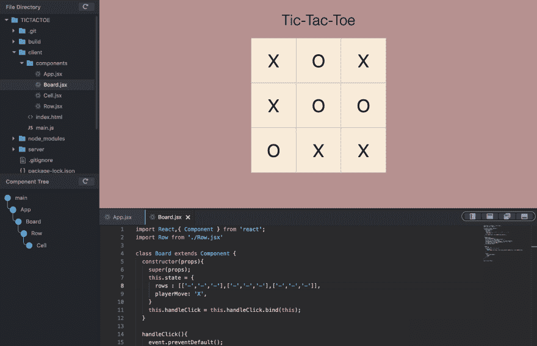

# React Web 应用的第一个专用 IDE 终于来了——React IDE 3.0 Beta

> 原文：<https://dev.to/ep36/the-first-dedicated-ide-for-react-web-applications-is-finally-here-reactide-3-0-beta-2j04>

除了网飞、易贝、Airbnb、Dropbox、Instagram 和脸书背后的团队，目前有超过 130 万个网站和应用程序基于 React 构建，使其成为有史以来最强大和无处不在的框架之一。

React 已经迅速成为开发人员构建 web 应用、移动应用、桌面甚至 VR 的首选解决方案。现在，随着 React Hooks 的推出，对集成开发解决方案的需求越来越大。

* * *

## 呼吁网络简化

React 核心工程师 Sophie Alpert 在之前的 React 会议上表示:

> 我们已经失去了很多网络简单性…我们想要的是能够为你的应用程序创建一个单独的文件，并运行它，而不必设置任何东西…我们需要社区来构建更多这样的工具。"

Reactide 团队通过向开发者社区寻求更多见解来应对这一挑战。我们在 ReactJS 纽约的各种活动中与数十名 React 开发人员进行了交谈，并确定了 React 开发中的主要难点:

*   定制 React boiler-plating 需要数小时的配置和 JavaScript 疲劳，即使是快速原型制作。
*   当前的开发者工具被分成专门的案例，并且不提供交叉利用。
*   React 应用程序已经发展到拥有多达数千个组件，这使得组件管理几乎令人望而却步。
*   长的组件链使得状态流难以跟踪和调试。

我们开始了解决这些棘手问题的旅程，以便开发人员可以回到编码的工作中。

* * *

我们非常高兴地推出世界上第一个 React web 开发专用 IDE-[React IDE](https://reactide.io)。

## 一键扩展的开发者环境

Reactide 是一个跨平台的桌面应用程序，它提供了一个定制的模拟器，使得构建工具和服务器配置变得不必要。这将开发带回了打开单个文件就能在浏览器中立即呈现项目的时代。现在，开发人员可以通过一个 React JSX 文件实现同样的简单性，同时仍然利用 React 的强大功能。

## 可导航，可编辑，实时可视化

我们也很高兴地宣布一个创新的可视化工具，允许开发人员通过 Reactide 的定制组件树渲染器**实时导航和编辑代码。**这使得管理状态流变得直观、直接，尤其是直观。

## 同步属性

为了进一步加速 React 开发流程，Reactide 提供了组件属性和样式的同步 **GUI 控件。**现在，必须等待并将每个小编辑上传到项目的繁琐过程变得即时。

这是一个漫长的旅程，Reactide 3.0 背后的团队- [胡安·哈特](https://github.com/juanhart1)、[哈立德·乌马尔](https://github.com/khalid050)、[洛奇·廖](https://github.com/seemsrocky)和[我自己](https://github.com/EP36) -终于高兴地呼吁测试员。Reactide 适用于 Mac、Linux 和 Windows。

### 请访问 [Reactide.io](https://reactide.io) 并在 [GitHub](http://github.com/reactide/reactide) 上与我们分享最新消息，成为 Reactide 正式发布的一部分！