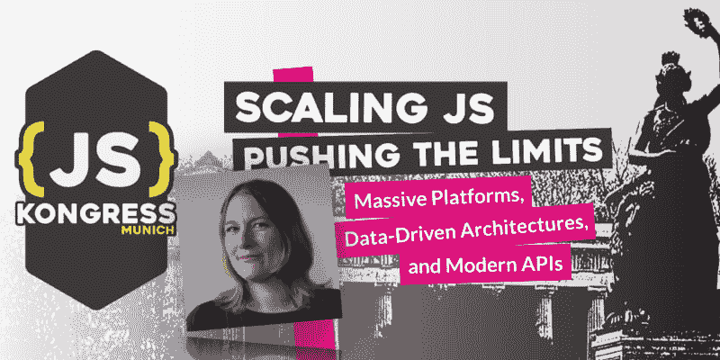

# 杰西卡·罗斯加入了项目委员会

> 原文：<https://dev.to/jskongress/jessica-rose-joins-the-program-committee-l94>

<figure> 

<figcaption>[杰西卡·罗斯](https://medium.com/u/e2bf65445f72)与 Mozilla 合作，运行 TechSpeaker 程序。她热衷于增加技术教育和有意义的技术工作。她主持了 Pursuit 播客，创建了开放代码 meetup 系列，并共同创建了 Trans*Code。她总是很兴奋地和你谈论你正在做的事情。</figcaption>

</figure>

有请 Jessica，JS Kongress 2020 计划委员会的首批成员之一。从 10 月 16 日开始征集论文截止，委员会将开始审查所有提交的论文，并选出最符合主题的论文。首先，我们问了她几个问题:

*   **你为什么期待#jskongress？**

我一直想参加这个活动，它是世界上最受欢迎的 JavaScript 会议之一(或者至少在我的网络中！)我很高兴能看到今年的演讲者，并见到一些与会者，尤其是第一次与会者。

*   你如何看待或联想到 2020 年的格言“扩展 JS——挑战极限:大规模平台、数据驱动架构和现代 API”？

当我想到扩展 JS 时，我想到了行业围绕这些问题共享知识的需要(例如，通过 JSKongress！)确保该领域的人才能够以一种获得支持和充分了解的方式应对这些大规模挑战。我很高兴能在活动中实时看到这方面的知识分享！

*   你对这个项目的愿景是什么？

我希望帮助塑造一个节目，将多样化和令人信服的声音带到舞台上，希望这能为围绕主题的在线和离线对话创造空间。我希望能够看到前沿新技术的内容，以及扩展旧代码库的挑战。我想听听第一次发言的人，听听已经在这个行业工作了一段时间的人的新声音和令人信服的新材料。

*   你还记得你第一次接触 JS 的时候吗？原因是什么，或者是谁？

哦，天哪，我担心这可能显示我的年龄。那是很久很久以前的事了，当时我正试图在我的第一个网站上从奇怪的借来的代码和清理出来的代码中寻找出路。我想知道那段奇怪的代码是什么意思，我还能用它做些什么。我立刻感到沮丧和高兴。

*   你对所有演讲者和所有想提交演讲想法的人有什么激励吗？

我鼓励任何有故事要讲的人投稿。我今年听到的一些最有趣的技术挑战、修复和叙述都来自一对一聊天的人，他们认为自己的想法不值得出现在舞台上。请分享你的故事，我们很想看看。

* * *

#jskongress 2020 的论文征集截止到 10 月 15 日——我们期待在[https://sessionize.com/js-kongress-2020](https://sessionize.com/js-kongress-2020)上读到你的想法

帖子[杰西卡·罗斯加入计划委员会](https://js-kongress.com/2019/08/13/jessica-rose-joins-the-program-committee/)最早出现在 [JS KONGRESS 2020:扩展 JS-挑战极限:大规模平台、数据驱动架构和现代 API。](https://js-kongress.com)。