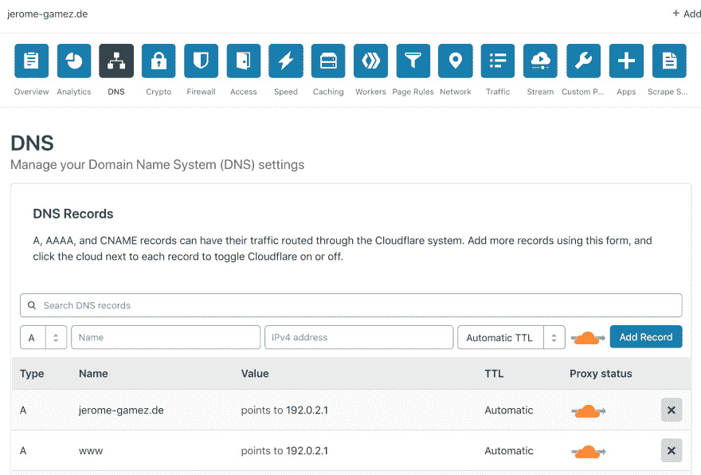
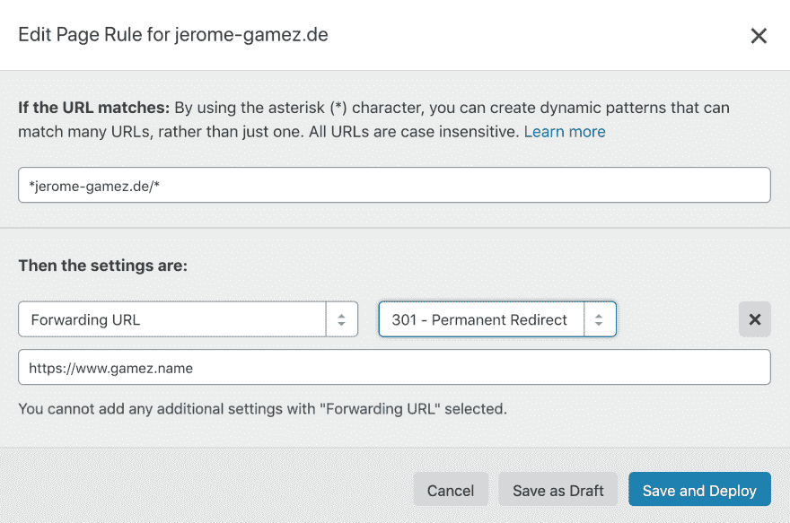

# 使用 Cloudflare 转发没有服务器的域

> 原文：<https://dev.to/jeromegamez/forwarding-domains-without-a-server-with-cloudflare-49kk>

*[图片](https://unsplash.com/photos/H5qxGjUTN-k)作者[朱冰](https://unsplash.com/@zhubing428)，来源于 [the Cloudflare forums](https://community.cloudflare.com/t/using-page-rules-without-an-a-record/59069)*

想象一下，你刚刚为你的下一个副业项目买了一个新的域名，还没有一个网站，但也不希望它指向空白。我过去对此的通常做法是这样的:

*   设置域的 A 记录指向我的主网站的 IP 地址。
*   更新该站点的 web 服务器配置以侦听新域。
*   一旦侧项目准备就绪，恢复设置并用新的 IP 地址更新 A 记录。

虽然这很容易，但仍然需要更新一个不相关的站点，如果没有现有的站点作为临时占位符，该怎么办？

当我想把我的(超级旧的)域名 [jerome-gamez.de](https://www.jerome-gamez.de) 重定向到我当前的 [gamez.name](https://www.gamez.name) 时，就是这种情况。当我开始怀疑是否有更简单的解决方案时，我已经在我的 VPS 上更新配置了——我想我找到了一个使用 [Cloudflare DNS](https://www.cloudflare.com) 和[页面规则](https://www.cloudflare.com/features-page-rules/)的解决方案，我今天想与你分享它。

* * *

如果您还没有，[在 Cloudflare](https://dash.cloudflare.com/sign-up) 创建一个帐户(这是免费的)，添加您的站点并将您的域名的 NS 记录指向您站点的仪表板上命名的名称服务器。

### 设置 DNS

在 **DNS** 仪表板上，输入以下条目:

| 类型 | 名字 | 价值 | 晶体管-晶体管逻辑。 | 代理状态 |
| --- | --- | --- | --- | --- |
| A | `@` | 192.0.2.1 | 自动的 | 使能够 |
| A | `www` | 192.0.2.1 | 自动的 | 使能够 |

*我不确定`www`条目是否真的需要——为了确定，我创建了它，它至少没有破坏任何东西*

### 设置页面规则

在**页面规则**仪表板上，创建一个新的页面规则:

| URL 模式 | 环境 | 价值 |
| --- | --- | --- |
| `*your-domain.tld/*` | 转发 URL | `your-target.tld` |

如果是临时转发，使用`302`作为状态，否则使用`301`。

### 等待

大多数情况下，传播设置的过程只需要几分钟，但在某些情况下需要更长时间。你可以在[whatsmydns.net](https://www.whatsmydns.net)上查看当前进度。

完成后，您的域(以及其上的任何路径)应该重定向到页面规则中配置的目标。

在我的域名上尽可能多地尝试一下，例如在[https://jerome-gamez.de/you-wont-believe-what-happens-next](https://jerome-gamez.de/you-wont-believe-what-happens-next)或[https://www.jerome-gamez.de/www-works-too](https://www.jerome-gamez.de/www-works-too)并给我发送一些流量——但不要失望，没有什么有趣的东西可看:)。