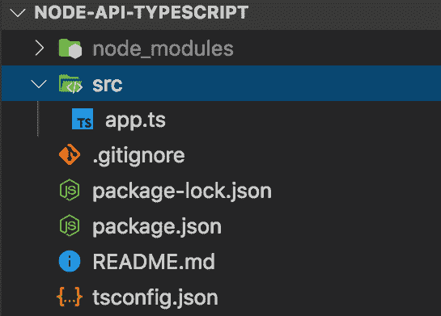

# 使用 Typescript 设置节点 API

> 原文：<https://dev.to/easybuoy/setting-up-node-api-with-typescript-2eeh>

我将带我们完成用 typescript 设置基本节点 API 的步骤。

> 注意:您的机器上应该安装了 [Nodejs](https://nodejs.org/en/) 。

第一件事是创建我们的项目文件夹，并用 npm 初始化它以生成`package.json`文件。

```
npm init -y 
```

安装依赖关系

```
npm i express --save
npm i @types/node @types/express ts-node typescript nodemon --save-dev 
```

在您的应用程序的根目录下创建一个`tsconfig.json`文件，或者在您的终端上运行`npx tsc --init`并添加下面的配置。

```
{  "compilerOptions":  {  "target":  "es6",  "module":  "commonjs",  "allowJs":  true,  "outDir":  "./build",  "rootDir":  "./src",  "esModuleInterop":  true  }  } 
```

> 注意:更多选项可以添加到`tsconfig.json`文件中。
> 点击了解更多[。](https://www.typescriptlang.org/docs/handbook/compiler-options.html)

向 package.json 文件添加脚本。

```
"scripts":  {  "dev":  "nodemon src/app.ts",  "start":  "tsc && node build/app"  } 
```

创建一个用于构建我们的应用程序的目录。在`src`目录中，创建一个`app.ts`文件。

在`app.ts`文件中，添加下面的代码。

```
import express, { Application, Request, Response, NextFunction } from "express";

const app: Application = express();

app.use(express.json());

app.get("/", (req: Request, res: Response): object => {
    return res.json({ status: "success", message: "Welcome to API Service" });
  }
);

app.use((req: Request, res: Response, next: NextFunction) => {
  const error = new Error("Route Not found");
  next(error);
});

app.use((error: { message: string; status: number }, req: Request, res: Response,next: NextFunction
  ) => {
    res.status(error.status || 500);
    res.json({
      status: "error",
      message: error.message
    });
    next();
  }
);

const PORT: any = process.env.PORT || 3000;

app.listen(PORT, () => console.log(`app listening on port ${PORT}`)); 
```

此时，您的项目结构应该如下图所示。

[](https://res.cloudinary.com/practicaldev/image/fetch/s--ZUVn5TnS--/c_limit%2Cf_auto%2Cfl_progressive%2Cq_auto%2Cw_880/https://thepracticaldev.s3.amazonaws.com/i/2lfl5rlcjrjksx9d3ba3.png)

### 发展👨🏾‍💻

要在开发环境中运行应用程序，运行下面的命令

```
npm run dev 
```

> 注意:上面的命令编译内存中 src 目录下的文件。

### 生产🚀

要在生产环境中运行应用程序，请运行下面的命令

```
npm start 
```

> 注意:上面的命令将在`src`目录中找到的文件编译到`build`目录中，并运行`build`目录中的 app.js 文件，如上面我们的`package.json`文件中的`start script`所指定的。

本文使用的项目可以在这里找到[。](https://github.com/Easybuoy/node-api-typescript)

如果您有任何问题或反馈，请留下评论。

感谢阅读。