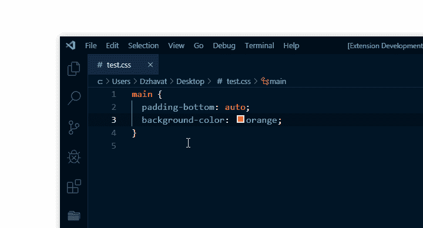

# 显示 CSS 属性初始值的 VS 代码扩展

> 原文：<https://dev.to/dzhavat/showdev-vs-code-extension-that-shows-the-initial-value-of-a-css-property-3c9k>

这篇文章最初发表在我的博客上。

* * *

几天前，我有了一个关于 VS 代码扩展的想法，在悬停时显示给定 CSS 属性的初始值(默认值)。这为我解决了一个实际问题，因为大多数时候我使用默认值来“重置”一个属性。

这意味着如果我在一个元素上有`background-color: tomato`并想把它设置为初始值，我可能会用`transparent`而不是`initial`、`unset`或其他什么。因此，我没有记住所有 CSS 属性的初始值，而是为自己创建了一个扩展。

考虑到这一点，我向你展示 CSS 初始值。

这里有一个小演示:

这个扩展非常简单，可能会出现一些奇怪的情况，但是我想和大家分享一下，以便得到反馈。这也是我的第一个扩展，所以我很确定还有可以改进的地方。代码是[开源的](https://github.com/dzhavat/css-initial-value)如果有人想看看或贡献。

如果您使用 CSS，请尝试一下。希望你觉得有用。

##  [扎瓦特](https://github.com/dzhavat)/[CSS-初始值](https://github.com/dzhavat/css-initial-value)

### VS 代码扩展，显示每个属性的初始值。

<article class="markdown-body entry-content container-lg" itemprop="text">

# CSS 初始值([链接](https://marketplace.visualstudio.com/items?itemName=dzhavat.css-initial-value)

VS 代码扩展，显示每个 CSS 属性的初始值。

## 特征

适用于以下文件类型:

*   半铸钢ˌ钢性铸铁(Cast Semi-Steel)
*   较少的
*   厚颜无耻
*   Scss

## 演示

## 信用

用于此扩展的数据来自 [MDN](https://github.com/mdn/data) 。

</article>

[View on GitHub](https://github.com/dzhavat/css-initial-value)